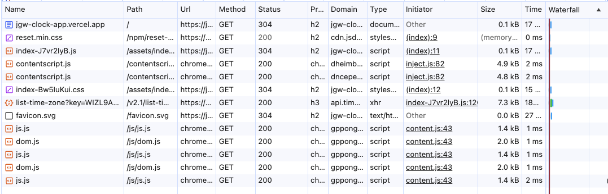
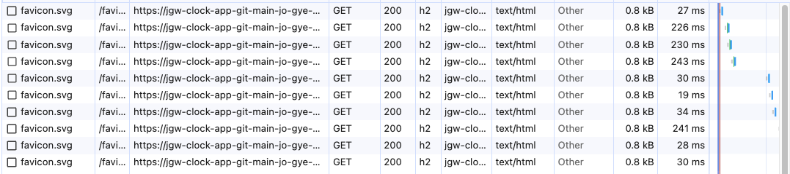
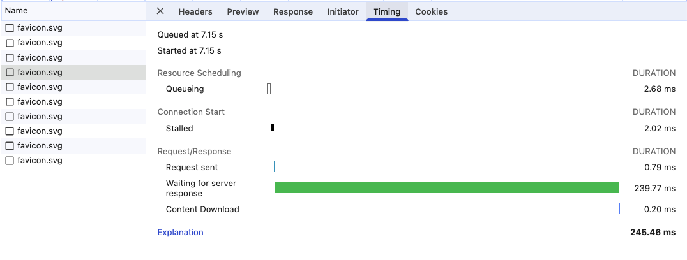

> ☝️ 이 문서는 파비콘(Favicon) 자원을 캐시하게 된 이유와, 캐시의 합리성을 검토한 뒤 최종적으로 캐시하지 않기로 판단한 근거를 정리한 문서입니다.

 

## I. 최초 로드 이후에도, 페이지 이동 시마다 파비콘(Favicon) 자원이 재요청되는 현상

프로젝트를 개발하던 과정에서 TimeZoneDB API를 통해 도시 시계 목록을 조회하는 로직이 있었기 때문에, 해당 요청의 응답 헤더와 본문을 확인하기 위해 개발자 도구의 Network 탭을 확인했습니다.

그러나 이 과정에서 브라우저가 요청하는 자원 목록을 살펴보던 중, `favicon.svg` 정적 자원이 아래 이미지와 같이 최초 로드 이후에도 페이지 이동 시마다 반복적으로 재요청되는 현상을 확인하게 되었습니다.

> _해당 이미지는 최초 페이지 로드 시 브라우저가 요청한 전체 네트워크 요청 목록을 보여주는 Network 탭 화면입니다._

 

> _해당 이미지는 페이지 이동 시마다 `favicon.svg` 자원이 반복적으로 재요청되는 현상을 확인하기 위해, 관련 요청(other 항목)만 필터링하여 표시한 Network 탭 화면입니다._

 

이미지를 통해 확인할 수 있듯이, 페이지를 이동할 때마다 `favicon.svg` 자원이 반복적으로 재요청되고 있었습니다. 또한 해당 자원이 캐시되지 않았기 때문에, 요청이 완료되기까지 걸리는 전체 소요 시간이 매번 달라지는 현상이 나타났습니다. 특히 일부 재요청의 경우, 정적 자원임에도 불구하고 최대 243ms까지 소요되는 비교적 큰 네트워크 지연이 발생하는 것을 확인할 수 있었습니다.

이로 인해서, 소요 시간이 가장 오래 걸린 요청이 어떤 단계에서 지연되고 있는지를 분석하기 위해, 다음 이미지와 같이 해당 요청의 상세 패널의 Timing 탭을 열어 확인하였습니다.

 

최대 243ms가 소요된 파비콘 요청의 상세 패널에서 Timing 탭을 확인해 보면, 전체 지연의 대부분이 Waiting for server response 단계(239.77ms)에서 발생한 것을 확인할 수 있습니다. 이 구간은 "요청이 서버로 전송된 이후, 서버가 요청을 처리하고 응답의 첫 번째 바이트(TTFB)를 생성할 때까지 소요된 시간"을 의미합니다.

하지만 해당 프로젝트는 직접 웹 서버를 구축한 환경이 아니라 Vercel을 통해 배포된 구조였기 때문에, 이 구간의 서버 처리(TTFB)에 대해 개발자가 직접 접근하거나 내부 제어할 수 있는 수단이 없었습니다. 또한, 이 지연을 애플리케이션 레벨에서 개선할 수 있는 방법을 별도로 찾지도 못한 상태였습니다.

그러나 이를 해결하기에 앞서, 먼저 이 현상이 왜 발생하고 있는지를 파악하기로 했습니다. 현재 진행 중인 Clock 프로젝트는 React + TypeScript + Vite 기반의 SPA(Single-Page Application) 구조로 개발된 웹 애플리케이션으로, 최초 페이지 로드 이후에는 페이지 이동이 발생하더라도 HTML 문서가 다시 요청되지 않고, JavaScript가 메모리로 추상화하여 관리하는 Virtual DOM의 변경 사항만 실제 DOM에 반영하는 CSR(Client-Side Rendering) 방식으로 동작하기 때문에, 페이지 이동 시마다 파비콘과 같은 정적 자원이 다시 요청되는 이유를 이해하기 어려웠기 때문입니다.

 

## II. React 기반의 SPA의 CSR(Client-Side Rendering) 렌더링 과정

