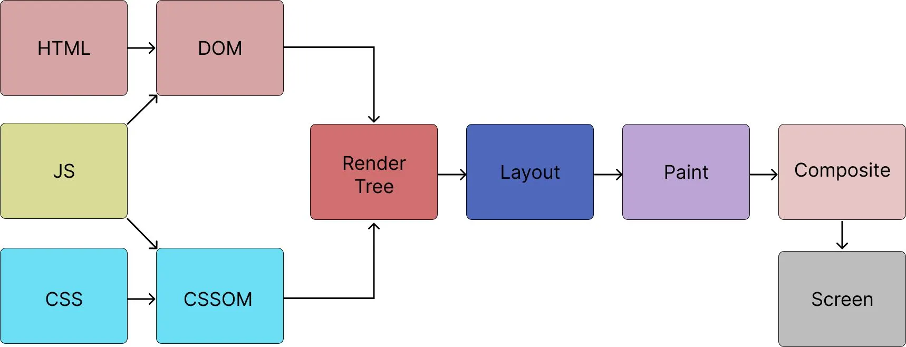
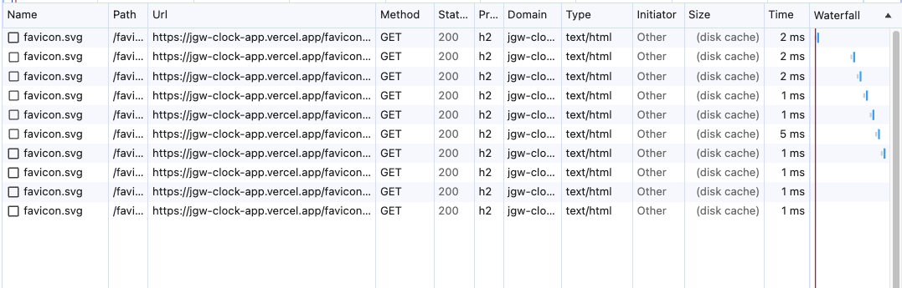
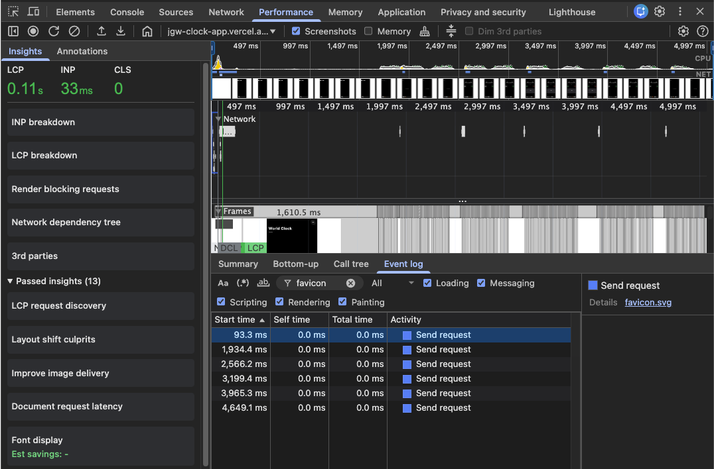
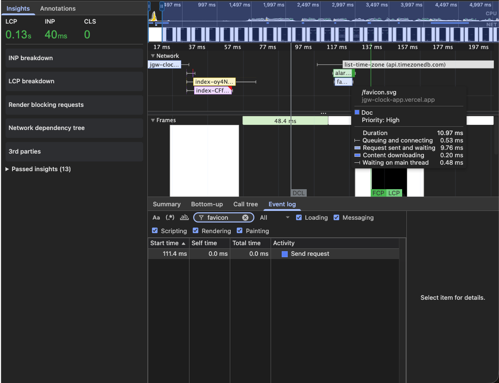
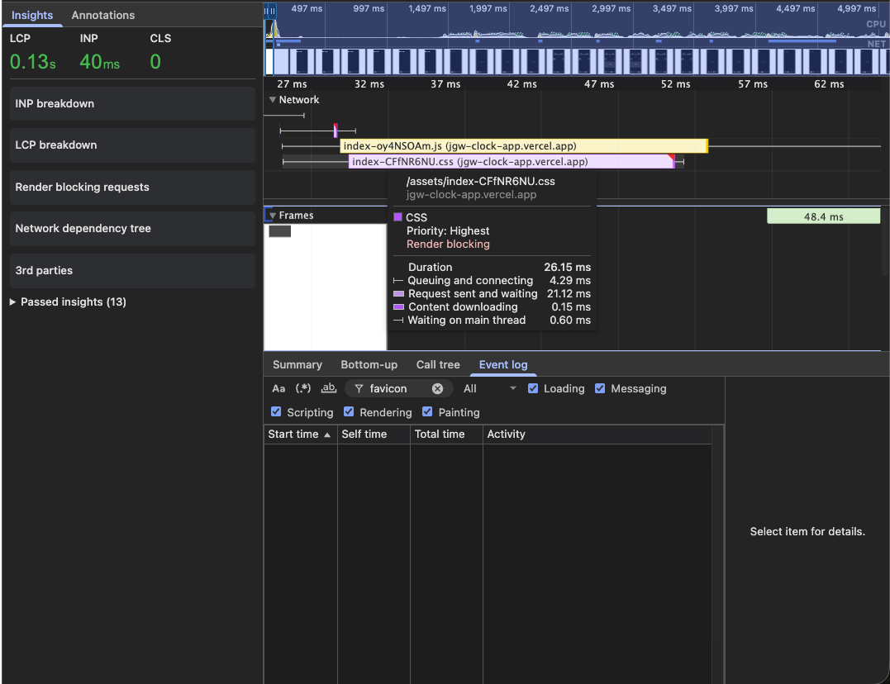
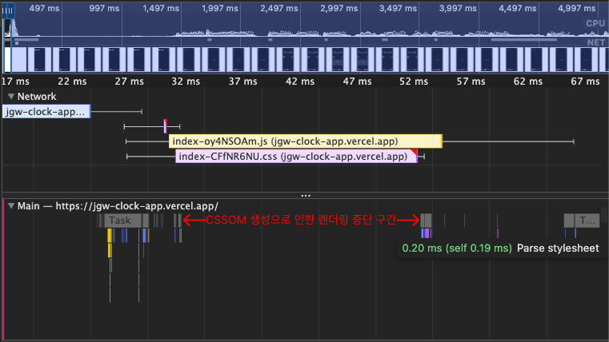
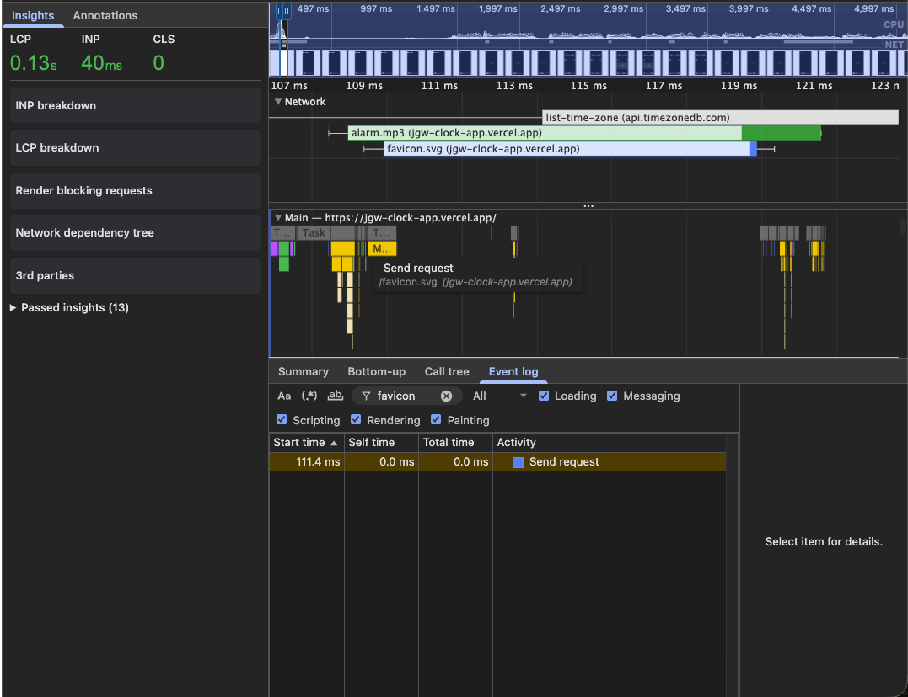

> ☝️ 이 문서는 파비콘(Favicon) 자원을 캐시하게 된 이유와, 캐시의 합리성을 검토한 뒤 최종적으로 캐시하지 않기로 판단한 근거를 정리한 문서입니다.

<br />

## I. 최초 로드 이후에도, 페이지 이동 시마다 파비콘(Favicon) 자원이 재요청되는 현상

프로젝트를 개발하던 과정에서 TimeZoneDB API를 통해 도시 시계 목록을 조회하는 로직이 있었기 때문에, 해당 요청의 응답 헤더와 본문을 확인하기 위해 개발자 도구의 Network 탭을 확인했습니다.

그러나 이 과정에서 브라우저가 요청하는 자원 목록을 살펴보던 중, `favicon.svg` 정적 자원이 아래 이미지와 같이 최초 로드 이후에도 페이지 이동 시마다 반복적으로 재요청되는 현상을 확인하게 되었습니다.

<br />


> _해당 이미지는 최초 페이지 로드 시 브라우저가 요청한 전체 네트워크 요청 목록을 보여주는 Network 탭 화면입니다._

<br />


> _해당 이미지는 페이지 이동 시마다 `favicon.svg` 자원이 반복적으로 재요청되는 현상을 확인하기 위해, 관련 요청(other 항목)만 필터링하여 표시한 Network 탭 화면입니다._

<br />

이미지를 통해 확인할 수 있듯이, 페이지를 이동할 때마다 `favicon.svg` 자원이 반복적으로 재요청되고 있었습니다. 또한 해당 자원이 캐시되지 않았기 때문에, 요청이 완료되기까지 걸리는 전체 소요 시간이 매번 달라지는 현상이 나타났습니다. 특히 일부 재요청의 경우, 정적 자원임에도 불구하고 최대 243ms까지 소요되는 비교적 큰 네트워크 지연이 발생하는 것을 확인할 수 있었습니다.

이로 인해서, 소요 시간이 가장 오래 걸린 요청이 어떤 단계에서 지연되고 있는지를 분석하기 위해, 다음 이미지와 같이 해당 요청의 상세 패널의 Timing 탭을 열어 확인하였습니다.


<br />

최대 243ms가 소요된 파비콘 요청의 상세 패널에서 Timing 탭을 확인해 보면, 전체 지연의 대부분이 Waiting for server response 단계(239.77ms)에서 발생한 것을 확인할 수 있습니다. 이 구간은 "요청이 서버로 전송된 이후, 서버가 요청을 처리하고 응답의 첫 번째 바이트(TTFB)를 생성할 때까지 소요된 시간"을 의미합니다.

하지만 해당 프로젝트는 직접 웹 서버를 구축한 환경이 아니라 Vercel을 통해 배포된 구조였기 때문에, 이 구간의 서버 처리(TTFB)에 대해 개발자가 직접 접근하거나 내부 제어할 수 있는 수단이 없었습니다. 또한, 이 지연을 애플리케이션 레벨에서 개선할 수 있는 방법을 별도로 찾지도 못한 상태였습니다.

<br />

## II. React 기반의 웹 애플리케이션 렌더링 과정

> 📌 이 목차에서는 브라우저 렌더링 과정, SPA(Single-Page Application) 등의 내용을 요약하여 설명합니다. 다소 분량이 많기 때문에, 파비콘 자원이 재요청되는 원인만 확인하고 싶다면 다음 목차로 넘어가셔도 됩니다.

["I. 최초 로드 이후에도, 페이지 이동 시마다 파비콘(Favicon) 자원이 재요청되는 현상"](#i-최초-로드-이후에도-페이지-이동-시마다-파비콘favicon-자원이-재요청되는-현상) 목차에서 설명한 문제를 해결하기에 앞서, 먼저 이 현상이 왜 발생하고 있는지를 파악하기로 했습니다.

현재 진행 중인 Clock 프로젝트는 React + TypeScript + Vite 기반의 SPA(Single-Page Application) 구조로 개발된 웹 애플리케이션으로, 최초 페이지 로드 이후에는 페이지 이동이 발생하더라도 HTML 문서가 다시 요청되지 않고, JavaScript가 메모리로 추상화하여 관리하는 Virtual DOM의 변경 사항만 실제 DOM에 반영하는 CSR(Client-Side Rendering) 방식으로 동작하기 때문에, 페이지 이동 시마다 파비콘과 같은 정적 자원이 다시 요청되는 이유를 이해하기 어려웠기 때문입니다.

<br />

### A. 브라우저 동작･렌더링 과정



> 브라우저 동작･렌더링 과정에 대해 보다 자세한 내용은, 제 기술 블로그의 [Notion: 브라우저 동작 원리](https://gye-won.notion.site/Browser-Workflow-2ae88bd9c3fa80b8a33dc4b869c180ec?pvs=74) 포스트를 참고해 주시기 바랍니다.

<br />

많은 프론트엔드 개발자는 브라우저의 동작･렌더링 과정을 이해하고 프로젝트를 진행하게 됩니다. 간단하게 브라우저 동작･렌더링 과정을 설명하자면 다음과 같이 동작을 하게 됩니다.

- 사용자가 URL에 최초 접속 시 브라우저 구성 요소 중 사용자 인터페이스는 이를 감지하여 렌더링을 위해 브라우저 엔진(UI와 렌더링 엔진 사이에서 발생한 동작을 중재하는 엔진)에 전달하고 렌더링 엔진(웹 서버로부터 전달받은 HTML 문서를 해석하여 브라우저 화면에 표시하는 역할을 수행하는 엔진)에 전달하게 됩니다.
- URL을 전달받은 렌더링 엔진은 브라우저의 다른 구성 요소인 통신 모듈에 URL을 넘긴 후 통신 모듈은 DNS, TCP/IP 연결 과정을 진행하여 웹 서버로부터 해당 도메인의 정적 자원(HTML, CSS, JavaScript)을 전달받고 렌더링 엔진에게 다시 전달한다.
- 이후, 렌더링 엔진은 전달받은 HTML 문서와 CSS 자원을 각각 DOM과 CSSOM으로 변환 시킨 후 이 둘을 결합하여 Render Tree를 생성하여 요소의 크기, 위치 등을 계산하는 Layout 단계를 수행하고, 요소의 색상, 그림자 등의 시각적 속성을 픽셀 단위로 계산하기 위한 Paint 작업을 수행하고, 수행된 결과물들을 결합하는 Composite 단계를 수행하여 실제 화면에 출력하기 위해 UI 백엔드에 넘겨준다.
- UI 백엔드는 Render Tree 기반으로 계산된 요소의 위치, 크기, 색상 등을 브라우저 화면에 실제로 그리기 위해 GPU 및 OS 그래픽 시스템과 연동하여 실제 화면을 그리는 작업을 수행하고, 최종적으로 브라우저 뷰포트에 HTML 문서를 해석한 결과물이 렌더링된다.

<br />

### B. SPA(Single-Page Application)


> SPA(Single-Page Application) & MPA(Multi-Page Application)에 대해 보다 자세한 내용은, 제 기술 블로그의 [Notion: SPA & MPA](https://gye-won.notion.site/SPA-MPA-29888bd9c3fa801d94b7c17a2fbb2799) 포스트를 참고해 주시기 바랍니다.

<br />

브라우저는 앞서 설명한 동작 원리에 따라 HTML, CSS, JavaScript 자원을 받아 렌더링을 수행합니다. 그렇다면 React 강의나 책에서 가장 먼저 등장하는 SPA(Single-Page Application)는 무엇을 의미할까요? 그건 바로 웹 애플리케이션이 하나의 HTML 문서를 기반으로 동작하는 구조를 의미합니다.

일반적인 웹 사이트에서는 사용자가 여러 페이지를 이동할 때마다 서로 다른 HTML 문서가 서버로부터 전달됩니다. 이러한 방식으로 여러 HTML 페이지를 통해 웹 사이트를 구성하는 구조를 MPA(Multi-Page Application)라고 부릅니다. 이 경우 페이지가 전환될 때마다 브라우저는 새로운 HTML 문서를 요청하고, 이에 포함된 CSS, JavaScript 등의 정적 자원을 다시 받아 전체 렌더링 과정을 수행하게 됩니다.

반면, React, Vue, Angular와 같은 프레임워크는 기본적으로 SPA 구조를 기반으로 합니다. 즉, 애플리케이션은 최초 접속 시 하나의 HTML 문서만 로드하고, 이후의 화면 전환은 이 HTML 문서를 교체하지 않은 채 JavaScript를 통해 화면을 동적으로 변경하는 방식으로 이루어집니다. 이러한 동작 방식은 [CSR(Client-Side Rendering)](https://gye-won.notion.site/CSR-Client-Side-Rendering-23688bd9c3fa811dab4fd1cbf549c3e6?pvs=74)과 [클라이언트 사이드 라우팅(Client-Side Routing)](https://gye-won.notion.site/Client-Side-Routing-29a88bd9c3fa80e9a67ddae3a6cddc5e)에 의해 가능해지며, 이에 대한 자세한 내용은 제 기술 블로그의 노션 포스트를 참고해 주시기 바랍니다.

중요한 점은, 현재 개발 중인 Clock 프로젝트 역시 이러한 SPA 구조를 따르고 있기 때문에, 사용자가 최초 접속 시 전달받은 HTML 문서는 이후 페이지 이동이 발생하더라도 변경되지 않는다는 것입니다. 즉, 페이지 전환 시마다 새로운 HTML 정적 자원을 다시 요청하는 과정이 발생하지 않고, JavaScript가 메모리 상에서 관리하는 Virtual DOM의 변경 사항만 실제 DOM에 반영되어 화면이 갱신됩니다.

이와 같은 구조를 고려할 때, 페이지 이동이 발생하더라도 HTML 문서가 다시 로드되지 않는 SPA 환경에서 `favicon.svg`와 같은 정적 자원이 반복적으로 재요청되는 현상은 저는 잘 이해가 되지 않았습니다.

<br />

## III. SPA 구조에서 `favicon.svg` 파일이 재요청되는 이유와 캐시 설정

앞서 ["II. React 기반의 웹 애플리케이션 렌더링 과정"](#ii-react-기반의-웹-애플리케이션-렌더링-과정) 목차에서, SPA 환경에서는 페이지 이동이 발생하더라도 HTML 문서가 다시 요청되지 않기 때문에 `favicon.svg`와 같은 정적 자원이 반복적으로 요청되는 현상이 직관적으로 이해되지 않는다는 점을 서술했습니다. 그럼에도 불구하고, 이 문제의 원인과 해결 방법을 알고 싶었기 때문에 Stack Overflow와 Raddit 등 개발자 커뮤니티에서 관련 정보를 얻기 위해 노력했습니다.

그러나 이와 관련된 정보를 단순한 검색만으로는 정확히 파악하기 어려웠습니다. 대부분의 파비콘(Favicon) 관련 자료는 "이전 파비콘이 유지되어 변경되지 않는 문제"에 대한 결과에 초점이 맞춰져 있었고, SPA 환경에서 파비콘이 반복적으로 재요청되는 현상을 다루는 사례는 거의 찾아볼 수 없었기 때문입니다. 그래서 이 문제를 검색으로 문제를 파악하기 어렵다고 판단하여 ChatGPT에 해당 문제를 질문하였고, 다음과 같은 답변을 얻을 수 있었습니다.

```md
질문: "React 기반 SPA에서 라우트가 변경됨에도 불구하고 favicon.svg를 재요청이 발생하는 이유가 머야?"
```

```md
답변: "SPA에서의 라우트 변경은 React 입장에서는 컴포넌트 교체일 뿐이지만, 브라우저 입장에서는 주소창의 URL이 변경된 상태 입니다.
브라우저는 URL이 바뀌면 해당 탭의 상태를 동기화하기 위해 현재 문서 내의 메타데이터(파비콘 등)를 재평가 합니다.
이 과정에서 브라우저가 <link rel="icon"> 태그를 다시 확인하게 되고, favicon.svg에 대한 네트워크 요청(캐시 확인 포함)이 발생하게 됩니다."
```

SPA(Single-Page Application) 환경에서는 해시 기반(Fragment Mode) 또는 히스토리 기반(History API Mode)의 클라이언트 사이드 라우팅(Client-Side Routing)을 통해 페이지가 전환되더라도 새로운 HTML 문서를 서버에 요청하지 않고 내부 구성 요소만 변경됩니다. 그러나 브라우저는 URL이 변경된 상태이기 때문에, 해당 탭의 상태를 동기화하기 위해 현재 문서에 연결된 메타데이터가 다시 평가하게 되고, 그 결과 `favicon.svg`와 같은 정적 자원이 재요청되고 있었던 것입니다.

즉, 이 현상은 브라우저의 동작 원리나 SPA 구조에 대한 이해 부족으로 발생한 문제가 아니라, 브라우저가 탭의 상태를 유지･동기화하기 위해 문서 메타데이터를 재평가하는 정상적인 동작이었습니다. 원인을 파악한 이후에는, 재요청으로 인해 발생하는 서버 응답 지연을 줄이기 위해 `favicon.svg`에 대해 최초 응답 시 `Cache-Control` 헤더를 설정하여, 이후 요청이 발생하더라도 서버가 아닌 웹 캐시(Disk Cache)에서 자원을 재사용하도록 구성하면 된다는 점을 알 수 있었습니다.

```jsonc
// 웹 서버를 직접 구축한 것이 아닌 Vercel을 통해 배포되어, Vercel에서 구성된 웹 서버를 사용하게 됩니다.
// 이로 인해, 정적 자원의 응답 헤더를 지정하기 위해서는 vercel.json에서 자원을 선택하여 value를 설정해줘야 합니다.
{
  // ...
  "headers": [
    {
      "source": "/favicon.svg",
      "headers": [
        {
          "key": "Cache-Control",
          "value": "public, max-age=31536000, immutable"
        }
      ]
    }
  ]
}
```



위와 같이 `favicon.svg`의 응답 헤더에 캐시 정책을 설정한 후 Network 탭을 확인해 보면, 해당 자원이 브라우저 캐시에서 관리되는 것을 확인할 수 있습니다.

그 결과, URL 변경으로 인해 재요청이 발생하더라도 서버로 네트워크 요청을 보내지 않고 메모리에서 즉시 응답이 반환되며, 응답 시간이 기존 최대 243ms에서 최대 5ms 수준으로 크게 감소한 것을 확인할 수 있었습니다.

<br />

## IV. `favicon.svg` 응답 헤더에 캐시 정책을 적용하는 것이 합리적인 선택인가

지금까지 `favicon.svg` 정적 자원이 재요청되는 원인과, 이를 해결하기 위해 `vercel.json`을 통해 캐시 정책을 설정한 과정을 설명했습니다. 그 결과, 응답 시간이 기존에 비해 크게 감소하는 효과를 확인할 수 있었습니다. 그러나 이러한 캐시 설정이 과연 합리적인 선택이었는지에 대해서는 의문을 가지게 되었습니다.

의문을 가지게 된 이유는, 개발에서는 대부분의 선택이 트레이드오프(Trade-off) 관계에 놓이게 되기 때문입니다.

현재 상황에서도 `favicon.svg`에 캐시 정책을 적용하면, 최초 요청 이후 자원이 메모리 캐시(Memory Cache)에 저장되어 원본 서버로의 재요청이 발생하지 않고, 브라우저가 로컬 메모리에서 접근하기 때문에 응답 시간이 크게 감소한다는 장점을 얻을 수 있습니다.

하지만 반대로 생각하면, 이러한 방식은 임시 복사본(캐시)을 사용자의 로컬 환경에 저장하게 되므로, 자원의 크기만큼 사용자의 디스크 및 메모리 공간을 차지한다는 단점도 함께 존재합니다.

이번 Clock 프로젝트에서는 지금까지 진행해 왔던 프로젝트와는 다르게 "궁금하면 직접 해보자"라는 마인드를 가지고 진행하고 있습니다. 따라서 현재 상황의 트레이드오프 관계에서 캐시를 적용하는 것이 합리적인 선택인지에 대해, 다음과 같은 기준을 세워 적용 여부를 결정했습니다.

- **`favicon.svg` 요청이 화면 렌더링 과정에 영향을 주는가?**
- **네트워크 요청이 블로킹되어 렌더링 흐름을 차단되는가?**

이와 같이 기준을 설정한 뒤, `vercel.json`에서 `favicon.svg`에 적용했던 캐시 정책을 제거하고, 정확한 측정을 위해 시크릿 모드에서 개발자 도구의 Performance 탭을 사용하여 페이지를 새로고침한 후 약 5초 동안 여러 차례 라우트 이동을 발생시켜, 해당 동작이 위 기준에 부합하는지를 확인하였습니다. 그 결과는 다음 이미지와 같습니다.



이제 Performance 측정 결과를 바탕으로, 제가 세운 기준에 따라 `favicon.svg` 정적 파일의 응답 헤더에 캐시 정책을 적용하는 것이 합리적인 선택인지 자세히 살펴보겠습니다.

<br />

**① `favicon.svg` 요청이 화면 렌더링 과정에 영향을 주는가?**

먼저 사용자가 제가 만든 Clock 서비스에 최초로 접속했을 때, 화면을 렌더링하기 위한 필요한 자원을 서버로부터 전달받는 과정에서 `favicon.svg` 파일이 첫 렌더링 속도에 실제로 영향을 주는지 살펴보겠습니다.

<br />



위 Performance 결과 이미지는 최초 접속 과정에서 발생한 Performance > Frames 탭의 결과 화면입니다.

Frames 탭을 확인해 보면, 번들링된 JavaScript와 CSS 자원이 로드된 이후 약 48.4ms의 프레임이 생성되는 것을 확인할 수 있습니다. 이는 브라우저가 DOM과 CSSOM을 기반으로 Render Tree -> Layout -> Paint -> Composite 과정을 거쳐 실제 화면을 그리는 렌더링을 수행하고 있음을 유추할 수 있습니다.

이후 화면의 LCP(최대 콘텐츠 렌더링 시간)는 약 0.13(130ms) 시점에 발생하며, 이는 사용자에게 가장 중요한 콘텐츠가 해당 시점에 화면에 표시되었음을 나타냅니다. 반면, `favicon.svg` 요청은 이미지 하단의 결과에서 확인할 수 있듯이 약 111.4ms 시점에 네트워크 요청이 시작됩니다.

만약 이 `favicon.svg` 요청이 화면 렌더링을 차단하거나 지연시켰다면, 해당 요청 시점을 기준으로 Frames 구간이 더 길어지거나, LCP 시점이 뒤로 밀렸을 것입니다. 그러나 Frames 탭에서는 `favicon.svg` 요청 시점과 무관하게 프레임 시간이 증가하는 현상이 관찰되지 않고 있습니다.

즉, Performance > Frames 탭을 통해 확인할 수 있는 점은 `favicon.svg` 요청이 네트워크 자원은 소모하지만, 화면을 구성하는 렌더링 과정에는 포함되지 않기 때문에 실제 화면 렌더링 속도에는 영향을 주지 않는다는 점을 확인할 수 있습니다.

<br />

**② 네트워크 요청이 블로킹되어 렌더링 흐름을 차단되는가?**

앞서 `favicon.svg` 요청이 브라우저의 화면 렌더링 과정에 영향을 주는지를 살펴본 결과, 해당 요청이 렌더링 과정에 직접적인 영향을 주지 않는다는 점을 확인할 수 있었습니다. 그러나 화면 렌더링과는 별도로, `favicon.svg` 네트워크 요청 자체가 블로킹(Blocking)되어 애플리케이션의 전체적인 흐름을 방해하는지를 추가로 확인할 필요가 있습니다.

확인에 앞서, [블로킹(Blocking)](https://gye-won.notion.site/Blocking-Non-Blocking-23588bd9c3fa81f7b67ee7c1314829c3)과 [논-블로킹(Non-Blocking)](https://gye-won.notion.site/Blocking-Non-Blocking-23588bd9c3fa81f7b67ee7c1314829c3)의 개념을 이해할 필요가 있습니다. 다만, 이에 대한 내용은 서술하지 않을 것이기 때문에 자세한 내용은 제 기술 블로그의 노션 포스트를 참고해 주시기 바랍니다.

<br />



위 이미지는 Performance 탭에서 CSS 파일에 마우스를 올렸을 때 표시되는 화면입니다. 이 이미지를 첨부한 이유는, CSS 네트워크 요청의 요약 정보에 **"Render Blocking"** 이라는 문구가 표시되는 것을 확인할 수 있기 때문입니다.

브라우저 렌더링 과정을 살펴보면, Render Tree는 HTML을 파싱하여 생성된 DOM과 CSS를 파싱하여 생성된 CSSOM을 결합한 결과물이라는 것을 알 수 있습니다. 이때 HTML과 CSS 자원 자체는 브라우저가 서버로부터 비동기적으로 요청하지만, Render Tree를 생성하기 위해서는 DOM과 CSSOM이 모두 준비되어 있어야 합니다.

HTML을 DOM으로 파싱하는 과정에서 `<script>` 태그를 만나게 되면, 브라우저는 DOM 파싱을 일시 중단하고 JavaScript 엔진을 통해 해당 스크립트를 실행합니다. 이 과정에서 브라우저의 메인 스레드(Main Thread)의 제어권이 JavaScript 실행으로 넘어가게 되며, 이로 인해 DOM 생성이 지연되는 블로킹(Blocking)이 발생합니다. 이러한 특성 때문에 과거에는 `<script>` 태그를 `<body>` 하단에 배치하는 방식이 일반적이었지만, 현재는 `async`, `defer` 속성을 통해 스크팁트의 로드 시점을 제어할 수 있습니다.

CSS 역시 요소의 크기, 위치, 색상과 같은 스타일 정보를 결정하는 언어이기 떄문에, Render Tree를 생성하기 이전에 CSSOM이 반드시 준비되어야 합니다. 만약 스타일 계산이 렌더링 이후로 미뤄진다면, 런타임 중에 반복적인 스타일 계산이 발생하여 성능 저하로 이어질 수 있습니다. 이러한 이유로 CSS는 Render Tree 결합 이전 단계에서 블로킹되어 처리되며, 이후 Layout -> Paint -> Composite 단계에서 즉시 적용될 수 있도록 준비됩니다.

<br />



> _해당 이미지는 CSSOM 생성 과정에서 블로킹이 발생하여, 브라우저의 메인 스레드가 해당 작업의 완료를 기다리며 다른 작업을 수행하지 못하는 구간을 표시한 이미지입니다._

<br />

즉, 블로킹(Blocking)은 프로세스의 실행 흐름 과정에서 특정 작업이 제어권을 점유하며 다음 단계로 진행하지 못하는 상태를 의미합니다. 이 개념을 이해하면, 각 자원이 렌더링 과정에서 어떤 역할을 가지는지와 그에 따른 장단점을 파악할 수 있습니다.

반면, `favicon.svg`는 앞서 확인했듯이 화면을 구성하는 렌더링 과정에 포함되지 않기 때문에, 해당 요청이 발생하더라도 DOM 생성이나 Render Tree 결합을 직접적으로 차단하지 않습니다. 그러나 렌더링과는 별대로, 네트워크 요청 자체가 실행 흐름 상에서 블로킹되는 방식으로 처리될 경우, 브라우저의 메인 스레드가 해당 작업의 완료를 기다리며 다른 작업을 즉시 수행하지 못하는 상황이 발생할 수 있습니다.

이러한 상황은 사용자 입장에서는 페이지 이동 과정에서 일시적인 멈춤이나 지연이 발생한 것처럼 인식될 수 있습니다. 실제로, ["I. 최초 로드 이후에도, 페이지 이동 시마다 파비콘(Favicon) 자원이 재요청되는 현상"](#i-최초-로드-이후에도-페이지-이동-시마다-파비콘favicon-자원이-재요청되는-현상)에서 확인했듯이 `favicon.svg` 요청은 최대 243ms까지 소요된 사례도 존재했습니다. 이는 화면을 구성하는 렌더링 과정에는 영향을 주지 않더라도, 페이지 이동이 반복되는 SPA 환경에서는 이러한 지연이 누적되어 사용자 경험 저하로 이어질 수 있으며, 경우에 따라서는 사용자 이탈의 원인이 될 가능성도 있습니다.

이러한 이유로, `favicon.svg` 네트워크 요청이 실제로 실행 흐름을 블로킹하는지 여부를 확인하기 위해, 다음 이미지를 통해 Performance 탭을 분석해 보겠습니다.

<br />



이미지를 확인해 보면, 약 109ms 시점에 브라우저가 서버로 `favicon.svg` 자원을 요청하는 작업을 수행하고 있음을 알 수 있습니다. 만약 이 네트워크 요청 과정에서 블로킹이 발생했다면, 앞서 CSSOM 생성 과정에서 살펴본 것처럼 응답이 도착할 때까지 브라우저의 메인 스레드(Main Thread)는 제어권을 넘긴 채 다른 작업을 수행하지 못하고 빈 구간이 표시되었을 것입니다.

그러나 현재 이미지를 확인하면, 네트워크 요청을 전송한 이후 응답을 받기 전 구간에 중간 회색 바가 표시되어 있는 것을 확인할 수 있습니다. 해당 구간이 무엇을 의미하는지 확인하기 위해, 이를 한 번 더 확대하여 살펴보겠습니다.

<br />


Performance 탭 상단의 Network 영역을 확인해 보면, `favicon.svg` 요청이 아직 완료되지 않았음에도 불구하고, 확대된 이미지에서는 메인 스레드 영역에 회색 바와 함께 **Task** 라는 표시가 나타나는 것을 확인할 수 있습니다. 이는 브라우저의 메인 스레드가 해당 시점에도 특정 작업을 수행하고 있음을 의미합니다. 또한, 회색 바 하단에 표시된 노란색 막내는 JavaScript 코드가 실행되고 있었음을 나타냅니다.

이를 통해 확인할 수 있는 점은, `favicon.svg` 네트워크 요청이 발생했을 때 브라우저가 해당 요청으로 인해 블로킹(Blocking) 상태에 들어가는 것이 아니라, 논블로킹(Non-Blocking) 방식으로 처리되어 제어권이 네트워크로 넘어가지 않고 메인 스레드에 유지된 채 다른 작업들을 계속 수행하고 있었다는 점을 확인할 수 있습니다.

<br />

## V. 그렇다면 `favicon.svg` 자원에 캐시 정책을 적용하는 것이 적절한 선택일까?

다소 긴 내용이었지만, ["IV. `favicon.svg` 응답 헤더에 캐시 정책을 적용하는 것이 합리적인 선택인가"](#iv-faviconsvg-응답-헤더에-캐시-정책을-적용하는-것이-합리적인-선택인가)에서 개발자 도구를 활용하여 캐시 정책 적용이 적절한 선택인지 살펴보았습니다. 그리고 이를 판단하기 위해 다음과 같은 기준을 세웠습니다.

- **`favicon.svg` 요청이 화면 렌더링 과정에 영향을 주는가?**
- **네트워크 요청이 블로킹되어 렌더링 흐름을 차단되는가?**

만약 위 두 기준 모두에 영향을 준다면, 캐시 정책을 적용하는 것은 충분히 합리적인 선택이었을 것입니다. 그러나 개인적으로 프론트엔드 개발자로서 생각해보았을 때, 성능 최적화는 궁극적으로 사용자를 위한 방향이어야 하며, 그중에서도 런타임 성능에 직접적인 영향을 주는 요소가 가장 중요하다고 판단했습니다.

그러나 favicon.svg 정적 파일은 요청 및 응답 과정에서 일부 네트워크 자원이 소모되기는 하지만, 자원의 크기 자체가 크지 않을 뿐만 아니라 앞서 세운 기준에 비추어 보았을 때 화면 렌더링 과정에 영향을 주지도 않았고, 네트워크 요청이 블로킹되어 실행 흐름을 방해하는 현상도 확인되지 않았습니다. 반면, 캐시 정책을 적용할 경우 해당 자원이 사용자의 로컬 환경에 디스크 또는 메모리로 저장되면서 추가적인 공간을 점유하게 됩니다.

이러한 점을 종합적으로 고려했을 때, `favicon.svg`에 캐시 정책을 적용하는 것은 개인적으로는 적절하지 않은 트레이드오프(Trade-off)라고 판단하였고, 그 결과 `favicon.svg`의 응답 헤더에 설정했던 `Cache-Control` 정책을 제거하여 캐시를 사용하지 않기로 결정했습니다.