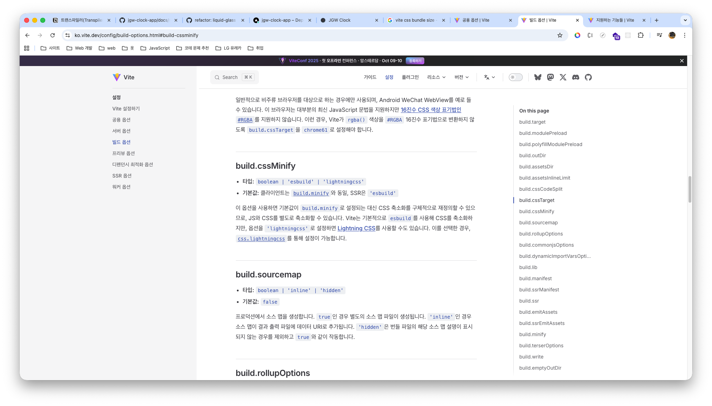
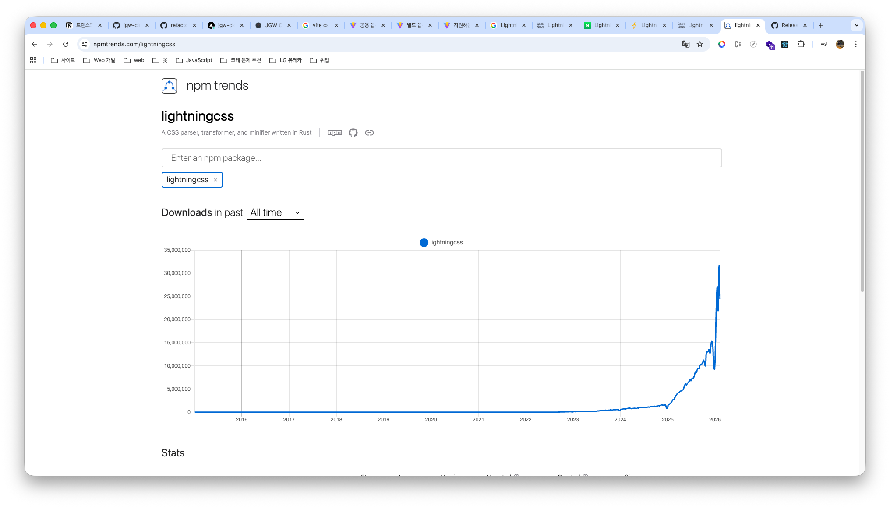
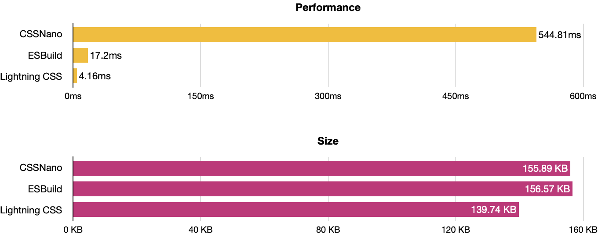
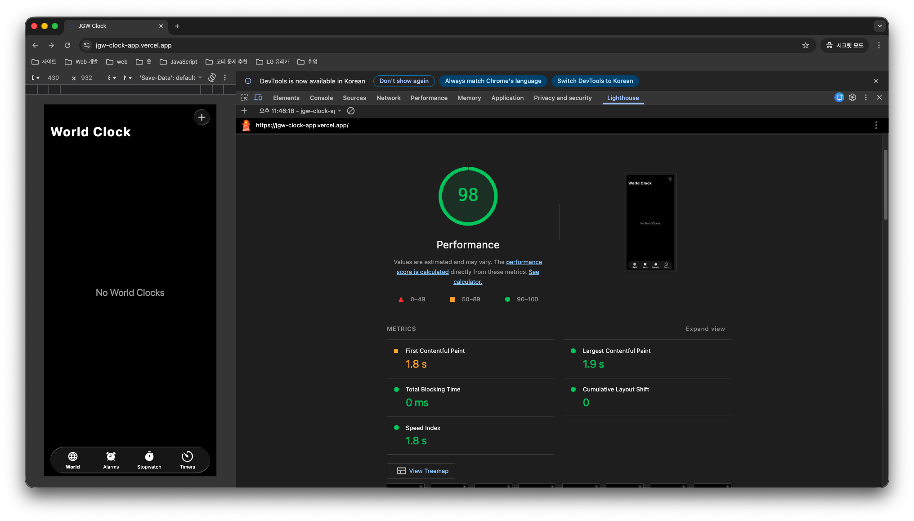
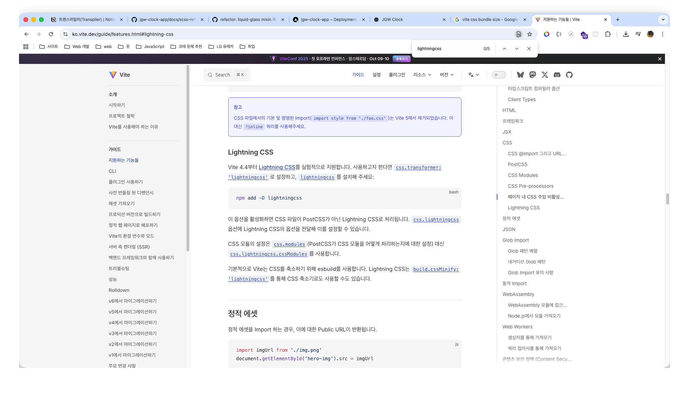

> ☝️ 이 문서에서는 Lighthouse Performance 감점 요인 중 CSS로 인한 Render blocking requests 개선하기 위한 과정을 정리했습니다.

<br />

## I. Render blocking request 항목으로 인해 FCP 지연이 발생하는 원인

[｢Google Lighthouse 개선 | Lighthouse Performance 성능 개선｣](./google-lighthouse-upgrade.md/#iii-lighthouse-performance-성능-개선) 문서에서 Lighthouse Performance 감점 요인 중, **Render blocking requests 항목**이 **FCP 측정 시점을 지연시키는 주요 원인 중 하나**라고 설명했습니다.

먼저 해당 항목이 FCP 측정 시점을 지연시키는 원인 중 하나가 되는 이유를 설명하기에 앞서, 이전 [｢Google Lighthouse 개선 | Lighthouse Performance 점수 94점 측정 원인｣](./google-lighthouse-upgrade.md/#b-lighthouse-performance-점수-94점-측정-원인) 문서에서 **Render blocking requests를 발생시키는 네트워크 요청 자원**의 종류를 확인했지만, **해당 문서에서는 다루지 않았기 때문에 어떤 자원들이 렌더링 흐름을 차단하는 자원에 해당하는지 다시 확인**해보겠습니다.

<br />


<br />

위 이미지를 통해 **렌더링 흐름을 차단하는 자원**은 총 **`index.xxx.css` 번들 CSS 파일**과 **jsDelivr CDN에서 제공되는 `reset.min.css` 파일** 두 개라는 것을 확인할 수 있습니다. 즉 **두 자원의 공통점은 CSS 파일이라는 점**입니다. 그렇다면 왜 **CSS 파일이 렌더링 흐름을 차단하는 자원에 속하는지 이해**하기 위해, **브라우저의 동작 및 렌더링 과정**을 먼저 살펴보겠습니다.

<br />


<br />

많은 프론트엔드 개발자는 **브라우저의 동작 및 렌더링 과정을 이해한 상태에서 프로젝트를 진행**합니다. 브라우저 동작 및 렌더링 과정을 간단히 정리하면 다음과 같습니다.

<br />

> 브라우저 동작･렌더링 과정에 대해 보다 자세한 내용은, 제 기술 블로그의 [｢Notion: 브라우저 동작 원리｣](https://gye-won.notion.site/Browser-Workflow-2ae88bd9c3fa80b8a33dc4b869c180ec?pvs=74) 포스트를 참고해 주시기 바랍니다.

<br />

1. 사용자가 URL에 최초 접속하면, 브라우저 구성 요소 중 사용자 인터페이스(UI)는 이를 감지하고 브라우저 엔진(UI와 렌더링 엔진 사이에서 동작을 중재하는 역할)에 전달합니다. 이후 브라우저 엔진은 해당 요청을 렌더링 엔진에 전달합니다.
1. URL을 전달받은 렌더링 엔진은 브라우저의 통신 모듈에 요청을 전달하고, 통신 모듈은 DNS 조회 및 TCP/IP 연결 과정을 거쳐 웹 서버로부터 HTML, CSS, JavaScript 등의 정적 자원을 전달받아 다시 렌더링 엔진에 전달합니다.
1. 렌더링 엔진은 전달받은 HTML과 CSS를 각각 DOM과 CSSOM으로 변환한 뒤 이를 결합하여 Render Tree를 생성합니다. 이후 요소의 크기와 위치를 계산하는 Layout 단계를 수행하고, 색상 및 그림자 등 시각적 속성을 픽셀 단위로 계산하는 Paint 작업을 수행합니다. 마지막으로 결과 레이어를 결합하는 Composite 단계를 거쳐 UI 백엔드로 전달합니다.
1. UI 백엔드는 Render Tree 기반 계산 결과를 바탕으로 GPU 및 OS 그래픽 시스템과 연동하여 실제 화면을 그리는 작업을 수행하며, 최종적으로 브라우저 뷰포트에 렌더링 결과가 출력됩니다.

<br />

브라우저 렌더링 과정을 보면 알 수 있듯이, HTML과 CSS는 **각각 DOM과 CSSOM으로 변환된 뒤 이를 결합하여 Render Tree를 생성**하고, 이를 기반으로 **최종적으로 사용자 화면에 URL에 맞는 페이지가 출력**됩니다.

즉 URL에 맞는 페이지를 화면에 출력하기 위해서는 DOM과 CSSOM을 결합한 **Render Tree 기반의 모든 계산이 완료된 결과물이 필요**합니다. 그렇기 때문에 DOM과 CSSOM을 구축하는 과정은 **실행 흐름이 보장되는 동기 방식으로 진행**됩니다.

조금 더 정확히 설명하면, 브라우저가 HTML 문서를 해석하는 과정에서 `<link>` 태그를 만나면 연결된 **CSS 파일을 비동기적으로 불러온 뒤 CSSOM을 동기적으로 구축**하게 됩니다. 이때 **여러 개의 CSS 파일**을 불러오게 되면, **먼저 불러온 CSS 파일부터 CSSOM을 구축하**고 **이후 불러온 CSS 파일을 해석한 뒤 기존에 구축된 CSSOM에 재계산하여 반영**하게 됩니다.

<br />


<br />

이 과정에서 CSS 파일 자체를 불러오는 동작은 비동기로 수행되기 때문에 DOM 파싱이 즉시 차단되지는 않습니다. 하지만 **CSSOM을 동기적으로 구축하는 과정**에서는 **DOM 파싱이 일시적으로 차단되며 렌더링 흐름이 지연**됩니다.

다만 여기서 중요한 점은, **CSS 파일을 네트워크를 통해 요청하고 응답받는 과정 자체**가 렌더링 흐름을 직접 차단하지는 않더라도, 실제 화면에 출력할 수 있는 **Render Tree 정보가 구축되지 않은 상태이기 때문에 어떠한 콘텐츠도 출력되지 않는다는 점**입니다.

즉 **CSSOM을 구축하는 과정에서 DOM 파싱이 일시적으로 차단되어 렌더링 흐름이 지연**되기도 하지만, 최초 로드 시 화면에 출력할 수 있는 Render Tree가 완성되지 않은 상태이므로 **CSS 파일을 불러오는 과정에서 요청을 보내는 시간과 응답을 받기까지 소요되는 시간 또한 결과적으로 렌더링 지연의 원인**이 될 수 있습니다.

이처럼 종합적인 이유로 인해 CSS 파일은 **"렌더링 흐름을 차단하는 네트워크 자원(Render blocking request)"** 에 속하게 됩니다. 따라서 **CSS 파일 자체를 해당 자원에서 제외하는 것은 불가능**하지만, **불러와야 하는 CSS 파일의 수를 줄이거나 파일 크기를 축소**하는 등의 방법을 통해 **CSSOM 구축 시간** 또는 **네트워크 응답 시간을 단축**시켜 **CSS로 인해 지연되는 FCP 시점을 앞당길 수 있습니다.**

<br />

## II. jsDelivr CDN - `reset.min.css`

렌더링 흐름을 차단시키는 네트워크 요청 자원 중 먼저 **`reset.min.css`** 가 무엇인지 살펴보겠습니다.

`reset.min.css`은 **jsDelivr CDN에서 제공하는 스타일 초기화 파일**로, 각 **브라우저가 기본적으로 가지고 있는 스타일을 최소한의 수준으로 제거하여 일관된 스타일 제공**하기 위한 용도로 사용됩니다.

또한 파일명에 포함된 **`min`은 경량화(Minified) 파일임을 의미**하며, **불필요한 공백 및 주석 등을 제거해 파일 크기를 최소화한 상태로 제공**된다는 뜻입니다. 즉 **`reset.css`와 동일한 기능을 제공**하지만, **네트워크 전송 효율을 높이기 위해 최적화된 형태의 결과물**입니다.

아울러 **CDN(Content Delivery Network)을 통해 제공**되기 때문에 **사용자와 물리적으로 가까운 서버로부터 응답을 전달받게 되어 네트워크 지연 시간이 상대적으로 짧아진다는 특성**을 가집니다.

이로 인해 **네트워크 요청에 대한 응답 크기 자체도 매우 작고, 전송 속도 또한 비교적 빠른 시간 내에 수신**할 수 있습니다. 실제로 `reset.css`와 `reset.min.css`의 **응답 속도 및 파일 크기 차이를 Network 탭에서 비교**해보면 다음과 같습니다. 단, Vercel을 통해 배포된 사이트에서 확인하려면 재빌드가 필요하기 때문에, CPU와 Network 성능을 동일하게 제한한 상태에서 **개발 서버 기준으로 차이를 비교**했습니다.

<br />


<br />

비교 결과를 보면 **`reset.min.css`의 파일 크기는 약 0.8kB**, **`reset.css`는 약 1.4kB**로 확인됩니다. 즉 매우 큰 차이는 아니지만 **약 0.6kB 수준의 차이가 발생**합니다.

또한 Time 속성 값을 확인해보면 성능을 제한한 환경임에도 **두 파일 간 응답 시간 차이는 크게 벌어지지 않았습니다.** 이는 **두 파일의 크기 차이가 크지 않고, 사용자와 물리적으로 가까운 서버인 CDN을 통해 제공되기 때문**으로 보입니다. 여러 차례 측정한 결과 **대략 580 ~ 620ms 내에 요청에 대한 응답을 전달받는 것을 확인**할 수 있었습니다.

이제 **`reset.min.css` 기준**으로, **응답을 전달받은 이후 스타일시트 해석 및 초기 CSSOM 구축 계산 과정이 어느 정도 소요**되는지 Performance 패널을 통해 확인해보겠습니다.

<br />


<br />

위 이미지를 보면 응답을 전달받은 이후 **Parse Stylesheet가 포함된 Task 막대(이미지에서 클릭된 Task를 의미)는 약 1.25ms가 소요**되었고, **초기 CSSOM 구축 계산 과정이 포함된 Recalculate Style Task 막대는 약 1.9ms가 소요**된 것을 확인할 수 있습니다.

**두 시간을 합산하면 약 3.15ms 수준**으로, jsDelivr CDN에서 스타일 초기화 파일 응답을 전달받은 이후 **초기 CSSOM 구축 계산 완료까지 걸린 시간이 매우 짧다는 것을 확인**할 수 있습니다.

즉 jsDelivr CDN에서 제공하는 스타일 초기화 파일로 인해 **CSSOM을 구축하는 과정에서 DOM 파싱이 일시적으로 차단되어 렌더링 흐름을 지연**시키기는 하지만, 그 시간이 **매우 짧기 때문에 FCP 측정 시점을 늦추는 데 큰 영향을 주지는 않습니다.**

다만 문제는 해당 스타일 코드를 직접 작성한 것이 아니라 **CDN을 통해 제공받는 자원이기 때문에 로직 수정이 불가능**하여, **파일 크기를 줄이는 방식의 최적화 또한 적용할 수 없다는 점**입니다. 따라서 **CSSOM 구축 시간을 추가적으로 단축시키는 데에는 한계**가 있습니다.

앞서 [｢I. Render blocking request 항목으로 인해 FCP 지연이 발생하는 원인｣](#i-render-blocking-request-항목으로-인해-fcp-지연이-발생하는-원인) 목차에서 설명했듯이, CSS 파일은 CSSOM 구축 시간뿐만 아니라 해당 **파일을 요청하는 시간과 응답을 받기까지 소요되는 시간 또한 결과적으로 렌더링 지연의 원인**이 된다고 설명했습니다.

그리고 jsDelivr CDN에서 제공하는 스타일 초기화 파일은 **대략 580 ~ 620ms 내에 요청에 대한 응답을 전달받는 것을 확인**했습니다. 이는 **초기 Render Tree 구축에 필요한 CSSOM 자원 중 하나인 스타일 초기화 CSS 파일을 전달받기 전까지 렌더링이 지연**되며, 그로 인해 **FCP 측정 시점이 늦춰질 수 있음을 의미**합니다.

따라서 현재와 같이 CDN을 통해 직접 불러오는 방식이 아니라, React의 Virtual DOM 구축 시 진입점 파일에 연결된 **`global.scss` 파일 내부로 해당 스타일 초기화 파일을 요청**하는 방식으로 로직을 수정해보겠습니다.


<br />

```html
<!doctype html>
<html lang="ko">
  <head>
    <!-- jsDeliver CDN 자원 주석 처리 -->
    <!-- <link rel="stylesheet" href="https://cdn.jsdelivr.net/npm/reset-css@5.0.2/reset.min.css"> -->
  </head>
  <body>
  </body>
</html>
```

```scss
@import url("https://cdn.jsdelivr.net/npm/reset-css@5.0.2/reset.min.css"); // jSDeliver CDN 자원 요청 global.scss 파일 내부에 포함

// ...기존 로직
```

<br />

`global.scss` 파일 내부로 jsDelivr CDN에서 제공하는 스타일 초기화 CSS 파일을 요청하도록 로직을 수정한 뒤 **재빌드**하고, **이후 Vercel을 통해 배포된 환경에서 FCP 측정 시점을 다시 확인**해보겠습니다.

<br />


<br />

jsDelivr CDN에서 제공하는 스타일 초기화 CSS 파일을 요청하는 로직을 `global.scss`로 옮긴 후 결과를 보면, **FCP 측정 시점은 여전히 약 2.4s로 동일한 것을 확인**할 수 있습니다. 이러한 결과가 나온 이유는 **결국 스타일 초기화 CSS 파일에 대한 네트워크 요청이 제거되지 않았기 때문**입니다.

<br />


<br />

개발자 도구의 Network와 Performance 패널 결과를 보면, 여전히 **`index.xxx.css` 번들 CSS 파일**과 더불어 jsDeliver CDN에서 제공하는 **스타일 초기화 파일**을 **요청**하고 있다는 것을 확인할 수 있습니다.

다만 달라진 점은 기존에는 HTML 문서를 동기적으로 해석하는 과정에서 **jsDelivr CDN 스타일 초기화 파일을 요청하는 `<link>` 태그를 먼저 만나 해당 파일을 먼저 요청**했다면, **현재는 `index.xxx.css` 번들 CSS 파일을 먼저 불러온 이후 스타일 초기화 파일을 불러오는 순서로 변경**되었다는 점입니다.

이는 수정한 로직이 **SCSS의 `@import` 규칙 기반으로 변경되었기 때문**입니다. 해당 방식은 **CSS의 `@import`와 동일하게 동작**하여, 해당 **파일에 대한 요청 및 해석이 완료된 이후 다음 로직을 실행하는 구조**를 가집니다. 즉 jsDelivr CDN에서 제공하는 스타일 초기화 파일 요청이 제거된 것이 아니라, **해당 파일을 먼저 해석한 뒤 번들링된 CSS 로직을 해석하여 최종적으로 CSSOM을 구축하는 구조로 변경된 것**입니다.

결과적으로 요청 순서만 변경되었을 뿐, **네트워크 요청 자체는 여전히 발생**하고 있기 때문에 FCP 측정 시점에는 실질적인 변화가 없다고 볼 수 있습니다.

그렇다면 jsDelivr CDN에서 제공하는 **스타일 초기화 파일에 대한 요청을 제거하면서 기능은 그대로 적용할 수 있는 방법**은 무엇일까요? 바로 해당 **스타일 초기화 파일 내부에 작성된 CSS 로직을 `global.scss`에 직접 포함시키는 방식**입니다.

이러한 방식은 **추가적인 CSS 네트워크 요청을 줄이기 위해 실제로 많이 사용되는 방법**이며, jsDelivr CDN에서도 파일 URL 제공뿐만 아니라 파일 자체를 다운로드할 수 있는 기능을 함께 제공합니다.

<br />


<br />

따라서 SCSS 환경을 사용하고 있는 현재 프로젝트 기준에 맞게, jsDelivr CDN에서 제공하는 **SCSS 파일을 다운로드한 뒤 `global.scss`에 연결하도록 로직을 수정**해보겠습니다.

<br />

```scss
// src/app/styles/_reset.scss
html, body, div, span, applet, object, iframe,
h1, h2, h3, h4, h5, h6, p, blockquote, pre,
a, abbr, acronym, address, big, cite, code,
del, dfn, em, img, ins, kbd, q, s, samp,
small, strike, strong, sub, sup, tt, var,
b, u, i, center,
dl, dt, dd, ol, ul, li,
fieldset, form, label, legend,
table, caption, tbody, tfoot, thead, tr, th, td,
article, aside, canvas, details, embed,
figure, figcaption, footer, header, hgroup,
main, menu, nav, output, ruby, section, summary,
time, mark, audio, video {
	margin: 0;
	padding: 0;
	border: 0;
	font-size: 100%;
	font: inherit;
	vertical-align: baseline;
}
article, aside, details, figcaption, figure,
footer, header, hgroup, main, menu, nav, section {
	display: block;
}
*[hidden] {
    display: none;
}
body {
	line-height: 1;
}
menu, ol, ul {
	list-style: none;
}
blockquote, q {
	quotes: none;
}
blockquote:before, blockquote:after,
q:before, q:after {
	content: '';
	content: none;
}
table {
	border-collapse: collapse;
	border-spacing: 0;
}
```

```scss
// global.scss
@use "reset";
```

> Sass / SCSS는 CSS의 확장(Supertset) 언어이기 때문에 CSS 로직을 그대로 붙여넣어도 동일하게 동작합니다.

<br />

jsDelivr CDN에서 제공하는 SCSS 파일을 다운로드하여 `global.scss`에 연결하도록 로직을 수정한 뒤, **재빌드**하고, **이후 Vercel을 통해 배포된 환경에서 FCP 측정 시점을 다시 확인**해보겠습니다.

<br />


<br />

jsDelivr CDN에서 제공하는 스타일 초기화 CSS 요청을 제거하고, 해당 파일을 다운로드하여 `global.scss`에 연결하도록 로직을 수정한 뒤 결과를 보면 **FCP 측정 시점**이 **기존 약 2.4s에서 약 1.8s로 단축**된 것을 확인할 수 있으며, **Lighthouse Performnace 점수 또한 기존 94점에서 98점으로 개선**된 것을 확인할 수 있습니다.

<br />


<br />

또한 개발자 도구 Network 패널에서 CSS 네트워크 요청 항목을 보면 **`index.xxx.css` 번들 CSS 파일만 요청되는 것을 확인**할 수 있습니다. 즉 스타일 초기화 기능은 그대로 유지되지만, 추가 요청이 제거되면서 FCP 측정 시점이 개선된 결과를 확인할 수 있습니다.

<br />

## III. Bundle CSS - `index.xxx.css`

jsDelivr CDN에서 제공하는 **스타일 초기화 CSS 파일에 대한 요청을 제거**함으로써 **모바일 디바이스 환경** 기준 **FCP 측정 시점을 약 2.4s에서 약 1.8s 수준으로 단축시켜 Lighthouse Performance 점수를 94점에서 98점으로 개선**했습니다.

다만 **`index.xxx.css` 파일로 인해 발생하는 렌더링 지연을 추가로 줄이기 위해서는 파일 크기 축소가 필요**합니다. 해당 파일은 **Vite를 통해 번들링된 결과물**이기 때문에, 파일 크기를 줄이기 위해서는 결국 **기존 스타일시트 로직에 대한 수정이 필요**합니다.

그러나 어느 정도 수준까지 수정해야 Lighthouse Performance의 FCP 측정 기준을 안정 구간(🟢)으로 개선할 수 있는지에 대한 기준을 알 수 없었습니다. 그러나 jsDelivr CDN에서 제공하는 스타일 초기화 CSS 파일에 대한 요청을 제거하는 과정에서 **Google Lighthouse가 점수 산정 기준표를 제공한다는 사실을 확인**했기 때문에, **이를 먼저 확인한 뒤 수정 방향을 결정**해보겠습니다.

<br />


<br />

Google Lighthouse에서 제공하는 **FCP 점수 측정 기준표**를 보면 **안정 구간(🟢)에 해당**하기 위해서는 **대략 0s ~ 1.8s 사이에서 FCP가 측정**되어야 합니다. 즉 **현재 수치 또한 기준에 근접**해 있기 때문에, 전체 스타일시트 로직을 대규모로 수정하는 방식보다는 **일부 로직만 수정하여 빌드 결과물의 파일 크기를 축소하는 방향으로 먼저 진행한 뒤 결과를 재측정**해보겠습니다.

먼저 Vercel > JGW Clock > Deployment 탭으로 이동하여 스타일 초기화 로직을 **`global.scss`에 포함시키기 이전의 빌드 결과물**과, **포함시킨 이후의 빌드 결과물 크기**를 먼저 살펴보겠습니다.

<br />

```md
03:03:12.728 | dist/index.html                              2.36 kB │ gzip:   0.91 kB
03:03:12.729 | dist/assets/SF_Pro-Bold-7QsjyyjH.woff2      98.32 kB
03:03:12.729 | dist/assets/SF_Pro-Regular-D7lx-8SM.woff2  102.66 kB
03:03:12.730 | dist/assets/SF_Pro-Light-CWkfg6lM.woff2    113.46 kB
03:03:12.730 | dist/assets/index-Bfw4KEH4.css              22.58 kB │ gzip:   4.38 kB   # 스타일 초기화 로직 포함 이전 CSS 빌드 결과물 크기
03:03:12.730 | dist/assets/index-DPSVK2o6.js              592.54 kB │ gzip: 203.81 kB
...
```

> 위 코드 블록은 스타일 초기화 로직을 포함시키기 이전(Before)의 Deployment 로그를 보기 쉽게 Markdown 형식으로 정리한 내용입니다. 실제 Deployment 결과는 [여기](./images/reset-style-before-deployment-logs.png)에서 확인할 수 있습니다.

<br />

```md
03:31:17.822 | dist/index.html                              2.27 kB │ gzip:   0.87 kB
03:31:17.823 | dist/assets/SF_Pro-Bold-7QsjyyjH.woff2      98.32 kB
03:31:17.823 | dist/assets/SF_Pro-Regular-D7lx-8SM.woff2  102.66 kB
03:31:17.823 | dist/assets/SF_Pro-Light-CWkfg6lM.woff2    113.46 kB
03:31:17.823 | dist/assets/index-ns878Gv0.css              23.39 kB │ gzip:   4.75 kB   # 스타일 초기화 로직 포함 이후 CSS 빌드 결과물 크기
03:31:17.824 | dist/assets/index-8hbTcXjk.js              592.54 kB │ gzip: 203.81 kB
...
```

> 위 코드 블록은 스타일 초기화 로직을 포함시키기 이후(After)의 Deployment 로그를 보기 쉽게 Markdown 형식으로 정리한 내용입니다. 실제 Deployment 결과는 [여기](./images/reset-style-after-deployment-logs.png)에서 확인할 수 있습니다.

<br />

두 빌드 결과물의 크기 차이를 확인해보면, **압축 이전 기준으로는 22.58kB -> 23.39kB로 약 0.81kB 증가**했으며, **압축 이후 기준으로는 4.38kB -> 4.75kB로 약 0.37kB 증가**한 것을 확인할 수 있습니다.

이처럼 빌드 결과물 크기의 증가 폭이 크지 않기 때문에, 해당 **크기를 일부 축소하더라도 FCP 측정 결과가 유의미하게 개선될지는 확실하지 않습니다.**

다만 [｢SCSS 구조 리팩토링｣](./scss-refactoring.md) 문서에서 다뤘듯이 **SCSS 로직에 대한 일부 수정을 진행**하여 **CSS 번들 크기를 23.72kB -> 22.23kB로 약 6% 감소시킨 상태**입니다.

따라서 빌드 결과물 크기를 추가로 축소했음에도 개선이 없다면, **전체 스타일시트 코드를 분석하여 사용되지 않는 로직을 제거하는 방식으로 빌드 크기를 추가로 줄이거나**, FCP 측정 시점을 지연시키는 또 다른 주요 원인인 **"사용되지 않는 JavaScript 코드가 존재(Reduce unused JavaScript)" 항목으로** 넘어가야 할 수도 있을 것으로 보입니다.

<br />

**① SCSS 파일 분할(Partial) 기법 활용**

먼저 CSS 빌드 결과물 크기를 줄이기 위해 처음으로 진행한 작업은, SCSS 파일 내부에서만 모듈로 활용되는 파일들을 **파일 분할(Partial) 기능을 통해 이름을 변경**하여 **트랜스파일 과정에서 단독 CSS 파일로 생성되는 것을 방지하는 것**이었습니다.

<br />

```md
# 기존 App 초기화 시 바로 적용되는 SCSS 디렉토리 구조
# reset, font, liquid-glass는 global.scss 내부에서만 사용되지만 트랜스파일 제외 대상이 아님
app/
└─ styles/
   ├─ reset.scss
   ├─ font.scss
   ├─ liquid-glass.scss
   └─ global.scss
```

```md
# 수정 후 App 초기화 시 바로 적용되는 SCSS 디렉토리 구조
app/
└─ styles/
   ├─ _reset.scss
   ├─ _font.scss
   ├─ _liquid-glass.scss
   └─ global.scss
```

<br />

하지만 간과한 부분이 있었는데, 위와 같이 수정한 뒤 재빌드를 진행하더라도 **CSS 번들 크기는 줄어들지 않았습니다.** 그 이유는 SCSS에서 제공하는 파일 분할(Partial) 기능은 파일명을 변경함으로써 **해당 파일이 SCSS -> CSS로 단독 트랜스파일되는 것을 방지**할 뿐, **내부 로직 자체가 변경되는 것은 아니기 때문**입니다.

<br />

```scss
// 트랜스파일 이전 global.scss

@use "reset";
```

```scss
// 트랜스파일 이후 global.scss
article, aside, details, figcaption, figure,
footer, header, hgroup, main, menu, nav, section {
	display: block;
}
```

<br />

위 코드를 보면 알 수 있듯이 SCSS -> CSS로 트랜스파일되는 과정에서 기존 **`@use`를 통해 불러오던 SCSS 파일의 로직이 `global.scss` 결과물에 그대로 포함**됩니다. 즉 근본적으로 **스타일 로직 자체가 변경된 것이 아니기 때문에,** 재빌드를 하더라도 **단독 CSS 파일은 생성되지 않은 뿐 번들링된 결과물의 로직은 동일하게 유지**됩니다. 그 결과 CSS 빌드 크기 또한 줄어들지 않게 됩니다.

<br />

```md
10:17:58.981 | dist/index.html                              2.27 kB │ gzip:   0.87 kB
10:17:58.982 | dist/assets/SF_Pro-Bold-7QsjyyjH.woff2      98.32 kB
10:17:58.984 | dist/assets/SF_Pro-Regular-D7lx-8SM.woff2  102.66 kB
10:17:58.984 | dist/assets/SF_Pro-Light-CWkfg6lM.woff2    113.46 kB
10:17:58.985 | dist/assets/index-ns878Gv0.css              23.39 kB │ gzip:   4.75 kB
10:17:58.985 | dist/assets/index-8hbTcXjk.js              592.54 kB │ gzip: 203.81 kB
...
```

> 위 코드 블록은 파일 분할(Partial) 이후의 Deployment 로그를 보기 쉽게 Markdown 형식으로 정리한 내용입니다. 실제 Deployment 결과는 [여기](./images/scss-partial-after-deployment-logs.png)에서 확인할 수 있습니다.

<br />

최종적으로 파일 분할(Partial) 적용 이후에도 **CSS 빌드 결과물 크기에는 변화가 없다는 것을 확인**할 수 있었습니다.

<br />

**② SCSS 변수 및 Mixin 로직 제거**

먼저 숫자 값으로 사용되는 전역 토큰은 [｢SCSS 구조 리팩토링｣](./scss-refactoring.md) 문서에서 작성했듯이, 크기(width), 높이(height), 여백(padding, margin)처럼 값 자체에 **명확한 의미가 없는 속성들을 전역 토큰으로 관리하는 방식**이 `rem`, `em`과 같은 **상대 단위를 사용하는 방식**과 **큰 차이가 없다고 판단하여 별도로 정의하지 않았다고 설명**했습니다.

다만 `border-radius: 9999px`처럼 값 자체를 조정할 필요가 없고, "완전한 라운드"처럼 **의미론적인 값만 전역 토큰으로 정의**했다고 했습니다. 그러나 **의미론적인 값을 가지는 전역 토큰**이 **사실상 `border-radius: 9999px` 하나뿐**이었고, **실제 사용되는 스타일 또한 많지 않았습니다.**

이로 인해 **전역 토큰 값을 정의한 `_values.scss` 파일을 제거**하면, CSS 번들링 과정에서 포함되는 **SCSS 파일 수를 줄일 수 있다고 판단**하여 **해당 파일을 제거하고, 전역 토큰 값을 사용하던 스타일에는 제거된 변수가 아닌 단순 숫자 값을 직접 적용하는 방식으로 수정**했습니다.

<br />

```scss
// _values.scss 파일 제거 이전
&__button {
	padding: 2rem;
	border-radius: map.get($rounded, full);
	// ...
}
```

```scss
// _values.scss 파일 제거 이후
&__button {
	padding: 2rem;
	border-radius: 9999px;
	// ...
}
```

<br />

다음으로 **웹 폰트(Web Font)를 지정하는 스타일 로직이 동일한 구조로 반복**되고 있었기 때문에, 이를 **`_font-face.scss` 파일에서 SCSS의 Mixin 문법을 활용해 구성**했었습니다.

그러나 Mixin 문법을 활용한 **`_font-face.scss` 파일을 제거**하고 **`_font.scss` 내부에서 `@font-face` 규칙을 직접 선언하는 방식으로 수정**하면 **동일한 결과를 유지함과 동시에 SCSS 파일을 제거하여 CSS 번들 크기를 줄일 수 있다고 판단**했습니다. 따라서 `_font-face.scss` 파일을 제거한 뒤, `_font.scss`에서 여러 개의 웹 폰트를 직접 선언하도록 로직을 수정했습니다.

<br />

```scss
// font-face Mixin 로직 제거 이전 _font.scss 로직
@include mixin-font-face("SF Pro", "SF_Pro-Light", 300);
@include mixin-font-face("SF Pro", "SF_Pro-Regular", 400);
@include mixin-font-face("SF Pro", "SF_Pro-Bold", 700);
```

```scss
// font-face Mixin 로직 제거 이후 _font.scss 로직
@font-face {
  font-family: "SF Pro";
  src: url("/src/shared/assets/fonts/SF_Pro-Light.woff2") format("woff2");
  font-weight: 300;
  font-style: normal;
}

@font-face {
  font-family: "SF Pro";
  src: url("/src/shared/assets/fonts/SF_Pro-Regular.woff2") format("woff2");
  font-weight: 400;
  font-style: normal;
}

@font-face {
  font-family: "SF Pro";
  src: url("/src/shared/assets/fonts/SF_Pro-Bold.woff2") format("woff2");
  font-weight: 700;
  font-style: normal;
}
```

<br />

Mixin 문법을 통해 정의한 liquid-glass 스타일은 여러 곳에서 재사용하기보다는, **SPA 특성을 활용해 전역 스타일로 구성**하여 **해당 클래스 이름을 가진 HTML 요소에 liquid-glass 스타일이 적용되도록 로직을 작성**했습니다.

하지만 웹 폰트(Web Font)를 지정하던 **`_font-face.scss` 파일을 제거한 이유와 동일한 맥락**으로, Mixin 문법을 통해 정의된 liquid-glass 스타일을 별도의 `_liquid-glass.scss` 파일로 분리해두기보다는 **전역 스타일 파일인 `app/styles/_liquid-glass.scss` 내부에서 직접 선언**하면 **동일한 스타일을 유지하면서**도 **SCSS 파일 하나를 제거할 수 있기 때문에, CSS 번들 크기를 줄일 수 있는 방법**이라고 생각했습니다.

이로 인해 Mixin 문법으로 정의되어 있던 **`_liquid-glass.scss` 파일을 제거하고, 전역 스타일 내부에 기존 Mixin 로직을 직접 작성하도록 수정**했습니다.

<br />

```scss
// shared/styles/mixin/_liquid-glass.scss 제거 이전
@use "@shared/styles" as *;

.liquid-glass {
  --transition: "";

  &.fast { --transition: 200ms cubic-bezier(0.5, 0, 0, 1); }
  &.slow { --transition: background-color 400ms cubic-bezier(1, 0, 0.4, 1), box-shadow 400ms cubic-bezier(1, 0, 0.4, 1); }

  @include mixin-liquid-glass(
    $boxShadow: "strong",
    $transition: var(--transition)
  );
}
```

```scss
// shared/styles/mixin/_liquid-glass.scss 제거 이후
.liquid-glass {
  --transition: "";

  &.fast { --transition: 200ms cubic-bezier(0.5, 0, 0, 1); }
  &.slow { --transition: background-color 400ms cubic-bezier(1, 0, 0.4, 1), box-shadow 400ms cubic-bezier(1, 0, 0.4, 1); }

  background-color: color-mix(in srgb, #bbbbbc 12%, transparent);
  backdrop-filter: blur(2rem) saturate(150%);
  -webkit-backdrop-filter: blur(2rem) saturate(150%);

  box-shadow:
    inset 0 0 0 1px color-mix(in srgb, #ffffff calc(0.3 * 10%), transparent),
    inset 1.8px 3px 0px -2px color-mix(in srgb, #ffffff calc(0.3 * 90%), transparent),
    inset -2px -2px 0px -2px color-mix(in srgb, #ffffff calc(0.3 * 80%), transparent),
    inset -3px -8px 1px -6px color-mix(in srgb, #ffffff calc(0.3 * 60%), transparent),
    inset -0.3px -1px 4px 0px color-mix(in srgb, #000000 calc(2 * 12%), transparent),
    inset -1.5px 2.5px 0px -2px color-mix(in srgb, #000000 calc(2 * 12%), transparent),
    inset 0px 3px 4px -2px color-mix(in srgb, #000000 calc(2 * 12%), transparent),
    inset 2px -6.5px 1px -4px color-mix(in srgb, #000000 calc(2 * 12%), transparent),
    0px 1px 5px 0px color-mix(in srgb, #000000 calc(2 * 12%), transparent),
    0px 6px 16px 0px color-mix(in srgb, #000000 calc(2 * 12%), transparent);

  transition: var(--transition);
}
```

<br />

이와 같이 기존에 사용하던 변수 및 Mixin 로직을 제거하는 방향으로 **SCSS 로직을 리팩토링한 뒤 재빌드를 진행**했습니다.

<br />

```md
10:17:58.981 | dist/index.html                              2.27 kB │ gzip:   0.87 kB
10:17:58.982 | dist/assets/SF_Pro-Bold-7QsjyyjH.woff2      98.32 kB
10:17:58.984 | dist/assets/SF_Pro-Regular-D7lx-8SM.woff2  102.66 kB
10:17:58.984 | dist/assets/SF_Pro-Light-CWkfg6lM.woff2    113.46 kB
10:17:58.985 | dist/assets/index-ns878Gv0.css              23.39 kB │ gzip:   4.75 kB
10:17:58.985 | dist/assets/index-8hbTcXjk.js              592.54 kB │ gzip: 203.81 kB
...
```

> 위 코드 블록은 파일 분할(Partial) 이후의 Deployment 로그를 보기 쉽게 Markdown 형식으로 정리한 내용입니다. 실제 Deployment 결과는 [여기](./images/scss-partial-after-deployment-logs.png)에서 확인할 수 있습니다.

<br />

```md
21:26:22.172 | dist/index.html                              2.27 kB │ gzip:   0.87 kB
21:26:22.173 | dist/assets/SF_Pro-Bold-7QsjyyjH.woff2      98.32 kB
21:26:22.173 | dist/assets/SF_Pro-Regular-D7lx-8SM.woff2  102.66 kB
21:26:22.173 | dist/assets/SF_Pro-Light-CWkfg6lM.woff2    113.46 kB
21:26:22.173 | dist/assets/index-CaEg3Dvi.css              23.34 kB │ gzip:   4.72 kB
21:26:22.174 | dist/assets/index-BocHY1oC.js              592.53 kB │ gzip: 203.79 kB
...
```

> 위 코드 블록은 SCSS 변수 및 Mixin 로직 제거 이후의 Deployment 로그를 보기 쉽게 Markdown 형식으로 정리한 내용입니다. 실제 Deployment 결과는 [여기](./images/scss-variables-mixin-remove-after-deployment-logs.png)에서 확인할 수 있습니다.

<br />

하지만 결과를 보면 알 수 있듯이, **전체 CSS 빌드 크기는 23.39kB -> 23.34kB로 약 0.05kB 감소**했으며, **압축 크기는 4.75kB -> 4.72kB로 약 0.03kB가 감소**했습니다.

즉, 이와 같이 수정을 진행하더라도 유의미한 변화는 발생하는 않았습니다. **① SCSS 파일 분할(Partial) 기법 활용**에서 정리했던 것처럼 **실제 CSS 본문 내용 자체는 변경되지 않았기 때문**입니다. 이에 대한 내용은 이는 [｢SCSS 구조 리팩토링｣](./scss-refactoring.md) 문서에서 서술했지만, FCP 측정 시점 단축에 집중하는 과정에서 해당 내용을 잊어버리고 진행했던 것이었습니다.

정확히 말하면 **SCSS는 CSS 전처리기 언어**이기 때문에, **SCCS 문법으로 작성한 스타일시트는 빌드 과정에서 먼저 CSS로 트랜스파일된 이후, 에러가 없다면 개별 CSS 파일로 생성**됩니다. 즉, **변수나 Mixin 로직을 제거하기 전과 이후 모두 결과적으로 동일한 CSS 로직이 적용**되고 있는 구조입니다.

그렇기 때문에 **트랜스파일된 CSS 파일의 실제 내용에 변화가 없기 때문에, 이후 번들링을 진행하더라도 결과물에는 차이가 발생하지 않으며,** 결국 **CSS 빌드 결과물 크기 역시 유의미하게 달라지지 않게 됩니다.**

따라서 이번 리팩토링은 **CSS 빌드 결과물 크기 감소를 기대하며 DX(Developer Experience)를 일부 포기하고 진행**했던 작업이었으나, **실질적인 번들 감소 효과가 없었기 때문에 해당 로직은 기존 방식으로 다시 되돌려 적용**했습니다.

<br />

**③ CSS 처리 엔진 Lightning CSS**

SCSS를 CSS 전처리기 언어가 아닌 번들링 도구처럼 인식하고 **파일 분할(Partial) 기법을 적용**하거나, **변수 및 Mixin 로직을 제거하는 방식으로 리팩토링을 진행**했음에도 불구하고 **최종적으로 번들링된 CSS 결과물 자체는 동일하게 생성**되었기 때문에 **CSS 번들 크기를 줄이지는 못했습니다.**

또한 앞서 언급했듯이, FCP 측정 시점을 앞당기기 위한 SCSS 리팩토링을 진행하기 이전 단계에서 [｢SCSS 구조 리팩토링｣](./scss-refactoring.md)을 통해 **CSS 번들 크기를 23.72kB -> 22.23kB로 약 6% 감소시킨 상태**였습니다.

현재 기준에서도 **최종 CSS 번들 결과물의 크기가 크게 부담되는 수준은 아니기 때문에**, 전체 스타일시트 로직을 다시 분석하여 **사용되지 않는 SCSS 코드를 추가로 제거하는 과정은 오히려 불필요한 시간을 소모**할 가능성이 높고, **번들 크기 또한 유의미하게 감소하지는 않을 것으로 판단**했습니다. 이에 따라 전체 스타일시트 로직을 분석하는 과정은 불필요하다고 판단하여 진행하지 않기로 했습니다.

다만 FCP 측정 시점을 지연시키는 또 다른 항목인 **"사용되지 않는 JavaScript 코드가 존재(Reduce unused JavaScript)"로 넘어가기 전**에, 리팩토링이 아닌 **빌드 설정을 변경하는 방식을 마지막으로 검토**해보기로 했습니다.

왜냐하면 Vite는 단순 번들링 도구가 아닌 빌드 도구이기 때문에, 내부적으로 ESBuild와 Rollup을 기반으로 동작하지만 그 외에도 **다양한 빌드 옵션을 설정할 수 있기 때문**입니다. 따라서 **Vite에서 CSS 처리와 관련해 제공되는 빌드 설정 항목들을 확인**해보았습니다.

<br />



<br />

Vite는 다양한 설정을 지원하기 때문에 먼저 공식 문서의 [｢Vite 설정 > 빌드 옵션｣](https://ko.vite.dev/config/build-options.html) 페이지로 이동했습니다. 여러 설정 항목이 존재했지만, 그 중 **`build.cssMinify` 설정**은 직역하면 **"CSS 파일 압축"**이라는 의미이기 때문에 해당 설정을 먼저 확인했습니다.

<br />

```tsx
interface ViteBuild {
	cssMinify: boolean | "esbuild" | "lightningcss";
	// ...
}
```

<br />

해당 설정 값을 보면 **CSS 파일 압축 여부 제어하는 `boolean`** 값과, **압축 방식을 `esbuild` 또는 `lightningcss`로 지정**할 수 있다고 공식 문서에 설명되어 있습니다.

공식 문서를 확인해보면 **"이 옵션을 사용하면 기본값이 `build.minify`로 설정되는 대신 CSS 축소화를 구체적으로 재정의할 수 있으므로, JS와 CSS를 별도로 축소화할 수 있습니다. Vite는 기본적으로 esbuild를 사용해 CSS를 축소화하지만, ..."** 라고 명시되어 있습니다.

즉 `build.cssMinify의` 기본값은 `build.minify` 설정을 따르며, 해당 **기본 압축 방식은 esbuild**이자만 **CSS 압축 방식을 수정할 수 있는 옵션**이라는 의미입니다.

따라서 별도 설정을 하지 않은 **현재 프로젝트는 기본값인 esbuild 기반 CSS 압축 방식을 사용하고 있는 상태**였다는 의밉니다. 그래서 다른 압축 방식인 **Lightning CSS**가 무엇인지 궁금하여 이에 대해 확인해보게 되었습니다.

하지만 Lightning CSS는 NPM Registry 기준 **약 3년 전에 등록된 비교적 최근 도구**이기 때문에 자료가 많지는 않습니다. 그러나 **NPM Trends 기준 2025년 시점부터 가파른 다운로드 증가 추이**를 보이고 있다는 점을 확인할 수 있었습니다.

<br />



<br />

가파른 다운로드 증가 추이에 대한 이유가 궁금하여 추가로 관련 정보를 찾던 중 **[｢GeekNews | Lightning CSS - Rust로 작성된 초고속 CSS 파서｣](https://news.hada.io/topic?id=10522) 포스트를 확인**했으며, 주요 내용은 다음과 같습니다.

<br />

- Parcel과 함께 사용하기 위해 만든 초고속 CSS 파서/트랜스포머/번들러/미니파이어
- CSSNano 에 비해서 100배 이상, ESBuild 보다 4배 이상 빠름
- 매우 최적화된 Minification

<br />

즉 **Parcel 번들러와 함께 사용하기 위해 제작된 CSS 처리 엔진**이지만, **CSSNano나 ESBuild 대비 더 높은 처리 성능을 제공하는 도구**입니다. 다만 현재 기준에서 중요한 것은 처리 속도보다는 번들 사이즈였기 때문에 **공식 문서의 벤치마킹 결과를 추가로 확인**했습니다.

<br />



<br />

벤치마킹 결과를 보면 **다른 CSS 처리 엔진 대비 더 작은 번들 결과물을 생성**하다는 점을 확인할 수 있었고, 이에 따라 해결 방법이 될 수 있다고 판단하여 **`vite.config.ts`에서 CSS 처리 엔진 설정을 다음과 같이 수정**했습니다.

<br />

```tsx
// vite.config.ts 변경 이후
export default defineConfig({
  plugins: [
    react({
      babel: {
        plugins: [['babel-plugin-react-compiler']],
      },
    }),
    svgr(),
  ],
  server: {
    port: Number(process.env.PORT) || 5173,
  },
  css: {
    transformer: "lightningcss",
    lightningcss: {
      cssModules: {
        dashedIdents: true
      }
    }
  },
  resolve: {
    alias: [
      { find: "@app", replacement: path.resolve(__dirname, "src/app") },
      { find: "@pages", replacement: path.resolve(__dirname, "src/pages") },
      { find: "@widgets", replacement: path.resolve(__dirname, "src/widgets") },
      { find: "@features", replacement: path.resolve(__dirname, "src/features") },
      { find: "@entities", replacement: path.resolve(__dirname, "src/entities") },
      { find: "@shared", replacement: path.resolve(__dirname, "src/shared") },
    ]
  },
  build: {
    cssMinify: "lightningcss"
  }
});
```

<br />

Vite의 빌드 설정을 위와 같이 변경한 뒤, **재빌드를 진행한 결과**는 다음과 같습니다.

<br />

```md
22:01:25.989 | dist/index.html                              2.27 kB │ gzip:   0.87 kB
22:01:25.990 | dist/assets/SF_Pro-Bold-7QsjyyjH.woff2      98.32 kB
22:01:25.994 | dist/assets/SF_Pro-Regular-D7lx-8SM.woff2  102.66 kB
22:01:25.994 | dist/assets/SF_Pro-Light-CWkfg6lM.woff2    113.46 kB
22:01:25.995 | dist/assets/index-LFWnB243.css              22.25 kB │ gzip:   4.48 kB
22:01:25.995 | dist/assets/index-CS81rpM8.js              592.40 kB │ gzip: 203.65 kB
...
```

> 위 코드 블록은 Vite 빌드 설정 변경 이후의 Deployment 로그를 보기 쉽게 Markdown 형식으로 정리한 내용입니다. 실제 Deployment 결과는 [여기](./images/vite-config-update-after-deployment-logs.png)에서 확인할 수 있습니다.

<br />

**Lightning CSS로 변경 이후 결과**를 보면 **전체 CSS 빌드 크기는 23.34kB -> 22.25kB로 약 1.09kB 감소**했고, **압축 크기는 4.72kB -> 4.48kB로 약 0.24kB 감소**했습니다.

즉 **스타일 초기화 로직을 포함하기 이전 CSS 빌드 결과물(22.58kB / gzip 4.38kB)과 거의 유사한 수준까지 감소한 결과**였습니다. 이에 따라 FCP 측정 시점 또한 기존 1.8s보다 더 단축되었을 것이라 판단하고, Vercel 배포 환경에서 Lighthouse 측정을 다시 진행했습니다.

<br />




<br />

그러나 결과를 확인해보면 CSS 번들 크기가 감소했음에도 감소 폭이 크지 않았기 때문에, **네트워크 응답 완료 시점 또한 크게 단축되지는 않았을 것으로 보이며, CSSOM을 구축하는 과정 역시 눈에 띄게 줄어들지는 않았을 것으로 판단**됩니다. 그 결과 **FCP 측정 시점은 여전히 약 1.8s 수준에 머무르고 있습니다.**

다만 Lighthouse 감점 요인을 보면 Render blocking request 항목이 기존 위험 수준(🔴)에서 경고 수준(🟡)으로 완화된 것을 확인할 수 있습니다. 그러나 이는 CSS 번들 크기 감소 영향이라기보다는, **jsDelivr CDN을 통한 스타일 초기화 파일 요청이 제거된 영향이 더 크다고 볼 수 있습니다.**

또한 `build.cssMinify`로 제공되는 Lightning CSS 처리 엔진은 **Vite 표준 기능이 아니라 v4.4부터 도입된 실험적 기능**입니다. 현재 Clock 서비스는 **Vite v7.1.7 버전을 사용**하고 있음에도 **여전히 실험적 기능으로 분류**되어 있습니다. 즉 향후 **Vite 버전 변경 시 설정 방식이 달라지거나, 최악의 경우 지원이 중단될 가능성도 존재**합니다.

<br />



<br />

현재 최종적인 목표는 CSS 번들 크기를 줄이거나, CSSOM 구축 시간을 단축하여 **Render blocking request로 인해 발생하는 FCP 측정 시점을 앞당기는 것**입니다. 그러나 **Lightning CSS는 실험적 기능이기 때문에 향후 빌드 안정성이 저하될 가능성이 있는 상황은 바람직하지 않다고 판단**했습니다.

또한 **CSS 번들 크기를 줄이기 위한 방법은 대부분 시도한 상태**이며, 결과적으로 jsDelivr CDN 스타일 초기화 파일 요청을 제거함으로써 **빌드 결과물 크기는 다소 증가했음에도 FCP 측정 시점을 약 2.4s -> 1.8s 수준까지 단축시킨 상태**입니다.

즉 번들 크기 축소도 중요하지만, **Lightning CSS를 적용하기 이전에도 번들 결과물의 크기가 과도하게 큰 수준은 아니었으며,** 사용자에게 서비스를 제공하는 프론트엔드 개발자 입장에서는 일정 수준 번들 크기가 증가하더라도 **런타임 성능을 최적화하는 것이 더 나은 트레이드오프(Trade-off) 결과**라고 판단했습니다.

또한 **Render blocking request로 인한 FCP 지연을 줄이기 위해 SCSS 구조를 수정했던 본래 목적을 고려**했을 때, 해당 **목적 자체는 이미 달성된 상태**입니다. 다만 FCP 측정 시점을 지연시키는 또 다른 항목인 "사용되지 않는 JavaScript 코드가 존재(Reduce unused JavaScript)"로 넘어가지 않고, CSS 번들 크기를 조금이라도 더 줄였을 경우 **네트워크 응답 완료 시점을 약 0.1s 수준이라도 단축시킨다면 FCP 측정 기준을 안정 수준(🟢)으로 개선할 가능성이 있었기 때문에 CSS 번들 크기 축소를 추가로 시도**했던 것입니다.

결과적으로 **CSS 번들 크기는 일정 수준 증가했지만, FCP 측정 시점을 앞당기는 목표 자체는 달성한 상태**이므로 Lightning CSS와 같은 실험적 기능으로 인해 **빌드 안정성이 저하되는 선택지는 현재 상황에서 적합하지 않다고 판단**했습니다. 이에 따라 최종적으로 Vite 설정을 이전 상태로 되돌렸습니다.