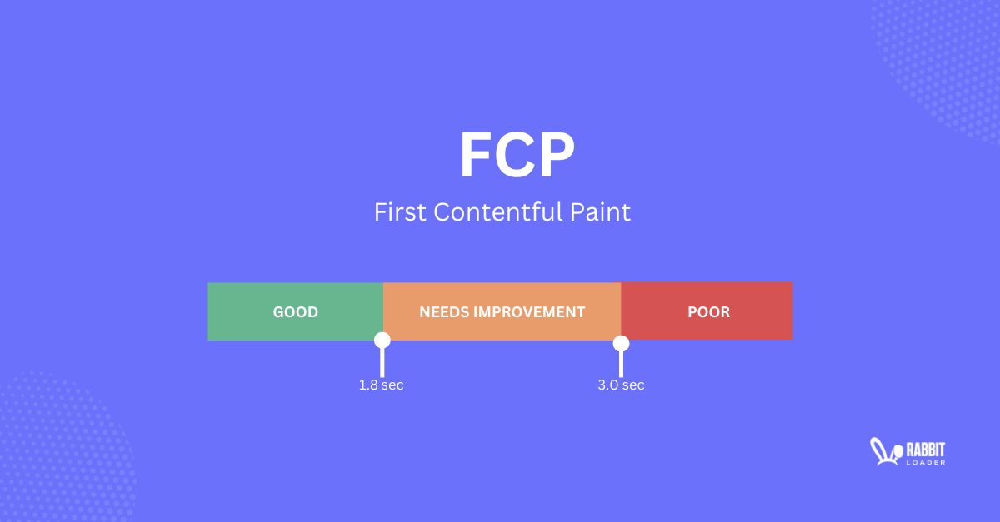

> ☝️ 이 문서에서는 Lighthouse Performance 감점 요인 중 CSS로 인한 Render blocking requests 항목을 주요 원인으로 판단한 근거와, 이를 개선하기 위한 과정을 정리했습니다.

<br />

## I. Render blocking request 항목으로 인해 FCP 지연이 발생하는 원인

[｢Google Lighthouse 개선 | Lighthouse Performance 성능 개선｣](./google-lighthouse-upgrade.md/#iii-lighthouse-performance-성능-개선) 문서에서 Lighthouse Performance 감점 요인 중, **Render blocking requests 항목**이 **FCP 측정 시점을 지연시키는 주요 원인 중 하나**라고 설명했습니다.

먼저 해당 항목이 FCP 측정 시점을 지연시키는 원인 중 하나가 되는 이유를 설명하기에 앞서, 이전 [｢Google Lighthouse 개선 | Lighthouse Performance 점수 94점 측정 원인｣](./google-lighthouse-upgrade.md/#b-lighthouse-performance-점수-94점-측정-원인) 문서에서 **Render blocking requests를 발생시키는 네트워크 요청 자원**의 종류를 확인했지만, **해당 문서에서는 다루지 않았기 때문에 어떤 자원들이 렌더링 흐름을 차단하는 자원에 해당하는지 다시 확인**해보겠습니다.

<br />


<br />

위 이미지를 통해 **렌더링 흐름을 차단하는 자원**은 총 **`index.xxx.css` 번들 CSS 파일**과 **jsDelivr CDN에서 제공되는 `reset.min.css` 파일** 두 개라는 것을 확인할 수 있습니다. 즉 **두 자원의 공통점은 CSS 파일이라는 점**입니다. 그렇다면 왜 **CSS 파일이 렌더링 흐름을 차단하는 자원에 속하는지 이해**하기 위해, **브라우저의 동작 및 렌더링 과정**을 먼저 살펴보겠습니다.

<br />


<br />

많은 프론트엔드 개발자는 **브라우저의 동작 및 렌더링 과정을 이해한 상태에서 프로젝트를 진행**합니다. 브라우저 동작 및 렌더링 과정을 간단히 정리하면 다음과 같습니다.

<br />

> 브라우저 동작･렌더링 과정에 대해 보다 자세한 내용은, 제 기술 블로그의 [｢Notion: 브라우저 동작 원리｣](https://gye-won.notion.site/Browser-Workflow-2ae88bd9c3fa80b8a33dc4b869c180ec?pvs=74) 포스트를 참고해 주시기 바랍니다.

<br />

1. 사용자가 URL에 최초 접속하면, 브라우저 구성 요소 중 사용자 인터페이스(UI)는 이를 감지하고 브라우저 엔진(UI와 렌더링 엔진 사이에서 동작을 중재하는 역할)에 전달합니다. 이후 브라우저 엔진은 해당 요청을 렌더링 엔진에 전달합니다.
1. URL을 전달받은 렌더링 엔진은 브라우저의 통신 모듈에 요청을 전달하고, 통신 모듈은 DNS 조회 및 TCP/IP 연결 과정을 거쳐 웹 서버로부터 HTML, CSS, JavaScript 등의 정적 자원을 전달받아 다시 렌더링 엔진에 전달합니다.
1. 렌더링 엔진은 전달받은 HTML과 CSS를 각각 DOM과 CSSOM으로 변환한 뒤 이를 결합하여 Render Tree를 생성합니다. 이후 요소의 크기와 위치를 계산하는 Layout 단계를 수행하고, 색상 및 그림자 등 시각적 속성을 픽셀 단위로 계산하는 Paint 작업을 수행합니다. 마지막으로 결과 레이어를 결합하는 Composite 단계를 거쳐 UI 백엔드로 전달합니다.
1. UI 백엔드는 Render Tree 기반 계산 결과를 바탕으로 GPU 및 OS 그래픽 시스템과 연동하여 실제 화면을 그리는 작업을 수행하며, 최종적으로 브라우저 뷰포트에 렌더링 결과가 출력됩니다.

<br />

브라우저 렌더링 과정을 보면 알 수 있듯이, HTML과 CSS는 **각각 DOM과 CSSOM으로 변환된 뒤 이를 결합하여 Render Tree를 생성**하고, 이를 기반으로 **최종적으로 사용자 화면에 URL에 맞는 페이지가 출력**됩니다.

즉 URL에 맞는 페이지를 화면에 출력하기 위해서는 DOM과 CSSOM을 결합한 **Render Tree 기반의 모든 계산이 완료된 결과물이 필요**합니다. 그렇기 때문에 DOM과 CSSOM을 구축하는 과정은 **실행 흐름이 보장되는 동기 방식으로 진행**됩니다.

조금 더 정확히 설명하면, 브라우저가 HTML 문서를 해석하는 과정에서 `<link>` 태그를 만나면 연결된 **CSS 파일을 비동기적으로 불러온 뒤 CSSOM을 동기적으로 구축**하게 됩니다. 이때 **여러 개의 CSS 파일**을 불러오게 되면, **먼저 불러온 CSS 파일부터 CSSOM을 구축하**고 **이후 불러온 CSS 파일을 해석한 뒤 기존에 구축된 CSSOM에 재계산하여 반영**하게 됩니다.

<br />

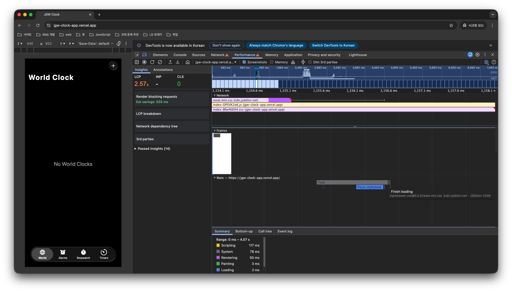

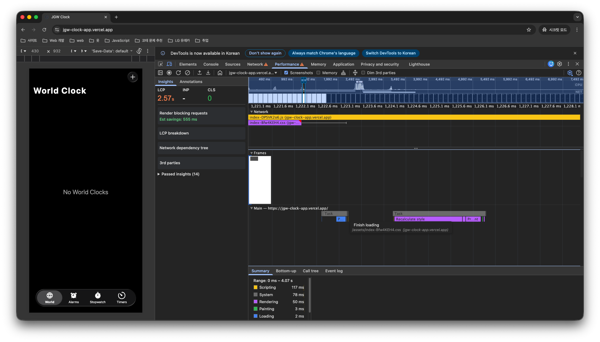


<br />

이 과정에서 CSS 파일 자체를 불러오는 동작은 비동기로 수행되기 때문에 DOM 파싱이 즉시 차단되지는 않습니다. 하지만 **CSSOM을 동기적으로 구축하는 과정**에서는 **DOM 파싱이 일시적으로 차단되며 렌더링 흐름이 지연**됩니다.

다만 여기서 중요한 점은, **CSS 파일을 네트워크를 통해 요청하고 응답받는 과정 자체**가 렌더링 흐름을 직접 차단하지는 않더라도, 실제 화면에 출력할 수 있는 **Render Tree 정보가 구축되지 않은 상태이기 때문에 어떠한 콘텐츠도 출력되지 않는다는 점**입니다.

즉 **CSSOM을 구축하는 과정에서 DOM 파싱이 일시적으로 차단되어 렌더링 흐름이 지연**되기도 하지만, 최초 로드 시 화면에 출력할 수 있는 Render Tree가 완성되지 않은 상태이므로 **CSS 파일을 불러오는 과정에서 요청을 보내는 시간과 응답을 받기까지 소요되는 시간 또한 결과적으로 렌더링 지연의 원인**이 될 수 있습니다.

이처럼 종합적인 이유로 인해 CSS 파일은 **"렌더링 흐름을 차단하는 네트워크 자원(Render blocking request)"** 에 속하게 됩니다. 따라서 **CSS 파일 자체를 해당 자원에서 제외하는 것은 불가능**하지만, **불러와야 하는 CSS 파일의 수를 줄이거나 파일 크기를 축소**하는 등의 방법을 통해 **CSSOM 구축 시간** 또는 **네트워크 응답 시간을 단축**시켜 **CSS로 인해 지연되는 FCP 시점을 앞당길 수 있습니다.**

<br />

## II. jsDelivr CDN - `reset.min.css`

렌더링 흐름을 차단시키는 네트워크 요청 자원 중 먼저 **`reset.min.css`** 가 무엇인지 살펴보겠습니다.

`reset.min.css`은 **jsDelivr CDN에서 제공하는 스타일 초기화 파일**로, 각 **브라우저가 기본적으로 가지고 있는 스타일을 최소한의 수준으로 제거하여 일관된 스타일 제공**하기 위한 용도로 사용됩니다.

또한 파일명에 포함된 **`min`은 경량화(Minified) 파일임을 의미**하며, **불필요한 공백 및 주석 등을 제거해 파일 크기를 최소화한 상태로 제공**된다는 뜻입니다. 즉 **`reset.css`와 동일한 기능을 제공**하지만, **네트워크 전송 효율을 높이기 위해 최적화된 형태의 결과물**입니다.

아울러 **CDN(Content Delivery Network)을 통해 제공**되기 때문에 **사용자와 물리적으로 가까운 서버로부터 응답을 전달받게 되어 네트워크 지연 시간이 상대적으로 짧아진다는 특성**을 가집니다.

이로 인해 **네트워크 요청에 대한 응답 크기 자체도 매우 작고, 전송 속도 또한 비교적 빠른 시간 내에 수신**할 수 있습니다. 실제로 `reset.css`와 `reset.min.css`의 **응답 속도 및 파일 크기 차이를 Network 탭에서 비교**해보면 다음과 같습니다. 단, Vercel을 통해 배포된 사이트에서 확인하려면 재빌드가 필요하기 때문에, CPU와 Network 성능을 동일하게 제한한 상태에서 **개발 서버 기준으로 차이를 비교**했습니다.

<br />

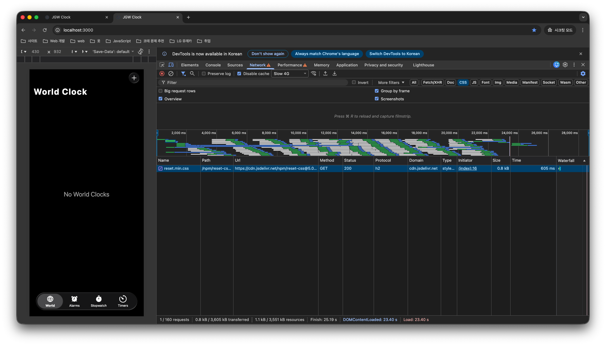

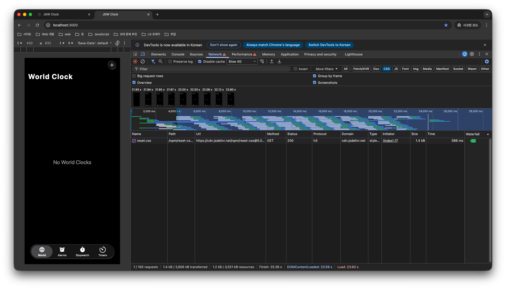

<br />

비교 결과를 보면 **`reset.min.css`의 파일 크기는 약 0.8kB**, **`reset.css`는 약 1.4kB**로 확인됩니다. 즉 매우 큰 차이는 아니지만 **약 0.6kB 수준의 차이가 발생**합니다.

또한 Time 속성 값을 확인해보면 성능을 제한한 환경임에도 **두 파일 간 응답 시간 차이는 크게 벌어지지 않았습니다.** 이는 **두 파일의 크기 차이가 크지 않고, 사용자와 물리적으로 가까운 서버인 CDN을 통해 제공되기 때문**으로 보입니다. 여러 차례 측정한 결과 **대략 580 ~ 620ms 내에 요청에 대한 응답을 전달받는 것을 확인**할 수 있었습니다.

이제 **`reset.min.css` 기준**으로, **응답을 전달받은 이후 스타일시트 해석 및 초기 CSSOM 구축 계산 과정이 어느 정도 소요**되는지 Performance 패널을 통해 확인해보겠습니다.

<br />

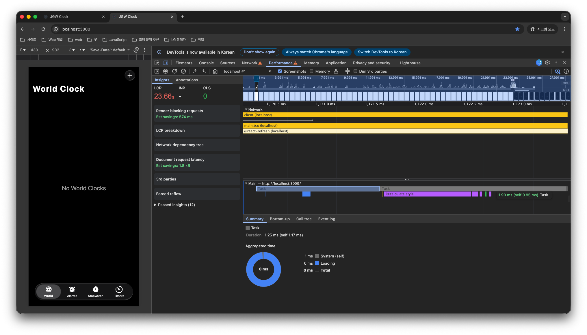

<br />

위 이미지를 보면 응답을 전달받은 이후 **Parse Stylesheet가 포함된 Task 막대(이미지에서 클릭된 Task를 의미)는 약 1.25ms가 소요**되었고, **초기 CSSOM 구축 계산 과정이 포함된 Recalculate Style Task 막대는 약 1.9ms가 소요**된 것을 확인할 수 있습니다.

**두 시간을 합산하면 약 3.15ms 수준**으로, jsDelivr CDN에서 스타일 초기화 파일 응답을 전달받은 이후 **초기 CSSOM 구축 계산 완료까지 걸린 시간이 매우 짧다는 것을 확인**할 수 있습니다.

즉 jsDelivr CDN에서 제공하는 스타일 초기화 파일로 인해 **CSSOM을 구축하는 과정에서 DOM 파싱이 일시적으로 차단되어 렌더링 흐름을 지연**시키기는 하지만, 그 시간이 **매우 짧기 때문에 FCP 측정 시점을 늦추는 데 큰 영향을 주지는 않습니다.**

다만 문제는 해당 스타일 코드를 직접 작성한 것이 아니라 **CDN을 통해 제공받는 자원이기 때문에 로직 수정이 불가능**하여, **파일 크기를 줄이는 방식의 최적화 또한 적용할 수 없다는 점**입니다. 따라서 **CSSOM 구축 시간을 추가적으로 단축시키는 데에는 한계**가 있습니다.

앞서 [｢I. Render blocking request 항목으로 인해 FCP 지연이 발생하는 원인｣](#i-render-blocking-request-항목으로-인해-fcp-지연이-발생하는-원인) 목차에서 설명했듯이, CSS 파일은 CSSOM 구축 시간뿐만 아니라 해당 **파일을 요청하는 시간과 응답을 받기까지 소요되는 시간 또한 결과적으로 렌더링 지연의 원인**이 된다고 설명했습니다.

그리고 jsDelivr CDN에서 제공하는 스타일 초기화 파일은 **대략 580 ~ 620ms 내에 요청에 대한 응답을 전달받는 것을 확인**했습니다. 이는 **초기 Render Tree 구축에 필요한 CSSOM 자원 중 하나인 스타일 초기화 CSS 파일을 전달받기 전까지 렌더링이 지연**되며, 그로 인해 **FCP 측정 시점이 늦춰질 수 있음을 의미**합니다.

따라서 현재와 같이 CDN을 통해 직접 불러오는 방식이 아니라, React의 Virtual DOM 구축 시 진입점 파일에 연결된 **`global.scss` 파일 내부로 해당 스타일 초기화 파일을 요청**하는 방식으로 로직을 수정해보겠습니다.


<br />

```html
<!doctype html>
<html lang="ko">
  <head>
    <!-- jsDeliver CDN 자원 주석 처리 -->
    <!-- <link rel="stylesheet" href="https://cdn.jsdelivr.net/npm/reset-css@5.0.2/reset.min.css"> -->
  </head>
  <body>
  </body>
</html>
```

```scss
@import url("https://cdn.jsdelivr.net/npm/reset-css@5.0.2/reset.min.css"); // jSDeliver CDN 자원 요청 global.scss 파일 내부에 포함

// ...기존 로직
```

<br />

`global.scss` 파일 내부로 jsDelivr CDN에서 제공하는 스타일 초기화 CSS 파일을 요청하도록 로직을 수정한 뒤 **재빌드**하고, **이후 Vercel을 통해 배포된 환경에서 FCP 측정 시점을 다시 확인**해보겠습니다.

<br />

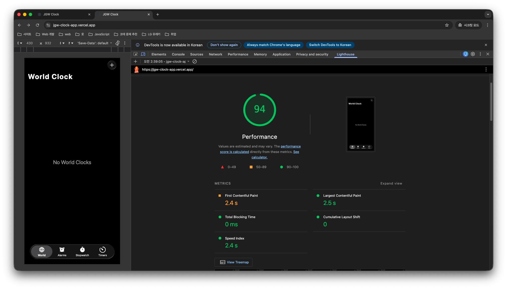

<br />

jsDelivr CDN에서 제공하는 스타일 초기화 CSS 파일을 요청하는 로직을 `global.scss`로 옮긴 후 결과를 보면, **FCP 측정 시점은 여전히 약 2.4s로 동일한 것을 확인**할 수 있습니다. 이러한 결과가 나온 이유는 **결국 스타일 초기화 CSS 파일에 대한 네트워크 요청이 제거되지 않았기 때문**입니다.

<br />

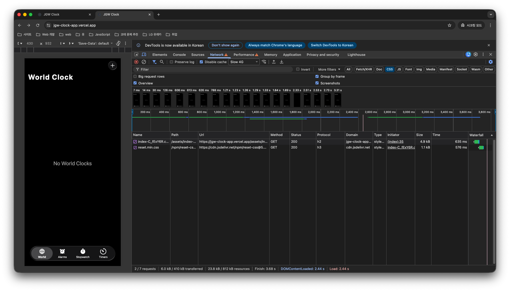

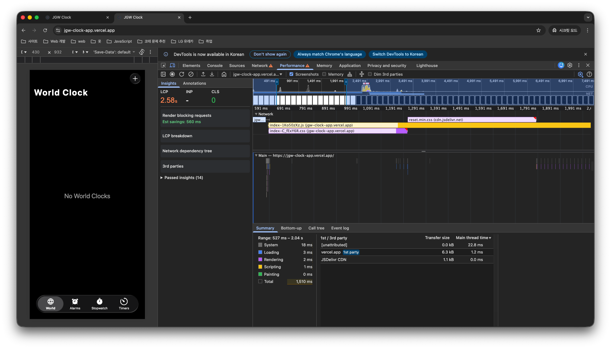

<br />

개발자 도구의 Network와 Performance 패널 결과를 보면, 여전히 **`index.xxx.css` 번들 CSS 파일**과 더불어 jsDeliver CDN에서 제공하는 **스타일 초기화 파일**을 **요청**하고 있다는 것을 확인할 수 있습니다.

다만 달라진 점은 기존에는 HTML 문서를 동기적으로 해석하는 과정에서 **jsDelivr CDN 스타일 초기화 파일을 요청하는 `<link>` 태그를 먼저 만나 해당 파일을 먼저 요청**했다면, **현재는 `index.xxx.css` 번들 CSS 파일을 먼저 불러온 이후 스타일 초기화 파일을 불러오는 순서로 변경**되었다는 점입니다.

이는 수정한 로직이 **SCSS의 `@import` 규칙 기반으로 변경되었기 때문**입니다. 해당 방식은 **CSS의 `@import`와 동일하게 동작**하여, 해당 **파일에 대한 요청 및 해석이 완료된 이후 다음 로직을 실행하는 구조**를 가집니다. 즉 jsDelivr CDN에서 제공하는 스타일 초기화 파일 요청이 제거된 것이 아니라, **해당 파일을 먼저 해석한 뒤 번들링된 CSS 로직을 해석하여 최종적으로 CSSOM을 구축하는 구조로 변경된 것**입니다.

결과적으로 요청 순서만 변경되었을 뿐, **네트워크 요청 자체는 여전히 발생**하고 있기 때문에 FCP 측정 시점에는 실질적인 변화가 없다고 볼 수 있습니다.

그렇다면 jsDelivr CDN에서 제공하는 **스타일 초기화 파일에 대한 요청을 제거하면서 기능은 그대로 적용할 수 있는 방법**은 무엇일까요? 바로 해당 **스타일 초기화 파일 내부에 작성된 CSS 로직을 `global.scss`에 직접 포함시키는 방식**입니다.

이러한 방식은 **추가적인 CSS 네트워크 요청을 줄이기 위해 실제로 많이 사용되는 방법**이며, jsDelivr CDN에서도 파일 URL 제공뿐만 아니라 파일 자체를 다운로드할 수 있는 기능을 함께 제공합니다.

<br />

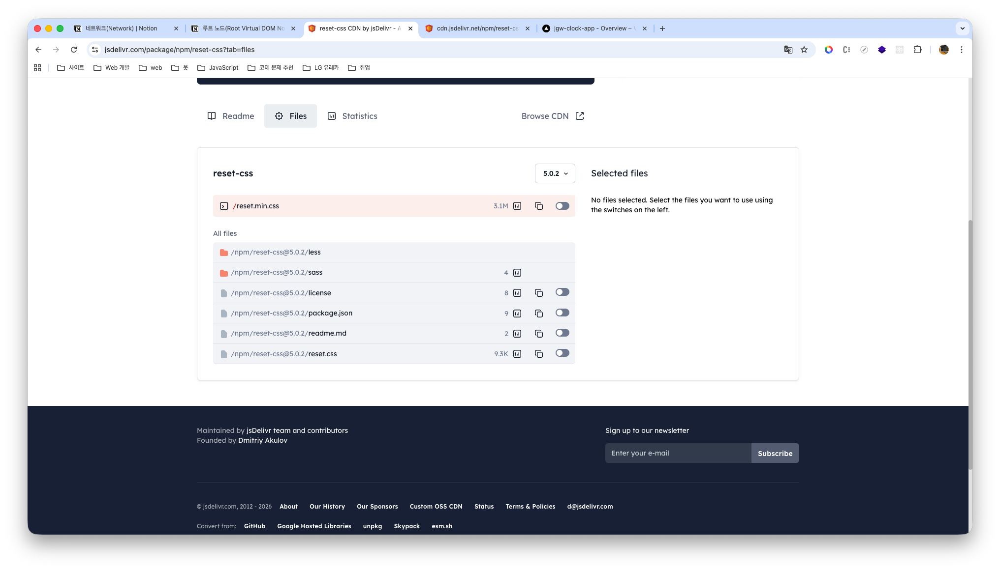

<br />

따라서 SCSS 환경을 사용하고 있는 현재 프로젝트 기준에 맞게, jsDelivr CDN에서 제공하는 **SCSS 파일을 다운로드한 뒤 `global.scss`에 연결하도록 로직을 수정**해보겠습니다.

<br />

```scss
// src/app/styles/_reset.scss
html, body, div, span, applet, object, iframe,
h1, h2, h3, h4, h5, h6, p, blockquote, pre,
a, abbr, acronym, address, big, cite, code,
del, dfn, em, img, ins, kbd, q, s, samp,
small, strike, strong, sub, sup, tt, var,
b, u, i, center,
dl, dt, dd, ol, ul, li,
fieldset, form, label, legend,
table, caption, tbody, tfoot, thead, tr, th, td,
article, aside, canvas, details, embed,
figure, figcaption, footer, header, hgroup,
main, menu, nav, output, ruby, section, summary,
time, mark, audio, video {
	margin: 0;
	padding: 0;
	border: 0;
	font-size: 100%;
	font: inherit;
	vertical-align: baseline;
}
article, aside, details, figcaption, figure,
footer, header, hgroup, main, menu, nav, section {
	display: block;
}
*[hidden] {
    display: none;
}
body {
	line-height: 1;
}
menu, ol, ul {
	list-style: none;
}
blockquote, q {
	quotes: none;
}
blockquote:before, blockquote:after,
q:before, q:after {
	content: '';
	content: none;
}
table {
	border-collapse: collapse;
	border-spacing: 0;
}
```

```scss
// global.scss
@use "reset";
```

> Sass / SCSS는 CSS의 확장(Supertset) 언어이기 때문에 CSS 로직을 그대로 붙여넣어도 동일하게 동작합니다.

<br />

jsDelivr CDN에서 제공하는 SCSS 파일을 다운로드하여 `global.scss`에 연결하도록 로직을 수정한 뒤, **재빌드**하고, **이후 Vercel을 통해 배포된 환경에서 FCP 측정 시점을 다시 확인**해보겠습니다.

<br />


<br />

jsDelivr CDN에서 제공하는 스타일 초기화 CSS 요청을 제거하고, 해당 파일을 다운로드하여 `global.scss`에 연결하도록 로직을 수정한 뒤 결과를 보면 **FCP 측정 시점**이 **기존 약 2.4s에서 약 1.8s로 단축**된 것을 확인할 수 있으며, **Lighthouse Performnace 점수 또한 기존 94점에서 98점으로 개선**된 것을 확인할 수 있습니다.

<br />

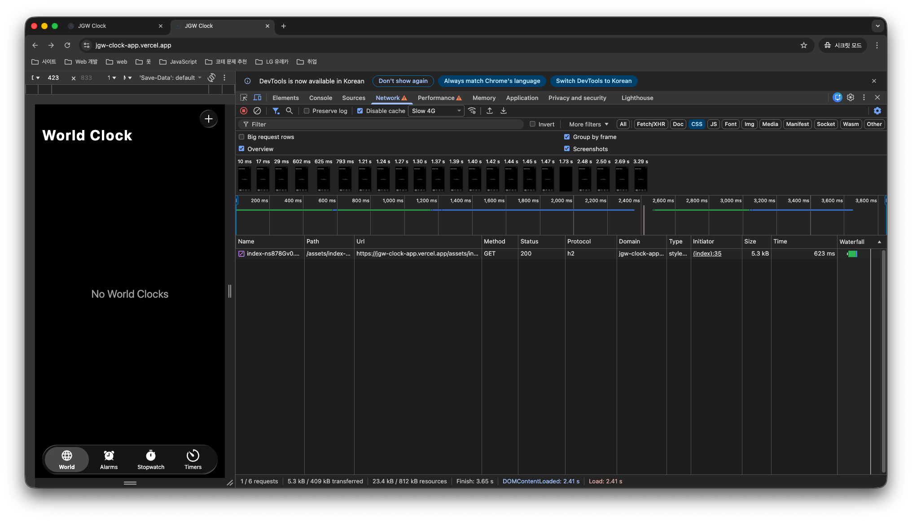

<br />

또한 개발자 도구 Network 패널에서 CSS 네트워크 요청 항목을 보면 **`index.xxx.css` 번들 CSS 파일만 요청되는 것을 확인**할 수 있습니다. 즉 스타일 초기화 기능은 그대로 유지되지만, 추가 요청이 제거되면서 FCP 측정 시점이 개선된 결과를 확인할 수 있습니다.

<br />
<br />
<br />
<br />
<br />
<br />
<br />
<br />
<br />
<br />
<br />
<br />
<br />
<br />
<br />
<br />
<br />
<br />
<br />
<br />


## I. Render blocking requests 항목이 FCP 지연의 주요 원인이라고 판단한 이유

[｢Google Lighthouse 개선 | Lighthouse Performance 성능 개선｣](./google-lighthouse-upgrade.md/#iii-lighthouse-performance-성능-개선) 문서에서 Lighthouse Performance 감정 요인 중, 개인적으로 CSS로 인한 **Render blocking requests 항목**이 **FCP 측정 시점을 지연시키는 주요 원인**으로 보고 있다고 설명했습니다.

먼저 해당 감점 요인을 주요 원인으로 본 이유를 설명하기에 앞서 **브라우저 동작 및 렌더링 과정**을 살펴보겠습니다.

<br />


> 브라우저 동작･렌더링 과정에 대해 보다 자세한 내용은, 제 기술 블로그의 [｢Notion: 브라우저 동작 원리｣](https://gye-won.notion.site/Browser-Workflow-2ae88bd9c3fa80b8a33dc4b869c180ec?pvs=74) 포스트를 참고해 주시기 바랍니다.

<br />

많은 프론트엔드 개발자는 **브라우저의 동작 및 렌더링 과정을 이해한 상태에서 프로젝트를 진행**합니다. 브라우저 동작 및 렌더링 과정을 간단히 정리하면 다음과 같습니다.

<br />

1. 사용자가 URL에 최초 접속하면, 브라우저 구성 요소 중 사용자 인터페이스(UI)는 이를 감지하고 브라우저 엔진(UI와 렌더링 엔진 사이에서 동작을 중재하는 역할)에 전달합니다. 이후 브라우저 엔진은 해당 요청을 렌더링 엔진에 전달합니다.
1. URL을 전달받은 렌더링 엔진은 브라우저의 통신 모듈에 요청을 전달하고, 통신 모듈은 DNS 조회 및 TCP/IP 연결 과정을 거쳐 웹 서버로부터 HTML, CSS, JavaScript 등의 정적 자원을 전달받아 다시 렌더링 엔진에 전달합니다.
1. 렌더링 엔진은 전달받은 HTML과 CSS를 각각 DOM과 CSSOM으로 변환한 뒤 이를 결합하여 Render Tree를 생성합니다. 이후 요소의 크기와 위치를 계산하는 Layout 단계를 수행하고, 색상 및 그림자 등 시각적 속성을 픽셀 단위로 계산하는 Paint 작업을 수행합니다. 마지막으로 결과 레이어를 결합하는 Composite 단계를 거쳐 UI 백엔드로 전달합니다.
1. UI 백엔드는 Render Tree 기반 계산 결과를 바탕으로 GPU 및 OS 그래픽 시스템과 연동하여 실제 화면을 그리는 작업을 수행하며, 최종적으로 브라우저 뷰포트에 렌더링 결과가 출력됩니다.

<br />

브라우저 렌더링 과정을 보면 알 수 있듯이, HTML과 CSS는 **각각 DOM과 CSSOM으로 변환된 뒤 이를 결합하여 Render Tree를 생성**하고, 이를 기반으로 **최종적으로 사용자 화면에 URL에 맞는 페이지가 출력**됩니다.

즉 URL에 맞는 페이지를 화면에 출력하기 위해서는 DOM과 CSSOM을 결합한 **Render Tree 기반으로 모든 계산이 끝마친 결과물이 필요**합니다. 그렇기 때문에 DOM과 CSSOM을 구축하는 과정은 **실행 흐름이 보장되는 동기 방식으로 진행**됩니다.

조금 더 정확히 설명하면, 브라우저가 DOM을 해석하는 과정에 `<link>` 태그를 만나면 연결된 CSS 파일을 비동기적으로 불러온 뒤 **CSSOM을 동기적으로 구축**하게 됩니다. 이 과정에서 **DOM 파싱이 일시적으로 차단되며 렌더링 흐름이 지연**됩니다.

다만 CSSOM 구축으로 인해 렌더링 흐름이 지연된다고 해서 무조건 부정적으로만 볼 수는 없습니다. 만약 **CSSOM 구축이 비동기로 진행**되어 **완료되지 않은 상태에서 Render Tree 결합**이 이루어진다면 **스타일 정보가 누락된 상태로 Layout -> Paint -> Composite 단계가 진행되어 화면이 출력**될 수 있습니다.

이후 **누락된 스타일이 추가 반영**되면 브라우저는 **최종 계산된 스타일 값이 변경되었음을 감지하고 Reflow 및 Repaint 과정을 반복 수행**하게 됩니다. 결국 추가 연산이 지속적으로 발생하면서 **런타임 성능 저하**로 이어질 수 있습니다.

따라서 브라우저는 HTML 파싱 과정에서 CSSOM 구축을 동기적으로 완료한 이후 **DOM 파싱이 종료되면 Render Tree로 결합하고 화면을 출력**합니다. 이렇게 하면 이후 **추가 스타일 재계산이 최소화되어 성능 저하를 방지**할 수 있습니다.

물론 브라우저가 처리해야 할 **CSS 파일 수가 많거나 각 파일의 크기가 크다면 CSSOM 구축에 소요되는 시간 역시 증가**합니다. 이는 **최초 로딩 시 첫 번째 콘텐츠가 화면에 표시되는 시점(FCP)이 지연될 수 있는 원인**이 됩니다.

또한 Clock 서비스는 React 기반 SPA 애플리케이션이기 때문에 초기에는 빈 HTML 문서를 전달받고, `defer`로 인해 DOM 파싱이 완료된 이후  JavaScript 로직이 수행됩니다. 따라서 **최초 전달받은 HTML을 DOM으로 구축하는 과정**과, 이후 **Virtual DOM이 생성되어 실제 DOM에 반영되는 과정**이 **함께 발생**하게 됩니다.

이 과정 역시 결과적으로 **최초 로딩 시 콘텐츠가 화면에 표시되는 구간에 포함되기 때문에 FCP 지연의 원인**이 될 수 있습니다. 그렇기 때문에 Render blocking requests 항목을 **주요 원인으로 판단한 근거가 충분하지 않다고 느껴질 수 있어**, 개발자 도구 Performance 패널을 통해 **FCP 이전 구간을 보다 구체적으로 확인**해보겠습니다.

<br />

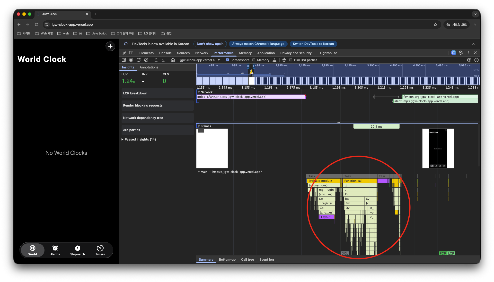

<br />

Performance 결과를 보면 알 수 있듯이, 정확한 내용은 모르더라도 Network 탭의 **`index.xxx.css` 번들 CSS 파일의 작업이 끝난 이후**에 **다수의 함수 호출이 발생**하는 것을 볼 수 있습니다.

<br />

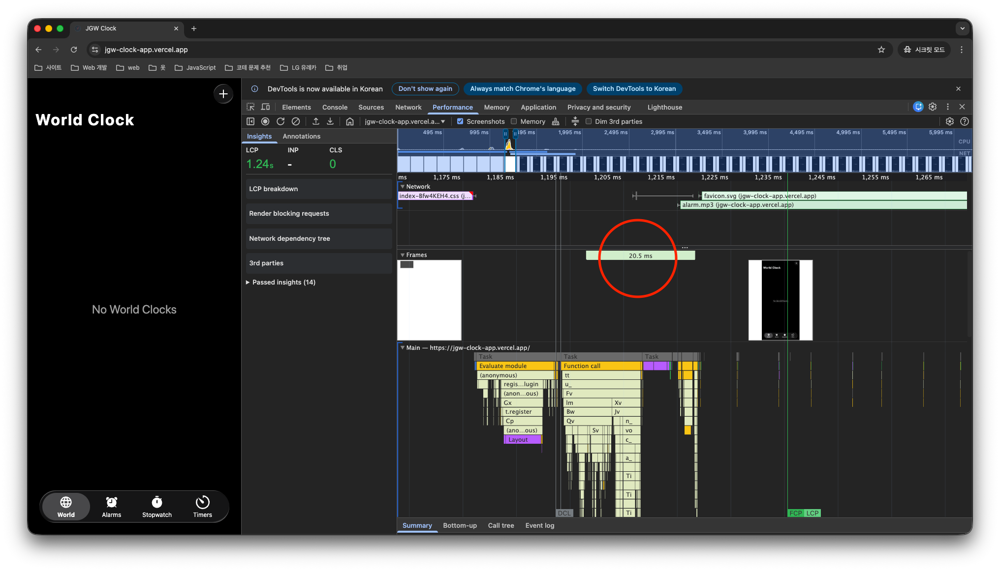

<br />

또한 해당 함수 호출 이후 **Frames 탭에서 초록색 구간이 표시**되는데, 이는 **실제 화면을 그리기까지 소요되는 시간 구간**이기 때문에 Virtual DOM을 구축한 이후 실제 DOM에 반영되는 과정으로 추정할 수 있습니다. 다만 Frames 구간을 확인해보면 **약 20.5ms 이후 바로 `/world` 페이지가 출력**되는 것을 확인할 수 있습니다.

<br />

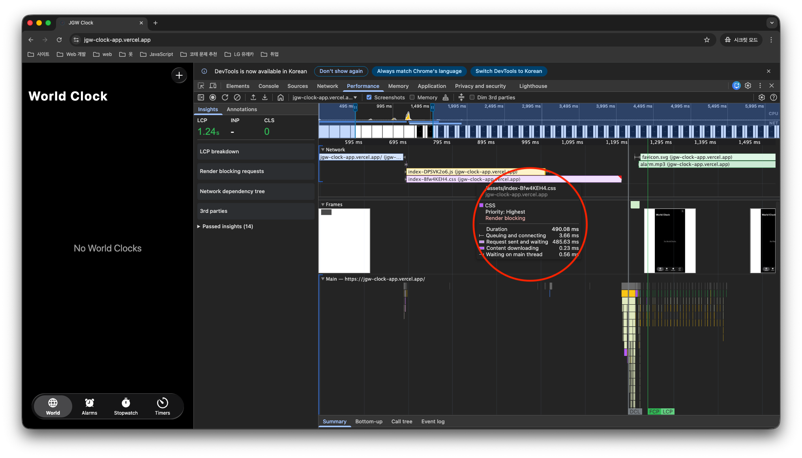

<br />

반면 Network 탭에서 **`index.xxx.css` 구간**을 확인해보면 **약 490.08ms 동안 지속되는 것을 확인**할 수 있습니다. 이 구간이 의미하는 바는 **Render Tree 결합을 위해 필요한 CSS 파일을 받아오는 과정**과, **응답 이후 CSSOM을 구축하는 데 소요되는 시간**을 포함한 구간을 나타냅니다.

따라서 Lighthouse Performance 감점 요인 중 Render blocking requests와 Reduce unused JavaScript 항목 **모두 FCP 지연 요인이 될 수는 있지만,** Reduce unused JavaScript 항목에 비해 **Render blocking requests 항목**이 **더 큰 지연을 발생시키는 원인으로 동작**하고 있기 때문에 **FCP 지연의 주요 원인이라고 판단**했습니다.

그렇다면 이전 [｢Google Lighthouse 개선 | Lighthouse Performance 점수 94점 측정 원인｣](./google-lighthouse-upgrade.md/#b-lighthouse-performance-점수-94점-측정-원인) 문서에서 **Render blocking requests를 발생시키는 네트워크 요청 자원**이 무엇인지 확인했지만, 해당 문서에서는 다루지 않았기 때문에 다시 한 번 살펴보겠습니다.

<br />


<br />

결과를 보면 알 수 있듯이 `index.xxx.css` 번들 CSS 파일 이외에도, **jsDelivr CDN에서 제공되는 `reset.min.css` 파일** 역시 **렌더링 흐름을 차단시키는 네트워크 요청 자원으로 동작**하고 있음을 확인할 수 있습니다.

따라서 Render Tree 결합을 위해 **CSSOM을 구축하는 데 소요되는 시간을 줄이기 위한 개선 과정**은, **다음 목차부터 `reset.min.css` 파일부터 순차적으로 다루어 보겠습니다.**

<br />