> ☝️ 이 문서에서는 Lighthouse Performance 감점 요인 중 JavaScript로 인한 Reduce unused JavaScript를 개선하기 위한 과정을 정리했습니다.

<br />

## I. Reduce unused JavaScript 항목으로 인해 FCP 지연이 발생하는 원인

[｢Google Lighthouse 개선 | Lighthouse Performance 성능 개선｣](./google-lighthouse-upgrade.md/#iii-lighthouse-performance-성능-개선) 문서에서 Lighthouse Performance 감점 요인 중, **Reduce unused JavaScript 항목**이 **FCP 측정 시점을 지연시키는 주요 원인 중 하나**라고 설명했습니다.

먼저 이전 [｢Google Lighthouse 개선 | Lighthouse Performance 점수 94점 측정 원인｣](./google-lighthouse-upgrade.md/#b-lighthouse-performance-점수-94점-측정-원인) 문서에서는 **Reduce unused JavaScript를 발생시키는 `.js` 파일의 종류를 확인**했지만, **해당 문서에서는 다루지 않았기 때문에 어떤 자원으로 인해 사용되지 않는 JavaScript 로직이 포함되어 있는지 다시 확인**해보겠습니다.

<br />


<br />

위 이미지를 통해 사용되지 않는 JavaScript가 포함된 파일은 **번들링된 JavaScript 파일 단 하나**라는 것을 확인할 수 있습니다. 즉 **번들링 결과물에 최초 로드 시점에서 실제로 사용되지 않는 코드가 함께 포함**되어 있기 때문에, 해당 항목이 **감점 요인으로 작용**한다는 것을 알 수 있습니다.

그렇다면 여러 개의 JavaScript 파일이 **하나의 번들 결과물로 구성**되었을 때, 개발자 도구 Performance 패널을 통해 **FCP 측정 이전 구간을 확인**해보겠습니다.

<br />

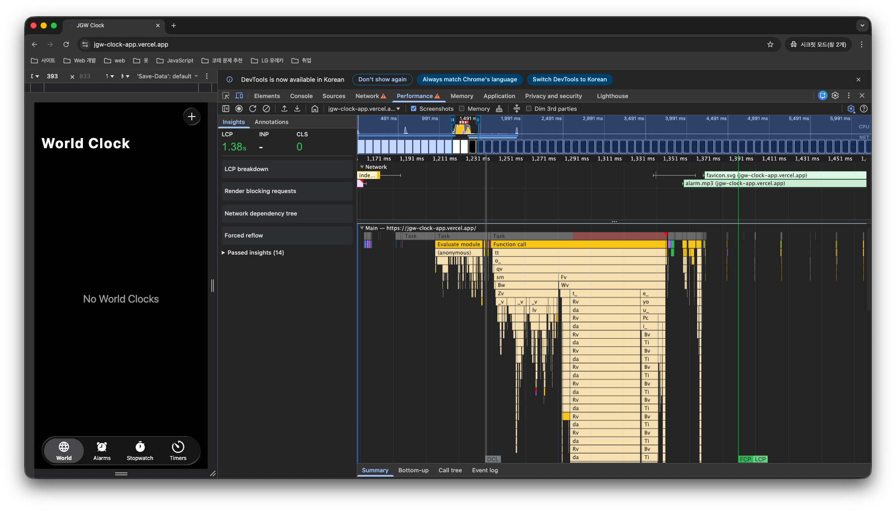

<br />

Performance 결과를 확인해보면, 난독화로 인해 정확히 어떤 함수들이 호출되는지는 식별하기 어렵지만, **FCP 측정 시점 바로 이전 구간**에서 스크린샷 이미지에 모두 담기지 않을 만큼 **매우 많은 함수들이 호출된 이후에 최초 로딩 이후 첫 번째 콘텐츠가 표시**되고 있음을 확인할 수 있습니다.

사실 난독화로 인해 정확히 어떤 함수들인지는 식별하기 어렵지만, **FCP는 최초 로딩 이후 첫 번째 콘텐츠가 화면에 표시되는 시점을 의미**합니다. 즉 여기서 중요한 표현은 **"최초 로딩 이후"** 라는 점입니다. 이 표현이 중요한 이유는 **React가 SPA + CSR 기반으로 동작하는 라이브러리**이기 때문입니다. 이를 정확히 이해하기 위해서는 **SPA 기반 웹 애플리케이션에서 화면이 출력되는 동작 과정을 이해**할 필요가 있으므로, 해당 과정을 간단히 살펴보겠습니다.

> React의 Virtual DOM 기반 SPA + CSR 웹 애플리케이션 동작 과정을 기준으로 설명합니다.

<br />

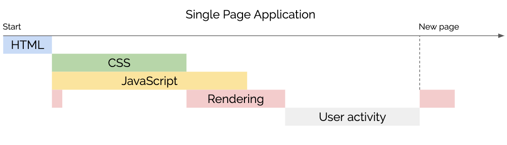

<br />

일반적으로 SPA 기반 웹 애플리케이션은 서버로부터 **HTML 문서 하나**와, **화면 구성을 위한 `<link>`, `<script>` 태그에 연결된 모든 정적 자원**을 **최초에 함께 요청**하게 됩니다.

이후 브라우저는 전달받은 HTML 문서와 CSS를 기반으로 **DOM과 CSSOM을 각각 구축하고, 이를 결합하여 Render Tree를 구성**합니다. 하지만 전달받은 HTML 문서에는 **`<div id="root"></div>`만 존재하기 때문에 초기에는 사용자에게 하얀 화면(White Screen)이 노출**됩니다.

이때 **`<script>` 태그에 연결된 JavaScript 로직이 실행**되면서, 메모리 상에서 JavaScript 객체 형태로 관리되는 실제 DOM을 추상화한 **Virtual DOM을 구축**하게 됩니다. 이 과정에서 **React로 작성된 컴포넌트 로직이 `React.createElement()` 호출을 통해 Virtual Element를 생성하고, 이를 결합하여 하나의 Virtual DOM을 구성**하게 됩니다.

이후 구축된 Virtual DOM을 HTML 문서에서 전달받은 **대상 요소(`<div id="root" />`)에 반영하여 실제 DOM을 재구성**하게 되며, **다시 Render Tree를 생성한 뒤 최종적으로 사용자 화면에 UI가 표시**됩니다.

<br />

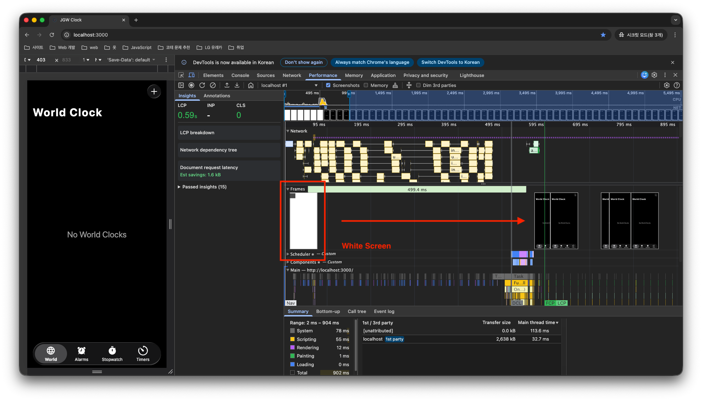

<br />

이로 인해 최초 접속 시 화면 생성을 위한 자원을 모두 요청하고, Virtual DOM을 구축하기 전까지 하얀 화면이 노출되며, Virtual DOM 생성을 위한 다양한 함수 호출로 인해 **초기 렌더링이 지연되는 단점이 존재**합니다. 반면 Virtual DOM 구축 이후에는 **DOM 변경이 발생하더라도 재조정(Reconciliation) 과정을 통해 변경된 요소만 갱신**되며 **페이지 전체가 다시 로드되지 않기 때문에, 모바일 퍼스트(Mobile-First) 전략에 유리**하다는 장점이 있습니다.

즉 Clock 웹 애플리케이션과 같은 React 기반 프로젝트에서 **FCP 측정 시점 직전 구간에 매우 많은 함수 호출이 발생한 이유**는, 최초 로딩 이후 **Virtual DOM을 구축하기 위해 `React.createElement()`가 반복 호출되며 Virtual Element를 생성하는 과정을 거치기 때문**입니다.

<br />

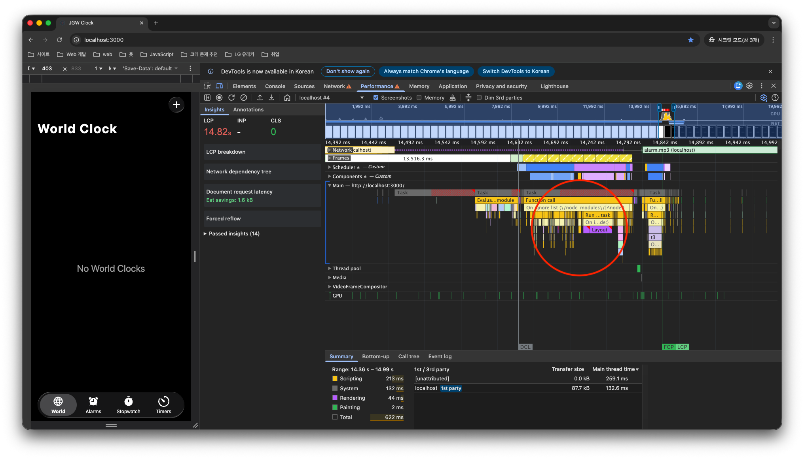

<br />

렌더링 측면에서는 명확한 장단점이 존재하지만, 현재 **Reduce unused JavaScript 관점**에서 보면 연결된 **모든 정적 자원을 최초에 요청하게 되므로 다수의 네트워크 요청이 발생**하고, 이는 **Virtual DOM 구축 시점을 지연시키는 동시에 불필요한 JavaScript 로직 실행을 유발**하게 됩니다.

이때 **최초 Virtual DOM 구축 자체는 현재 URL에 매칭된 라우트에 대해서만 수행**되지만, **URL 변경 시에는 기존에 전달받은 JavaScript 파일을 기반으로 해당 라우트에 맞는 Virtual DOM을 다시 구축**하게 됩니다. 즉 **현재 시점에 필요하지 않은 JavaScript 파일까지 함께 전달받게 되는 구조**입니다.

또한 **외부 패키지를 사용하는 경우**, 현재 화면에서 직접 사용되지 않더라도 **다른 JavaScript 모듈에서 해당 패키지를 참조**하고 있다면 **해당 모듈 파일이 함께 전달되므로 Reduce unused JavaScript 문제가 더욱 커지게 됩니다.**

<br />

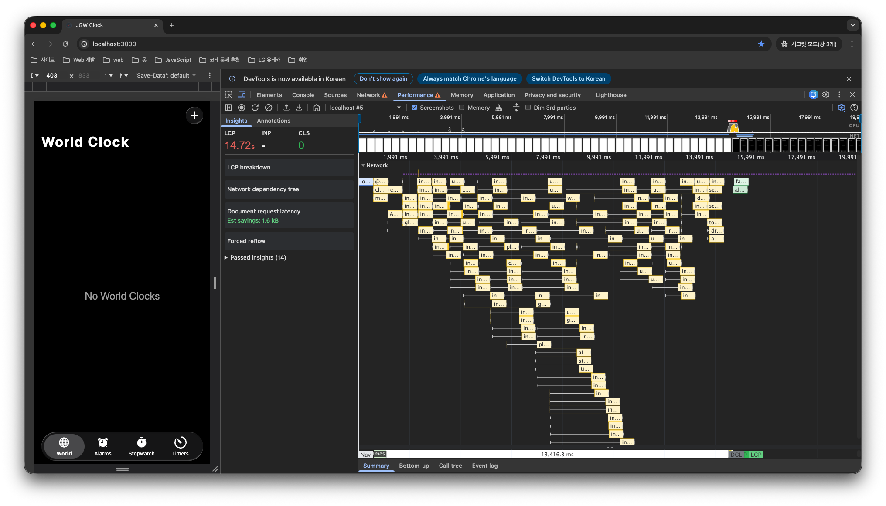

<br />

즉 React와 같은 SPA + CSR 조합의 웹 애플리케이션에서는 **구조적인 한계**로 인해 Reduce unused JavaScript로 인해 발생하는 **FCP 측정 시점을 단축시키는 데에는 명확한 한계가 존재**합니다.

이를 개선하기 위해서는 **`React.lazy()`를 통해 해당 컴포넌트가 실제로 화면에 노출되는 시점에 관련 파일을 로드하도록 구성**하거나, **SSR 렌더링 방식으로 전환하여 현재 시점에 필요한 HTML 문서와 CSS, JavaScript 정적 자원만을 전달받는 구조로 변경**할 필요가 있습니다.

그렇기 때문에 본 문서에서는 **구조적 한계가 무엇인지** 짚어보고, 그럼에도 불구하고 **FCP 시점을 단축시켜 Lighthouse Performance 점수를 100점으로 개선한 과정**을 다뤄보겠습니다.

<br />

## II. SPA + CSR 환경에서 Reduce unused JavaScript로 인한 FCP 측정 시점 단축의 구조적 한계

앞서 [｢Reduce unused JavaScript 항목으로 인해 FCP 지연이 발생하는 원인｣](#i-reduce-unused-javascript-항목으로-인해-fcp-지연이-발생하는-원인) 목차에서 React 기반의 SPA + CSR 환경에서는 **모든 정적 자원을 최초에 요청**하게 되므로, **현재 시점에 필요하지 않은 JavaScript 파일까지 함께 전달받는 구조**가 된다고 설명했습니다.

이로 인해 **다수의 네트워크 요청이 발생**하며, **응답을 받기 전까지 Virtual DOM 구축 시점이 지연**된다고 했습니다. 또한 **불필요한 JavaScript 실행까지 함께 발생**한다고 설명했습니다.

하지만 다수의 네트워크 요청이 발생하는 문제는 **번들링(Bundling)을 통해 일정 부분 완화**할 수 있습니다. 여러 개의 JavaScript 파일을 **하나의 번들 파일로 생성하여 단일 네트워크 요청 구조로 전환**할 수 있기 때문입니다. 또한 Vite는 빌드 단계에서 번들 결과물의 안전성을 높이기 위해 ESBuild보다 느리지만 안정적인 Rollup을 사용하여 난독화, 트리셰이킹, 압축 등의 과정을 거쳐 **최적화된 번들 결과물을 생성**합니다.

<br />

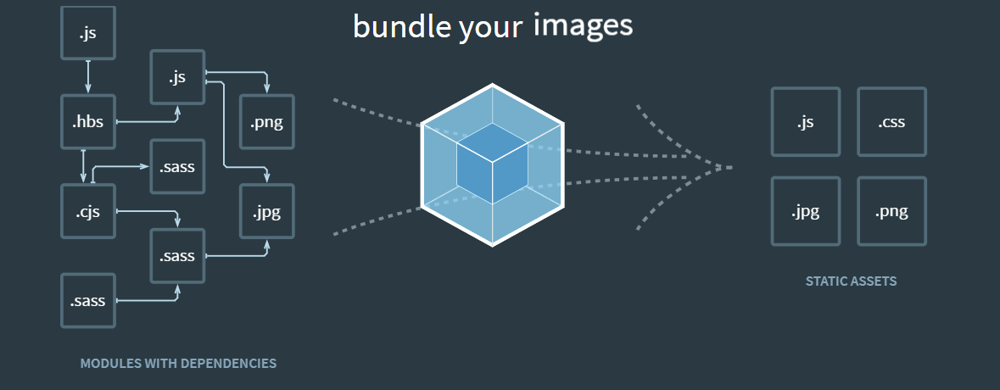

<br />

이로 인해 실제로 개발 서버(Dev Server)가 아닌 **배포 서버(Production Server)에 접속**하면, **개발 서버와 달리 하나의 번들 파일만 전달받는 구조임을 확인**할 수 있습니다.

<br />


<br />

하지만 SPA + CSR 환경에서는 **여러 개의 자원을 개별적으로 전달받는 구조**이든, **하나의 파일로 번들링된 자원을 전달받는 구조**이든 **"현재 시점"에 필요하지 않더라도 모든 자원을 요청하는 구조라는 점은 동일**합니다. 이에 대해 보다 정확히 확인하기 위해, 앞서 개발 서버에서 최초 접속 시 여러 개의 자원을 전달받는 구조임을 확인했으므로 **`rollup-plugin-visualizer` 패키지를 설치하여 JavaScript 번들링 결과물의 구조를 확인**해보겠습니다.

<!-- <br />

```md
09:19:47.161 | dist/index.html                              2.27 kB │ gzip:   0.87 kB
09:19:47.162 | dist/assets/SF_Pro-Bold-7QsjyyjH.woff2      98.32 kB
09:19:47.162 | dist/assets/SF_Pro-Regular-D7lx-8SM.woff2  102.66 kB
09:19:47.162 | dist/assets/SF_Pro-Light-CWkfg6lM.woff2    113.46 kB
09:19:47.163 | dist/assets/index-TXEuhWPf.css              23.48 kB │ gzip:   4.76 kB
09:19:47.163 | dist/assets/index-D32C65n_.js              592.54 kB │ gzip: 204.36 kB

⚠️ Some chunks are larger than 500 kB after minification. Consider:
- Using dynamic import() to code-split the application
- Use build.rollupOptions.output.manualChunks to improve chunking: https://rollupjs.org/configuration-options/#output-manualchunks
- Adjust chunk size limit for this warning via build.chunkSizeWarningLimit.
...
```

> 위 코드 블록은 번들 결과를 분리하기 이전의 Deployment 로그를 보기 쉽게 Markdown 형식으로 정리한 내용입니다. 실제 Deployment 결과는 [여기](./images/no-chunk-bundle-result-visualizer-deployment-logs.png)에서 확인할 수 있습니다. -->

<br />

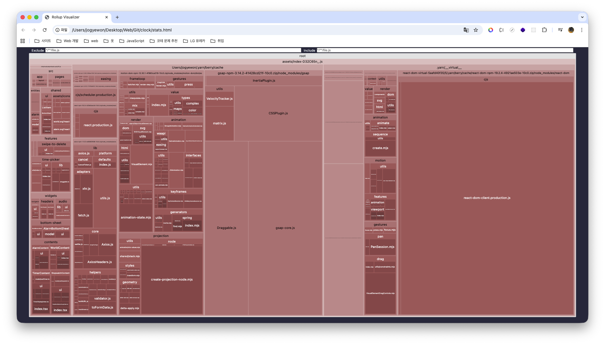

<br />

번들링 결과물의 구조를 확인해보면 **`index-D32C65n_.js` 번들 파일 내부**에는 프로젝트 과정에서 작성한 **모든 JavaScript 로직**과 더불어, **사용 중인 패키지** 등 **모든 JavaScript 모듈이 함께 포함된 구조**임을 확인할 수 있습니다.

즉 **하나의 번들 자원을 전달**받더라도, 해당 파일 내부에는 **모든 JavaScript 로직이 포함되어 있어 최초 접속 시점에 필요하지 않은 로직 역시 함께 존재**하게 됩니다.

Vite에서는 번들 자원을 **여러 개의 작은 조각(Chunk)으로 분리할 수 있는 기능을 제공**합니다. 그렇다면 이 번들 결과물을 작은 조각으로 나눌 경우, 최초 접속 시점에 필요하지 않은 로직을 분리할 수 있는지 확인하기 위해 Vite 빌드 설정을 다음과 같이 수정을 해보겠습니다.

<br />

```tsx
// vite.config.ts 번들 결과 작은 조각으로 분리
// https://vite.dev/config/
export default defineConfig({
  // ...
  build: {
    rollupOptions: {
      output: {
        manualChunks(id) {
          if(id.includes("react") || id.includes("scheduler")) { // React 관련 로직은 메인 번들에 포함
            return;
          }
          if(id.includes("gsap")) { // GSAP 패키지는 용량이 크기 때문에 별도 Chunk로 분리
            return "vendor-gsap";
          }
          if(id.includes("node_modules") || id.includes(".yarn")) { // 기타 패키지는 별도 Chunk로 분리
            return "vendor-libs";
          }
        }
      }
    },
  }
});
```

<br />

<!-- ```md
00:55:12.696 | dist/index.html                              2.43 kB │ gzip:   0.92 kB
00:55:12.696 | dist/assets/SF_Pro-Bold-7QsjyyjH.woff2      98.32 kB
00:55:12.697 | dist/assets/SF_Pro-Regular-D7lx-8SM.woff2  102.66 kB
00:55:12.702 | dist/assets/SF_Pro-Light-CWkfg6lM.woff2    113.46 kB
00:55:12.702 | dist/assets/index-TXEuhWPf.css              23.48 kB │ gzip:   4.76 kB
00:55:12.702 | dist/assets/vendor-gsap-BBM_9RY7.js        111.88 kB │ gzip:  42.98 kB   # Chunk 단위로 분리한 GSAP 패키지 번들 자원
00:55:12.703 | dist/assets/vendor-libs-DxHqpy7U.js        167.99 kB │ gzip:  57.93 kB   # Chunk 단위로 분리한 기타 패키지 번들 자원
00:55:12.703 | dist/assets/index-BCq25VZB.js              311.16 kB │ gzip: 101.94 kB   # 메인 번들 자원
...
```

> 위 코드 블록은 번들 결과를 분리하기 이후의 Deployment 로그를 보기 쉽게 Markdown 형식으로 정리한 내용입니다. 실제 Deployment 결과는 [여기](./images/bundle-result-chunk-visualizer-deployment-logs.png)에서 확인할 수 있습니다.

<br /> -->

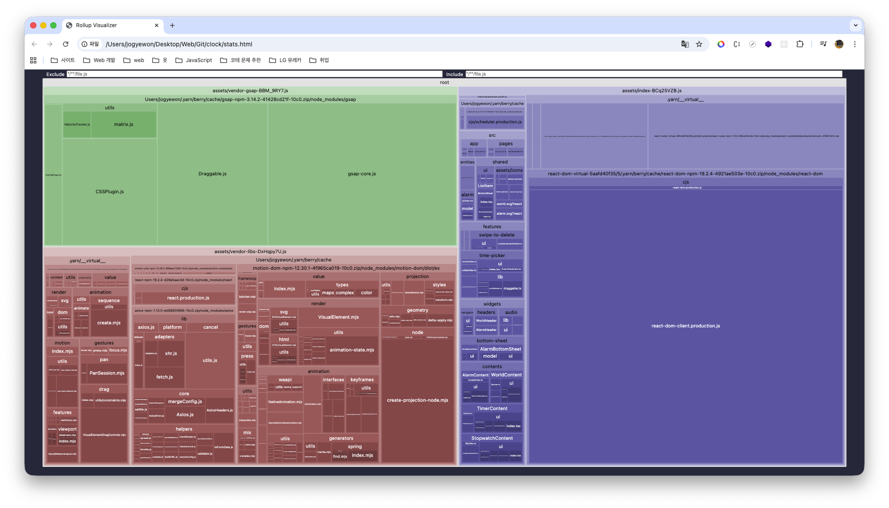

<br />

이와 같이 번들 자원을 **여러 개의 작은 조각(Chunk)으로 분리한 뒤, 배포 서버로 이동하여 개발자 도구 Network 탭에서 실제 요청 구조**를 확인해보겠습니다.

<br />

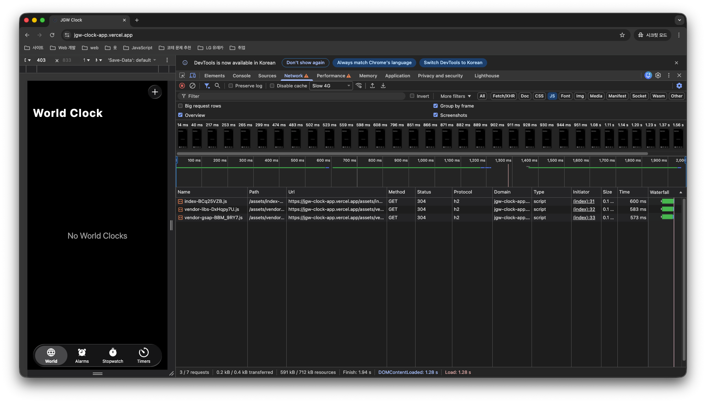

<br />

Network 탭에서 결과를 확인해보면 **번들 자원을 여러 개의 작은 조각(Chunk)으로 분리**하더라도, SPA 구조에서는 **최초 접속 시 모든 자원을 함께 요청**하게 되므로 **메인 번들 자원뿐만 아니라 분리된 Chunk 자원들까지 동시에 요청**되고 있음을 확인할 수 있습니다.

보다 더 자세한 결과를 확인하기 위해 **개발자 도구 Performance 패널을 통해 최초 접속 과정에서 어떤 일이 발생**하는 살펴보겠습니다.

<br />

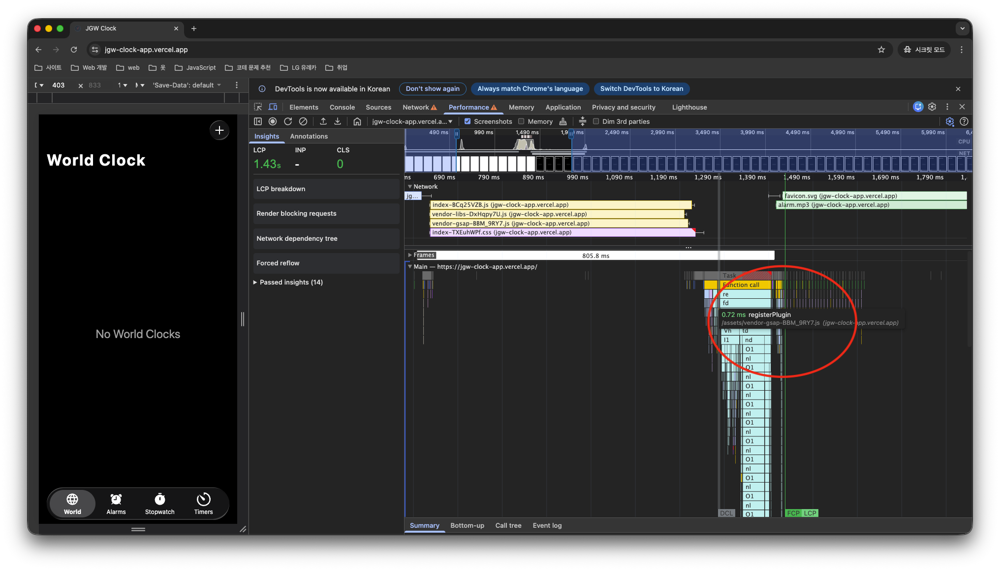

<br />

Performance 탭에서 결과를 확인해보면, 앞서 개발 서버에서 다수의 네트워크 요청이 발생했던 과정과 유사하게, 최초 접속 당시에 **메인 번들 결과물과 더불어 분리된 Chunk 자원들을 요청**하며, **모든 응답을 받은 이후 Virtual DOM을 구축하기 위한 다양한 함수가 호출**되고 있음을 확인할 수 있습니다.

또한 여러 차례 언급했듯이 Virtual DOM 구축 과정 자체는 현재 URL에 매칭된 라우트에 대해서만 수행되지만, **전달받은 JavaScript 로직은 실행을 위한 준비 상태까지 진행**된다고 했습니다. 그렇기 때문에 Performance 결과에서 **빨간색으로 하이라이팅된 영역**을 확인해보면 **`vendor-gsap`으로 분리한 Chunk 내부의 `GSAP.registerPlugin()` 함수가 호출**되는 것을 확인할 수 있습니다.

즉 JavaScript 번들 결과물을 **여러 개의 작은 조각(Chunk) 단위로 분리**하더라도, **SPA + CSR 구조에서는 최초 접속 시 필요한 모든 정적 자원을 서버에 요청**하게 되며 동시에 **JavaScript 로직 실행을 위한 준비 과정까지 수행**됩니다. 결과적으로 **현재 시점에 사용되지 않는 JavaScript 모듈이 포함되는 구조**이기 때문에 **Reduce unused JavaScript 문제를 명확히 해결하기 어려운 구조적 한계가 존재**합니다.

<br />

## III. 그럼에도 Lighthouse Performance를 100점으로 개선하는 방법

앞서 [｢II. SPA + CSR 환경에서 Reduce unused JavaScript로 인한 FCP 측정 시점 단축의 구조적 한계｣](#ii-spa--csr-환경에서-reduce-unused-javascript로-인한-fcp-측정-시점-단축의-구조적-한계) 목차에서 React와 같은 SPA + CSR 기반 웹 애플리케이션 환경에서는 **Reduce unused JavaScript** 문제를 **구조적인 한계로 인해 명확하게 해결하기 어려운 이유**에 대해 설명했습니다.

그렇다면 Lighthouse Performance 점수를 100점으로 개선할 수 있는 방법은 무엇일까요? 바로 **Lighthouse Performance의 감점 요인 항목 자체를 제거**하는 것이 아니라, **FCP, LCP 등과 같이 점수 산정에 직접적으로 반영되는 핵심 성능 지표를 개선**하는 것입니다.

이것이 가능한 이유는 Lighthouse Performance의 감점 요인 항목이 **실제 점수에 직접 반영되는 요소가 아니라(Unscored),** 현재 성능 결과를 바탕으로 **개선 가능성이 있는 지점을 안내하는 "힌트" 역할을 하기 때문**입니다. 따라서 **이러한 항목을 개선**하면 **특정 성능 지표가 함께 개선**될 가능성이 높으며, 그 결과 **Lighthouse Performance 점수 역시 간접적으로 상승**하게 됩니다.

<br />

> 💡 실제 [｢Lighthouse 성능 점수 | Chrome for Developers｣](https://developer.chrome.com/docs/lighthouse/performance/performance-scoring?utm_source=lighthouse&utm_medium=devtools&hl=ko) 페이지를 확인하면 "일반적으로 기회 또는 진단의 결과가 아니라 측정항목만 Lighthouse 실적 점수에 기여합니다. 하지만 기회와 진단을 개선하면 측정항목 값이 개선될 가능성이 높으므로 간접적인 관계가 있습니다." 라고 설명하고 있습니다.

<br />

그렇다면 이전 [**｢FCP 개선을 위한 CSS 최적화｣**](./fcp-css-optimization.md) 문서에서 jsDelivr CDN에서 제공하는 스타일 초기화 파일 요청을 제거한 이후 Lighthouse Performance를 개선한 결과, **FCP 측정 시점이 약 2.4s에서 약 1.8s로 단축**되었으며 **점수 또한 94점에서 98점으로 개선**되었습니다.

<br />

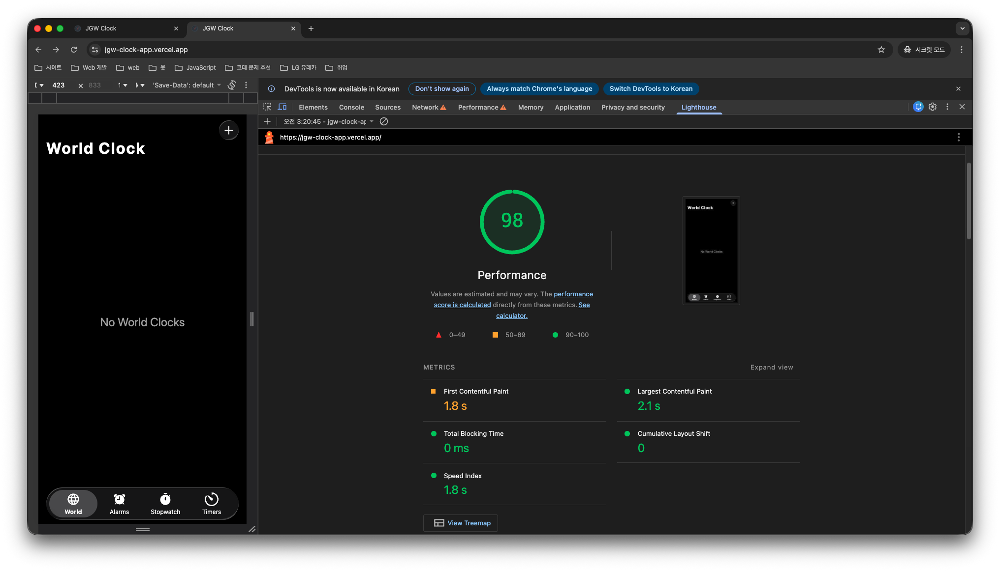

<br />

그러면 이에 앞서 SPA + CSR 기반의 웹 애플리리케이션 환경에서는 **최초 접속 시 "현재 시점"에 불필요한 모든 정적 자원을 함께 전달**받아, **필요하지 않은 JavaScript 로직까지 포함**된다고 설명했습니다. 또한 **이러한 자원들은 실제로 실행되지 않더라도 JavaScript 실행을 위한 준비 단계까지 수행**된다고 했습니다.

그렇기 때문에 Virtual DOM 구축 자체는 현재 URL에 매칭되는 라우트에 대해서만 수행되지만, 결과적으로 **다른 라우트를 구성하고 있는 JavaScript 모듈들까지 실행 준비 상태**에 들어가게 됩니다. 또한 앞서 확인했듯이 번들 결과물을 여러 개의 작은 조각(Chunk)으로 분리했음에도 불구하고 **`vendor-gsap` Chunk 내부의 `GSAP.registerPlugin()`과 같은 함수가 호출**되는 것도 확인할 수 있었습니다.

즉 이 모든 것들은 **현재 시점에서는 필요하지 않은 자원들에 대한 불필요한 실행 준비 상태를 유발**하며, **함수 호출**과 **JavaScript 메인 스레드 점유**를 통해 결국 **FCP 측정 시점을 지연시키는 요인으로 작용**하게 됩니다. 그렇다면 **FCP 측정 시점을 지연시키는 자원들을 최초 접속 이후에 전달받는 구조로 변경**한다면, **그만큼 FCP 측정 시점을 단축**시킬 수 있다는 의미가 됩니다.

이를 위해서는 **최초 접속 이후에 자원을 전달받도록 구조를 변경할 수 있는 방법이 필요**합니다. React에서는 이를 위한 방법으로 **`React.lazy()` 메서드를 제공**합니다. 이는 최초 렌더링 시점에 컴포넌트 코드를 즉시 요청하는 것이 아니라, **실제로 필요한 시점까지 요청을 지연(Lazy)시키는 기능을 제공**하는 메서드입니다. 즉 이를 활용하면 특정 컴포넌트 코드에 한해 최초 접속 이후에 전달받는 구조로 변경할 수 있습니다.

<br />

> Vite와 같은 번들러 또는 빌드 도구를 사용할 경우, `React.lazy()`를 통해 동적 import 되는 모듈들은 별도의 Chunk로 자동 분리되어 번들링됩니다.

<br />

그렇다면 현재 번들 결과물을 여러 개의 작은 조각(Chunk)으로 분리한 시점에서, **어떤 자원을 사용하는 컴포넌트 코드를 지연 요청 대상으로 설정하는 것이 적절한지 확인**하기 위해 `rollup-plugin-visualizer` 결과를 다시 살펴보겠습니다.

<br />

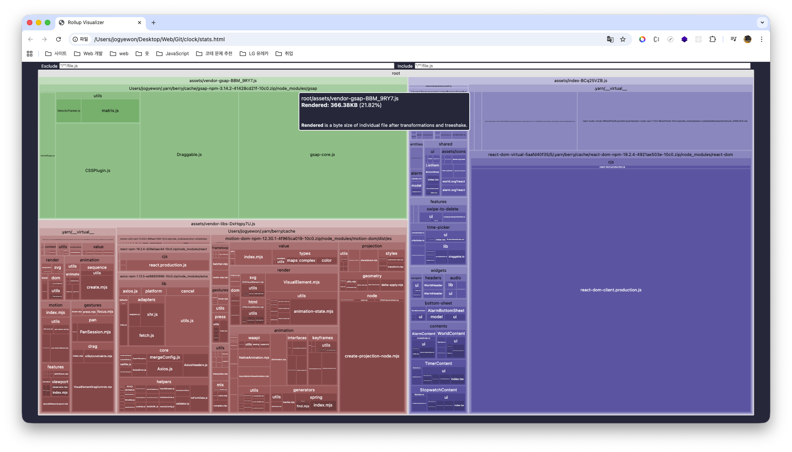

<br />

결과를 확인해보면 메인 번들 결과물, GSAP 패키지를 포함하는 `vendor-gsap` Chunk, 기타 패키지를 포함하는 `vendor-libs` Chunk로 **총 3개의 덩어리로 구성**되어 있습니다. 

이 중 **GSAP 패키지를 포함하는 `vendor-gsap` Chunk**는 Alarm 라우트에서 Bottom Sheet를 활성화하여 알림 시간을 설정하는 **TimePicker 컴포넌트 내부에서만 사용**됨에도 불구하고, **약 366.38kB의 크기를 가지며 분리 이전 번들 결과물 기준으로 전체의 약 21.28%를 차지**하고 있습니다.

즉 현재 시점에 필요하지 않음에도 SPA 구조 특성상 최초 접속 시 해당 Chunk까지 함께 전달받게 되며, 동시에 JavaScript 실행 준비를 수행하게 됩니다. 이로 인해 불필요한 함수 호출과 JavaScript 메인 스레드 점유가 발생하고, 결과적으로 **FCP 측정 시점을 지연시키는 주요 원인 중 하나**로 작용하게 됩니다.

그렇다면 이 Chunk를 사용하는 **TimePicker 컴포넌트 자체에 `React.lazy()`를 적용할 경우 어떤 변화가 발생하는지 확인**하기 위해, 다음과 같이 코드를 수정한 뒤 재빌드를 진행하고 배포 서버에서 **개발자 도구 Network 패널의 결과를 확인**해보겠습니다.

<br />

```tsx
// ...
import { lazy } from "react";

// // import { TimePicker } from "@features/time-picker"; 에서 다음과 같이 동적 import로 변경
const TimePicker = lazy(() => import("@features/time-picker").then((moduel) => ({ default: moduel.TimePicker })));

export default function AlarmBottomSheet({ isOpen, onClose }: Props) {
  // ...

  return (
    <BottomSheet {...}>
      <div className={`${styles["alarm-sheet-content"]}`}>
        <TimePicker onPointerOver={handleTimePickerMouseOver} onPointerLeave={handleTimePickerMouseLeave} updateTimePicker={handleTimeChange} />

        {/* ... */}
      </div>
    </BottomSheet>
  );
}
```

<br />

```md
19:13:18.827 | dist/index.html                              2.35 kB │ gzip:  0.90 kB
19:13:18.827 | dist/assets/SF_Pro-Bold-7QsjyyjH.woff2      98.32 kB
19:13:18.827 | dist/assets/SF_Pro-Regular-D7lx-8SM.woff2  102.66 kB
19:13:18.828 | dist/assets/SF_Pro-Light-CWkfg6lM.woff2    113.46 kB
19:13:18.828 | dist/assets/index-C8B5jrWO.css               2.96 kB │ gzip:  0.96 kB   # React.lazy()로 분리하여 TimePicker 관련 CSS 별도 Chunk로 분리됨
19:13:18.828 | dist/assets/index-BcF60dKn.css              20.54 kB │ gzip:  4.08 kB
19:13:18.828 | dist/assets/index-BV2k9fO4.js               10.75 kB │ gzip:  3.96 kB   # React.lazy()로 분리하여 TimePicker 관련 JavaScript 별도 Chunk로 분리됨
19:13:18.828 | dist/assets/vendor-gsap-BBM_9RY7.js        111.88 kB │ gzip: 42.98 kB
19:13:18.828 | dist/assets/vendor-libs-DxHqpy7U.js        167.99 kB │ gzip: 57.93 kB
19:13:18.828 | dist/assets/index-B4mDj_3K.js              301.83 kB │ gzip: 99.21 kB
...
```

> 위 코드 블록은 TimePicker 컴포넌트를 React.lazy 적용 이후의 Deployment 로그를 보기 쉽게 Markdown 형식으로 정리한 내용입니다. 실제 Deployment 결과는 [여기](./images/time-picker-react-lazy-after-deployment-logs.png)에서 확인할 수 있습니다.

<br />

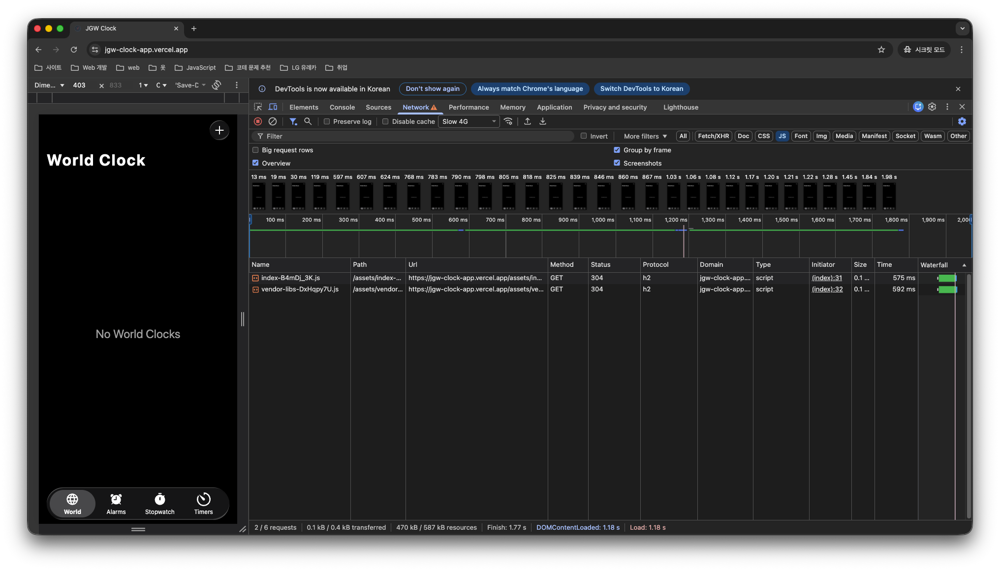

<br />

TimePicker 컴포넌트에 `React.lazy()`를 적용한 이후 개발자 도구 Network 결과를 확인해보면, **이전과 달리 최초 접속 시 `vendor-gsap`이 요청되지 않는 것을 확인**할 수 있습니다.

즉 Vite와 같은 빌드 도구를 사용하는 경우, **번들 결과물을 여러 개의 작은 조각(Chunk)으로 분리**하더라도 **`React.lazy()`를 적용하면 TimePicker가 실제로 필요한 시점까지 로딩이 지연**되며, **해당 컴포넌트에서만 사용되는 GSAP 패키지를 포함한 `vendor-gsap` 또한 TimePicker 컴포넌트가 마운트될 때까지 요청이 지연**되는 것을 확인할 수 있습니다.

그렇다면 최초 접속 이후 Alarm 라우트로 이동한 뒤 Bottom Sheet를 활성화하여 **TimePicker 컴포넌트가 마운트되는 시점**에 **`vendor-gsap`이 실제로 요청되는지 확인**해보겠습니다.

<br />

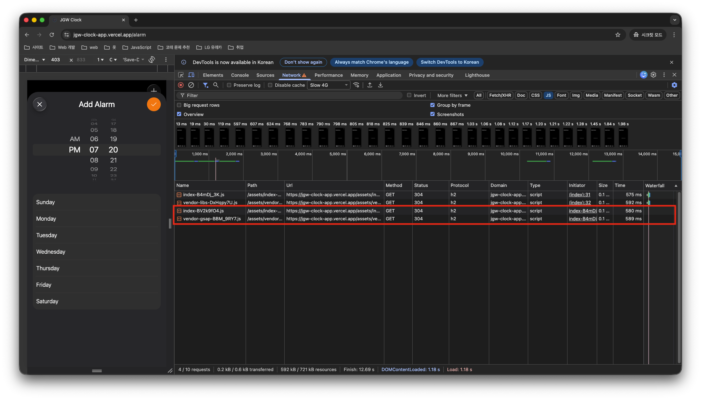

<br />

Network 결과를 확인해보면, TimePicker 컴포넌트가 마운트되는 시점에 해당 컴포넌트 로직이 포함된 **`index-BV2k9fO4.js`와 `vendor-gsap` 파일이 요청**되는 것을 확인할 수 있습니다.

즉 현재 시점에 필요하지 않은 **GSAP 패키지를 포함한 `vendor-gsap` Chunk를 최초 접속 시 전달받지 않도록 변경**함으로써, 불필요한 JavaScript 실행 준비 상태를 유발하지 않게 되었고, 그로 인해 함수 호출 및 JavaScript 메인 스레드 점유가 감소하여 FCP 측정 시점을 지연시키지 않게 됩니다.

그렇다면 TimePicker 컴포넌트에 `React.lazy()`를 적용한 이후 **Lighthouse 전체 보고서**를 다시 한 번 확인해보겠습니다.

<br />

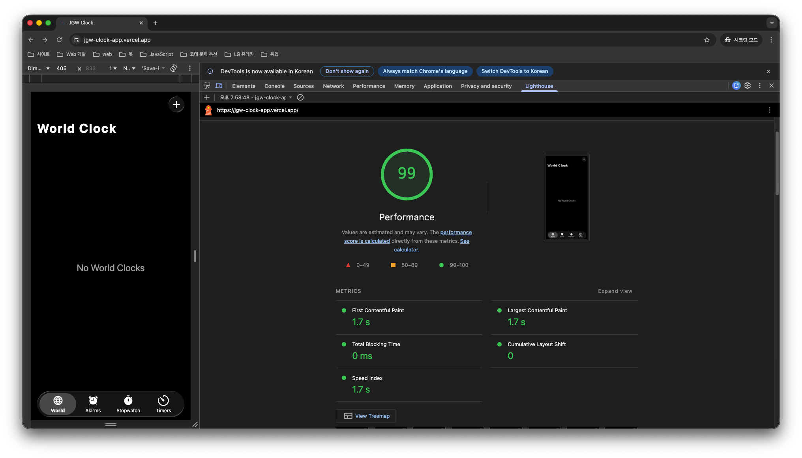

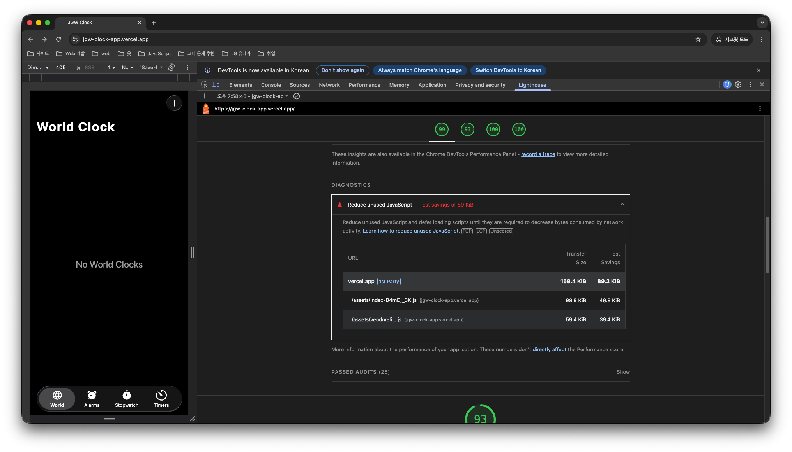

<br />

Lighthouse Performance 요약 결과를 확인해보면, **FCP 측정 시점이 약 1.8s에서 1.7s로 단축**되었으며 **점수 또한 98점에서 99점으로 개선**된 것을 확인할 수 있습니다.

그러나 앞서 [도입부](#iii-그럼에도-lighthouse-performance를-100점으로-개선하는-방법)에서 언급했듯이 SPA + CSR 기반 웹 애플리케이션 환경에서는 **구조적으로 최초 접속 시 모든 정적 자원을 전달**받기 때문에 Lighthouse Performance 감점 요인에서 **Reduce unused JavaScript 항목이 완전히 사라지지 않은 것을 확인**할 수 있습니다.

즉 **감점 요인 항목**은 **현재 성능 결과를 바탕으로 개선 가능성이 있는 지점을 안내하는 "힌트" 역할**을 한다는 점을 다시 한 번 **명확히 확인**할 수 있었습니다.

**남은 1점을 개선**하기 위해서는 현재 시점에 필요하지 않은 GSAP 패키지를 포함한 `vendor-gsap` Chunk를 지연 요청한 것과 동일한 방식으로, **현재 시점에 필요하지 않은 JavaScript 로직들 역시 `React.lazy()`를 통해 지연 요청 구조로 변경**하여 **Lighthouse Performance의 FCP, LCP 등 점수 산정에 직접 반영되는 성능 지표를 추가로 개선**하면 됩니다.

그렇다면 현재 시점에 필요하지 않은 JavaScript 자원은 무엇일까요? 바로 메인 페이지(`/world`)를 제외한 **다른 라우트에 대한 로직**입니다. **최초 접속 시 기준이 되는 페이지는 메인 페이지**이기 때문에, **다른 페이지에 대한 JavaScript 실행 준비를 수행할 필요가 없기 때문**입니다.

<br />

> 해당 문서에서는 직접적으로 다루지 않았지만, 문서를 작성하기 이전에 Lighthouse Performance 점수를 100점으로 개선하기 위한 사전 테스트 과정을 진행했습니다. <br />
> Clock 프로젝트의 Bottom Sheet UI 컴포넌트는 `react-modal-sheet` 패키지를 사용하고 있으며, 해당 패키지의 Peer dependency인 Motion 또한 GSAP과 유사하게 큰 용량을 차지하고 있었습니다. <br />
> 이로 인해 Bottom Sheet UI와 관련된 로직에 조건부 렌더링과 `React.lazy()`를 적용하지 않을 경우, Motion 패키지로 인해 Lighthouse Performance 점수를 100점으로 개선하기 어려웠습니다. <br />
> 이러한 이유로 문서에서는 별도로 명시하지 않았지만, `react-modal-sheet` 관련 로직 역시 조건부 렌더링과 `React.lazy()`를 적용한 이후 본 개선 과정을 진행했습니다.

<br />

```tsx
import { Route, Routes } from "react-router";
import Layout from "@app/layout";
import { lazy } from "react";
import { WorldPage } from "@pages/world";

// 메인 라우트(World)를 제외한 다른 라우트들은 다음과 같이 동적 import로 변경
const AlarmPage = lazy(() => import("@pages/alarm").then((module) => ({ default: module.AlarmPage })));
const StopwatchPage = lazy(() => import("@pages/stopwatch").then((module) => ({ default: module.StopwatchPage })));
const TimerPage = lazy(() => import("@pages/timer").then((module) => ({ default: module.TimerPage })));

export default function AppRouter() {
  return (
    <Routes>
      <Route element={<Layout />}>
        <Route index element={<WorldPage />}  />
        <Route path="/alarm" element={<AlarmPage />}  />
        <Route path="/stopwatch" element={<StopwatchPage />}  />
        <Route path="/timer" element={<TimerPage />}  />  
      </Route>
    </Routes>
  );
}
```

<br />

이와 같이 메인 페이지를 제외한 **다른 라우트 로직에 `React.lazy()`를 적용하여 별도의 Chunk로 분리한 이후**, 해당 **컴포넌트가 필요한 시점에 요청이 발생하도록 구조를 변경**한 뒤 **Lighthouse Performance 결과를 확인**해보면 다음과 같습니다.


<br />

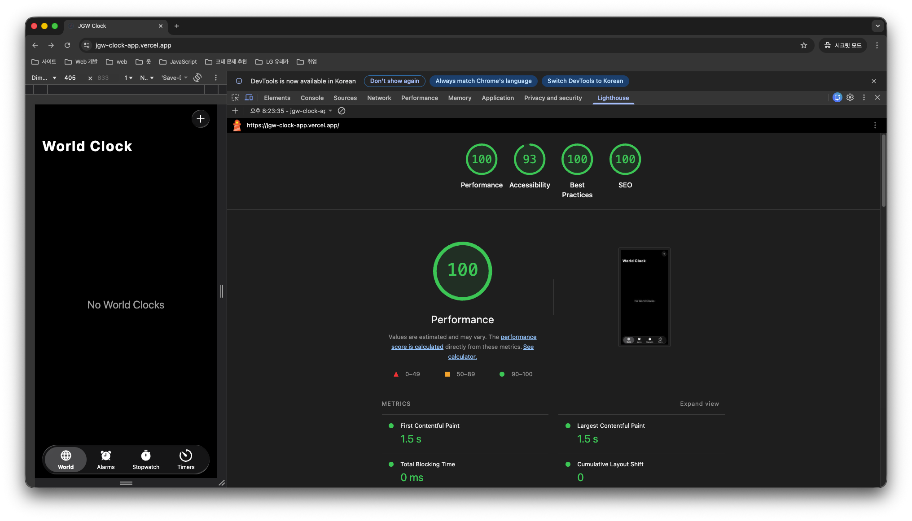

<br />

Lighthouse Performance 결과를 확인해보면, **최종적으로 FCP 측정 시점이 약 1.8s에서 1.5s로 단축되었으며 점수 또한 98점에서 100점으로 개선**된 것을 확인할 수 있습니다.

<br />

## IV. Lighthouse Performance 점수를 100점으로 개선한 것 외에 얻을 수 있는 이점

앞서 [｢II. SPA + CSR 환경에서 Reduce unused JavaScript로 인한 FCP 측정 시점 단축의 구조적 한계｣](#ii-spa--csr-환경에서-reduce-unused-javascript로-인한-fcp-측정-시점-단축의-구조적-한계) 목차에서는 **하나의 번들 결과물을 여러 개의 작은 조각(Chunk)으로 분리하는 과정**을 일부 다루었고, [｢III. 그럼에도 Lighthouse Performance를 100점으로 개선하는 방법｣](#iii-그럼에도-lighthouse-performance를-100점으로-개선하는-방법) 목차에서는 `React.lazy()`를 활용하여 **FCP를 약 1.8s에서 1.5s로 단축시키고 Lighthouse Performance 점수를 98점에서 100점으로 개선하는 과정**을 설명했습니다.

이제 하나의 번들 결과물을 여러 개의 작은 조각(Chunk)으로 분리하고, `React.lazy()`를 적용하여 Lighthouse Performance 점수를 100점으로 개선한 것 외에 **추가적으로 얻을 수 있는 이점**이 무엇인지 살펴볼 필요가 있습니다. 왜냐하면 개발에서의 **모든 선택은 트레이드오프(Trade-off) 관계를 가지기 때문**입니다.

<br />

**① 하나의 번들 결과물을 여러 개의 작은 조각(Chunk)으로 분리**

[｢II. SPA + CSR 환경에서 Reduce unused JavaScript로 인한 FCP 측정 시점 단축의 구조적 한계｣](#ii-spa--csr-환경에서-reduce-unused-javascript로-인한-fcp-측정-시점-단축의-구조적-한계) 목차에서 SPA + CSR 환경에서는 **모든 정적 자원을 최초에 요청**하게 되어, **현재 시점에 필요하지 않은 JavaScript 파일까지 함께 전달받는 구조**가 된다고 설명했습니다. 이로 인해 **다수의 네트워크 요청이 발생하고, 응답을 받기 전까지 Virtual DOM 구축 시점이 지연**된다고 언급했습니다.

하지만 **번들링(Bundling)을 통해 이러한 문제를 일정 부분 완화**할 수 있으며, Vite와 같은 번들러 또는 빌드 도구는 하나의 파일로 번들 결과물을 생성하고 내부적으로 난독화, 트리셰이킹, 압축 등의 과정을 거쳐 파일 크기를 축소해줍니다.

다만 프로젝트에서 작성한 **모든 JavaScript 모듈들이 포함되기 때문에, 프로젝트 규모가 커질수록 번들 결과물의 크기 역시 증가**하게 됩니다. 그 결과 **번들 내부에는 현재 시점에 필요하지 않은 JavaScript 코드까지 함께 포함**되게 됩니다.

이러한 한계를 보완하기 위해 Vite에서는 **번들 자원을 여러 개의 작은 조각(Chunk)으로 분리할 수 있는 기능을 제공**합니다. 그러나 앞선 목차에서는 번들 크기 자체를 줄이기 위한 목적보다는, **최초 접속 시점에 필요하지 않은 로직을 분리할 수 있는지 검증하기 위한 용도로 활용**했습니다. 그 과정에서 번들 결과물을 분리한 상태로 지금까지 문서를 작성해왔습니다.

이제 여러 개의 작은 조각(Chunk)으로 **분리하지 않은 경우와 분리한 경우를 비교**하기 위해, **먼저 분리하지 않은 상태의 Vercel의 Deployment Log를 살펴보겠습니다.**

<br />

```md
09:19:47.161 | dist/index.html                              2.27 kB │ gzip:   0.87 kB
09:19:47.162 | dist/assets/SF_Pro-Bold-7QsjyyjH.woff2      98.32 kB
09:19:47.162 | dist/assets/SF_Pro-Regular-D7lx-8SM.woff2  102.66 kB
09:19:47.162 | dist/assets/SF_Pro-Light-CWkfg6lM.woff2    113.46 kB
09:19:47.163 | dist/assets/index-TXEuhWPf.css              23.48 kB │ gzip:   4.76 kB
09:19:47.163 | dist/assets/index-D32C65n_.js              592.54 kB │ gzip: 204.36 kB

⚠️ Some chunks are larger than 500 kB after minification. Consider:
- Using dynamic import() to code-split the application
- Use build.rollupOptions.output.manualChunks to improve chunking: https://rollupjs.org/configuration-options/#output-manualchunks
- Adjust chunk size limit for this warning via build.chunkSizeWarningLimit.
...
```

> 위 코드 블록은 번들 결과를 분리하기 이전의 Deployment 로그를 보기 쉽게 Markdown 형식으로 정리한 내용입니다. 실제 Deployment 결과는 [여기](./images/no-chunk-bundle-result-visualizer-deployment-logs.png)에서 확인할 수 있습니다.

<br />

결과를 확인해보면 **JavaScript 번들 결과물의 크기가 총 592.54kB**, **압축 크기가 204.36kB**임을 확인할 수 있습니다. 또한 로그에서는 **"Some chunks are larger than 500 kB after minification."** 와 같은 경고 메시지가 출력되고 있습니다.

이는 Vite 빌드 단계에서 사용되는 Rollup 번들러가 **번들 결과물 중 500kB를 초과하는 자원이 존재**한다는 점을 경고 형태로 안내하고 있는 것입니다. 이와 같은 경고 메시지가 출력되는 이유는 자원 크기가 커질수록 **네트워크 응답 시간, 파싱 등의 과정들이 지연**되어 **렌더링 성능이 저하될 가능성이 높아지기 때문**입니다.

또한 **네트워크 요청에는 요청 간 의존성이 존재**합니다. 이를 쉽게 설명하면 **A 자원을 먼저 요청하고 해석해야만 B 자원 요청이 가능해지는 구조**를 의미합니다.

이 때문에 **개발 서버(Dev Server)** 가 배포 서버(Production Server)보다 **런타임 성능이 저하되는 주요 원인 중 하나**가 됩니다. 단순히 네트워크 요청 수가 많기 때문만이 아니라, **A 모듈이 B 모듈을 의존하고, B 모듈이 다시 C 모듈을 의존하는 방식으로 연쇄적인 요청이 발생**하기 때문입니다. 그 결과 최초 요청 시 A -> B -> C -> D와 같은 순차적 네트워크 요청과 실행 준비 과정이 이어지며, FCP, LCP와 같은 핵심 성능 지표가 직접적으로 저하되는 원인이 될 수 있습니다.

<br />


<br />

반면 Vite에서 제공하는 번들 자원을 작은 조각(Chunk)으로 분리하는 기능을 적용한 결과를 확인해보면, **네트워크 요청 간 의존성이 형성되지 않고 동시에 요청이 수행되는 것을 확인**할 수 있습니다.

<br />

```md
00:55:12.696 | dist/index.html                              2.43 kB │ gzip:   0.92 kB
00:55:12.696 | dist/assets/SF_Pro-Bold-7QsjyyjH.woff2      98.32 kB
00:55:12.697 | dist/assets/SF_Pro-Regular-D7lx-8SM.woff2  102.66 kB
00:55:12.702 | dist/assets/SF_Pro-Light-CWkfg6lM.woff2    113.46 kB
00:55:12.702 | dist/assets/index-TXEuhWPf.css              23.48 kB │ gzip:   4.76 kB
00:55:12.702 | dist/assets/vendor-gsap-BBM_9RY7.js        111.88 kB │ gzip:  42.98 kB   # Chunk 단위로 분리한 GSAP 패키지 번들 자원
00:55:12.703 | dist/assets/vendor-libs-DxHqpy7U.js        167.99 kB │ gzip:  57.93 kB   # Chunk 단위로 분리한 기타 패키지 번들 자원
00:55:12.703 | dist/assets/index-BCq25VZB.js              311.16 kB │ gzip: 101.94 kB   # 메인 번들 자원
...
```

> 위 코드 블록은 번들 결과를 분리하기 이후의 Deployment 로그를 보기 쉽게 Markdown 형식으로 정리한 내용입니다. 실제 Deployment 결과는 [여기](./images/bundle-result-chunk-visualizer-deployment-logs.png)에서 확인할 수 있습니다.

<br >

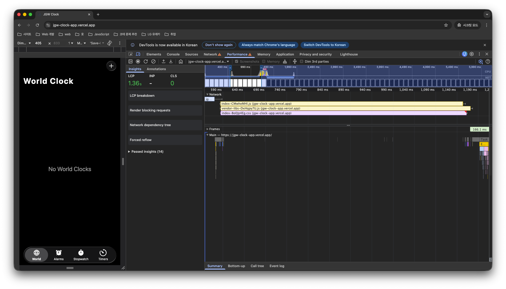

<br >

이와 같은 결과가 나타나는 이유는 Vite가 **분리된 Chunk 자원을 별도의 `<link>` 태그로 주입하여 비동기적으로 요청할 수 있도록 구성해주기 때문**입니다. 따라서 HTML 문서를 해석하는 과정에서 `<head>` 태그에 포함된 **외부 자원 요청이 병령적으로 수행**되며, **네트워크 요청 간 의존성이 발생하지 않게 됩니다.**

결과적으로 **하나의 번들 결과물을 여러 개의 작은 조각(Chunk) 단위로 분리하는 방식**은, **분리된 Chunk 개수만큼 네트워크 요청이 증가한다는 단점은 존재**합니다. 그러나 하나의 큰 번들 결과물을 분리한 것이기 때문에 **각 자원의 크기가 작아져 응답 시간이 단축**되고, **파싱 및 실행 준비에 소요되는 시간 역시 감소**하는 효과를 얻을 수 있습니다.

또한 분리된 Chunk 자원 간 네트워크 요청 의존성이 형성되지 않고 **비동기적으로 요청**되기 때문에, 개발 서버 환경에서 발생한 것과 같은 런타임 성능 저하 역시 크게 발생하지는 않습니다.

즉 하나의 번들 결과물을 여러 개의 조각(Chunk)으로 분리하는 방식은 네트워크 요청 수가 증가한다는 점을 제외하면, 런타임 성능 측면에서 **더 유리한 트레이드오프(Trade-off) 관계가 성립**한다고 판단하여 기존 단일 번들 방식으로 되돌리지 않기로 결정했습니다.

<br />

**② `React.lazy()`를 활용하여 FCP 측정 시점 단축**

[｢III. 그럼에도 Lighthouse Performance를 100점으로 개선하는 방법｣](#iii-그럼에도-lighthouse-performance를-100점으로-개선하는-방법) 목차에서는 GSAP 패키지를 포함한 `vendor-gsap` Chunk가 Alarm 라우트에서 Bottom Sheet를 활성화한 경우, TimePicker 컴포넌트에서만 사용된다는 점을 확인했습니다. 이에 따라 **`React.lazy()`를 활용하여 최초 접속 시 `vendor-gsap`을 전달받는 것이 아니라, 실제 TimePicker 컴포넌트가 마운트되는 시점에 자원 요청이 이루어지도록 지연**시켰습니다.

또한 Lighthouse 보고서는 최초 접속 경로인 **메인 페이지(`/world`)를 기준으로 측정**되기 때문에, **최초 접속 시 불필요한 다른 라우트들 역시 `React.lazy()`를 적용하여 자원 요청이 지연되도록 구성**했습니다. 그 결과 **FCP 측정 시점을 약 1.8s -> 1.5s 수준으로 단축**시켜, **Lighthouse Performance 점수를 98점에서 100점으로 개선**할 수 있었습니다.

<br />


<br />

다만 목표로 하던 Lighthouse Performance 100점을 달성할 수 있었지만, `React.lazy()`는 **컴포넌트가 실제 호출되는 시점에 자원 요청을 수행**합니다.

즉 적용 이전과 달리 **Alarm 라우트 이동 후 Bottom Sheet를 활성화하는 시점에 TimePicer 구성 자원을 요청**하게 되며, **응답 이후 Virtual DOM에 반영**되는 구조가 됩니다.

또한 메인 페이지 외 `React.lazy()`로 분리한 **다른 라우트 역시 최초 이동 시 라우트 자원 요청이 발생**하고, **응답 이후 Virtual DOM에 반영**됩니다. 이는 곧 **일정 수준의 지연(Delay)이 발생**함을 의미합니다.

<br />


<br />

결과를 보면 메인 페이지 이후 **다른 라우트로 최초 이동이 발생**할 경우, 해당 **라우트 자원을 서버에 요청한 뒤 응답을 수신하고, 이를 Virtual DOM에 반영한 이후 실제 라우트 전환**이 이루어지고 있습니다.

이처럼 **서비스 이용 중 발생하는 지연(Delay) 역시 UX 저하 요인**이 되지만, 더 큰 문제는 **사용자 환경에 따라 지연 시간이 달라진다는 점**입니다. 앞선 테스트는 개발자 도구에서 **CPU Throttling 4x slowdown**, **Network Slow 4G**로 **제한한 환경**이었습니다.

만약 이보다 **더 열악한 사용자 환경이라면 지연 시간은 더욱 길어질 수밖에 없습니다.** 이를 확인하기 위해 Chrom 개발자 도구에서 제공하는 **최저 성능 환경으로 제한하여 다시 측정**해보겠습니다.

<br />

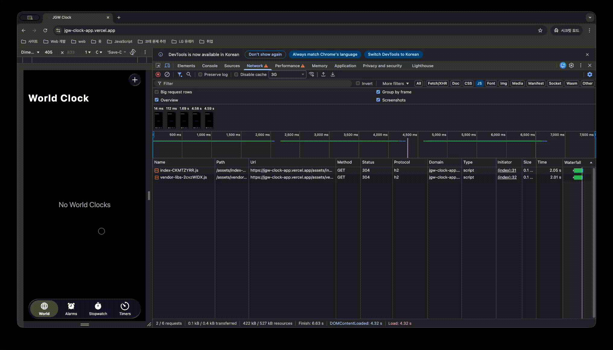

<br />

모바일 성능 제한 환경에서는 약 580ms ~ 600ms 이후 응답을 수신한 뒤 페이지 이동이 발생했습니다. 반면 **최악의 환경에서는 약 2.02s ~ 2.09s 이후에야 라우트 자원 응답을 받은 뒤 페이지 이동**이 이루어졌습니다.

여기서 중요한 점은 라우트 자원 요청 시 JavaScript뿐만 아니라 **CSS 파일도 함께 요청**된다는 점입니다.

즉 최초 접속 시에 DOM + CSSOM 결합을 통해 Render Tree가 구성되지만, 라우트 이동 과정에서 **신규 자원이 응답**되면 **Virtual DOM 재구성이 발생**하고 **Reflow, Repaint가 수행**됩니다. 그 결과 **최초 렌더링 시 계산된 스타일 또한 재계산이 발생**하게 됩니다.

<br />

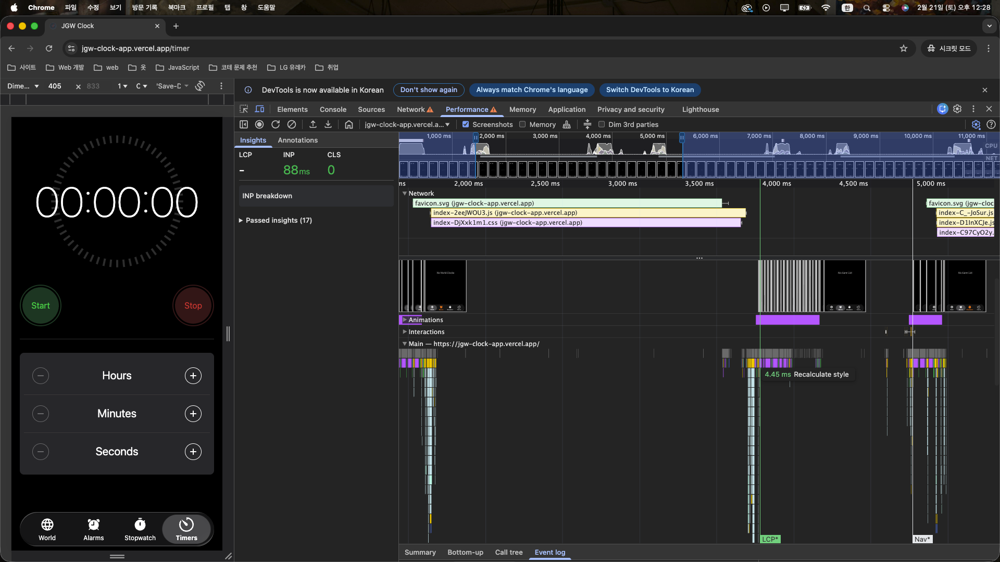

<br />

다만 Clock 웹 애플리케이션은 모바일 웹 환경을 기준으로 개발되었습니다. Lighthouse 디바이스 환경을 **Desktop으로 설정할 경우 Performance 점수가 100점으로 측정**됨에도 불구하고, **실제 타겟은 모바일 환경이기 때문에 이에 맞춰 개발과 성능 최적화를 진행**해왔습니다.

그러나 `React.lazy()`를 통해 FCP를 약 1.5s까지 단축하여 Lighthouse Performance 100점을 만드는 것은, **측정 지표상 개선일 뿐 실제 서비스 이용 과정에서의 런타임 성능은 오히려 저하되는 결과를 초래**합니다.

또한 Google Lighthouse FCP 점수 기준을 보면 **약 0s ~ 1.8s 구간은 안정 구간(🟢)으로 분류**됩니다. `React.lazy()` 적용 이전에도 **FCP는 약 1.8s 수준**이었으며 **Performance 점수 역시 98점**으로 낮지 않은 수치였습니다.

<br />

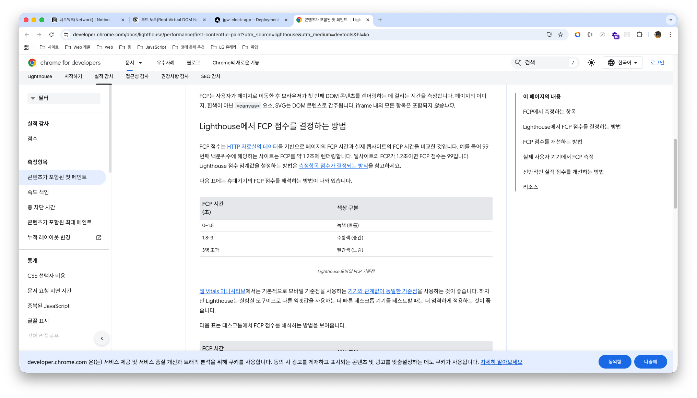

<br />

즉 `React.lazy()` 적용 이전에도 **FCP는 안정 구간에 근접**했고, **Lighthouse 점수 역시 충분히 양호**했습니다. 그러나 개인적으로는 프론트엔드 개발자는 **FCP, LCP 등과 같은 주요 성능 지표에 신경을 쓰는 것도 중요**하지만, 이를 개선하는 과정에서 **UX와 런타임 성능 저하가 발생하는 것**은 오히려 **불필요한 트레이드오프(Trade-off) 관계**라고 판단했습니다.

이로 인해 `React.lazy()`를 적용하여 Lighthouse Performance 점수를 100점대로 유지하는 것보다, **UX와 런타임 성능을 저하시키지 않는 것이 더 합리적으로 판단**했기 때문에 **관련 코드는 `React.lazy()` 적용 이전 구조로 되돌리기로 결정**했습니다.
