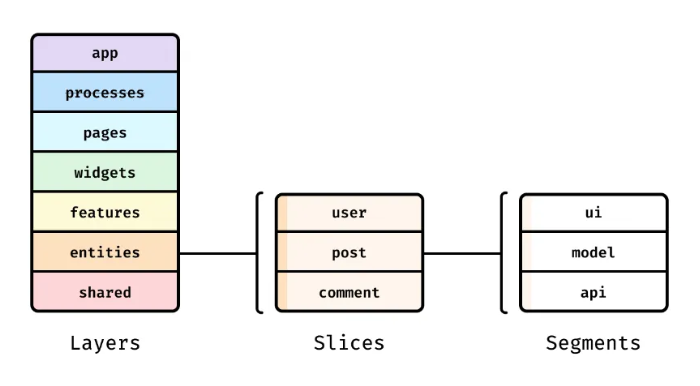

> ☝️ 이 문서는 이전 프로젝트에서 사용하던 디렉토리 구조로 인해 발생한 문제를 바탕으로, 이번 Clock 프로젝트에서 FSD 아키텍처를 도입하게 된 이유를 정리한 문서입니다.

<br />

## I. 기존에 사용하던 디렉토리 구조

Clock 프로젝트 이전까지는 개인 프로젝트든 팀 프로젝트든 관계없이, 다음과 명확한 기준 없이 디렉토리의 의미만 정의한 상태로 프로젝트를 진행해 왔습니다.

```md
project/
├─ ...
├─ src/
│  ├─ api/
│  ├─ assets/
│  ├─ components/
│  ├─ hooks/
│  ├─ pages/
│  │  └─ pageA/
│  │     ├─ components/
│  │     │  ├─ componentA/
│  │     │  ├─ componentB/
│  │     │  └─ componentC/
│  │     └─ index.tsx
│  ├─ ...
│  └─ App.tsx
└─ ...
```

> 🗂️ 이전 프로젝트에서 사용하던 디렉토리 구조는 [PICKY-FE](https://github.com/LG-Uplus-Movie-SNS-PICKY/PICKY-FE) 리포지토리에서 확인할 수 있습니다.

<br />

## II. 기존에 사용하던 디렉토리 구조 문제점

[I. 기존에 사용하던 디렉토리 구조](#i-기존에-사용하던-디렉토리-구조)와 같은 방식으로 디렉토리 구조를 관리한 경우, 개인적으로 다음과 같은 문제들을 겪었습니다.

<br />

**① 코드 탐색을 위해 디렉토리를 반복적으로 오가야 하는 문제**

코드 탐색을 위해 디렉토리를 반복적으로 오가야 하는 문제는 IDE(또는 Code Editor)에서 제공하는 검색 기능을 통해 어느 정도 완화할 수 있으며, 디렉토리 구조의 형태와 관계없이 어느 정도는 불가피하게 발생하는 문제입니다.

이 문제는 아래에 서술한 다른 문제들과 대부분 연관되어 있지만, **② 디렉토리의 의미만으로는 파일 위치를 명확히 결정하기 어려운 문제**와 가장 큰 연관이 있습니다. 개인 프로젝트의 경우에는 혼자 진행한 프로젝트라는 점에서 수정이 필요한 코드를 비교적 빠르게 떠올릴 수 있었지만, 그 과정 역시 구조에 의존하기보다는 기억에 의존하는 방식에 가까웠습니다.

팀 프로젝트의 경우에는 여러 명이 함께 개발을 진행하면서, 다른 사람이 개발한 기능이 현재 코드에 영향을 주거나, 이전에 작성한 코드가 현재 코드에 영향을 미치는 상황이 자주 발생했습니다. 이로 인해 문제를 좁히고 해결하기 위한 디버깅 과정에서 여러 파일을 반복적으로 확인해야 했으며, 모듈 코드는 경로를 따라 역추적할 수 있었지만 일부 부수 효과로 인해 영향을 받는 코드까지 고려해야 하는 경우에는 문제의 복잡도가 더욱 커졌습니다.

<br />

**② 디렉토리의 의미만으로는 파일 위치를 명확히 결정하기 어려운 문제**

Clock 프로젝트 이전까지는 디렉토리를 역할이나 책임에 대한 명확한 기준 없이, 단순히 의미 단위로만 관리해 왔습니다. 이로 인해 디렉토리가 표현하는 의미 자체에 지나치게 의존한 상태로 개발을 진행하게 되었습니다.

그 결과, 전역에서 사용되는 컴포넌트 로직은 `src/components`에 위치시키는 반면, 해당 컴포넌트에서 사용되는 상태 로직은 `src/hooks`를 전역 컴포넌트에서 사용되는 훅을 관리하는 디렉토리로 인식하여 전역 컴포넌트에서 사용되는 상태를 해당 디렉토리에 위치시키는 방식으로 관리하게 되었습니다. 이로 인해 컴포넌트와 상태 로직이 분리된 채 분산 관리되는 구조가 만들어졌으며, 단순히 전역에서 재사용된다는 이유만으로 훅을 `src/hooks`에 위치시키는 상황도 반복되었습니다.

```md
src/
├─ components/
│  └─ Header/               # 전역에서 공통적으로 사용되는 컴포넌트
├─ hooks/
│  ├─ useHeaderHook.ts      # Header 컴포넌트에서만 사용되는 커스텀 훅
│  ├─ useGlobalHook.ts      # 여러 곳에서 독립적으로 사용되는 커스텀 훅
│  └─ index.ts
```

```jsx
import { useHeaderHook } from "@hooks/";

function Header() {
  // Header 컴포넌트 내부에서 상태를 직접 정의하거나,
  // 상태 로직이 길어지는 경우에는 컴포넌트 디렉토리 내부에
  // 커스텀 훅을 두어 상태의 소유권과 제어 책임을 함께 관리할 수 있음에도 불구하고,
  // 현재 구조에서는 해당 상태 로직이 전역 hooks 디렉토리에 위치하여
  // 여러 위치에 분산된 형태로 관리되고 있음
  const { /* state, handlers */ } = useHeaderHook();
  
  return (
    <header>
      {/* ... */}
    </header>
  )
}
```

또한 특정 페이지에서 사용되는 컴포넌트들은 `src/pages/pageA/components`에서 관리했는데, 이 과정에서 Props를 통해 조건을 분기하여 재사용할 수 있는 컴포넌트임에도 불구하고, 페이지 단위라는 이유만으로 해당 디렉토리에 종속시켜 관리하게 되었습니다. 이로 인해 컴포넌트는 재사용 가능한 구조로 발전하지 못하고, 페이지마다 독립적으로 존재하는 형태로 증가하면서 구조적인 중복과 확장성의 한계가 점점 더 커지게 되었습니다.

```md
src/
├─ pages/
│  ├─ pageA/
│  │  ├─ PageAButton/    # Page A에서 종속되서 관리되는 Button
│  │  │  └─ index.tsx
│  │  └─ index.tsx
│  └─ pageB/
│     ├─ PageBButton/    # Page B에서 종속되서 관리되는 Button
│     │  └─ index.tsx
│     └─ index.tsx
```

```tsx
// 🟢 Page A에서 독립적으로 관리되는 Button 컴포넌트
function PageAButton() {
  return (
    <button style={{ padding: 24 }}>
      {/* ... */}
    </button>
  )
}
```

```tsx
// 🔴 Page B에서 독립적으로 관리되는 Button 컴포넌트
function PageAButton() {
  return (
    <button style={{ padding: 48 }}>
      {/* ... */}
    </button>
  )
}
```

```tsx
// 🤔 사실상 Props를 통해서 재사용이 가능했던 컴포넌트 형태
interface Props {
  padding: number;
  children: React.ReactElement | React.ReactElement[];
}

function Button({ padding, children }: Props) {
  return (
    <button style={{ padding }}>
      {children}
    </button>
  )
}
```

<br />

**③ 도메인･비즈니스 로직을 명확히 분리하기 어려운 문제**


> - 도메인 로직 (What): 서비스의 핵심 규칙과 상태를 담당하는 로직
> - 비즈니스 로직 (How): 도메인 로직을 활용해 기능과 흐름을 구성하는 애플리케이션 로직

[I. 기존에 사용하던 디렉토리 구조](#i-기존에-사용하던-디렉토리-구조)와 같은 방식으로 디렉토리 구조를 관리할 경우, `components`, `hooks`와 같이 역할이 아닌 형태나 구현 수단을 기준으로 한 디렉토리 이름이 사용되면서 도메인 로직과 비즈니스 로직이 구조적으로 분리되기 어려운 문제가 발생했습니다.

디렉토리 이름이 명확한 책임을 드러내지 못하다 보니, 각 로직이 어떤 도메인에 속하는지, 혹은 도메인 로직을 활용하는 비즈니스 로직인지를 구조만으로 판단하기 어렵습니다.

```md
# 디렉토리 이름만으로는 책임을 구분할 수 없는 구조
project/
├─ ...
├─ src/
│  ├─ api/
│  ├─ assets/
│  ├─ components/
│  ├─ hooks/
│  ├─ pages/
│  │  └─ pageA/
│  │     ├─ components/
│  │     │  ├─ componentA/
│  │     │  ├─ componentB/
│  │     │  └─ componentC/
│  │     └─ index.tsx
│  ├─ ...
│  └─ App.tsx
└─ ...
```

예를 들어 `components` 디렉토리는 전역에서 재사용되는 컴포넌트인지, 특정 페이지에 종속된 컴포넌트인지는 구분할 수 있지만, 해당 컴포넌트가 특정 도메인의 핵심 규칙을 표현하는 컴포넌트인지, 혹은 도메인 로직을 활용해 비즈니스 로직인지에 대한 정보는 제공하지 않습니다.

```md
# 전역 컴포넌트, 종속 컴포넌트인지 구분은 가지만 도메인･비즈니스 책임은 모호한 구조
project/
├─ src/
│  ├─ components/
│  │  ├─ UserInfo/
│  │  ├─ CartPreview/
│  │  └─ OrderTotal/
│  ├─ pages/
│  │  └─ pageA/
│  │     ├─ components/
│  │     │  ├─ UserSection/
│  │     │  ├─ CartSection/
│  │     │  └─ OrderSection/
│  │     └─ index.tsx
│  ├─ ...
│  └─ App.tsx
└─ ...
```

또한 경로 기반으로 모듈을 자유롭게 불러올 수 있는 구조이기 때문에, `src/components`에서 `src/pages/pageA/component`에 접근하더라도 기술적으로는 문제가 발생하지 않아 구조적으로 부자연스러운 의존성이 만들어지게 됩니다.

```tsx
// src/components에서 pageA 하위의 컴포넌트에 접근하더라도, 기술적으로는 에러가 발생하지 않지만,
// 구조적으로 페이지에 종속된 컴포넌트에 의존하는 부자연스러운 구조가 만들어짐
import ComponentA from "@pages/pageA/components/componentA";

function Header() {
  return (
    <header>
      <ComponentA />
    </header>
  )
}
```

<br />

위와 같은 문제로 인해 프로젝트가 진행될수록 의존성은 더욱 복잡해졌고, 코드 전반은 점차 스파게티화되기 시작했습니다. 프로젝트의 완성도를 높이기 위해 리팩토링의 중요성을 인지하고 있었음에도 불구하고, 작은 수정에도 여러 코드가 함께 변경되는 상황이 반복되면서 유지보수에 대한 부담이 커졌습니다.

그 결과, 프로젝트가 완료된 이후 구조 개선이나 유지보수를 통해 완성도를 높이기보다는 프로젝트 완료 자체에만 집중하게 되었고, 프로젝트가 끝난 뒤에도 추가적인 개선 작업을 진행하지 않은 채 그대로 두는 잘못된 개발 습관으로 이어지게 되었습니다.

<br />

## III. FSD 아키텍처(Feature-Sliced Design) 도입 배경

> 본 문서는 FSD 아키텍처의 기본적인 내용만을 다루며, 자세한 설명과 예시는 [Feature-Sliced Design 공식 문서](https://feature-sliced.design)를 참고하시기 바랍니다.

[II. 기존에 사용하던 디렉토리 구조 문제점](#ii-기존에-사용하던-디렉토리-구조-문제점)에서 정리한 문제로 인해 잘못된 개발 습관을 개선하기 위한 방법을 지속적으로 고민하며 여러 글과 자료를 찾아봤습니다.

1. 컴포넌트 로직과 커스텀 훅을 활용한 상태 로직 분리
2. Atomic Design System 기반 디렉토리 구조 설계

이러한 방법들은 코드의 역할을 나누거나 컴포넌트를 계층적으로 설계하는 데에는 일정 부분 도움이 되었지만, 문제점에서 언급한 **"② 디렉토리의 의미만으로는 파일 위치를 명확히 결정하기 어려운 문제"**, **"③ 도메인･비즈니스 로직을 명확히 분리하기 어려운 문제"** 를 해결하기에는 한계가 있다고 판단했습니다. 그러던 중 개발자 유튜버 제로초 님의 ["아직도 React 폴더 구조로 고민하고 계신가요? FSD 한 번 써보세요"](https://www.youtube.com/watch?v=64Fx5Y1gEOA) 영상을 통해 처음으로 FSD 아키텍처의 디렉토리 구조를 접하게 되었습니다.

<br />



FSD 아키텍처는 디렉토리를 App -> Process -> Pages -> Widgets -> Features -> Entities -> Shared 레이어로 구성하고, 각 레이어 간의 접근을 제한함으로써 책임과 의존성의 방향을 명확히 합니다. 또한 각 레이어 내부의 슬라이스와 세그먼트 단위로 나누어, 구조적으로 명확한 의미와 역할을 가지도록 설계된 아키텍처입니다.

그래서 Clock 프로젝트를 처음 기획할 당시에는 토이 프로젝트 규모로 판단하고, FSD 아키텍처 기반의 디렉토리 구조를 적용하여 이전에 겪었던 문제점들을 실제로 해결할 수 있는지 확인하기 위한 목적으로 진행되었습니다.

<br />

## IV. FSD 아키텍처(Feature-Sliced Design) 도입으로 인한 문제점 완화

> [II. 기존에 사용하던 디렉토리 구조 문제점](#ii-기존에-사용하던-디렉토리-구조-문제점)에서 정리한 문제들이 FSD 아키텍처 기반의 설계를 통해 실제로 어떻게 완화되었는지를 설명합니다.

<br />

**① 코드 탐색을 위해 디렉토리를 반복적으로 오가야 하는 문제**

Clock 프로젝트 이전까지는 명확한 기준 없이 디렉토리의 의미만을 정의한 상태로 프로젝트를 진행해 왔습니다. 그 결과 `src` 하위에 여러 디렉토리가 생성되었고, 디버깅 과정에서 문제가 발생한 코드를 찾기 위해서는 여러 디렉토리를 반복적으로 확인해야 하는 상황이 발생했습니다.

```md
# 기존 디렉토리 설계 방식(여러 디렉토리 간 모듈을 공유해 문제가 발생한 코드를 찾기 어려움)
src/
├─ api/
├─ assets/
├─ components/
├─ hooks/
├─ pages/
├─ provider/
└─ ...
```

반면, FSD 아키텍처 기반의 설계 방식에서는 `src` 하위가 총 6개의 레이어 단위로만 구성됩니다(process 레이어는 더 이상 사용되지 않음). 이로 인해 문제가 발생한 코드가 어떤 레이어에 속해 있는지, 또 해당 슬라이스가 단방향 의존성 규칙에 따라 어떤 레이어를 참조하고 있는지만 확인하면 되므로, 이전 방식에 비해 디버깅 과정을 훨씬 수월하게 진행할 수 있었습니다.

```md
# FSD 아키텍처 기반 디렉토리 설계 방식(문제 발생 시 위에서 아래로 확인하면 됨)
src/
├─ app/
├─ pages/
├─ widgets/
├─ features/
├─ entities/
└─ shared/
```

<br />

**② 디렉토리의 의미만으로는 파일 위치를 명확히 결정하기 어려운 문제**

기존 방식에서는 전역에서 사용되는 컴포넌트 로직을 `src/components`에 위치시키는 반면, 해당 컴포넌트에서 사용되는 상태 로직은 `src/hooks`를 전역 훅을 관리하는 디렉토리로 인식하여 함께 관리하는 구조로 사용했습니다.

```md
# 기존 디렉토리 설계 방식
src/
├─ components/
│  └─ Header/               # 전역에서 공통적으로 사용되는 컴포넌트
├─ hooks/
│  ├─ useHeaderHook.ts      # Header 컴포넌트에서만 사용되는 커스텀 훅
│  ├─ useGlobalHook.ts      # 여러 곳에서 독립적으로 사용되는 커스텀 훅
│  └─ index.ts
```

```tsx
import { useHeaderHook } from "@hooks/";

function Header() {
  // Header 컴포넌트 내부에서 상태를 직접 정의하거나,
  // 상태 로직이 길어지는 경우에는 컴포넌트 디렉토리 내부에
  // 커스텀 훅을 두어 상태의 소유권과 제어 책임을 함께 관리할 수 있음에도 불구하고,
  // 현재 구조에서는 해당 상태 로직이 전역 hooks 디렉토리에 위치하여
  // 여러 위치에 분산된 형태로 관리되고 있음
  const { /* state, handlers */ } = useHeaderHook();
  
  return (
    <header>
      {/* ... */}
    </header>
  )
}
```

반면, FSD 아키텍처 기반의 설계 방식에서는 [레이어(Layer)](https://feature-sliced.design/kr/docs/get-started/overview#layers)마다 명확한 책임과 의미가 정의되어 있으며, 각 레이어 내부를 [슬라이스(Slice)](https://feature-sliced.design/kr/docs/get-started/overview#slices)단위로 구분하고, [세그먼트(Segment)](https://feature-sliced.design/kr/docs/get-started/overview#segments)를 통해 코드의 역할을 명확하게 분리할 수 있습니다.

```md
# FSD 아키텍처 기반 디렉토리 구조
src/
├─ app/
├─ pages/
├─ widgets/
├─ features/
├─ entities/
└─ shared/
   ├─ model/
   │  ├─ useHeaderHook.ts
   │  └─ index.ts
   └─ ui/
      ├─ Header/
      │  └─ index.tsx
      └─ index.ts
```

```tsx
import { useHeaderHook } from "@shared/model";

function Header() {
  // Header 컴포넌트에서 사용되는 상태 로직은 전역 hooks 디렉토리에 분산되어 관리되는 것이 아니라,
  // shared 레이어 내부에서 UI와 상태 로직이 동일한 맥락으로 묶여 관리됨
  // 이를 통해 상태의 소유권과 제어 책임이 명확해지고, 컴포넌트와 상태 로직 간의 관계를 구조만으로도 파악할 수 있음
  const { /* state, handlers */ } = useHeaderHook();
  
  return (
    <header>
      {/* ... */}
    </header>
  );
}
```

<br />

**③ 도메인･비즈니스 로직을 명확히 분리하기 어려운 문제**

기존 구조에서는 `components` 디렉토리는 전역에서 재사용되는 컴포넌트인지, 특정 페이지에 종속된 컴포넌트인지는 구분할 수 있지만, 해당 컴포넌트가 특정 도메인의 핵심 규칙을 표현하는 컴포넌트인지, 혹은 도메인 로직을 활용해 비즈니스 로직인지에 대한 정보는 제공하지 않습니다.

```md
# 전역 컴포넌트, 종속 컴포넌트인지 구분은 가지만 도메인･비즈니스 책임은 모호한 구조
project/
├─ src/
│  ├─ components/
│  │  ├─ UserInfo/
│  │  ├─ CartPreview/
│  │  └─ OrderTotal/
│  ├─ pages/
│  │  └─ pageA/
│  │     ├─ components/
│  │     │  ├─ UserSection/
│  │     │  ├─ CartSection/
│  │     │  └─ OrderSection/
│  │     └─ index.tsx
│  ├─ ...
│  └─ App.tsx
└─ ...
```

반면, FSD 아키텍처에서는 Entities 레이어를 통해 도메인의 상태와 핵심 규칙을 명확하게 정의하고, Features 레이어에서 해당 도메인 로직을 활용하여 기능과 흐름을 구성하는 애플리케이션 로직을 조합할 수 있습니다. 이를 통해 도메인 로직과 비스니스 로직의 책임이 레이어 구조 자체에 드러나며, 각 로직의 역할과 경계가 구조적으로 분리됩니다.

```md
# FSD 아키텍처 기반 디렉토리 구조 예시
src/
├─ entities/
│  └─ user/
│     ├─ model/
│     │  ├─ types.ts
│     │  └─ user.ts        # User 도메인 상태 및 규칙
│     └─ ui/
│        └─ UserInfo.tsx   # 도메인 상태를 표현하는 UI
├─ features/
│  └─ update-user/
│     ├─ model/
│     │  └─ useUpdateUser.ts  # 도메인 로직을 활용한 유즈케이스
│     └─ ui/
│        └─ UpdateUserButton.tsx
└─ ...
```

<br />

이와 같이 기존 방식 대신 FSD 아키텍처 기반의 설계 방식을 도입하면서, 프로젝트를 진행하며 겪었던 여러 구조적 문제들을 상단 부분 완화할 수 있었습니다. 디렉토리 구조 자체가 책임과 역할을 드러내다 보니 코드의 위치를 결정하기 쉬워졌고, 모듈 간 의존성 또한 이전 방식에 비해 훨씬 단순하게 관리할 수 있었습니다.

물론 FSD 아키텍처가 모든 문제를 해결해 주는 만능 해법은 아닙니다. 실제로 구조를 충분히 이해하지 못한 상태에서 설계하여 오히려 구조를 다시 정비하기 위한 추가적인 유지보수가 많이 발생하기도 했습니다.

그럼에도 불구하고 명확한 책임 분리와 일관된 의존성 규칙을 통해 구조적인 복잡도를 효과적으로 낮출 수 있었고, 그 결과 프로젝트 완료 이후에도 꾸준히 완성도를 높이기 위한 유지보수를 이어갈 수 있었습니다. 이러한 경험을 바탕으로, 앞으로 React 기반 프로젝트를 개발할 때는 FSD 아키텍처를 저만의 디렉토리 설계 기준으로 삼아 프로젝트를 진행활 계획입니다.