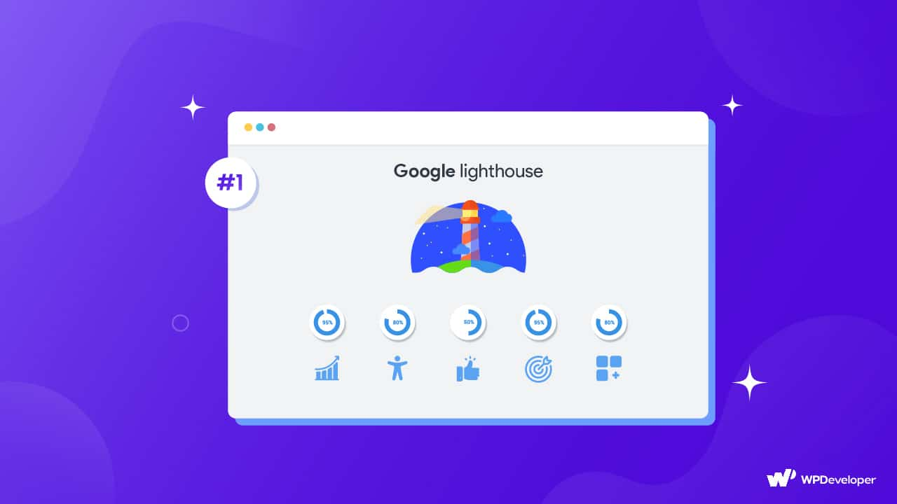

> ☝️ 이 문서는 프로젝트 개발 완료 이후 일부 성능 최적화를 적용한 뒤, 배포 서버의 Clock 서비스를 대상으로 Google 개발자 도구에서 제공하는 Lighthouse를 활용하여 전체 보고서 점수를 100점으로 개선한 과정을 설명한 문서입니다.

 

## I. Google Lighthouse란?

Google에서 제작한 Chrome 개발자 도구에서는 Lighthouse라는 분석 도구를 제공합니다. Lighthouse는 Navigation, Timespan, Snapshot과 같은 다양한 측정 모드를 제공하지만, 일반적으로는 **Navigation 모드를 통해 페이지 최초 로드 시점의 전체 보고서를 생성하는 용도**로 가장 많이 활용됩니다.

왜냐하면 Timespan과 Snapshot 모드는 **일부 카테고리를 선택할 수 없는 제한**이 있으며, 보다 **정밀한 성능 분석이 필요한 경우**에는 Chrome 개발자 도구의 **Performance, Memory 패널을 통해 세부 측정을 수행**하는 것이 더 적절하기 때문입니다.

반면 **Navigation 모드**는 **페이지 최초 로드 시 Performance, Accessibility, Best Practices, SEO 등 전체 카테고리에 대한 종합 보고서를 생성**해주기 때문에, **FCP(First Contentful Paint)와 같은 로딩 성능 지표**뿐만 아니라 접근성, 웹 표준, SEO 등 **웹 개발 원칙을 준수하며 개발**이 이루어졌는지도 **함께 확인**할 수 있습니다.

 

> Google Lighthouse에 자세한 내용은 제 노션의 [｢개발자 도구 | Lighthouse｣](https://gye-won.notion.site/Lighthouse-2b488bd9c3fa80e19dcfcc12df891c2e?pvs=74)에서 확인하실 수 있습니다.

 

하지만 주의해야 될 점은 **Google Lighthouse 보고서가 100% 정확한 결과를 제공하는 것은 아니라는 점**입니다. 해당 출처(Origin)에 저장된 쿠키, 캐시 정보와 사용자의 방문 기록, 확장 프로그램 등과 같은 **외부 요인의 영향을 받을 수 있습니다.** 또한 이러한 외부 요인을 제외하더라도 **보고서 결과는 어디까지나 정량적 기준에 따라 산출**됩니다.

예를 들어 SEO 우선순위를 높이기 위해서는 [｢Lighthouse SEO 점수 개선 및 Google Search Console 사이트 등록｣](./seo-optimization.md) 문서에서 확인할 수 있듯이, 개발 관점만으로 달성할 수 있는 영역이 아닙니다. 보유한 백링크 규모, 브랜드 신뢰도 등 **마케팅･브랜딩 영역과의 협업이 함께 이루어져야 실제 검색 노출 우선순위를 높일 수 있습니다.** 하지만 Google Lighthouse는 **HTML 문서의 메타데이터 구성, `robots.txt` 파일 존재 여부** 등 **개발 관점의 요소를 중심으로만 점수를 산정**합니다.

이처럼 Lighthouse 결과는 절대적 지표가 아니며, 이러한 한계를 이해한 상태에서 활용할 필요가 있습니다. 실제 운영 중인 대규모 서비스의 경우 프로젝트 규모와 구조가 복잡하기 때문에, Lighthouse와 같은 정량적 지표보다 **실제 사용자에게 제공되는 런타임 성능을 더욱 중요하게 고려**합니다. 이로 인해 Lighthouse 점수를 측정하더라도 **모든 항목에서 100점을 달성한 사례는 드문 편**입니다.

 

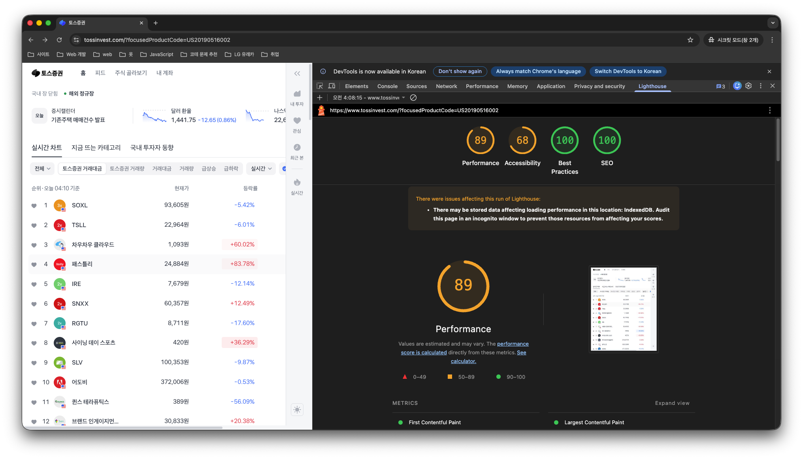

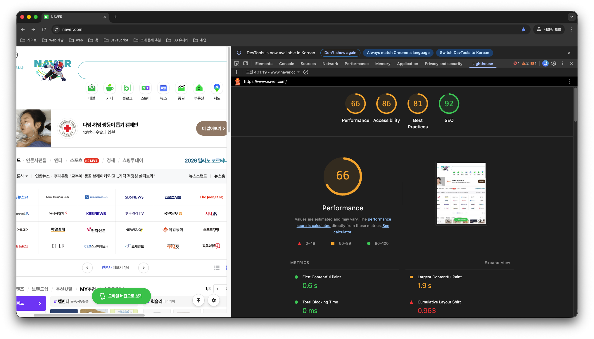

 

다만 현재 Clock 서비스와 같이 실제 운영 서비스가 아닌 포트폴리오 성격의 프로젝트에서는 이러한 **정량적 지표를 개선하는 과정 자체가 중요한 학습 요소**가 된다고 생각합니다. 따라서 해당 문서에서는 **Lighthouse 전체 측정 지표를 100점 기준으로 개선한 과정**을 작성했습니다.

 

## II. Clock 사이트 Lighthouse 결과

Lighthouse 측정은 **프로젝트 개발 완료 이후 일부 성능 최적화를 적용**한 뒤, Vercel을 통해 **배포한 Clock 사이트를 대상**으로 **진행**했습니다.

또한 Google Lighthouse는 앞서 [｢Google Lighthouse란?｣](#i-google-lighthouse란) 목차에서 설명했듯이 **다양한 외부 요인이 반영된 정량적 결과 보고서를 제공**합니다. 이에 따라 **Google Chrome 시크릿 모드를 통해 외부 요인을 최대한 배제한 환경에서 측정을 진행**했습니다.

 

 

위 사진에서 확인할 수 있듯이 **Lighthouse 개선 이전 결과**는 **모든 항목이 90~100점 범위로 측정**되어 예상보다 양호한 점수로 나타났습니다.

하지만 Performnace와 Accessibility 점수가 100점이 아닌 90점대로 유지되는 원인을 살펴보기 전에, Vercel을 통해 **배포한 사이트 환경**에서 **Lighthouse 결과를 측정하는 이유에 대해 먼저 설명**한 뒤, **각 점수가 90점대로 유지되는 원인을 이어서 살펴보겠습니다.**

 

### A. 배포한 사이트 환경에서 Lighthosue 결과 측정 이유

Node.js의 등장은 프론트엔드 개발 환경에 큰 변화를 가져왔습니다. 그중 하나가 바로 **모듈 시스템(Module System)의 등장**입니다. 본래 JavaScript는 자체적인 모듈 시스템을 제공하지 않았습니다. 하지만 Node.js는 브라우저 외부 환경에서 JavaScript 코드를 해석할 수 있도록 설계된 런타임 환경입니다.

이로 인해 JavaScript를 활용한 서버 사이드 개발이 가능해졌습니다. 다만 기존 JavaScript는 모듈 시스템을 제공하지 않았기 때문에, **Node.js 런타임 환경에서는 자체적으로 CommonJS 모듈 시스템을 제공**하여 **모듈 기반 프로젝트를 구성**할 수 있도록 지원했습니다.

 

 

이후 프론트엔드 개발 규모가 점차 커지면서, 하나의 HTML 문서 실행 컨텍스트 내에서 동작하던 JavaScript 구조는 **"전역 변수 오염"과 "의존성 관리의 복잡성" 문제를 야기**하게 되었고, 이에 따라 **브라우저 환경에서도 모듈 시스템의 필요성이 점차 커지게 되었습니다.**

이 과정에서 브라우저 환경의 **비동기 로딩을 지원하는 AMD**, 그리고 **CommonJS와 AMD를 모두 지원하는 UMD** 모듈 시스템이 등장했습니다. 다만 이들은 JavaScript 표준이 아닌 **패키지 형태**였기 때문에 ((버전 변화에 따른 사용 방식 차이, 그리고 장기 지원에 대한 불확실성이라는 한계가 존재))했습니다.

결국 ES6 표준안에서 **ESModule(ESM) 방식이 공식 모듈 시스템으로 채택**되면서, **브라우저 환경에서도 표준 기반 모듈 시스템을 사용**할 수 있게 되었습니다. 그러나 모듈이 증가한다는 것은 곧 **하나의 페이지에서 로드해야 할 JavaScript 파일 수가 늘어난다는 의미**이기도 합니다.

 

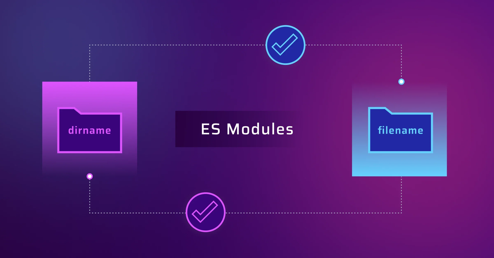

 

또한 **UI/UX 및 디자인 요소의 중요성이 커지면서**, CSS, 폰트, 이미지 등 **다양한 정적 자원의 수가 함께 증가**하게 되었습니다. 그 결과 **프로젝트 규모가 커질수록 다수의 JavaScript, CSS, 폰트, 이미지 파일 요청이 발생**하게 되었고, DX(Developer Experience)는 향상된 반면 **초기 로딩 성능 저하로 UX(User Experience)가 감소하는 문제**가 발생했습니다.

이러한 문제를 해결하기 인해 빌드 과정에서 다수의 파일을 하나로 묶어주는 **번들링 도구(Webpack, Parcel, ESBuild, Rollup 등)가 등장**하게 되었습니다. 번들링 도구는 단순 파일 결합을 넘어 압축, 난독화, 트리 셰이킹 등의 **최적화 과정을 수행하여 파일의 크기를 감소시키는 역할도 수행**합니다.

이로 인해 Node.js 기반 개발 서버 환경에서 Lighthouse 결과를 측정할 경우, 다음 이미지와 같이 **번들링이 수행되지 않은 상태**에서 **다수의 자원을 네트워크로 로드한 뒤 렌더링이 이루어지기 때문에 Performance 결과가 상대적으로 낮게 측정**됩니다.

 

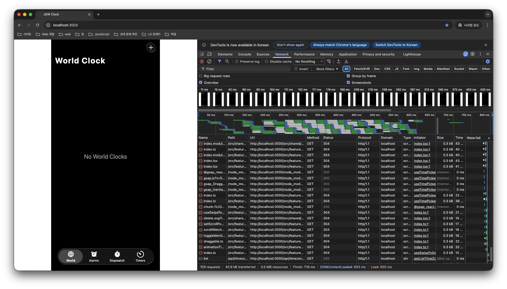

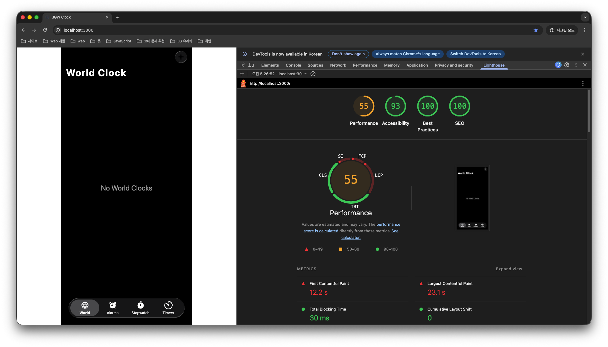

 

따라서 Lighthouse 결과를 측정할 때에는 개발 서버 환경이 아닌, 빌드 및 최적화가 완료된 **실제 사용자 이용 환경을 기준으로 측정하는 것이 정량적 지표를 보다 현실적으로 반영**할 수 있습니다. 이러한 이유로 배포된 사이트 환경에서 Lighthouse 측정을 진행했습니다.

 

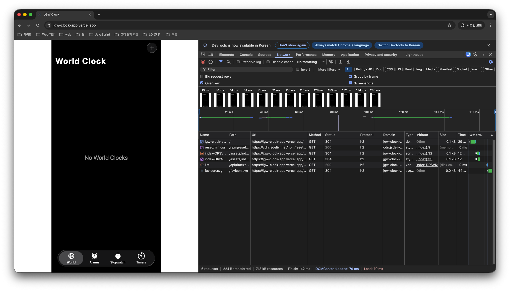

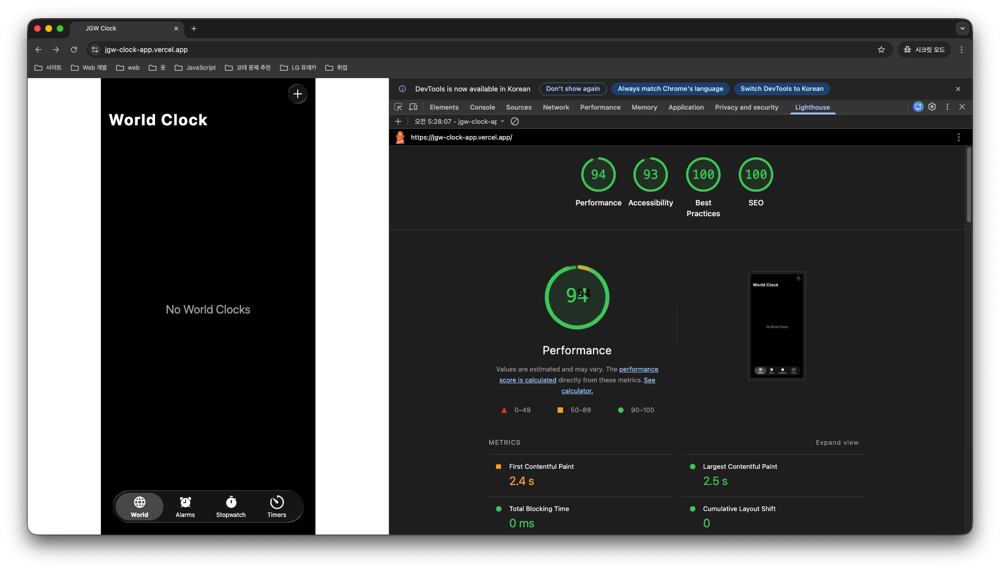

 

### B. Lighthouse Performance 점수 94점 측정 원인

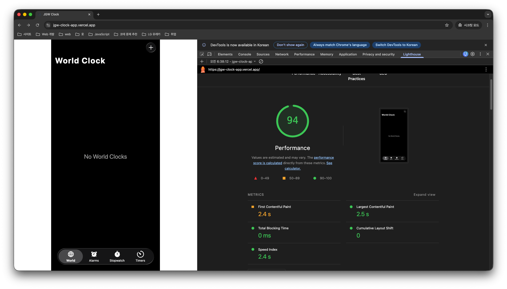

 

먼저 Lighthouse의 Performance 요약 결과를 살펴보면 **여러 개의 측정 지표**가 있습니다. 해당 지표들의 의미는 다음과 같습니다.

- **First Contentful Paint**: 최초 로딩 시 **첫 번째 콘텐츠가 화면에 표시되는 시점**을 의미합니다. (🟡 결과: 2.4s)
- **Largest Contentful Paint**: 최초 로딩 시 **주요 콘텐츠가 화면에 표시되는 시점**을 의미합니다. (🟢 결과: 2.5s)
- **Total Blocking Time**: FCP 이후 JavaScript 실행 등으로 인해 **메인 스레드가 차단되어 사용자 입력에 즉시 반응하지 못한 누적 시간**을 의미합니다. (🟢 결과: 0ms)
- **Cumulative Layout Shift**: **페이지 로딩 과정에서 발생한 레이아웃 이동의 누적 횟수**를 의미합니다. (🟢 결과: 0)
- **Speed Index**: 페이지 콘텐츠가 **시각적으로 표시되는 속도를 종합적으로 평가한 지표**를 의미합니다. (🟢 결과: 2.4s)

 

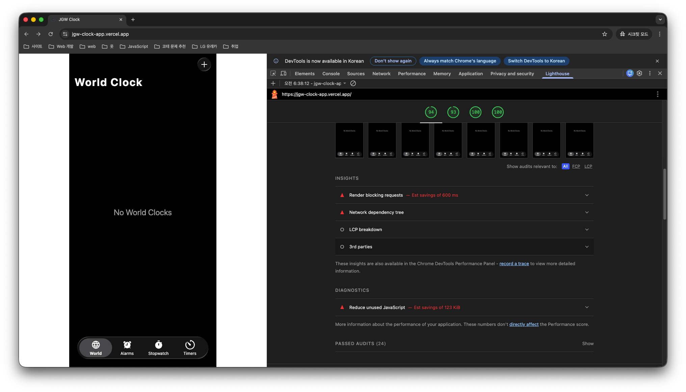

 

다음으로 Lighthouse의 Performance 감점 요인 리스트를 살펴보면, **다음과 같은 항목이 감점 요인으로 반영**된 것을 확인할 수 있습니다.

- Render blocking requests
- Network dependency tree
- Reduce unused JavaScript

다만 리스트 결과만으로는 정확한 감점 원인을 파악하기 어렵기 때문에, **각 감점 항목의 탭을 활성화하여 세부 원인을 살펴보겠습니다.**

 

**① Render blocking requests**

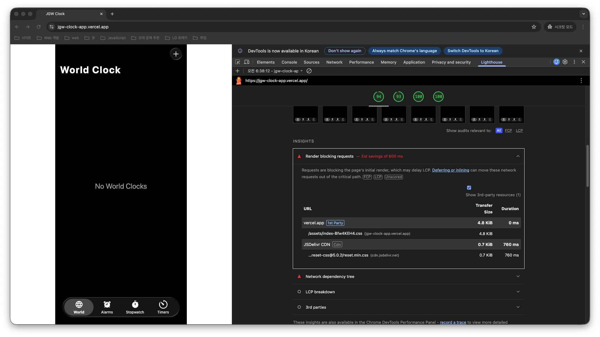

 

"Render blocking requests"를 번역하면 **"렌더링 흐름을 차단하는 네트워크 요청 자원이 존재한다."** 는 의미입니다.

이를 이해하고 탭을 활성화하여 세부 원인을 살펴보면, **vercel.app에서 전달받은 `/assets/index.xxx.css` 번들 CSS 파일**과 **JSDelivr CDN에서 제공되는 `reset-css@5.0.2/reset.min.css`** 이 **초기 렌더링 과정에서 렌더링 흐름을 지연시키는 요인으로 반영**된 것을 확인할 수 있습니다.

또한 세부 원인 우측에 **FCP**, **LCP**, **Unscored**라는 **Chip UI가 표시**되는 것을 확인할 수 있으며, 각 항목의 의미는 다음과 같습니다.

- **FCP**: Lighthouse Performnace 지표 중 **FCP(First Contentful Paint)에 영향을 줄 수 있음**을 의미합니다.
- **LCP**: Lighthouse Performnace 지표 중 **LCP(Largest Contentful Paint)에 영향을 줄 수 있음**을 의미합니다.
- **Unscored**: 해당 항목은 Lighthouse 보고서에 포함되지만, **전체 점수 산정에는 직접 반영되지 않음**을 의미합니다.

 

**② Network dependency tree**

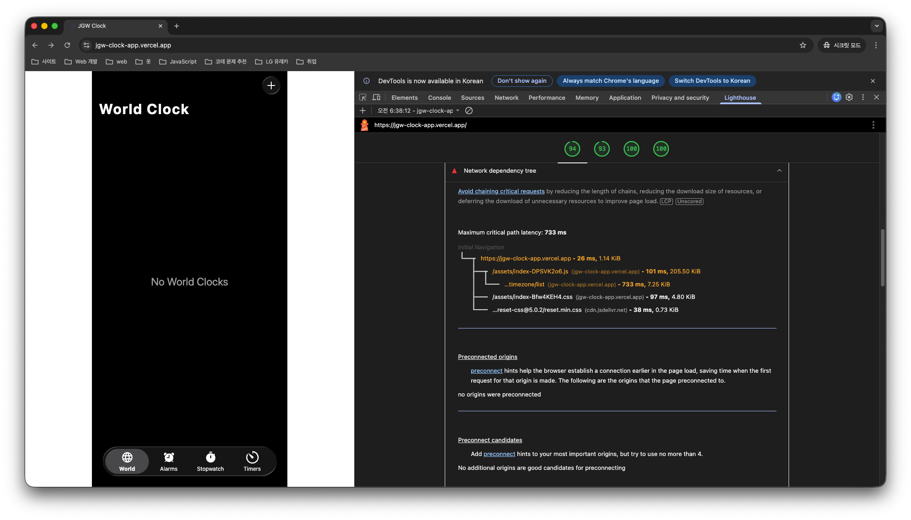

 

"Network dependency tree"를 번역하면 **"네트워크 요청 간 의존 관계 구조를 나타낸다."** 라는 의미입니다.

이를 이해하고 탭을 활성화하여 **경고(노란색)로 표시된 항목**을 확인해보면, JGW Clock 페이지 최초 접속 시 **브라우저가 웹 서버에 HTML 문서를 요청**한 뒤, 해당 문서에 연결된 **스크립트 파일을 JavaScript 엔진이 해석하는 과정**에서 **`GET /timezone/list` API 요청이 발생**하는 것을 확인할 수 있습니다. 또한 **해당 API 요청의 응답이 완료되기까지**의 **전체 소요 시간이 약 733ms로 측정**된 것을 확인할 수 있습니다.

또한 세부 원인 우측에 **LCP**, **Unscored**라는 **Chip UI가 표시**되는 것을 확인할 수 있으며, 각 항목의 의미는 다음과 같습니다.

- **LCP**: Lighthouse Performnace 지표 중 **LCP(Largest Contentful Paint)에 영향을 줄 수 있음**을 의미합니다.
- **Unscored**: 해당 항목은 Lighthouse 보고서에 포함되지만, **전체 점수 산정에는 직접 반영되지 않음**을 의미합니다.

 

**③ Reduce unused JavaScript**

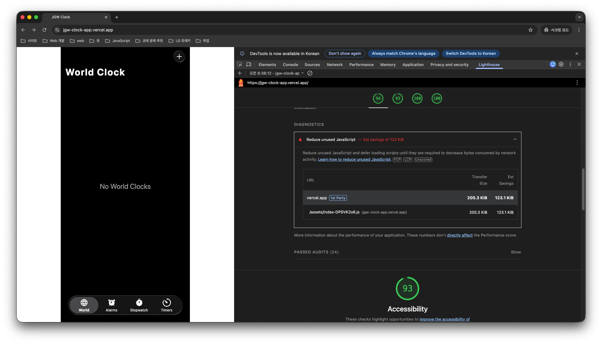

 

"Reduce unused JavaScript"를 번역하면 **"사용되지 않는 JavaScript 코드가 존재한다."** 라는 의미입니다.

이를 이해하고 탭을 활성화하여 세부 원인을 살펴보면, **`/assets/index-DPSVK2o6.js` 번들 파일**에서 **사용되지 않는 JavaScript 코드가 포함되어 있어 불필요한 네트워크 전송이 발생**하고 있음을 확인할 수 있습니다. 따라서 **사용되지 않는 코드를 제거**하거나, **필요 시점까지 스크립트 로딩을 지연(defer)** 시켜 **불필요한 네트워크 사용량을 줄일 것을 권장**하는 항목입니다.

또한 세부 원인 우측에 **FCP**, **LCP**, **Unscored**라는 **Chip UI가 표시**되는 것을 확인할 수 있으며, 각 항목의 의미는 다음과 같습니다.

- **FCP**: Lighthouse Performnace 지표 중 **FCP(First Contentful Paint)에 영향을 줄 수 있음**을 의미합니다.
- **LCP**: Lighthouse Performnace 지표 중 **LCP(Largest Contentful Paint)에 영향을 줄 수 있음**을 의미합니다.
- **Unscored**: 해당 항목은 Lighthouse 보고서에 포함되지만, **전체 점수 산정에는 직접 반영되지 않음**을 의미합니다.

 

### C. Lighthouse Accessibility 점수 93점 측정 원인

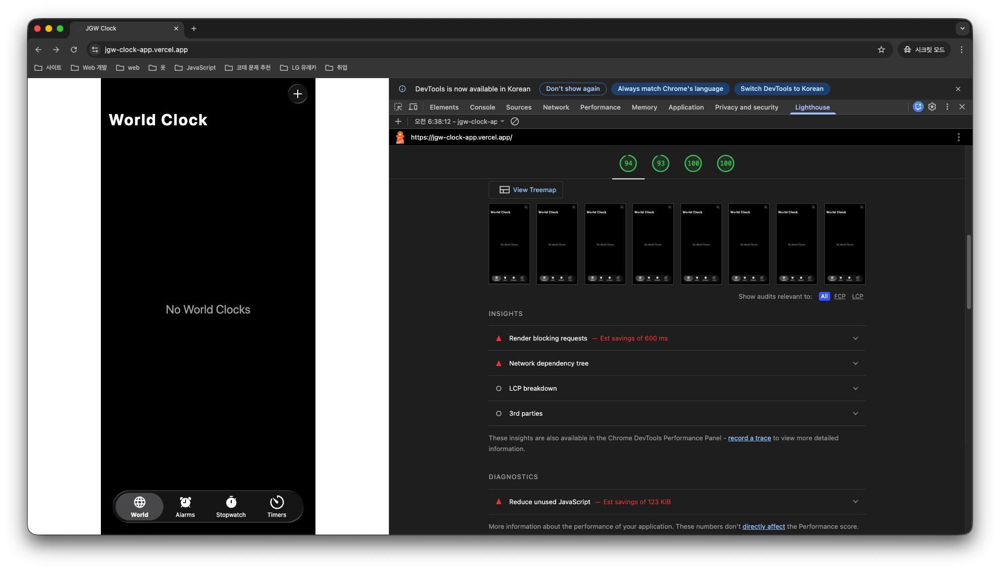

 

Lighthouse의 Accessibility 감점 요인 리스트를 살펴보면, **"Buttons do not have an accessible name"** 항목 하나만 **감점 요인으로 반영**된 것을 확인할 수 있습니다.

다만 리스트 제목만으로는 정확한 감점 원인을 파악하기 어렵기 때문에, 해당 **감점 항목의 탭을 활성화하여 세부 원인을 살펴보겠습니다.**

 

**① Buttons do not have an accessible name**

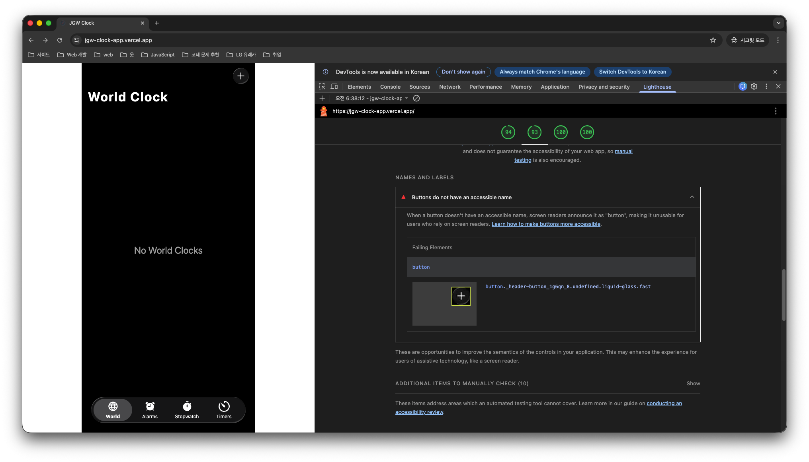

 

"Buttons do not have an accessible name"를 번역하면 **"버튼 요소에 접근 가능한 이름(Accessible Name)이 존재하지 않는다"** 는 의미입니다.

이를 이해하고 탭을 활성화하여 세부 원인을 살펴보면, **`button._header-button_1g6qn_8.undefined.liquid-glass.fast` 클래스를 가진 `<button>` 요소**가 **스크린 리더**에서 단순히 **"button"으로만 인식**될 수 있기 때문에, 해당 **버튼의 역할을 명확히 전달할 수 있는 접근성 이름을 제공**해야 한다는 것을 확인할 수 있습니다.

 