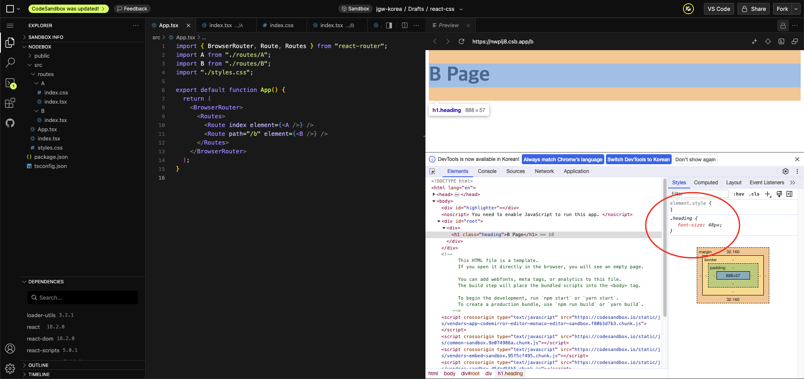
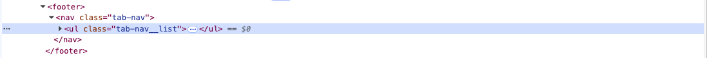
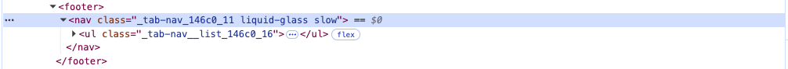

> ☝️ 이 문서는 프로젝트 개발 완료 이후, 기존 SCSS 스타일시트 코드를 분석하고 이를 기반으로 리팩토링을 진행한 과정을 단계적으로 정리한 문서입니다.

<br />

## I. SCSS 스타일 코드를 리팩토링을 하게 된 이유

```md
src/
├── widgets/
│   ├── navigator/
│   │   ├── ui/
│   │   │   ├── TabItem/
│   │   │   │   ├── index.tsx
│   │   │   │   ├── index.styles.scss
│   │   │   │   ├── mixin.scss
│   │   │   │   └── variable.scss
│   │   │   ├── index.tsx
│   │   │   └── index.styles.scss
│   │   └── ...
│   │
│   ├── headers/
│   │   ├── AlarmHeader/
│   │   │   ├── ui/
│   │   │   │   ├── index.tsx
│   │   │   │   ├── index.module.scss
│   │   │   │   ├── _mixin.scss
│   │   │   │   └── _variable.scss
│   │   │   └── ...
│   │   │
│   │   ├── WorldHeader/
│   │   │   ├── ui/
│   │   │   │   ├── index.tsx
│   │   │   │   ├── index.module.scss
│   │   │   │   ├── _mixin.scss
│   │   │   │   └── _variable.scss
│   │   │   └── ...
│   │   └── ...
│   │
│   └── ...
│
└── ...
```

현재 디렉토리 구조를 보면 알 수 있듯이, 어떤 부분에서는 파일 식별자 이름이 `styles`로 시작하고, 어떤 부분은 `module`로 시작하고 있습니다.

또한 지금 구조는 Liquid-Glass 스타일을 사용하고 있는 컴포넌트들만 몇 개만 요약해서 보여주고 있는데, 여기서 사용되고 있는 `mixin.scss`, `variable.scss`는 모두 동일한 역할을 하고 있음에도 불구하고 여러 개의 파일로 나뉘고 있습니다.

그리고 `TabItem`의 `mixin`과 `variable`은 컴파일(정확히는 SCSS -> CSS 트랜스파일)에 포함시키지 않아도 되는 대상임에도 불구하고, 현재 언더바(_) 기호를 쓰지 않고 있기 때문에 컴파일 대상이 되고 있습니다.

<br />

```scss
// 특정 hover 동적 가상 클래스 스타일 로직
.css-class-name {
  &:hover {
    &.glass-button__text {
      color: #ff7f00;
    }
    &.glass-button__icon {
      & > svg {
        & > path {
          stroke: #ff7f00;
        }
      }
    }
  }
}
```

또한 위 코드를 보면 알 수 있듯이, 텍스트 색상과 아이콘 색상을 동일하게 유지해야 함에도 불구하고 동일한 HEX 색상 값이 각각 개별적으로 선언되어 있습니다. 해당 색상 값은 여러 곳에서 공통으로 사용되는 값이기 때문에, 하나의 기준으로 관리되며 일관되게 적용되어야 합니다.

그러나 현재 구조에서는 색상을 변경해야 할 경우, 해당 HEX 값을 사용한 모든 위치를 직접 찾아 수정해야 하는 문제가 발생합니다. 또한 Visual Studio Code 같은 IDE의 검색･치환 기능을 이용해 일관 변경을 시도할 경우, 의도하지 않은 다른 영역의 동일한 값까지 함께 변경될 위험이 있어 안정적인 유지보수가 어렵다는 문제가 있습니다.

지금까지 살펴본 여러 문제점들을 통해, 프로젝트를 개발하던 당시부터 SCSS의 장점을 충분히 활용하지 못했고 스타일 구조 또한 개선의 여지가 크다고 판단했습니다. 이로 인해 프로젝트 개발이 완료된 이후 아쉬운 점들을 정리하고 구조적인 일관성과 유지보수성을 높이기 위해 SCSS 스타일 코드 전반에 대한 리팩토링을 진행하기로 결정했습니다.

<br />

## II. 컴파일 대상에 포함시키지 않는 전역 SCSS 스타일 토큰 정의

**① 전역 색상 토큰 정의**

프로젝트 개발이 완료된 이후, 가장 먼저 진행한 리팩토링 작업은 프로젝트 전반에서 반복적으로 사용되고 있는 SCSS 스타일 코드의 색상 값 등을 한 곳으로 정리하는 것이었습니다. 이를 통해 각 스타일 값이 어떤 용도로 사용되고 있는지, 그리고 여러 컴포넌트 중 어디에서 활용되고 있는지를 다음과 같이 명확하게 파악했습니다.

```scss
// src/app/layout -> background-color 값으로 사용
// src/app/styles -> background-color 값으로 사용
// src/features/swipe-to-delete -> button.box-shadow 값으로 사용
#000

// 전역 폰트 color 값으로 사용
// picker mask 2번째 인자 값으로 사용
// picker-track, picker-track-holder color 값으로 사용
// bottom sheet header color 값으로 사용
// List Item color 값으로 사용
// TimerContent button의 color 값으로 사용
// TimerContent button.decrement::before / button.increment::before의 border 값으로 사용
#FFF

// swipe-to-delete__actions > button background-color 값으로 사용
// AlarmContent delete-btn background-color 값으로 사용
// Stopwatch button-group > .stop color 값으로 사용
// TimerContent button-group > .stop color 값으로 사용
// WorldContentListItem delete-btn background-color 값으로 사용
#df3b32

...
```

> _현재 SCSS 코드 블럭은 사용 중인 색상 값의 활용 용도를 일부 요약한 내용입니다. 전체 내용은 이전 변경(commit) 이력인 [`refactor: CSS 스타일 변수 파일 생성`](https://github.com/JGW-Korea/jgw-clock-app/commit/27830462eb4d9b8c86aae1262fd82b0ab77e9deb#diff-3ad4e18cf72ade15855069362d55f48af9cd4c47dd7d042a4856510ec0e558ee)에서 확인할 수 있습니다._

<br />

이처럼 사용 중인 값들을 정리하여 각 값이 어떤 용도로 사용되고 있는지와 활용 범위가 어느 정도인지를 파악한 뒤, 이를 색상 토큰으로 정의했습니다.

```scss
$color-000000: #000000;
$color-ffffff: #ffffff;
$color-333333: #333333;
$color-2c2c2f: #2c2c2f;
$color-353535: #353535;
$color-414040: #414040;
$color-ff7f00: #ff7f00;
$color-df3b32: #df3b32;
$color-aca6a6: #aca6a6;
$color-9e9eb2: #9e9eb2;
$color-4d4d4d: #4d4d4d;
$color-1b3d27: #1b3d27;
$color-3d1616: #3d1616;
$color-2ed157: #2ed157;
$color-a8a8a8: #a8a8a8;
```

처음이는 이렇게 정의한 색상 토큰 변수를 모듈로 불러와 그대로 사용할 계획이었습니다. 그러나 해당 토큰들은 의미론적(Semantic) 맥락 없이 단순한 `color-HEX` 값으로만 구성되어 있어, 실제로 사용하더라도 각 값이 어떤 역할을 하는지 직관적으로 파악하기 어렵다고 판단했습니다.

또한 현재는 동일한 색상 값을 사용하고 있더라도, 추후 텍스트 색상은 유지한 채 테두리(border) 색상만 일부 수정해야 하는 상황이 발생할 수 있습니다. 이 경우 기존 구조에서는 새로운 변수를 추가로 선언해야 하므로, 확정성 측면에서 불리할 수 있다고 느꼈습니다.

이로 인해, 정의한 색상 토큰을 보다 의미론적으로 표현하고 확장성을 높이기 위해 SCSS의 `map` 자료형을 활용하여 색상 토큰을 구분해 관리하기로 했습니다.

```scss
$bg-colors: (
  primary: $color-000000,
  secondary: $color-2c2c2f,
  tertiary: $color-353535,
);

$state-bg-colors: ( // 특정 컴포넌트 상태에 대한 배경색
  delete: $color-df3b32,
  active: $color-ff7f00,
  neutral: $color-4d4d4d,
  start: $color-1b3d27,
  stop: $color-3d1616,
  hover: $color-414040,
);

...
```

<br />

**② 전역 값(values) 설계 기준**

전역에서 사용할 색상 토큰을 의미론적 단위로 정리한 이후, 레이아웃이나 크기처럼 숫자 값으로 사용되는 값들까지 전역 토큰으로 정의해야 하는지에 대해 고민하게 되었습니다.

검토 과정에서 전역 숫자 토큰을 사용하는 방식과 `rem`, `em`과 같은 상대 단위를 사용하는 방식 사이에서 실제로 체감 가능한 차이는 크지 않다고 판단했습니다. 두 방식 모두 결과적으로는 외부에 정의된 기준 값을 참조하여 스타일을 구성한다는 공통점을 가지기 때문입니다.

예를 들어, 다음과 같은 방식들은 모두 표현 방법은 다르지만 기준 값에 의존해 스타일을 결정합니다.

```tsx
// Tailwind 기반 Utility Class 부여
<button className="p-2 w-4 h-3">
  Click
</button>
```

```scss
// 전역 값 정의 후 map 기반으로 사용 시
button {
  padding: map.get($p, 2);
  width: map.get($w, 4);
  height: map.get($h, 3);
}
```

```scss
// 루트 요소에 font-size 지정 (현재 방식)
html, body {
  font-size: 4px;
}

button {
  padding: 2rem;
  width: 4rem;
  height: 3rem;
}
```

이처럼 Utility-First CSS, SCSS 전역 map 활용, rem 기반 상대 단위 방식은 모두 값을 직접 명시하지 않고, 기준이 되는 값을 통해 스타일을 적용한다는 점에서 구조적으로 유사하다고 판단했습니다. 차이는 기준이 클래스에 있느냐, SCSS 토큰에 있느냐, 혹은 루트 요소의 `font-size`에 있느냐 정도에 불과하다고 보았습니다.

또한 크기, 높이, 여백과 같이 숫자 값 자체에 명확한 의미가 없는 속성들까지 전역 토큰으로 관리하려면, SCSS의 map 자료형을 사용해 `w(width)`, `h(height)`, `p(padding)`, `m(margin)`과 같은 단위별 토큰을 정의하고, `w-1`, `w-2`, `w-3`과 같이 동일한 성격의 값들을 반복적으로 관리해야 합니다. 이러한 방식은 오히려 관리 대상과 추상화 계층만 불필요하게 증가시키는 결과로 이어질 수 있다고 판단했습니다.

```scss
// 예를 들어, 전역 토큰으로 관리하는 경우
$w: (
  $w-1: 1rem,
  $w-2: 2rem,
  $w-3: 3rem,
  $w-4: 4rem,
  ...
);

$h: (
  $h-1: 1rem,
  $h-2: 2rem,
  $h-3: 3rem,
  $h-4: 4rem,
  ...
);
```

이러한 이유로, 의미론적 가치가 없는 숫자 값들은 전역 토큰으로 정의하기보다는 CSS 차원에서 제공하는 상대 단위를 직접 활용하는 편이 더 단순하고 유지보수성 측면에서도 합리적이라고 결론지었습니다.

다만 `border-radius: 9999px`처럼 값 자체를 조정할 필요가 없고, "완전한 라운드"와 같이 시각적 의미가 명확한 경우에는 예외로 두었습니다. 이러한 값은 의미론적 토큰으로 전역에서 관리하는 편이 의도를 더 분명하게 드러낼 수 있다고 판단하여, 다음과 같이 정의했습니다.

```scss
// _values.scss
$rounded: (
  $full: 9999px
);
```

<br />

**③ 전역 SCSS 스타일 토큰 FSD 아키텍처에 맞춰 설계한 디렉토리 구조**

SCSS는 CSS 전처리기 언어이기 때문에, SCSS로 작성한 문법은 브라우저에서 사용되기 전에 CSS 문법으로 변환되는 컴파일 과정(정확히는 트랜스파일 과정)을 거쳐야 합니다.

이 과정에서 컴파일 대상에 포함되는 파일의 범위를 명확히 구분하는 것은 불필요한 빌드 작업을 줄이고, 결과적으로 빌드 시간을 최적화하는 데 도움이 됩니다. SCSS에서는 파일명 앞에 언더바(_)를 붙일 경우, 해당 파일을 직접적인 CSS 결과물로 컴파일하지 않고, 다른 SCSS 파일에서 참조되는 용도로만 사용할 수 있도록 설계되어 있습니다.

이러한 특성을 활용하여, 전역에서 공통으로 사용되는 색상이나 값과 같은 스타일 토큰 파일들은 실제 CSS를 생성할 필요 없이 값만 제공하면 되므로, 모두 컴파일 대상에서 제외하는 방식으로 관리했습니다.

또한 Clock 프로젝트는 FSD(Feautre-Sliced Design) 아키텍처를 기반으로 디렉토리 구조를 설계했기 때문에, 전역 스타일 토큰 역시 `shared` 레이어 하위에서 관리하는 것이 적절하다고 판단했습니다. 이에 따라 초기에는 다음과 같은 형태로, 컴파일 대상에서 제외된 전역 SCSS 변수 디렉토리 구조를 구성했습니다.

```md
src/
├── shared/
│   ├── styles/
│   │   ├── variables/
│   │   │   ├── _colors.scss
│   │   │   └── _values.scss
│   │   └── _variables.scss
│   └── ...
└── ...
```

하지만 이 구조를 그대로 사용할 경우, `variables`라는 디렉토리명과 `_variables.scss` 파일명이 중복되며, 진입점 역할을 하는 파일이 디렉토리 루트에 명확하게 드러나지 않는다는 문제가 있었습니다. 또한 파일명이 `index` 패턴을 따르지 않기 때문에, 전역 스타일 토큰을 사용할 때마다 명확한 경로를 작성해야 한다는 단점도 존재했습니다.

```scss
// _variables.scss 로직
@forward "./variables/colors";
@forward "./variables/values";
```

```scss
// 전역 스타일 토큰 사용 시 경로 예시
@use "@shared/styles/variables" as *;
```

이 구조를 그대로 유지할 경우, 이후 여러 곳에서 재사용되는 `mixin`이나 `function`과 같은 SCSS 로직이 추가될 때마다 `shared/styles` 하위에 디렉토리명과 파일명이 반복되는 구조가 계속해서 늘어나게 됩니다. 그 결과, 각 스타일 모듈의 책임 경계가 흐려질 뿐만 아니라, 디렉토리 루트에서 명확한 진입점 역할을 수행하는 파일을 파악하기 어려워진다고 판단했습니다.

```md
# 전역 mixin, function 로직이 추가되는 경우의 구조 예시
src/
├── shared/
│   ├── styles/
│   │   ├── variables/
│   │   │   └── ...
│   │   ├── mixins/
│   │   │   └── ...
│   │   ├── functions/
│   │   │   └── ...
│   │   ├── _variables.scss
│   │   ├── _mixins.scss
│   │   └── _functions.scss
│   └── ...
└── ...
```

이러한 문제를 해결하기 위해, 기존 `_variables.scss`에서 사용하던 `@forward` 문법을 활용하면 FSD 아키텍처의 Public API 개념과 동일하게, 각 스타일 모듈의 `_index.scss` 파일로 명확히 분리할 수 있다고 판단했습니다.

즉, `shared/styles` 슬라이스 하위에 위치한 각 세그먼트가 개별적인 Public API를 가지도록 구성하고, 이를 다시 한 번 상위 `_index.scss`에서 통합 노출하는 구조로 전역 스타일 토큰 디렉토리를 리팩토링했습니다. 그 결과, FSD 아키텍처의 구조적 원칙에 부합한 구조로 리팩토링했습니다.

```md
# FSD 아키텍처 구조에 맞게 재설계한 전역 스타일 토큰 디렉토리
src/
├── shared/
│   ├── styles/
│   │   ├── variables/
│   │   │   ├── ...
│   │   │   └── _index.scss      # 전역에서 사용할 SCSS 변수 Public API
│   │   ├── mixins/
│   │   │   ├── ...
│   │   │   └── _index.scss      # 전역에서 재사용할 SCSS mixin Public API
│   │   ├── functions/
│   │   │   ├── ...
│   │   │   └── _index.scss      # 전역에서 재사용할 SCSS function Public API
│   │   │
│   │   └── _index.scss          # shared/styles 슬라이스의 최상위 Public API
│   └── ...
└── ...
```

<br />

## III. 컴포넌트 내부 SCSS 파일명 및 디렉토리 구조 통일

앞서 [I. SCSS 스타일 코드를 리팩토링을 하게 된 이유](#i-scss-스타일-코드를-리팩토링을-하게-된-이유)에서 Clock 프로젝트의 전반적인 SCSS 디렉토리 구조를 간략히 살펴보았습니다. 본 목차에서는 해당 구조를 기반으로, 컴포넌트 내부에서 사용되고 SCSS 파일들의 이름과 디렉토리 구성 방식을 조금 더 구체적으로 살펴보겠습니다.

```md
src/
├── features/
│   ├── swipe-to-delete/
│   │   ├── ui/
│   │   │   ├── SwipeToDeleteActions/
│   │   │   │   └── index.tsx             # 상위 index.module.scss의 styles를 Props로 전달받아 사용
│   │   │   ├── SwipeToDeleteContainer/
│   │   │   │   └── index.tsx             # 상위 index.module.scss의 styles를 Props로 전달받아 사용
│   │   │   ├── index.module.scss
│   │   │   └── index.tsx
│   │   └── ...
│   │
│   ├── time-picker/
│   │   ├── ui/
│   │   │   ├── Picker/
│   │   │   │   ├── index.module.scss     # 개별 SCSS 파일을 직접 사용하는 구조
│   │   │   │   └── index.tsx
│   │   │   ├── PickerWheel/
│   │   │   │   ├── index.module.scss     # 개별 SCSS 파일을 직접 사용하는 구조
│   │   │   │   └── index.tsx
│   │   │   ├── index.module.scss
│   │   │   └── index.tsx
│   │   └── ...
│   │
│   └── ...
│
├── widgets/
│   ├── navigator/
│   │   ├── ui/
│   │   │   ├── TabItem/
│   │   │   │   ├── index.tsx
│   │   │   │   ├── index.styles.scss     # module이 아닌 styles 네이밍 사용 + 개별 SCSS 파일을 직접 사용하는 구조
│   │   │   │   ├── mixin.scss
│   │   │   │   └── variable.scss
│   │   │   ├── index.tsx
│   │   │   └── index.styles.scss
│   │   └── ...
│   │
│   └── ...
│
└── ...
```

위 디렉토리 구조에서 확인할 수 있듯이, 현재 Clock 프로젝트에서 사용되고 있는 컴포넌트 내부 SCSS 파일들은 파일명과 디렉토리 구성 방식이 일관되지 않은 상태입니다. 이러한 구조는 즉각적인 기능 오류를 발생시키지는 않지만, 프로젝트 전반의 가독성과 유지보수성 측면에서는 분명한 한계를 가지고 있습니다.

특히 향후 일부 스타일이나 컴포넌트를 수정해야 하는 상황이 발생할 경우, 각 디렉토리마다 서로 다른 구조와 규칙을 고려해야 하므로 수정 비용이 점점 증가할 수 있습니다. 또한 구조적인 통일성이 부족한 상태는 개발이 종료된 이후 별도의 정리나 개선이 이루어지지 않은 인상을 줄 수 있다고 보았습니다.

이러한 이유로, 컴포넌트 내부에서 사용되는 SCSS 파일의 이름과 디렉토리 구조를 통일하는 방향으로 리팩토링을 진행하기로 결정했습니다.

<br />

**① 컴포넌트 내부 SCSS 파일 디렉토리 구조 통일**

리팩토링 과정에서 먼저 진행한 작업은 컴포넌트 내부의 디렉토리 구조를 통일하는 것이었습니다. 이는 파일의 위치가 변경되어 경로를 수정해야 하는 작업을 제외하면, 실제 로직 변경이 거의 발생하지 않는 영역이었기 때문입니다. 이를 위해 먼저, 당시 프로젝트에서 사용되고 있던 디렉토리 구조가 어떻게 통일되지 않은 상태였는지 다시 한 번 살펴보겠습니다.

```md
src/
├── features/
│   ├── swipe-to-delete/
│   │   ├── ui/
│   │   │   ├── SwipeToDeleteActions/
│   │   │   │   └── index.tsx             # 상위 index.module.scss의 styles를 Props로 전달받아 사용
│   │   │   ├── SwipeToDeleteContainer/
│   │   │   │   └── index.tsx             # 상위 index.module.scss의 styles를 Props로 전달받아 사용
│   │   │   ├── index.module.scss
│   │   │   └── index.tsx
│   │   └── ...
│   │
│   ├── time-picker/
│   │   ├── ui/
│   │   │   ├── Picker/
│   │   │   │   ├── index.module.scss     # 개별 SCSS 파일을 직접 사용하는 구조
│   │   │   │   └── index.tsx
│   │   │   ├── PickerWheel/
│   │   │   │   ├── index.module.scss     # 개별 SCSS 파일을 직접 사용하는 구조
│   │   │   │   └── index.tsx
│   │   │   ├── index.module.scss
│   │   │   └── index.tsx
│   │   └── ...
│   │
│   └── ...
│
└── ...
```

구조를 다시 한 번 살펴본 결과, 현재 SCSS 스타일 적용 방식은 다음 두 가지 유형으로 구분할 수 있었습니다.

1. 상위 컴포넌트의 `index.module.scss`에서 정의된 `styles` 객체를 Props로 전달받아 사용하는 구조
1. 각 컴포넌트가 개별적인 SCSS 스타일 파일을 직접 불러와(import) 사용하는 구조

두 방식의 핵심적인 차이는 각 컴포넌트의 스타일을 독립적으로 관리하느냐에 있으며, 이로 인해 각각 뚜렷한 장단점이 드러납니다.

먼저, **"상위 컴포넌트의 `index.module.scss`에서 정의된 `styles` 객체를 Props로 전달받아 사용하는 구조"**는 하나의 SCSS 파일에서 해당 UI 세그먼트 전반의 스타일을 통합적으로 관리할 수 있다는 장점이 있습니다. 이 방식은 스타일의 맥락을 한 곳에서 파악할 수 있고, SCSS 파일의 개수도 최소화할 수 있습니다.

하지만, UI 세그먼트가 커질수록 하나의 SCSS 파일에 스타일 로직이 집중되어 코드 길이가 과도하게 늘어날 수 있다는 단점이 존재합니다.

```scss
// features/swipe-to-delete/ui/index.module.scss
.swipe-to-delete {
  ...

  &__actions {
    ...
  }

  &__container {
    ...
  }
}
```

<br />

반면 **"각 컴포넌트가 개별적인 SCSS 스타일 파일을 직접 불러와(import) 사용하는 구조"** 는 컴포넌트 단위로 스타일을 분리하여 관리할 수 있어, 스타일 로직을 해당 컴포넌트의 역할에 집중시킬 수 있다는 장점이 있습니다. 이로 인해 각 SCSS 파일의 크기를 상대적으로 작게 유지할 수 있습니다.

다만, 스타일 파일이 여러 개로 분산되면서 동일한 네임스페이스를 기준으로 한 앰퍼서드(&) 결합 규칙이 각 파일에서 독립적으로 정의되어야 하며, 전체 스타일 구조를 한 눈에 파악하기 어렵다는 단점이 발생할 수 있습니다.

```scss
// features/time-picker/ui/Picker/index.module.scss
.picker {
  ...

  // Picker Controls 영역 스타일 구성
  &-controls {
    ...

    &::after {
      ...
    }
  }
}
```

```scss
// features/time-picker/ui/PickerWheel/index.module.scss
.picker {
  &-control {
    ...

    &.meridiem {
      ...
    }
  }

  &-holder {
    ...
  }
}
```

<br />

다만 이러한 구조의 선택은, 개인적으로 명확한 정답이 존재하는 문제라기보다는 개발자의 선호나 팀의 스타일에 더 가까운 영역이라고 판단했습니다.

물론 여러 개의 SCSS 파일로 분리하지 않고 하나의 파일로 관리할 경우, 컴파일 대상 파일 수가 줄어들기 때문에 컴파일 시간이나 빌드 시간이 어느 정도 감소할 수는 있다고 생각했습니다. 이에 따라, Vercel에서 GitHub 리포지토리를 연결해 지속적인 배포가 이루어지고 있다는 점을 활용하여, 두 방식에 대한 실제 빌드 결과를 다음과 같이 비교해 보았습니다.

```md
# 여러 개의 SCSS 파일로 구성된 경우의 빌드 결과
...
03:40:24.211 | dist/assets/index-CFfNR6NU.css              23.56 kB │ gzip:   4.36 kB
03:40:24.212 | ✓ built in 6.91s
```

```md
# 단일 SCSS 파일로 구성된 경우의 빌드 결과
...
08:56:19.832 | dist/assets/index-BlpU9Dsr.css              22.23 kB │ gzip:   4.37 kB
08:56:19.833 | ✓ built in 6.65s
```

> _위 결과는 SCSS를 CSS로 컴파일하는 과정만을 측정한 것이 아니라, 프로젝트 전체 빌드 시간을 기준으로 한 값이므로 절대적인 비교 지표로 보기는 어렵습니다._

실제 빌드 결과를 확인한 결과, 단일 SCSS 파일로 구성했을 때 번들 크기와 전체 빌드 시간이 소폭 감소한 것은 사실이지만, 프로젝트 전반의 구조 선택에 영향을 줄 만큼 유의미한 차이라고 보기는 어렵다고 판단했습니다.

이러한 이유로, 저는 개인적으로 하나의 SCSS 파일로 스타일을 관리하는 방식이 기존에 사용해 오던 스타일과도 유사하고, FSD 아키텍처 원칙에 따라 이미 슬라이스 단위로 기능이 충분히 분리되어 있다고 보았습니다.

따라서 굳이 SCSS 파일을 더 세분화하기보다는, 앰퍼서드(&) 결합 규칙을 하나의 파일에서 관리하는 편이 SCSS의 특성을 더 잘 활용할 수 있다고 판단했고, 이에 따라 전체 디렉토리 구조를 단일 SCSS 파일 기준으로 통일시켰습니다.

```md
# 상위 index.module.scss의 styles를 Props로 전달받아 사용
src/
├── features/
│   ├── swipe-to-delete/
│   │   ├── ui/
│   │   │   ├── SwipeToDeleteActions/
│   │   │   │   └── index.tsx
│   │   │   ├── SwipeToDeleteContainer/
│   │   │   │   └── index.tsx
│   │   │   ├── index.module.scss
│   │   │   └── index.tsx
│   │   └── ...
│   │
│   ├── time-picker/
│   │   ├── ui/
│   │   │   ├── Picker/
│   │   │   │   └── index.tsx
│   │   │   ├── PickerWheel/
│   │   │   │   └── index.tsx
│   │   │   ├── index.module.scss
│   │   │   └── index.tsx
│   │   └── ...
│   │
│   └── ...
│
└── ...
```

<br />

**② SCSS 파일 식별자 이름 통일**

앞서 살펴본 **"① 컴포넌트 내부 SCSS 파일 디렉토리 구조 통일"** 과 마찬가지로, SCSS 파일 식별자 이름을 통일하는 작업 역시 파일 위치 변경에 따른 경로 수정만 발생할 뿐, 실제 스타일 로직 자체에는 거의 영향을 주지 않는 영역입니다.

다만 디렉토리 구조 통일과 달리, SCSS 파일명은 단순한 네이밍 규칙에 그치지 않습니다. SCSS는 최종적으로 CSS로 변환되어 사용되기 때문에, 파일명이 `*.styles.scss`인지 `*.module.scss`인지에 따라 CSS Modules 적용 여부가 달라지며, 그에 따라 스타일의 사용 방식에도 차이가 발생합니다.

이 차이를 설명하기에 앞서, 먼저 SCSS를 사용하지 않고 브라우저가 직접 해석할 수 있는 일반적인 CSS를 사용할 경우, React 컴포넌트에서 스타일이 어떻게 적용되는지 CodeSandbox를 통해 간단한 예제를 통해 살펴보겠습니다.

```css
/* A page CSS File */
.heading {
  font-size: 48px;
  color: red;
}
```

```tsx
// A page Component
import "./index.styles.css";

export default function A() {
  return (
    <div>
      <h1 className="heading">A Page</h1>

      {/* ... */}
    </div>
  );
}
```

A 페이지에서는 CSS 파일을 직접 import하고 있으며, `<h1 className="heading">` 요소에 `font-size: 48px` 스타일이 정상적으로 적용됩니다. 다음으로 B 페이지는 아래와 같이 구성되어 있습니다.

```tsx
// B page Component
export default function B() {
  return (
    <div>
      <h1 className="heading">B Page</h1>

      {/* ... */}
    </div>
  );
}
```

B 페이지에서는 어떠한 CSS 파일도 import하지 않은 상태입니다. 그럼에도 불구하고, B 페이지의 `<h1 className="heading">` 요소에는 A 페이지에서 정의한 `font-size: 48px` 스타일이 그대로 적용됩니다.



<br />

이렇게 동작하는 이유는 React가 SPA(Single-Page Application) 구조로 동작하기 때문입니다. 즉, React 애플리케이션은 여러 페이지로 구성된 것처럼 보이더라도, 실제로는 하나의 HTML 문서를 기반으로 동작합니다. _(이와 관련된 자세한 내용은 저의 노션 포스트 ["SPA & MPA"](https://gye-won.notion.site/SPA-MPA-29888bd9c3fa801d94b7c17a2fbb2799?pvs=74)에서 확인할 수 있습니다.)_

SPA 구조에서는 특정 컴포넌트 내부에서 CSS 파일을 생성하고 이를 import 하더라도, 결과적으로는 하나의 HTML 문서에 CSS 파일을 연결하는 것과 동일한 의미를 가지게 됩니다. 이로 인해 CSS는 애플리케이션 전반에 전역으로 적용되며, 컴포넌트 단위로 스타일을 격리하거나 모듈화하기가 어렵습니다.

이러한 문제로 인해 과거에는 CSS-in-JS 방식을 대안으로 활용하기도 했습니다. 하지만 CSS-in-JS는 런타임 시점에 스타일을 적용하기 때문에, 런타임 성능에 영향을 줄 수 있다는 단점이 존재합니다. 이로 인해 현재는 Tailwind와 같은 Utility-First CSS, 또는 SCSS, Less와 같은 CSS 전처리기를 통한 CSS-in-CSS 방식이 일반적으로 사용되고 있습니다.

SPA 구조의 CSS 적용 배경을 이해해야 하는 이유는, SCSS를 사용하고 있음에도 불구하고 파일명을 `*.styles.scss` 형태로 선언할 경우 일반적인 CSS 파일을 사용하는 방식과 동일하게 동작하기 때문입니다. 즉, 해당 방식은 CSS와 마찬가지로 스타일이 전역으로 적용되며, 컴포넌트 단위로 스타일이 모듈화가 되지 않습니다.

> _SCSS 파일명에 `styles` 식별자를 사용하지 않더라도, `index.scss`와 `index.styles.scss`는 동작 방식에 차이가 없습니다. 단순히 식별 용도로만 구분됩니다._

또한 기존에 작성된 코드를 살펴보면, SCSS 파일을 import하는 방식과 클래스 속성을 사용하는 방식 역시 일반적인 CSS를 사용하는 경우와 동일하다는 점을 확인할 수 있습니다.

```scss
// index.styles.scss
.tab-nav {
  ...
  
  // Tab Lsit -> Tab Item을 구성하는 전체 리스트 레이아웃 스타일 구성
  &__list {
    ...

    &::after {
      ...
    }
  }
}
```

```tsx
import "./index.style.scss";

export default function TabNavigator() {
  return (
    <footer>
      <nav className="tab-nav">
        <ul className="tab-nav__list">
          {TABS.map(({ id, path, label, icon }) => (
            <TabItem
              key={id}
              path={path}
              label={label}
              SvgIconComponent={icon}
            />
          ))}
        </ul>
      </nav>
    </footer>
  )
}
```



<br />

반면 SCSS 파일명을 `*.module.scss` 형태로 지정할 경우, 해당 스타일은 전역으로 공유되지 않고 특정 컴포넌트 범위 내에서만 적용되는 CSS 모듈로 동작합니다.

이렇게 동작하는 이유는 SCSS가 CSS로 컴파일되는 과정에서, 컴파일러와 번들러가 클래스 이름을 해시 기반의 고유한 식별자로 변환하여 관리하기 때문입니다. 이 과정에서 생성된 클래스 이름은 번들 결과물에도 동일하게 반영되며, 그 결과 스타일이 다른 컴포넌트와 충돌하지 않도록 범위가 자연스럽게 격리됩니다.

```tsx
import styles from "./index.module.scss";

export default function TabNavigator() {
  return (
    <footer>
      <nav className={`${styles["tab-nav"]} liquid-glass slow`}>
        <ul className={`${styles["tab-nav__list"]}`}>
          {TABS.map(({ id, path, label, icon }) => (
            <TabItem
              key={id}
              path={path}
              label={label}
              SvgIconComponent={icon}
            />
          ))}
        </ul>
      </nav>
    </footer>
  )
}
```



즉, 앞서 살펴본 **"① 컴포넌트 내부 SCSS 파일 디렉토리 구조 통일"**과 달리, SCSS 기반 스타일 로지을 모듈 단위로 관리하기 위해서는 개발자의 선호나 팀의 스타일에 더 가까운 영역에 맡길 수 있는 문제가 아니라 반드시 이해하고 통일해야 하는 중요한 요소입니다.

이에 따라 특정 컴포넌트에 종속되어야 하는 스타일 로직은 모두 `*.styles.scss`가 아닌 `*.module.scss` 형태로 통일하여 관리하도록 리팩토링을 진행했습니다.

```md
src/
├── features/
│   ├── swipe-to-delete/
│   │   ├── ui/
│   │   │   ├── SwipeToDeleteActions/
│   │   │   │   └── index.tsx
│   │   │   ├── SwipeToDeleteContainer/
│   │   │   │   └── index.tsx
│   │   │   ├── index.module.scss
│   │   │   └── index.tsx
│   │   └── ...
│   │
│   ├── time-picker/
│   │   ├── ui/
│   │   │   ├── Picker/
│   │   │   │   └── index.tsx
│   │   │   ├── PickerWheel/
│   │   │   │   └── index.tsx
│   │   │   ├── index.module.scss
│   │   │   └── index.tsx
│   │   └── ...
│   │
│   └── ...
│
├── widgets/
│   ├── navigator/
│   │   ├── ui/
│   │   │   ├── TabItem/
│   │   │   │   └── index.tsx
│   │   │   ├── index.tsx
│   │   │   └── index.module.scss
│   │   └── ...
│   │
│   └── ...
│
└── ...
```

<br />

## IV. Liquid-Glass 스타일을 전역 스타일로 관리

프로젝트를 처음 시작했을 당시에는 가볍게 토이 프로젝트로 시작했지만, 개발을 진행하면서 다양한 UI 스타일을 직접 적용해 보고 싶어졌습니다. 다만 참고할 만한 디자인 템플릿이 마땅히 없어 iOS 모바일 기기의 시계 앱을 보며 개발을 이어 나갔고, 그 과정에서 작업이 점차 클론 코딩 형태로 진행되었습니다.

이 과정에서 Liquid-Glass 스타일을 어떻게 구현해야 할지 감이 잡히지 않아 CodePen에 공개된 ["Apple_Liquid-glass_switcher"](https://codepen.io/Sir-Naomi/pen/GgoprxL) 예제를 참고했습니다.

해당 예제를 바탕으로 Tab Navigator 컴포넌트에 적용할 Liquid-Glass 스타일 로직을 React + SCSS 조합에 맞게 재구성하여 구현했습니다. 이후 다른 컴포넌트에서도 동일한 스타일이 필요해질 때마다, 기존에 작성한 스타일 로직을 그대로 복사하여 적용해 나갔습니다.

그 결과, Liquid-Glass 스타일과 관련된 SCSS 파일들이 다음과 같이 여러 컴포넌트 하위에 중복 생성되는 구조가 되었습니다.

```md
src/
├── widgets/
│   ├── navigator/
│   │   ├── ui/
│   │   │   ├── TabItem/
│   │   │   │   ├── index.tsx
│   │   │   │   ├── index.styles.scss
│   │   │   │   ├── mixin.scss
│   │   │   │   └── variable.scss
│   │   │   ├── index.tsx
│   │   │   └── index.styles.scss
│   │   └── ...
│   │
│   ├── headers/
│   │   ├── AlarmHeader/
│   │   │   ├── ui/
│   │   │   │   ├── index.tsx
│   │   │   │   ├── index.module.scss
│   │   │   │   ├── _mixin.scss
│   │   │   │   └── _variable.scss
│   │   │   └── ...
│   │   │
│   │   ├── WorldHeader/
│   │   │   ├── ui/
│   │   │   │   ├── index.tsx
│   │   │   │   ├── index.module.scss
│   │   │   │   ├── _mixin.scss
│   │   │   │   └── _variable.scss
│   │   │   └── ...
│   │   └── ...
│   │
│   └── ...
│
└── ...
```

이로 인해, 중복된 스타일 로직을 정의한 SCSS 파일들이 의도와 달리 CSS로 변환되는 구조가 되었고, 그 결과 CSS 번들 결과물의 크기가 불필요하게 증가한다고 판단했습니다.

이 문제를 해결하기 위해, 중복된 스타일 로직을 재사용 가능한 Mixin 기반 구조로 분리하기로 결정했으며, 먼저 참고한 예제를 기준으로 반복적으로 사용되는 값들을 SCSS 변수로 분리하여 정의하는 작업부터 진행했습니다.

```scss
// ----------------------------------------------------------------------------
// Liquid-Glass 스타일에서만 사용되는 값들이므로
// 전역 변수로 분리하지 않고, 해당 스타일 파일 내부의 지역 변수로 선언한다.
// 이를 통해 Liquid-Glass 스타일 숮어 시 다른 파일을 참조할 필요 없이
// 하나의 파일에서 관련 값과 로직을 함께 관리할 수 있도록 구성한다.
// ----------------------------------------------------------------------------
$liquid-glass-colors: ( // Liquid-Glass 기반 UI 컴포넌트에서 활용될 색상 변수
  glass: #bbbbbc,
  content: #e1e1e1,
  action: #ff7f00,
  dark: #000000,
  light: #ffffff,
);

$liquid-glass-backdrop-filter: (
  blur: 2rem,
  saturation: 150%,
);

$liquid-glass-reflex-dark: 2;
$liquid-glass-reflex-light: 0.3;
$liquid-glass-transition: 400ms cubic-bezier(1, 0, 0.4, 1);
$liquid-glass-rounded: 9999px;
```

<br />

이후 예제를 참고하여 여러 위치에 분산되어 있던 Liquid-Glass 스타일 로직을 분석했고, 그 과정에서 동일한 값이 반복적으로 사용되거나 특정 값에 따라 서로 다른 결과를 반환해야 하는 경우를 처리하기 위해 SCSS의 @function 문법을 활용해 함수 형태의 로직을 구성했습니다.

```scss
// ----------------------------------------------------------------------------
// Liquid-Glass 스타일 내부에서 조건에 따라 서로 다른 값을 적반환하기 위한 함수
// ----------------------------------------------------------------------------
@function liquid-glass-color-mix($colorKey: glass, $colorPercent: 12%) {
  @return color-mix(
    in srgb,
    map.get($liquid-glass-colors, $colorKey) $colorPercent,
    transparent
  );
}

@function liquid-glass-backdrop-filter() {
  @return blur(map.get($liquid-glass-backdrop-filter, blur)) saturate(map.get($liquid-glass-backdrop-filter, saturation));
};
```

이와 같이 구조를 정리한 이후, 기존 Tab Navigator 컴포넌트에서만 `box-shadow` 값이 다르게 사용되고 있음을 확인했습니다. 이에 따라 Mixin 문법을 활용하여 `include` 시점에 조건에 따라 각기 다른 box-shadow 값을 적용할 수 있도록 분기 로직을 구성했습니다.

```scss
// ----------------------------------------------------------------------------
// Liquid-Glass 스타일 내부에서 조건에 따라 서로 다른 스타일을 적용하기 위한 전용 mixin 로직
// ----------------------------------------------------------------------------
@mixin liguid-glass-box-shadow($variant: "strong") {
  @if($variant == "strong") {
    box-shadow:
      inset 0 0 0 1px liquid-glass-color-mix(light, $liquid-glass-reflex-light * 10%),
      inset 1.8px 3px 0px -2px liquid-glass-color-mix(light, $liquid-glass-reflex-light * 90%),
      inset -2px -2px 0px -2px liquid-glass-color-mix(light, $liquid-glass-reflex-light * 80%),
      inset -3px -8px 1px -6px liquid-glass-color-mix(light, $liquid-glass-reflex-light * 60%),
      inset -0.3px -1px 4px 0px liquid-glass-color-mix(dark, $liquid-glass-reflex-dark * 12%),
      inset -1.5px 2.5px 0px -2px liquid-glass-color-mix(dark, $liquid-glass-reflex-dark * 12%),
      inset 0px 3px 4px -2px liquid-glass-color-mix(dark, $liquid-glass-reflex-dark * 12%),
      inset 2px -6.5px 1px -4px liquid-glass-color-mix(dark, $liquid-glass-reflex-dark * 12%),
      0px 1px 5px 0px liquid-glass-color-mix(dark, $liquid-glass-reflex-dark * 12%),
      0px 6px 16px 0px liquid-glass-color-mix(dark, $liquid-glass-reflex-dark * 12%);
  } @else {
    box-shadow: 
      inset 0 0 0 1px liquid-glass-color-mix(light, $liquid-glass-reflex-light * 10%)
      inset 2px 1px 0px -1px liquid-glass-color-mix(light, $liquid-glass-reflex-light * 10%)
      inset -1.5px -1px 0px -1px liquid-glass-color-mix(light, $liquid-glass-reflex-light * 10%)
      inset -2px -6px 1px -5px liquid-glass-color-mix(light, $liquid-glass-reflex-light * 10%)
      inset -1px 2px 3px -1px liquid-glass-color-mix(dark, $liquid-glass-reflex-dark * 20%),
      inset 0px -4px 1px -2px liquid-glass-color-mix(dark, $liquid-glass-reflex-dark * 20%),
      0px 3px 6px 0px liquid-glass-color-mix(dark, $liquid-glass-reflex-dark * 20%);
  }
}
```

전역에서 재사용할 Liquid-Glass 기반 스타일 SCSS 파일 내부에서만 사용될 변수, 함수, Mixin을 구성한 뒤, 이를 조합하여 최종적으로 Liquid-Glass 스타일을 적용하기 위한 Mixin 로직을 구성했습니다.

```scss
// ----------------------------------------------------------------------------
// 전역에서 재활용할 Liquid-Glass 스타일 Mixin (show)
// ----------------------------------------------------------------------------
@mixin liquid-glass($colorKey: glass, $colorPercent: 12%, $boxShadow: "strong", $transition: null) {
  background-color: liquid-glass-color-mix($colorKey, $colorPercent);
  backdrop-filter: liquid-glass-backdrop-filter();
  -webkit-backdrop-filter: liquid-glass-backdrop-filter();

  @include liguid-glass-box-shadow($boxShadow);
  transition: $transition;
}
```

다만, Liquid-Glass 기반 스타일 SCSS 파일에 정의된 모든 변수, 함수, Mixin이 외부에 노출될 필요는 없다고 판단했습니다. 이에 따라 `shared/styles/mixin` 진입점 파일에서는 SCSS의 `show` 키워드를 사용하여, 최종적으로 Liquid-Glass 스타일을 적용하기 위한 Mixin 로직만 외부로 노출되록 구성했습니다.

```scss
// shared/styles/mixin/index.scss
@forward "font-face";
@forward "liquid-glass" show liquid-glass;
```

이렇게 모두 구성한 뒤 기존에 Liquid-Glass 기반의 스타일을 사용되고 있던 모든 파일에서 중복적으로 계속 작성된 로직들을 제거하고 전역에서 재사용할 Mixin 로직을 활용하여 Liquid-Glass 스타일을 적용시켰습니다.

```md
# 기존 각 컴포넌트 하위 경로에 Liquid-Glass 스타일을 적용시킬 변수, Mixin SCSS 파일을 제거한 이후 디렉토리 구조
src/
├── widgets/
│   ├── navigator/
│   │   ├── ui/
│   │   │   ├── TabItem/
│   │   │   │   └── index.tsx
│   │   │   ├── index.tsx
│   │   │   └── index.styles.scss
│   │   └── ...
│   │
│   ├── headers/
│   │   ├── AlarmHeader/
│   │   │   ├── ui/
│   │   │   │   ├── index.tsx
│   │   │   │   └── index.module.scss
│   │   │   └── ...
│   │   │
│   │   ├── WorldHeader/
│   │   │   ├── ui/
│   │   │   │   ├── index.tsx
│   │   │   │   └── index.module.scss
│   │   │   └── ...
│   │   └── ...
│   │
│   └── ...
│
└── ...
```

```scss
// Bottom Sheet Header 컴포넌트 내부에서 사용되던 Liquid-Glass 스타일을 아래와 같이 대체
@include mixin-liquid-glass();
```

```scss
// WorldHeader 컴포넌트 내부에서 사용되던 Liquid-Glass 스타일을 아래와 같이 대체
@include mixin-liquid-glass(
  $boxShadow: "strong",
  $transition: $transition // $transition: 200ms cubic-bezier(0.5, 0, 0, 1);
);
```

```scss
// AlarmHeader 컴포넌트 내부에서 사용되던 Liquid-Glass 스타일을 아래와 같이 대체
@include mixin-liquid-glass(
  $boxShadow: "strong",
  $transition: $transition // $transition: 200ms cubic-bezier(0.5, 0, 0, 1);
);
```

```scss
// Tab Navigator 컴포넌트의 .tab-nav 클래스 속성에서 사용되던 값을 아래와 같이 대체
@include mixin-liquid-glass(
  $boxShadow: "strong",
  $transition: (background-color $transition, box-shadow $transition)
  // $transition: 400ms cubic-bezier(1, 0, 0.4, 1);
);
```

```scss
// Tab Navigator 컴포넌트의 .tab-nav__list::after 클래스 속성에서 사용되던 값을 아래와 같이 대체
@include mixin-liquid-glass(
  $colorKey: content,
  $colorPercent: 18%,
  $boxShadow: "soft",
  $transition: (
    box-shadow $transition,
    transform $transition
    // $transition: 400ms cubic-bezier(1, 0, 0.4, 1);
  )
);
```

이렇게 재사용 가능한 구조로 변경한 이후, 재사용 단위 기반으로 로직을 정리했기 때문에 SCSS -> CSS 컴파일 시간과 컴파일된 CSS 번들 결과물의 크기 모두 유의미하게 감소할 것이라 예상했습니다. 예상한 결과가 실제로 맞는지 확인하기 위해 Vercel의 빌드 결과를 확인했지만, 다음과 같이 의외의 결과가 나왔습니다.

```md
# 로직 변경 전 빌드 결과
...
03:40:24.211 | dist/assets/index-CFfNR6NU.css              23.56 kB │ gzip:   4.36 kB
03:40:24.212 | ✓ built in 6.91s
```

```md
# 로직 변경 후 빌드 결과
01:32:10.235 | dist/assets/index-0xaH7see.css              23.72 kB │ gzip:   4.34 kB
01:32:10.236 | ✓ built in 6.96s
```

> _위 결과는 SCSS를 CSS로 컴파일하는 과정만을 측정한 것이 아니라, 프로젝트 전체 빌드 시간을 기준으로 한 값이므로 절대적인 비교 지표로 보기는 어렵습니다._

빌드 로그를 비교해 보면, Liquid-Glass 스타일을 전역에서 재사용 가능한 Mixin 기반 로직을 변경한 이후 CSS 번들 크기와 전체 빌드 시간이 감소하지 않고, 오히려 수치상으로는 소폭 증가한 것을 확인할 수 있습니다.

비록 증가 폭은 매우 미미했지만, 이러한 결과가 나온 정확한 원인을 이해하고 싶어 SCSS의 Mixin 문법과 컴파일 방식에 대한 관련 자료들을 찾아봤습니다. 찾은 자료 중에서 Medium의 ["scss(sass) mixin의 함정"](https://medium.com/@sonky740/scss-sass-mixin%EC%9D%98-%ED%95%A8%EC%A0%95-52eddef227c6) 포스트를 통해 해당 현상의 원인을 비교적 명확하게 파악할 수 있었습니다.

> _아래 코드는 Midium의 "scss(sass) mixin의 함정" 포스트에서 예제로 사용된 코드입니다._

```scss
// 재사용을 목적으로 정의한 Mixin 로직
@mixin icon($name, $size) {
  background-image: url('/icons/#{$name}.svg');
  background-size: contain;
  width: $size;
  height: $size;
}

// .icon 클래스 속성 명을 가진 하위 요소에서 미리 정의한 Mixin 로직 재사용
.icon {
  &-time {
    @include icon('time', 16px);
  }
  &-user {
    @include icon('user', 20px);
  }
}
```

위 코드는 Mixin 문법을 통해 재사용 가능한 스타일 로직을 정의한 뒤, `.icon` 클래스 선택자에서 해당 로직을 재사용하고 있습니다. 하지만 이 코드를 컴파일하면 CSS 로직은 다음과 같이 생성됩니다.
```css
.icon-time {
  background-image: url('/icons/time.svg');
  background-size: contain;
  width: 16px;
  height: 16px;
}

.icon-user {
  background-image: url('/icons/user.svg');
  background-size: contain;
  width: 20px;
  height: 20px;
}
```

컴파일된 CSS 코드를 확인해 보면, Mixin 문법을 통해 작성한 스타일 로직은 공통 스타일로 묶여 재사용되는 형태가 아니라, `@include`가 사용된 위치마다 Mixin 내부의 스타일 코드가 그대로 1:1로 복사되어 출력되는 구조임을 알 수 있습니다.

즉, 전역에서 재사용할 수 있도록 `shared/styles/mixin`에 정의한 Liquid-Glass Mixin 로직을 기존 코드에서 그대로 사용하게 되면, 실제 결과는 다음과 같은 형태로 컴파일됩니다.

```scss
// Bottom Sheet Header에서 Liquid-Glass Mixin을 통해 재사용할 수 있게 리팩토링한 로직
.bottom-sheet-header {
  ...
  &__button {
    ...
    &-left {
      @include mixin-liquid-glass(); // 전역에 구성한 Liquid-Glass 스타일 합성
    }
  }
}
```

```css
/* Bottom Sheet Header */
.bottom-sheet-header__button-left {
  background-color: color-mix(in srgb, #bbbbbc 12%, transparent);
  backdrop-filter: blur(2rem) saturate(150%);
  -webkit-backdrop-filter: blur(2rem) saturate(150%);
  
  box-shadow:
    inset 0 0 0 1px color-mix(in srgb, #ffffff calc(0.3 * 10%), transparent),
    inset 1.8px 3px 0px -2px color-mix(in srgb, #ffffff calc(0.3 * 90%), transparent),
    inset -2px -2px 0px -2px color-mix(in srgb, #ffffff calc(0.3 * 80%), transparent),
    inset -3px -8px 1px -6px color-mix(in srgb, #ffffff calc(0.3 * 60%), transparent),
    inset -0.3px -1px 4px 0px color-mix(in srgb, #000000 calc(2 * 12%), transparent),
    inset -1.5px 2.5px 0px -2px color-mix(in srgb, #000000 calc(2 * 12%), transparent),
    inset 0px 3px 4px -2px color-mix(in srgb, #000000 calc(2 * 12%), transparent),
    inset 2px -6.5px 1px -4px color-mix(in srgb, #000000 calc(2 * 12%), transparent),
    0px 1px 5px 0px color-mix(in srgb, #000000 calc(2 * 12%), transparent),
    0px 6px 16px 0px color-mix(in srgb, #000000 calc(2 * 12%), transparent);
}
```

이와 같이 Liquid-Glass 스타일을 리팩토링한 후, 컴파일 단계에서 이 Mixin을 호출하는 모든 위치마다 코드가 개별적으로 확장되었습니다. 특히 Mixin 내부에 포함된 또 다른 중첩 Mixin들까지 함께 복제되어 최종 CSS 번들에 병합되면서, 결과적으로 번들 크기와 빌드 시간이 소폭 증가하는 현상이 발생하던 것이었습니다.

그럼에도 불구하고 Mixin 방식은 한 곳에서 로직을 관리하고 여러 곳에서 재사용할 수 있다는 유집보수 측면의 막강한 장점이 있어, 이전처럼 각 파일에서 개별적으로 관리하는 방식으로 회귀하는 것은 비효율적이었습니다.

이러한 문제를 해결하기 위해 저는 SPA의 특성을 활용하기로 했습니다. SPA는 한 번 로드된 하나의 CSS 파일을 애플리케이션 전체에서 공유하게 되는데, 이는 HTML 문서에 `<link>` 태그로 전역 스타일을 연결하는 것과 같은 원리로 동작하게 됩니다.

즉, 전역 스코프에서 해당 Mixin 로직을 단 한 번만 호출하여 클래스 선택자로 정의해 두면, 스타일이 필요한 곳에서는 클래스 이름만 추가하여 이미 정의된 스타일을 참조할 수 있습니다. 이를 통해 컴파일 과정에서 코드 중복을 완전히 제거하고, 유지보수성과 번들 최적화를 동시에 달성할 수 있도록 다음과 같이 수정했습니다.

```scss
// app/styles/global.scss
@use "liquid-glass";
```

```scss
// app/styles/liquid-glass.scss
@use "@shared/styles" as *;

.liquid-glass {
  --transition: "";

  &.fast { --transition: 200ms cubic-bezier(0.5, 0, 0, 1); }
  &.slow { --transition: background-color 400ms cubic-bezier(1, 0, 0.4, 1), box-shadow 400ms cubic-bezier(1, 0, 0.4, 1); }

  @include mixin-liquid-glass(
    $boxShadow: "strong",
    $transition: var(--transition)
  );
}
```

```tsx
// Bottom Sheet Header 컴포넌트 내부에서 클래스 이름을 추가하여 이미 정의된 스타일 참조
export default function BottomSheetHeader({ sheetTitle, onClose, showRightButton, onRightButtonClick }: Props) {
  
  return (
    <Sheet.Header className={`...`}>
      <button className={`... liquid-glass`} ...>
        <Cancel ... />
      </button>
      
      {/* ... */}
    </Sheet.Header>
  );
}
```

Liquid-Glass 스타일을 사용하는 모든 컴포넌트를 위와 같은 방식으로 수정한 이후, Vercel의 빌드 결과는 다음과 같이 변화했습니다.

```md
# 리팩토링 이전 빌드 결과
...
03:40:24.211 | dist/assets/index-CFfNR6NU.css              23.56 kB │ gzip:   4.36 kB
03:40:24.212 | ✓ built in 6.91s
```

```md
# 재사용 가능한 Mixin 로직 정의 후,
# 각 컴포넌트에서 해당 Mixin을 직접 사용하는 방식으로 리팩토링했을 때의 빌드 결과
...
01:32:10.235 | dist/assets/index-0xaH7see.css              23.72 kB │ gzip:   4.34 kB
01:32:10.236 | ✓ built in 6.96s
```

```md
# 전역 클래스 기반으로 Liquid-Glass 스타일을 정의하고,
# 각 컴포넌트에서는 클래스 선택자만 사용하는 방식으로 최종 리팩토링한 이후의 빌드 결과
...
08:56:19.832 | dist/assets/index-BlpU9Dsr.css              22.23 kB │ gzip:   4.37 kB
08:56:19.833 | ✓ built in 6.65s
```

최종적으로 리팩토링한 빌드 결과를 보면 알 수 있듯이 CSS 파일의 번들 크기가 작아졌을 뿐만 아니라 프로젝트 전체 빌드 시간도 단축된 것을 확인할 수 있습니다.