> ☝️ 이 문서는 Clock 서비스의 SEO(Search Engine Optimization) 위해 HTML 문서의 메타데이터 정의하고, Google Search Console 및 Naver Search Advisor에 등록한 과정을 정리한 문서입니다.

<br />

## I. SEO(Search Engine Optimization)란?

Google, Bing, 네이버 등의 검색엔진에서 특정 사이트를 검색할 경우, 검색 결과(Search Result)는 **광고 검색 결과(Paid Search Result)** 와 **자연 검색 결과(Organic Search Result)** 두 가지로 구분됩니다.

<br />

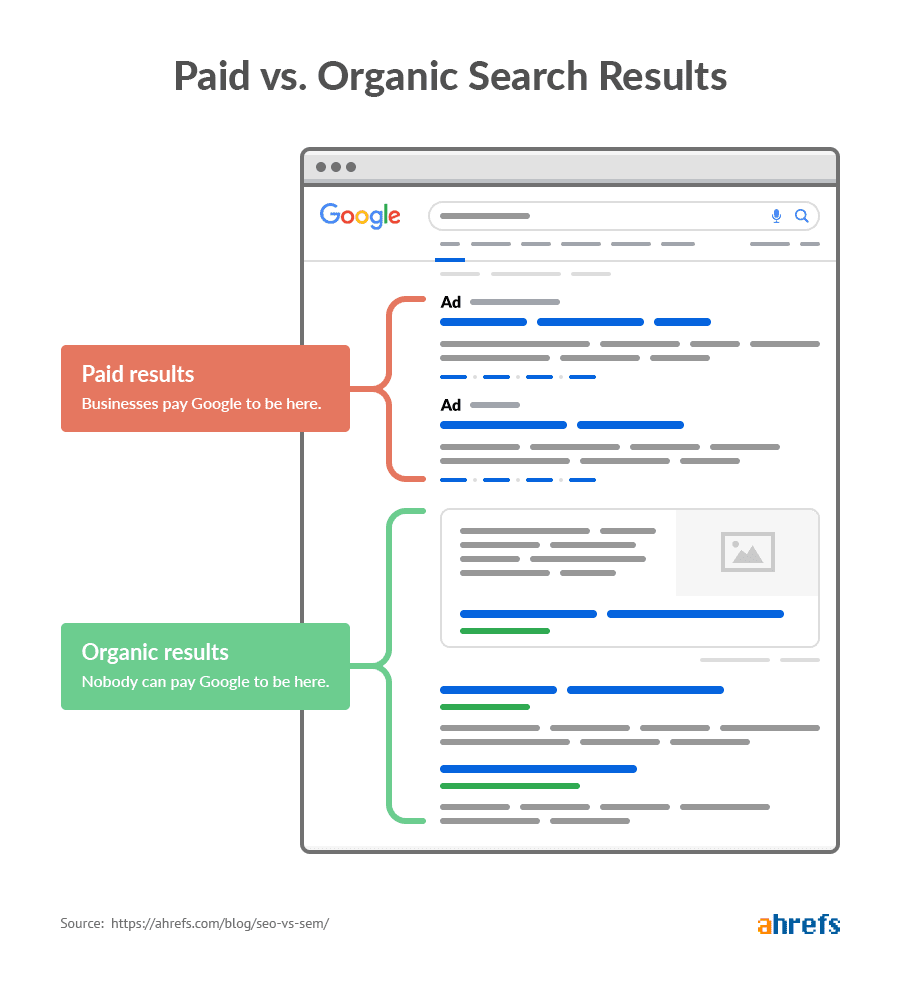

<br />

이때 **광고 검색 결과(Paid Search Result)** 의 경우, 해당 **검색엔진에 일정 비용을 지불함으로써 검색 결과 최상단에 사이트를 노출**시킬 수 있다는 장점이 있습니다. 그러나 **사용자 입장에서는 광고라는 인식으로 인해 거부감을 느낄 수 있어, 상대적으로 높은 접속률을 확보하지 못하는 경우도 존재**합니다.

반면 **자연 검색 결과(Organic Search Result)** 는 **사용자가 작성한 콘텐츠와의 연관성을 기반으로 검색엔진에 노출되며, 광고 검색 결과보다 더 높은 클릭률을 확보**할 가능성이 높습니다. 다만, 동일하거나 유사한 콘텐츠를 보유한 사이트가 매우 많기 때문에 각 검색엔진은 자체 크롤링 및 평가 기준을 통해 사이트별 점수를 산정하고, 이를 기반으로 노출 순위를 결정합니다. 따라서 **수집 및 평가 점수가 높지 않은 경우 사이트 노출 우선순위가 낮아져 사용자가 해당 사이트를 확보하지 못할 수도 있습니다.**

실제로 [**BACKLINKO**](https://backlinko.com/google-ctr-stats)에서 Google 검색 결과 약 **400만 건의 클릭률(CTR)을 분석한 통계**에 따르면, 아래 그림과 같이 **자연 검색 결과 1위 사이트의 전체 클릭률이 가장 높으며, 이후 순위부터는 클릭률이 급격히 감소**하는 경향을 확인할 수 있습니다.

<br />

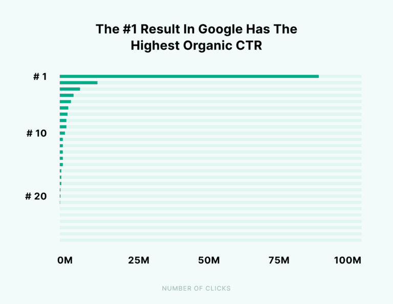

<br />

이처럼 광고에 대한 거부감을 유발하지 않으면서도 **자연 검색 결과 내 노출 우선순위를 높이기 위한 일련의 과정**을 **SEO(Search Engine Optimization)** 라고 합니다.

물론 **SEO를 통해 자연 검색 결과의 순위를 높이기 위해서**는 단순히 개발 영역을 넘어 **마케팅**, **브랜딩** 등 다양한 영역에 대한 이해도 함께 요구됩니다.

왜냐하면 SEO 최적화 과정에서 개발자는 **웹 렌더링 방식(CSR, SSR, SSG 등)에 따른 렌더링 기법 선택**, **HTML 문서의 메타데이터 구성**, **웹 표준 및 접근성 준수** 등과 같은 **기술적 영역을 중심**으로 **검색엔진이 페이지를 원활하게 크롤링하고 이해할 수 있도록 만드는 역할을 수행**하기 때문입니다.

즉 개발 영역에서도 SEO에 영향을 줄 수 있는 요소들을 개선할 수는 있지만, **검색 순위는 단순히 문서 구조나 메타데이터와 같은 기술적 요소만으로 결정되지 않습니다.** 동일하거나 유사한 서비스를 제공하는 **경쟁 사이트가 많을 경우**, 해당 사이트들이 **보유한 백링크 규모**, **브랜드 신뢰도**, **사용자 반응 지표**, **콘텐츠 품질** 등 **다양한 외부 요인들이 함께 반영되어 검색 결과 노출 순위에 영향을 미치게 됩니다.**

이로 인해, 본 문서에서는 **개발자 도구인 Lighthouse**의 **SEO 점수를 개선**하기 위해 **수행한 과정에 한정해 내용을 작성**했습니다.

<br />

## II. SEO를 위한 HTML 문서 메타데이터 작성

개발 영역에서 Lighthouse의 SEO 점수를 개선하기 위해 수행할 수 있는 **가장 기초적인 방법**은 **HTML 문서의 메타데이터 정보를 작성**하는 것입니다. 이는 **검색엔진 크롤러**가 **정보를 수집할 때 문서의 내용을 파악하는 데 도움을 주기 때문**입니다.

이로 인해, 먼저 **메타데이터 정보를 작성하지 않았을 경우**의 **Lighthouse SEO 점수**를 살펴보겠습니다.

<br />

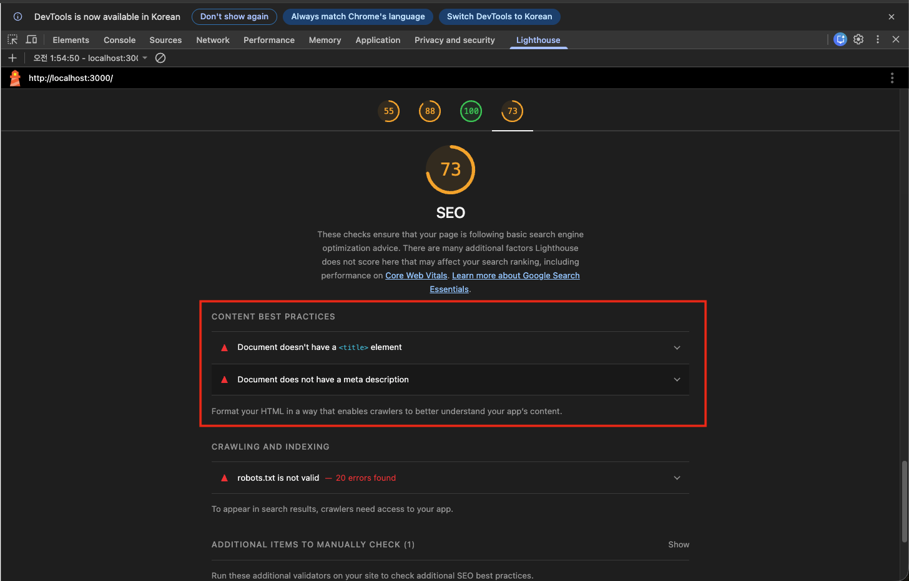

<br />

HTML 문서에 메타데이터 정보를 작성하지 않았을 경우 **Lighthouse SEO 점수가 73점으로 측정**되는 것을 확인할 수 있습니다.

또한 **Lighthouse를 이용하면 점수를 향상시키기 위한 힌트를 제공**하는데, 위 이미지의 빨간 블록으로 하이라이팅된 영역을 보면 **"Document doesn't have a `<title>` element"**, **"Document does not have a meta description"** 라고 표시된 것을 확인할 수 있습니다.

즉 **문서의 제목과 내용을 파악할 수 있는 메타데이터가 존재하지 않기 때문에** Lighthouse SEO 점수의 **감점 요인이 되었다는 것을 확인**할 수 있습니다. 이로 인해 **다음과 같이 HTML 문서의 제목과 메타데이터 정보를 추가한 후 점수를 다시 확인**해보겠습니다.

<br />

```html
<!doctype html>
<html lang="ko">
  <head>
    <!-- HTML 문서 메타데이터 정의 -->
    <title>JGW Clock</title>
    <meta name="description" content="JGW Clock은 iOS 시계 앱을 클론 코딩한 프로젝트로, 세계 시간, 알람, 타이머, 스톱워치 기능을 제공합니다." />
    <meta name="author" content="Jo Gye Won" />
    <meta name="keywords" content="시계, clock, Clock, ios, 세계 시계, world clock, World clock, 알람, alarm, Alarm, 타이머, timer, Timer, 스톱워치, stopwatch, Stopwatch, jgw, JGW, 조계원, Jo Gye Won, Gye Won Jo" />
  </head>
  <body>
    <div id="root"></div>
    <script type="module" src="/src/main.tsx"></script>
  </body>
</html>
```

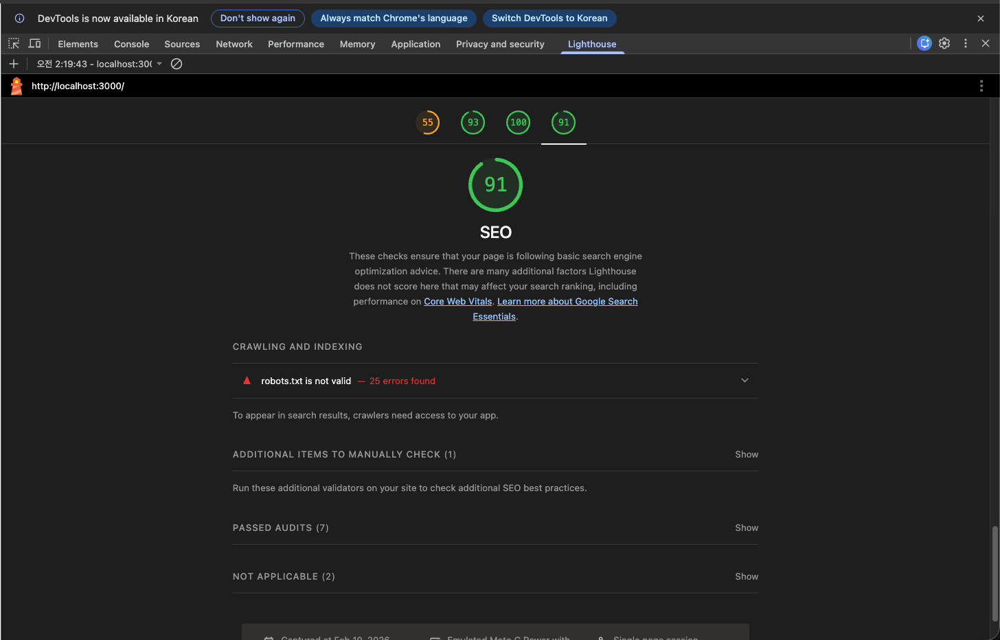

<br />

HTML 문서에 제목과 내용을 파악할 수 있는 메타데이터를 작성하면 **Lighthouse SEO 점수가 73점에서 91점으로 상승**하는 것을 확인할 수 있습니다. 즉 **검색엔진 크롤러**가 **정보를 수집할 때 문서의 내용을 파악할 수 있는 정보만 명시**하더라도 **Lighthouse SEO 점수가 크게 향상되는 것을 확인**할 수 있습니다.

그러면 이제 이전 결과에서는 표시되지 않았던 **오픈 그래프(Open Graph)** 와 **트위터 카드(Twitter Card)** 메타데이터 정보를 추가한 후, **Lighthouse SEO 점수 결과를 다시 살펴보겠습니다.**

<br />

```html
<!doctype html>
<html lang="ko">
  <head>
    <!-- HTML 문서 메타데이터 정의 -->
    
    <!-- Open Graph 메타데이터 정의 -->
    <meta property="og:type" content="website" />
    <meta property="og:title" content="JGW Clock" />
    <meta property="og:site_name" content="JGW Clock" />
    <meta property="og:description" content="JGW Clock은 iOS 시계 앱을 클론 코딩한 프로젝트로, 세계 시간, 알람, 타이머, 스톱워치 기능을 제공합니다." />
    <meta property="og:image" content="https://jgw-clock-app.vercel.app/thumbnail.jpg" />
    <meta property="og:url" content="https://jgw-clock-app.vercel.app/" />
    
    <!-- Twitter Card 메타데이터 정의 -->
    <meta name="twitter:card" content="summary_large_image" />
    <meta name="twitter:site" content="@jgw_vito" />
    <meta name="twitter:title" content="JGW Clock" />
    <meta name="twitter:description" content="JGW Clock은 iOS 시계 앱을 클론 코딩한 프로젝트로, 세계 시간, 알람, 타이머, 스톱워치 기능을 제공합니다." />
    <meta name="twitter:url" content="https://jgw-clock-app.vercel.app/" />
    <meta name="twitter:image" content="https://jgw-clock-app.vercel.app/thumbnail.jpg" />
  </head>
  <body>
    <div id="root"></div>
    <script type="module" src="/src/main.tsx"></script>
  </body>
</html>
```

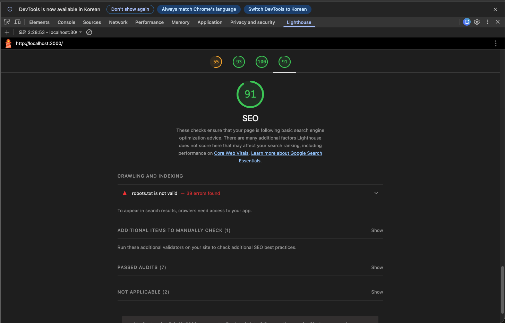

<br />

오픈 그래프(Open Graph)와 트위터 카드(Twitter Card) 메타데이터를 작성한 경우, **Lighthouse SEO 점수**가 **이전 결과와 동일하게 91점으로 유지**되는 것을 확인할 수 있습니다.

**이와 같은 결과가 나타나는 이유**는 오픈 그래프와 트위터 카드 메타데이터 정보가 **Lighthouse SEO 점수 산정 기준에 포함되는 항목이 아니기 때문**입니다. **오픈 그래프**는 문서의 내용을 검색엔진이 이해하기 위한 메타데이터라기보다, **SNS에 사이트를 공유할 때 단순 URL 형태가 아닌 카드 형태의 링크 미리보기를 제공하기 위한 메타데이터**이기 때문입니다.

그렇다면 왜 **많은 블로그 포스트에서 오픈 그래프와 트위터 카드 메타데이터 작성을 SEO와 연관 지어 설명**하는지에 대해 생각해볼 필요가 있습니다.

개인적인 관점에서는 앞서 [｢I. SEO(Search Engine Optimization)란?｣](#i-seosearch-engine-optimization란) 마지막 단락에서 설명한 것처럼, **검색 결과 노출 우선순위**는 **기술적 요소 외에도 다양한 외부 요인의 영향을 받기 때문**이라고 볼 수 있습니다.

그렇기 때문에 **결국에는 많은 사용자를 확보**해야 합니다. 그렇게 하기 위해서는 **다양한 백링크(외부 사이트에서 우리 서비스로 이동할 수 있는 링크)를 확보**하거나, **사용자의 클릭율(CTR)을 확보**해야 합니다.

하지만 **백링크**는 **사용자가 서비스를 이용하고 공유하는 과정에서 형성**되기 때문에 마케팅에 대한 전문 지식이 필요할 수 있습니다. 반면 **클릭율(CTR)을 확보**하기 위해서도 다양한 요인이 있겠지만, **결국 사용자가 "클릭하고 싶다"는 동기가 생겨야 합니다.**

예를 들어 **충분히 알려진 서비스가 아닌 경우**, 단순 URL만 공유되면 사이트에 대한 **신뢰 형성이 어렵고 보안 측면에서 경계심을 유발**할 수 있습니다. 반면 **카드 형태의 미리보기**는 **시각적 정보와 요약 정보를 함께 제공**하기 때문에 **사용자의 주목도를 높이는 데 도움**을 줄 수 있습니다.

<br />

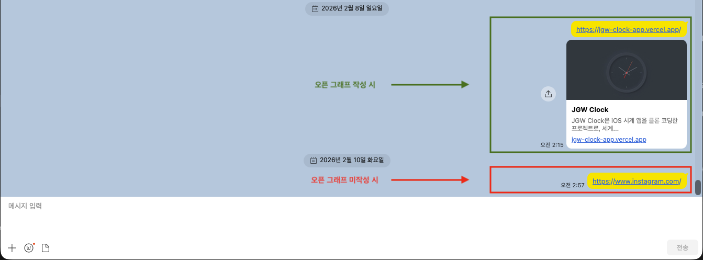

<br />

즉 **오픈 그래프(Open Graph) 또는 트위터 카드(Twitter Card) 적용 여부**는 Lighthouse SEO 점수 반영에는 영향이 없더라도 **링크 공유 시 사용자 주목도 및 클릭 유도 측면**에서 **긍정적인 영향을 줄 수 있기 때문에 Clock 프로젝트에서는 적용**하게 되었습니다.

<br />

## III. `robots.txt` 구성

앞서 [｢II. SEO를 위한 HTML 문서 메타데이터 작성｣](#ii-seo를-위한-html-문서-메타데이터-작성)에서 **HTML 문서의 제목 및 내용 메타데이터**와 카드 형태의 링크 미리보기를 제공하기 위한 **오픈 그래프 메타데이터**를 추가하여 **Lighthouse SEO 점수를 73점에서 91점으로 상승**시켰습니다.

그러면 Lighthouse SEO 점수를 **100점으로 올리기 위해 어떤 부분이 부족한지 확인하기 위해 Lighthouse 결과를 다시 측정**해보겠습니다.

<br />

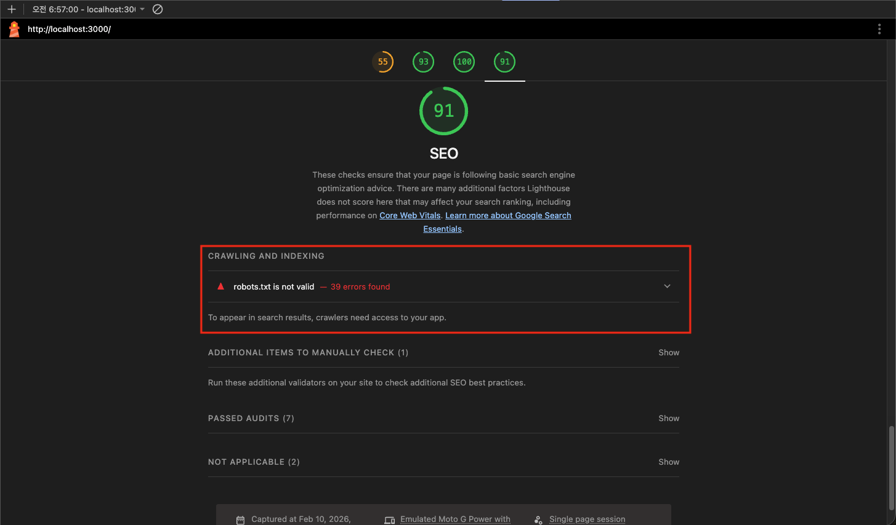

<br />

위 이미지의 빨간 블록으로 하이라이팅된 영역을 보면 **"robots.txt is not valid"** 라고 표시된 것을 확인할 수 있습니다.

즉 **`robots.txt` 파일이 존재하지 않기 때문에 Lighthouse SEO 점수의 감점 요인이 되었다는 것을 확인**할 수 있습니다. 그렇다면 `robots.txt` 파일을 추가해야 하는데, **해당 파일에 대한 개념을 먼저 살펴본 후 파일을 추가**해보겠습니다.

<br />


> `robots.txt`의 자세한 내용은 저의 노션 [SEO | robots.txt](https://gye-won.notion.site/robots-txt-30388bd9c3fa80849d59d9866faf250c?pvs=74)에서 확인할 수 있습니다.

<br />

**`robots.txt`** 는 **검색엔진 크롤러**가 **사이트 내 어떤 경로**를 **크롤링(수집)할 수 있는지, 또는 금지되는지를 정의**하는 파일입니다.

하지만 **`robots.txt` 파일이 없다면 검색엔진 크롤러가 정보를 수집하지 못해 Lighthouse SEO 점수가 떨어지는 것이라고 오해**할 수 있습니다. 실제 동작은 이와 반대로, **`robots.txt` 파일이 존재하지 않을 경우 검색엔진 크롤러는 별도의 수집 제어 정책이 없다고 판단**하여 **사이트 내 모든 경로를 수집 대상 범위에 포함**시키게 됩니다.

이로 인해 **프로젝트 규모가 커질수록 노출되면 안 되는 페이지나 핵심 페이지가 아닌 영역까지 수집 대상에 포함**될 수 있으며, 결과적으로 **크롤링 범위를 명확히 제어하기 어려워져 Lighthouse SEO 점수의 감정 요인이 되는 것**입니다.

그렇기 때문에 `robots.txt` 파일을 구성한 후 **Lighthouse SEO 점수를 다시 측정**해보면, 크롤링 제어 정책 부재로 인한 감점 요인이 해소되어 **100점으로 상승한 것을 확인**할 수 있습니다.

<br />

```
User-Agent: *
Allow: /
```

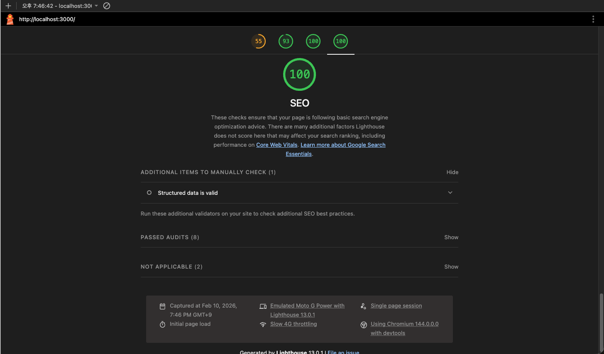

<br />

## IV. 검색 결과 노출을 위한 검색엔진 도구 선정 기준

Lighthouse SEO 점수를 100점으로 개선한 후, Vercel을 통해 배포를 진행했기 때문에 **최종적으로 Google과 Naver 검색엔진**에 **제가 만든 Clock 서비스를 노출**시키기 위해 **Google Search Console**과 **Naver Search Advisor**에 **사이트를 등록**해보겠습니다.

> 참고로 검색엔진 크롤러는 외부 링크, 내부 링크 구조 등 다양한 요인을 통해 URL의 존재를 인지할 수 있는 조건이 갖추어지면 이러한 검색엔진에 사이트를 직접 등록하징 않더라도 검색 결과에 노출될 수 있습니다. 다만 검색엔진에 직접 등록하는 경우, 해당 조건이 충분히 형성되지 않았더라도 사이트의 존재를 알릴 수 있기 때문에 검색 결과 노출이 목적이라면 등록하는 것이 좋습니다.

먼저 **Google Search Console**과 **Naver Search Advisor**에 **사이트를 등록하기 전**에, 수많은 검색엔진 중 이 **두 가지를 선택한 이유에 대해 설명**하겠습니다.

<br />

**① Google Search Console**

Google Search Console은 **Google 검색엔진**에 **사이트를 직접 등록하여 검색 결과에 노출될 수 있도록 관리**할 수 있는 서비스입니다.

즉 **Google 검색엔진**에 제가 만든 Clock 서비스의 URL 존재를 인지할 수 있는 조건이 충분히 형성되지 않더라도, **사이트 등록을 통해 검색 결과 노출 기회를 확보할 수 있다는 의미**입니다.

그렇다면 왜 **Google 검색 결과**에 Clock 서비스를 **노출시키려는지에 대한 이유를 살펴볼 필요가 있습니다.**

<br />

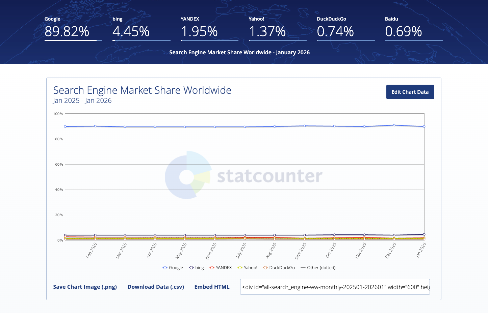

<br />

[StatCounter GlobalStats](https://gs.statcounter.com/search-engine-market-share)에 올라온 **2025년 1월 ~ 2026년 1월까지 전 세계 검색엔진 사용률 통계**를 확인해보면, **2026년 1월 기준 Google은 전 세계 검색엔진 사용률 중 약 89.82%를 차지**하는 것을 확인할 수 있습니다.

<br />

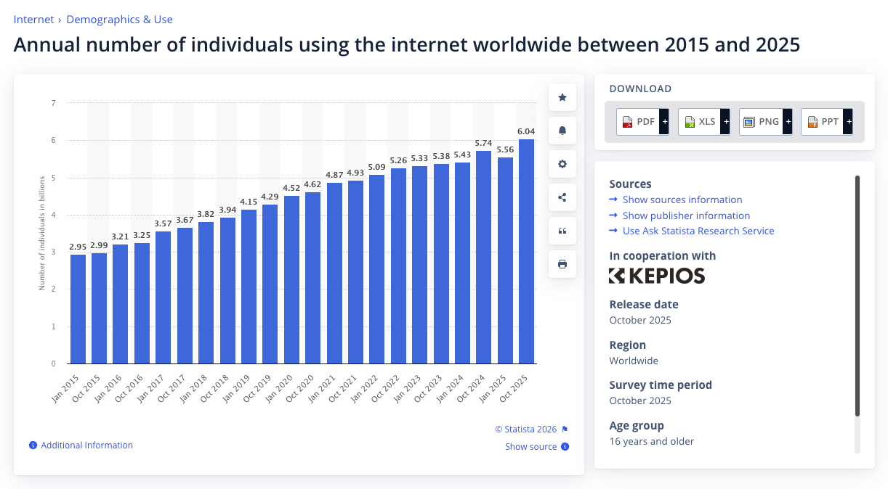

<br />

또한 [Statista](https://www.statista.com/statistics/1560762/global-internet-users-annual-number/#:~:text=Global%20annual%20number%20of%20internet%20users%202015%2D2025&text=As%20of%20October%202025%2C%20the%20number%20of,has%20steadily%20increased%20over%20the%20past%20decade.)의 **2015년 ~ 2025년 전 세계 인터넷 사용자 수 통계**를 보면, **2025년 기준 약 60억 명으로 전 세계 인구의 약 74% 수준에 달하는 것을 확인**할 수 있습니다.

<br />

즉 **전 세계 인구의 약 74%에 달하는 인터넷 사용자들이 가장 높은 점유율을 가진 검색엔진으로 Google을 사용**하고 있다는 것을 통계를 통해 파악할 수 있습니다. 이로 인해 Google 검색엔진에 서비스가 노출된다는 것은 Google을 사용하는 사용자들에게 잠재적으로 노출될 수 있음을 의미합니다.

그렇기 때문에 **개발한 서비스가 글로벌 시장을 목표**로 한다면, **Google 검색엔진에 노출시키는 과정은 중요한 요소**가 될 수 있습니다.

다만 **Clock 서비스**는 **별도의 수익 창출이나 실제 운영을 목적으로 하는 서비스는 아니지만,** Google Search Console을 이용해 **검색엔진 노출 과정을 경험해보는 것 자체가 개발자로서 하나의 경험이 될 수 있다고 판단하여 등록을 진행**했습니다.

<br />

**② Naver Search Advisor**

Naver Search Advisor은 **Naver 검색엔진**에 **사이트를 직접 등록하여 검색 결과에 노출될 수 있도록 관리**할 수 있는 서비스입니다.

즉 **Naver 검색엔진**에 제가 만든 Clock 서비스의 URL 존재를 인지할 수 있는 조건이 충분히 형성되지 않더라도, **사이트 등록을 통해 검색 결과 노출 기회를 확보할 수 있다는 의미**입니다.

그렇다면 왜 **Naver 검색 결과**에 Clock 서비스를 **노출시키려는지에 대한 이유를 살펴볼 필요가 있습니다.**

<br />

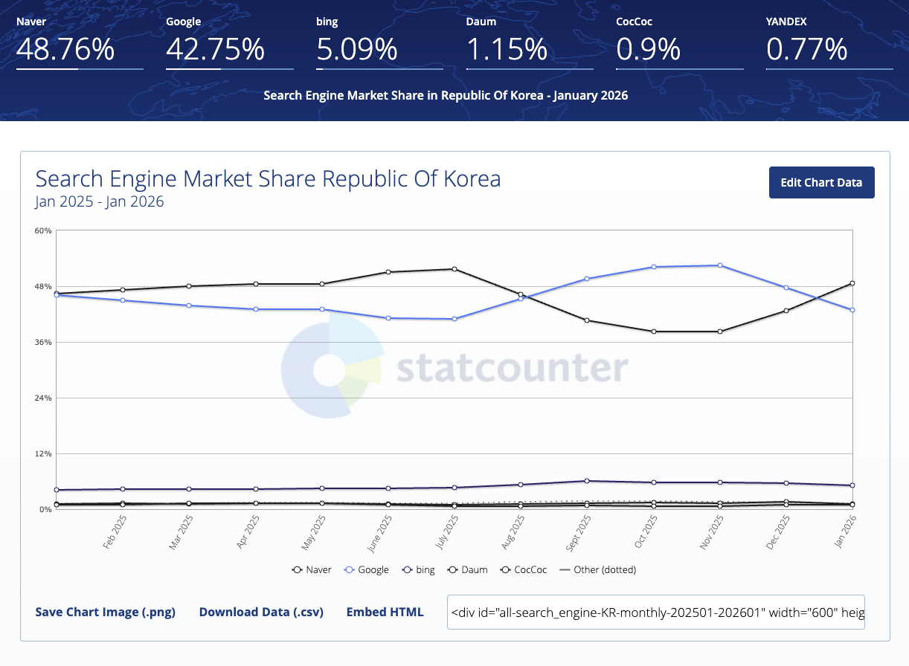

<br />

[StatCounter GlobalStats](https://gs.statcounter.com/search-engine-market-share/all/south-korea)에 올라온 **2025년 1월 ~ 2026년 1월까지 대한민국 검색엔진 사용률 통계**를 확인해보면, **2026년 1월 기준 Naver는 대한민국 검색엔진 사용률 중 약 48.76%를 차지**하는 것을 확인할 수 있습니다.

반면 **Google은 약 42.75%를 차지**하는 것을 확인할 수 있습니다. 즉 **대한민국에서는 검색엔진 사용률이 Naver와 Google이 거의 비슷**하지만, **Naver를 사용하는 사용자 수가 소폭 더 많다는 것을 확인**할 수 있습니다.

그렇기 때문에 **개발한 서비스가 대한민국 시장을 목표**로 한다면, **Google과 Naver 두 검색엔진에 노출시키는 과정은 중요한 요소**가 될 수 있습니다.

다만 **Clock 서비스**는 **별도의 수익 창출이나 실제 운영을 목적으로 하는 서비스는 아니지만,** Naver Search Advisor를 이용해 **검색엔진 노출 과정을 경험해보는 것 자체가 개발자로서 하나의 경험이 될 수 있다고 판단하여 등록을 진행**했습니다.

<br />

## V. Google Search Console 및 Naver Search Advisor 사이트 등록