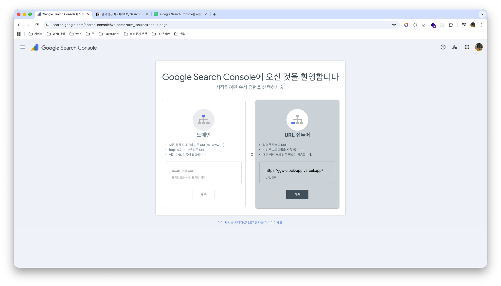
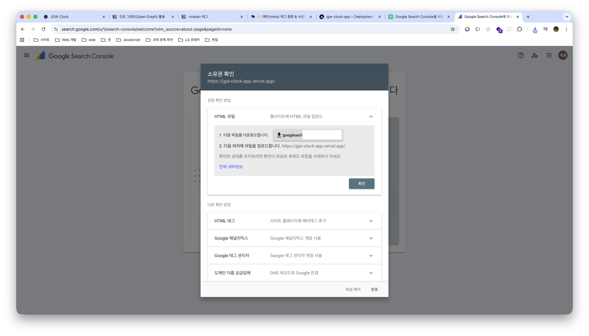
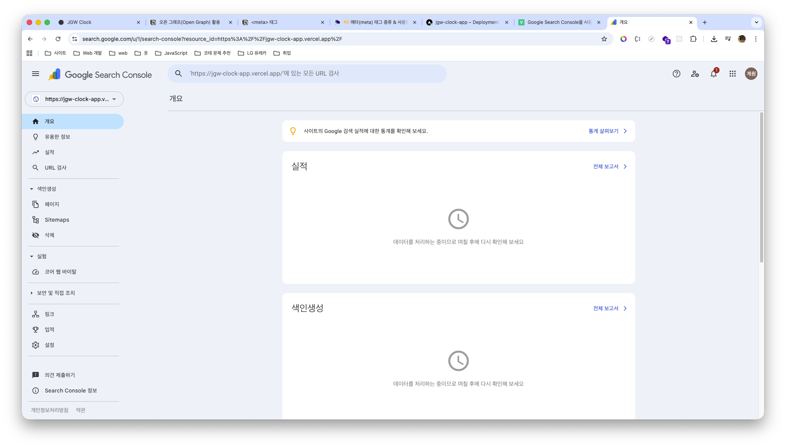
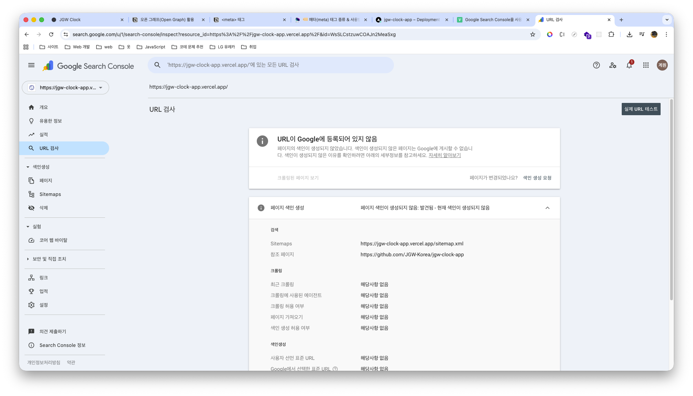
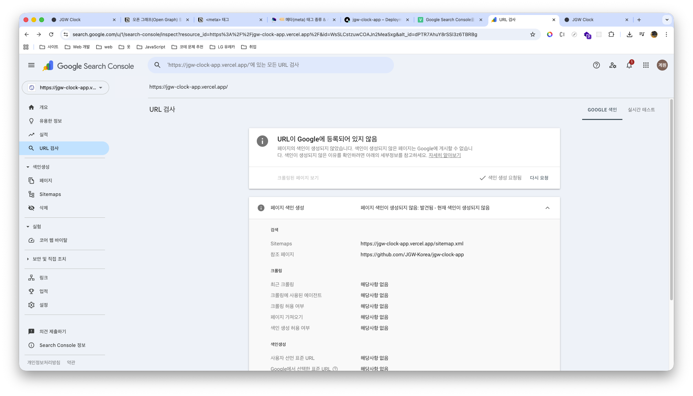
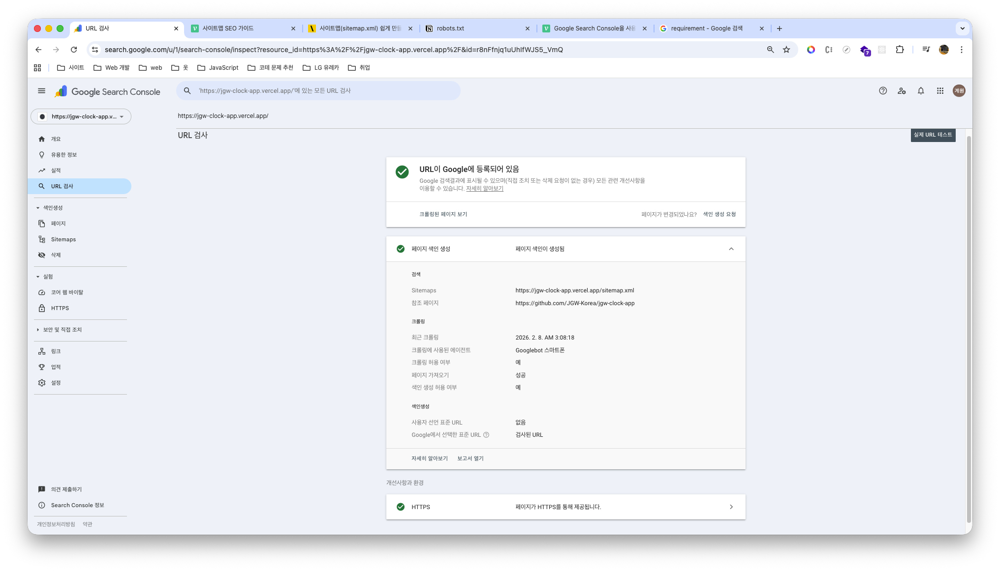
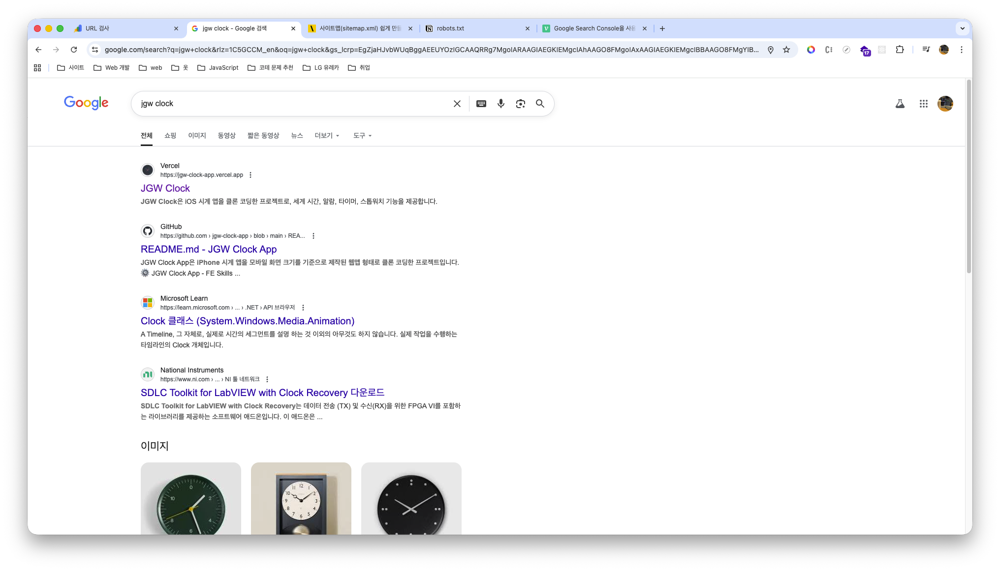

> ☝️ 이 문서는 Clock 서비스의 SEO(Search Engine Optimization) 위해 HTML 문서의 메타데이터 정의하고, Google Search Console 및 Naver Search Advisor에 등록한 과정을 정리한 문서입니다.

<br />

## I. SEO(Search Engine Optimization)란?

Google, Bing, 네이버 등의 검색엔진에서 특정 사이트를 검색할 경우, 검색 결과(Search Result)는 **광고 검색 결과(Paid Search Result)** 와 **자연 검색 결과(Organic Search Result)** 두 가지로 구분됩니다.

<br />


<br />

이때 **광고 검색 결과(Paid Search Result)** 의 경우, 해당 **검색엔진에 일정 비용을 지불함으로써 검색 결과 최상단에 사이트를 노출**시킬 수 있다는 장점이 있습니다. 그러나 **사용자 입장에서는 광고라는 인식으로 인해 거부감을 느낄 수 있어, 상대적으로 높은 접속률을 확보하지 못하는 경우도 존재**합니다.

반면 **자연 검색 결과(Organic Search Result)** 는 **사용자가 작성한 콘텐츠와의 연관성을 기반으로 검색엔진에 노출되며, 광고 검색 결과보다 더 높은 클릭률을 확보**할 가능성이 높습니다. 다만, 동일하거나 유사한 콘텐츠를 보유한 사이트가 매우 많기 때문에 각 검색엔진은 자체 크롤링 및 평가 기준을 통해 사이트별 점수를 산정하고, 이를 기반으로 노출 순위를 결정합니다. 따라서 **수집 및 평가 점수가 높지 않은 경우 사이트 노출 우선순위가 낮아져 사용자가 해당 사이트를 확보하지 못할 수도 있습니다.**

실제로 [**BACKLINKO**](https://backlinko.com/google-ctr-stats)에서 Google 검색 결과 약 **400만 건의 클릭률(CTR)을 분석한 통계**에 따르면, 아래 그림과 같이 **자연 검색 결과 1위 사이트의 전체 클릭률이 가장 높으며, 이후 순위부터는 클릭률이 급격히 감소**하는 경향을 확인할 수 있습니다.

<br />


<br />

이처럼 광고에 대한 거부감을 유발하지 않으면서도 **자연 검색 결과 내 노출 우선순위를 높이기 위한 일련의 과정**을 **SEO(Search Engine Optimization)** 라고 합니다.

물론 **SEO를 통해 자연 검색 결과의 순위를 높이기 위해서**는 단순히 개발 영역을 넘어 **마케팅**, **브랜딩** 등 다양한 영역에 대한 이해도 함께 요구됩니다.

왜냐하면 SEO 최적화 과정에서 개발자는 **웹 렌더링 방식(CSR, SSR, SSG 등)에 따른 렌더링 기법 선택**, **HTML 문서의 메타데이터 구성**, **웹 표준 및 접근성 준수** 등과 같은 **기술적 영역을 중심**으로 **검색엔진이 페이지를 원활하게 크롤링하고 이해할 수 있도록 만드는 역할을 수행**하기 때문입니다.

즉 개발 영역에서도 SEO에 영향을 줄 수 있는 요소들을 개선할 수는 있지만, **검색 순위는 단순히 문서 구조나 메타데이터와 같은 기술적 요소만으로 결정되지 않습니다.** 동일하거나 유사한 서비스를 제공하는 **경쟁 사이트가 많을 경우**, 해당 사이트들이 **보유한 백링크 규모**, **브랜드 신뢰도**, **사용자 반응 지표**, **콘텐츠 품질** 등 **다양한 외부 요인들이 함께 반영되어 검색 결과 노출 순위에 영향을 미치게 됩니다.**

이로 인해, 본 문서에서는 **개발자 도구인 Lighthouse**의 **SEO 점수를 개선**하기 위해 **수행한 과정에 한정해 내용을 작성**했습니다.

<br />

## II. SEO를 위한 HTML 문서 메타데이터 작성

개발 영역에서 Lighthouse의 SEO 점수를 개선하기 위해 수행할 수 있는 **가장 기초적인 방법**은 **HTML 문서의 메타데이터 정보를 작성**하는 것입니다. 이는 **검색엔진 크롤러**가 **정보를 수집할 때 문서의 내용을 파악하는 데 도움을 주기 때문**입니다.

이로 인해, 먼저 **메타데이터 정보를 작성하지 않았을 경우**의 **Lighthouse SEO 점수**를 살펴보겠습니다.

<br />


<br />

HTML 문서에 메타데이터 정보를 작성하지 않았을 경우 **Lighthouse SEO 점수가 73점으로 측정**되는 것을 확인할 수 있습니다.

또한 **Lighthouse를 이용하면 점수를 향상시키기 위한 힌트를 제공**하는데, 위 이미지의 빨간 블록으로 하이라이팅된 영역을 보면 **"Document doesn't have a `<title>` element"**, **"Document does not have a meta description"** 라고 표시된 것을 확인할 수 있습니다.

즉 **문서의 제목과 내용을 파악할 수 있는 메타데이터가 존재하지 않기 때문에** Lighthouse SEO 점수의 **감점 요인이 되었다는 것을 확인**할 수 있습니다. 이로 인해 **다음과 같이 HTML 문서의 제목과 메타데이터 정보를 추가한 후 점수를 다시 확인**해보겠습니다.

<br />

```html
<!doctype html>
<html lang="ko">
  <head>
    <!-- HTML 문서 메타데이터 정의 -->
    <title>JGW Clock</title>
    <meta name="description" content="JGW Clock은 iOS 시계 앱을 클론 코딩한 프로젝트로, 세계 시간, 알람, 타이머, 스톱워치 기능을 제공합니다." />
    <meta name="author" content="Jo Gye Won" />
    <meta name="keywords" content="시계, clock, Clock, ios, 세계 시계, world clock, World clock, 알람, alarm, Alarm, 타이머, timer, Timer, 스톱워치, stopwatch, Stopwatch, jgw, JGW, 조계원, Jo Gye Won, Gye Won Jo" />
  </head>
  <body>
    <div id="root"></div>
    <script type="module" src="/src/main.tsx"></script>
  </body>
</html>
```


<br />

HTML 문서에 제목과 내용을 파악할 수 있는 메타데이터를 작성하면 **Lighthouse SEO 점수가 73점에서 91점으로 상승**하는 것을 확인할 수 있습니다. 즉 **검색엔진 크롤러**가 **정보를 수집할 때 문서의 내용을 파악할 수 있는 정보만 명시**하더라도 **Lighthouse SEO 점수가 크게 향상되는 것을 확인**할 수 있습니다.

그러면 이제 이전 결과에서는 표시되지 않았던 **오픈 그래프(Open Graph)** 와 **트위터 카드(Twitter Card)** 메타데이터 정보를 추가한 후, **Lighthouse SEO 점수 결과를 다시 살펴보겠습니다.**

<br />

```html
<!doctype html>
<html lang="ko">
  <head>
    <!-- HTML 문서 메타데이터 정의 -->
    
    <!-- Open Graph 메타데이터 정의 -->
    <meta property="og:type" content="website" />
    <meta property="og:title" content="JGW Clock" />
    <meta property="og:site_name" content="JGW Clock" />
    <meta property="og:description" content="JGW Clock은 iOS 시계 앱을 클론 코딩한 프로젝트로, 세계 시간, 알람, 타이머, 스톱워치 기능을 제공합니다." />
    <meta property="og:image" content="https://jgw-clock-app.vercel.app/thumbnail.jpg" />
    <meta property="og:url" content="https://jgw-clock-app.vercel.app/" />
    
    <!-- Twitter Card 메타데이터 정의 -->
    <meta name="twitter:card" content="summary_large_image" />
    <meta name="twitter:site" content="@jgw_vito" />
    <meta name="twitter:title" content="JGW Clock" />
    <meta name="twitter:description" content="JGW Clock은 iOS 시계 앱을 클론 코딩한 프로젝트로, 세계 시간, 알람, 타이머, 스톱워치 기능을 제공합니다." />
    <meta name="twitter:url" content="https://jgw-clock-app.vercel.app/" />
    <meta name="twitter:image" content="https://jgw-clock-app.vercel.app/thumbnail.jpg" />
  </head>
  <body>
    <div id="root"></div>
    <script type="module" src="/src/main.tsx"></script>
  </body>
</html>
```


<br />

오픈 그래프(Open Graph)와 트위터 카드(Twitter Card) 메타데이터를 작성한 경우, **Lighthouse SEO 점수**가 **이전 결과와 동일하게 91점으로 유지**되는 것을 확인할 수 있습니다.

**이와 같은 결과가 나타나는 이유**는 오픈 그래프와 트위터 카드 메타데이터 정보가 **Lighthouse SEO 점수 산정 기준에 포함되는 항목이 아니기 때문**입니다. **오픈 그래프**는 문서의 내용을 검색엔진이 이해하기 위한 메타데이터라기보다, **SNS에 사이트를 공유할 때 단순 URL 형태가 아닌 카드 형태의 링크 미리보기를 제공하기 위한 메타데이터**이기 때문입니다.

그렇다면 왜 **많은 블로그 포스트에서 오픈 그래프와 트위터 카드 메타데이터 작성을 SEO와 연관 지어 설명**하는지에 대해 생각해볼 필요가 있습니다.

개인적인 관점에서는 앞서 [｢I. SEO(Search Engine Optimization)란?｣](#i-seosearch-engine-optimization란) 마지막 단락에서 설명한 것처럼, **검색 결과 노출 우선순위**는 **기술적 요소 외에도 다양한 외부 요인의 영향을 받기 때문**이라고 볼 수 있습니다.

그렇기 때문에 **결국에는 많은 사용자를 확보**해야 합니다. 그렇게 하기 위해서는 **다양한 백링크(외부 사이트에서 우리 서비스로 이동할 수 있는 링크)를 확보**하거나, **사용자의 클릭율(CTR)을 확보**해야 합니다.

하지만 **백링크**는 **사용자가 서비스를 이용하고 공유하는 과정에서 형성**되기 때문에 마케팅에 대한 전문 지식이 필요할 수 있습니다. 반면 **클릭율(CTR)을 확보**하기 위해서도 다양한 요인이 있겠지만, **결국 사용자가 "클릭하고 싶다"는 동기가 생겨야 합니다.**

예를 들어 **충분히 알려진 서비스가 아닌 경우**, 단순 URL만 공유되면 사이트에 대한 **신뢰 형성이 어렵고 보안 측면에서 경계심을 유발**할 수 있습니다. 반면 **카드 형태의 미리보기**는 **시각적 정보와 요약 정보를 함께 제공**하기 때문에 **사용자의 주목도를 높이는 데 도움**을 줄 수 있습니다.

<br />


<br />

즉 **오픈 그래프(Open Graph) 또는 트위터 카드(Twitter Card) 적용 여부**는 Lighthouse SEO 점수 반영에는 영향이 없더라도 **링크 공유 시 사용자 주목도 및 클릭 유도 측면**에서 **긍정적인 영향을 줄 수 있기 때문에 Clock 프로젝트에서는 적용**하게 되었습니다.

<br />

## III. `robots.txt` 구성

앞서 [｢II. SEO를 위한 HTML 문서 메타데이터 작성｣](#ii-seo를-위한-html-문서-메타데이터-작성)에서 **HTML 문서의 제목 및 내용 메타데이터**와 카드 형태의 링크 미리보기를 제공하기 위한 **오픈 그래프 메타데이터**를 추가하여 **Lighthouse SEO 점수를 73점에서 91점으로 상승**시켰습니다.

그러면 Lighthouse SEO 점수를 **100점으로 올리기 위해 어떤 부분이 부족한지 확인하기 위해 Lighthouse 결과를 다시 측정**해보겠습니다.

<br />


<br />

위 이미지의 빨간 블록으로 하이라이팅된 영역을 보면 **"robots.txt is not valid"** 라고 표시된 것을 확인할 수 있습니다.

즉 **`robots.txt` 파일이 존재하지 않기 때문에 Lighthouse SEO 점수의 감점 요인이 되었다는 것을 확인**할 수 있습니다. 그렇다면 `robots.txt` 파일을 추가해야 하는데, **해당 파일에 대한 개념을 먼저 살펴본 후 파일을 추가**해보겠습니다.

<br />


> `robots.txt`의 자세한 내용은 저의 노션 [｢SEO | robots.txt｣](https://gye-won.notion.site/robots-txt-30388bd9c3fa80849d59d9866faf250c?pvs=74)에서 확인할 수 있습니다.

<br />

**`robots.txt`** 는 **검색엔진 크롤러**가 **사이트 내 어떤 경로**를 **크롤링(수집)할 수 있는지, 또는 금지되는지를 정의**하는 파일입니다.

하지만 **`robots.txt` 파일이 없다면 검색엔진 크롤러가 정보를 수집하지 못해 Lighthouse SEO 점수가 떨어지는 것이라고 오해**할 수 있습니다. 실제 동작은 이와 반대로, **`robots.txt` 파일이 존재하지 않을 경우 검색엔진 크롤러는 별도의 수집 제어 정책이 없다고 판단**하여 **사이트 내 모든 경로를 수집 대상 범위에 포함**시키게 됩니다.

이로 인해 **프로젝트 규모가 커질수록 노출되면 안 되는 페이지나 핵심 페이지가 아닌 영역까지 수집 대상에 포함**될 수 있으며, 결과적으로 **크롤링 범위를 명확히 제어하기 어려워져 Lighthouse SEO 점수의 감정 요인이 되는 것**입니다.

그렇기 때문에 `robots.txt` 파일을 구성한 후 **Lighthouse SEO 점수를 다시 측정**해보면, 크롤링 제어 정책 부재로 인한 감점 요인이 해소되어 **100점으로 상승한 것을 확인**할 수 있습니다.

<br />

```
User-Agent: *
Allow: /
```


<br />

## IV. 검색 결과 노출을 위한 검색엔진 도구 선정 기준

Lighthouse SEO 점수를 100점으로 개선한 후, Vercel을 통해 배포를 진행했기 때문에 **최종적으로 Google과 Naver 검색엔진**에 **제가 만든 Clock 서비스를 노출**시키기 위해 **Google Search Console**과 **Naver Search Advisor**에 **사이트를 등록하기에 앞서,** 수많은 검색엔진 중 이 **두 가지를 선택한 이유**에 대해 설명하겠습니다.

> 참고로 검색엔진 크롤러는 외부 링크, 내부 링크 구조 등 다양한 요인을 통해 URL의 존재를 인지할 수 있는 조건이 갖추어지면 이러한 검색엔진에 사이트를 직접 등록하징 않더라도 검색 결과에 노출될 수 있습니다. 다만 검색엔진에 직접 등록하는 경우, 해당 조건이 충분히 형성되지 않았더라도 사이트의 존재를 알릴 수 있기 때문에 검색 결과 노출이 목적이라면 등록하는 것이 좋습니다.

<br />

**① Google Search Console**

Google Search Console은 **Google 검색엔진**에 **사이트를 직접 등록하여 검색 결과에 노출될 수 있도록 관리**할 수 있는 서비스입니다.

즉 **Google 검색엔진**에 제가 만든 Clock 서비스의 URL 존재를 인지할 수 있는 조건이 충분히 형성되지 않더라도, **사이트 등록을 통해 검색 결과 노출 기회를 확보할 수 있다는 의미**입니다.

그렇다면 왜 **Google 검색 결과**에 Clock 서비스를 **노출시키려는지에 대한 이유를 살펴볼 필요가 있습니다.**

<br />


<br />

[StatCounter GlobalStats](https://gs.statcounter.com/search-engine-market-share)에 올라온 **2025년 1월 ~ 2026년 1월까지 전 세계 검색엔진 사용률 통계**를 확인해보면, **2026년 1월 기준 Google은 전 세계 검색엔진 사용률 중 약 89.82%를 차지**하는 것을 확인할 수 있습니다.

<br />


<br />

또한 [Statista](https://www.statista.com/statistics/1560762/global-internet-users-annual-number/#:~:text=Global%20annual%20number%20of%20internet%20users%202015%2D2025&text=As%20of%20October%202025%2C%20the%20number%20of,has%20steadily%20increased%20over%20the%20past%20decade.)의 **2015년 ~ 2025년 전 세계 인터넷 사용자 수 통계**를 보면, **2025년 기준 약 60억 명으로 전 세계 인구의 약 74% 수준에 달하는 것을 확인**할 수 있습니다.

즉 **전 세계 인구의 약 74%에 달하는 인터넷 사용자들이 가장 높은 점유율을 가진 검색엔진으로 Google을 사용**하고 있다는 것을 통계를 통해 파악할 수 있습니다. 이로 인해 Google 검색엔진에 서비스가 노출된다는 것은 Google을 사용하는 사용자들에게 잠재적으로 노출될 수 있음을 의미합니다.

그렇기 때문에 **개발한 서비스가 글로벌 시장을 목표**로 한다면, **Google 검색엔진에 노출시키는 과정은 중요한 요소**가 될 수 있습니다.

다만 **Clock 서비스**는 **별도의 수익 창출이나 실제 운영을 목적으로 하는 서비스는 아니지만,** Google Search Console을 이용해 **검색엔진 노출 과정을 경험해보는 것 자체가 개발자로서 하나의 경험이 될 수 있다고 판단하여 등록을 진행**했습니다.

<br />

**② Naver Search Advisor**

Naver Search Advisor은 **Naver 검색엔진**에 **사이트를 직접 등록하여 검색 결과에 노출될 수 있도록 관리**할 수 있는 서비스입니다.

즉 **Naver 검색엔진**에 제가 만든 Clock 서비스의 URL 존재를 인지할 수 있는 조건이 충분히 형성되지 않더라도, **사이트 등록을 통해 검색 결과 노출 기회를 확보할 수 있다는 의미**입니다.

그렇다면 왜 **Naver 검색 결과**에 Clock 서비스를 **노출시키려는지에 대한 이유를 살펴볼 필요가 있습니다.**

<br />


<br />

[StatCounter GlobalStats](https://gs.statcounter.com/search-engine-market-share/all/south-korea)에 올라온 **2025년 1월 ~ 2026년 1월까지 대한민국 검색엔진 사용률 통계**를 확인해보면, **2026년 1월 기준 Naver는 대한민국 검색엔진 사용률 중 약 48.76%를 차지**하는 것을 확인할 수 있습니다.

반면 **Google은 약 42.75%를 차지**하는 것을 확인할 수 있습니다. 즉 **대한민국에서는 검색엔진 사용률이 Naver와 Google이 거의 비슷**하지만, **Naver를 사용하는 사용자 수가 소폭 더 많다는 것을 확인**할 수 있습니다.

그렇기 때문에 **개발한 서비스가 대한민국 시장을 목표**로 한다면, **Google과 Naver 두 검색엔진에 노출시키는 과정은 중요한 요소**가 될 수 있습니다.

다만 **Clock 서비스**는 **별도의 수익 창출이나 실제 운영을 목적으로 하는 서비스는 아니지만,** Naver Search Advisor를 이용해 **검색엔진 노출 과정을 경험해보는 것 자체가 개발자로서 하나의 경험이 될 수 있다고 판단하여 등록을 진행**했습니다.

<br />

## V. Google Search Console 및 Naver Search Advisor 사이트 등록

앞서 [｢IV. 검색 결과 노출을 위한 검색엔진 도구 선정 기준｣](#iv-검색-결과-노출을-위한-검색엔진-도구-선정-기준)에서 Clock 서비스를 노출시키기 위해 **Google Search Console**과 **Naver Search Advisor**를 **선정한 이유를 설명**했습니다.

다만 두 검색엔진에 **사이트를 등록하는 과정은 전반적으로 유사**하기 때문에, 본 문서에서는 **Google Search Console을 기준**으로 **사이트 등록 과정을 설명**하겠습니다.

<br />

**① Google Seacrh Console 사이트 접속**

먼저 Google Search Console에 사이트를 등록하기 위해 **해당 [사이트](https://search.google.com/search-console/welcome?utm_source=about-page)에 접속**해야 합니다.

<br />



<br />

Google Search Console 사이트에 접속하면 등록할 서비스를 **"도메인"** 또는 **"URL 접두어"** 유형 중 어떤 방식으로 등록할지 선택할 수 있습니다.

여기서 **"도메인" 유형은 별도의 도메인을 보유하고 있으며, DNS 레코드 설정을 통해 도메인 소유권 인증이 가능한 경우 선택**하는 속성입니다. 반면 **"URL 접두어" 유형은 특정 URL 경로 단위로 속성을 등록하는 방식**입니다. Clock 프로젝트의 경우 **별도의 도메인을 보유하고 있지 않고 Vercel에서 배포할 도메인을 사용**하고 있기 때문에 **"URL 접두어" 유형을 통해 사이트를 등록**해보겠습니다.

<br />

**② 인증 확인 후 서비스 소유권 확인**

Google Search Console에 사이트를 등록하기 위한 유형을 선택하면, **해당 경로의 대한 인증 절차를 진행**하게 됩니다. 이후 인증이 완료되면 **등록하려는 사이트**의 **실제 소유자인지를 검증하기 위해 소유권 확인 절차를 거치야 합니다.**

<br />



<br />

소유권 확인 절차는 **"HTML 파일 업로드"**, **"HTML 메타 태그 추가"** 등 여러 방법이 있지만, 저는 **권장 확인 방법인 "HTML 파일 업로드" 방식을 사용**했습니다. **제공된 인증 파일을 다운로드한 후 `public` 디렉토리에 위치시키고 재배포를 진행**했습니다.

이후 **해당 파일이 정상적으로 배포되었다면 `https://example.com/googlexxxxxxxx.html` 경로로 접속했을 때 인증 코드가 표시**됩니다. 이는 **소유권 확인을 위한 파일이 정상 등록**되었음을 의미하며, 이후 **"확인" 버튼을 눌러 소유권 인증을 완료**하면 됩니다.

소유권 인증이 완료되면 **"속성으로 이동"** 버튼을 눌러 Google Search Console에 등록한 서비스 속성 화면으로 이동하면 됩니다.

<br />



<br />

**③ 사이트맵(Sitemap) 추가**

모든 인증 절차가 완료된 이후에는 Google 검색엔진 크롤러가 제가 만든 Clock 서비스를 수집할 수 있도록 색인(Indexing)을 생성해야 합니다. 다만 **색인을 생성하기에 앞서 서비스 페이지의 전체 구조를 전달**하기 위한 **사이트맵(Sitemap)을 먼저 추가**하겠습니다.

<br />

> 사이트맵(Sitemap)의 자세한 내용은 저의 노션 [｢SEO | 사이트맵(Sitemap)｣](https://gye-won.notion.site/sitemap-30388bd9c3fa8029932bea8020a81851?pvs=74)에서 확인할 수 있습니다.

<br />

Google Search Console에 사이트맵(Sitemap)을 추가하기 위해 먼저 **`sitemap.xml` 파일에 Clock 서비스의 전체 페이지 구조를 XML 형식으로 계층적으로 구성한 뒤 `public` 디렉토리에 위치**시켰습니다. **이후 기존에 생성한 `robots.txt` 파일에 사이트맵 파일의 위치를 명시하여 크롤러가 수집 과정에서 사이트맵 경로를 인지할 수 있도록 수정**한 후 **재배포를 진행**했습니다.

<br />

```xml
<?xml version="1.0" encoding="UTF-8"?>
<urlset xmlns="http://www.sitemaps.org/schemas/sitemap/0.9">
  <url>
    <loc>https://jgw-clock-app.vercel.app/</loc>
    <lastmod>2026-02-08</lastmod>
    <changefreq>monthly</changefreq>
    <priority>1.0</priority>
  </url>
  <url>
    <loc>https://jgw-clock-app.vercel.app/alarm</loc>
    <priority>0.8</priority>
  </url>
  <url>
    <loc>https://jgw-clock-app.vercel.app/stopwatch</loc>
    <priority>0.8</priority>
  </url>
  <url>
    <loc>https://jgw-clock-app.vercel.app/timer</loc>
    <priority>0.8</priority>
  </url>
</urlset>
```

```
User-Agent: *
Allow: /

# 사이트맵 파일 위치 추가
Sitemap: https://jgw-clock-app.vercel.app/sitemap.xml
```

<br />

이후 해당 파일이 정상적으로 배포되었다면 **`https://example.com/sitemap.xml` 경로로 접속했을 때 XML 구조가 표시**됩니다. 이후 Google Search Console에 등록한 서비스 속성 화면에 접속한 뒤 **Sitemaps 페이지로 이동**하여 **Clock 서비스에 포함된 사이트맵을 제출**했습니다.

<br />


<br />

**④ Google Search Console 색인(Indexing) 생성**

이제 **Google Search Console 색인을 생성하기 위한 모든 작업이 완료**되었기 때문에 **색인 생성을 요청**하기 위해 Google Search Console에 등록한 서비스 속성 화면에 접속한 뒤 **"URL 검사 메뉴"로 이동**하겠습니다.

<br />



<br />

`https://jgw-clock-app.vercel.app/` URL 검사 결과를 보면 **"URL이 Google에 등록되어 있지 않음" 문구를 확인**할 수 있습니다. 그렇다면 **"색인 생성 요청"을 진행하기에 앞서 "실제 URL 테스트"를 통해 해당 URL이 Google에 등록 가능한 상태인지 먼저 확인**해보겠습니다.

<br />


<br />

위 결과를 보면 "실제 URL 테스트"를 통해 **Clock 서비스의 URL이 정상적으로 등록 가능한 상태**임을 확인할 수 있습니다. **이제 실제로 "색인 생성 요청"을 진행**하겠습니다.

<br />



<br />

**색인 생성을 요청하면 "색인 생성 요청됨"이라는 결과가 표시**됩니다. 이후 **일정 시간이 지나면 페이지 색인이 생성**되며, Google에 **"JGW Clock"을 검색했을 때 최종적으로 서비스가 검색 결과에 노출**되는 것을 확인할 수 있습니다.

<br />





<br />

## 번외. 프로젝트 구조 특성상 SEO에 상대적으로 취약한 구조

지금까지 **Lighthouse SEO 점수를 높이기 위한 과정**과 **검색 엔진에 사이트를 노출**시키기 위한 전반적인 내용을 문서로 작성했습니다.

하지만 Clock 프로젝트는 **React 기반의 SPA(Single-Page Application) + CSR(Client-Side Rendering) 구조**의 웹 애플리케이션입니다. 즉, **프로젝트 구조 특성상 SEO에 상대적으로 취약할 수밖에 없는 구조**를 가지게 됩니다.

이러한 이유를 이해하기 위해, 해당 목차에서는 **SPA와 CSR 구조**에 대한 전반적인 개념을 함께 살펴보겠습니다.

<br />

### A. SPA(Single-Page Application)

SPA(Single-Page Application)는 **단일 페이지(Single Page)로 구성된 웹 애플리케이션**을 의미합니다. 즉, 하나의 페이지를 기반으로 페이지 간 이동과 같은 사용자 흐름을 처리하는 구조입니다.

다만 처음 접할 경우 **"하나의 페이지로만 구성되어 있는데 페이지 간 이동은 어떻게 처리되는 것일까?"** 라는 의문이 생길 수 있습니다. 이는 **URL 구조의 프래그먼트(Fragment)를 활용**하거나, **Web API에서 제공하는 History API를 통해 브라우저의 주소와 히스토리를 동적으로 조작**하기 때문입니다.

하지만 이러한 동작 방식을 이해하기 위해서는 **CSR(Client-Side Rendering)에 대한 이해가 필요**합니다. 그렇기 때문에 해당 내용은 [｢B. CSR(Client-Side Rendering)｣](#b-csrclient-side-rendering) 목차에서 별도로 설명하겠습니다.

다시 본론으로 돌아와서, 앞서 **프로젝트 구조 특성상 SEO에 상대적으로 취약할 수밖에 없다고 언급**했습니다. **핵심적인 이유는 SPA 자체의 렌더링 방식**에 있습니다. SPA는 브라우저 동작 과정에서 최초 요청 시 다음과 같이 구성된 **하나의 HTML 페이지만 전달받기 때문**입니다.

<br />

```html
<!doctype html>
<html lang="en">
  <head>
    <title>Vite + React</title>
    <meta charset="UTF-8" />
    <link rel="icon" type="image/svg+xml" href="/favicon.svg" />
    <meta name="viewport" content="width=device-width, initial-scale=1.0, viewport-fit=cover" />
  </head>
  <body>
    <div id="root"></div>
    <script type="module" src="/src/main.tsx"></script>
  </body>
</html>
```

<br />

즉, SPA 구조에서는 여러 개의 라우트가 존재하더라도 **실제로 검색 엔진이 최초로 전달받는 문서는 단일 HTML 문서 하나**입니다. 이 문서에는 **공통 메타데이터만 정의**되어 있으며, **본문에는 `<div id="root">`와 같은 비어 있는 컨테이너 요소만 존재**합니다.

따라서 각 페이지(라우트)별 **메타데이터는 JavaScript를 통해 동적으로 변경**되며, **본문의 실제 콘텐츠 또한 CSR(Client-Side Rendering) 방식으로 브라우저에서 렌더링**됩니다.

이로 인해 **검색 엔진 크롤러가 특정 경로의 페이지를 수집하는 시점**에, SPA 구조에서는 라우트가 여러 개 존재하더라도 **초기 HTML 기준 메타데이터는 공통 정보만 존재**하고, **본문 콘텐츠 역시 비어 있는 상태**이기 때문에 페이지의 실제 정보를 온전히 수집하지 못하게 됩니다.

**최근 검색 엔진은 JavaScript를 통해 동적으로 변경되는 메타데이터와 일부 콘텐츠까지 일정 수준 수집**할 수 있게 되었지만, **모든 정보를 완전하게 수집한다고 보장하기는 어렵습니다**. 또한 **본문 콘텐츠는 CSR 기반으로 렌더링되기 때문에, 크롤링 시점이나 실행 환경에 따라 실제 콘텐츠가 충분히 반영되지 않을 수 있어 SEO 최적화에 한계가 발생**합니다.

이 때문에 페이지 단위 SEO가 중요한 서비스의 경우 SPA 구조를 그대로 사용하기보다, **MPA(Multi-Page Application) 구조로 전환**하거나 **Next.js, Nuxt.js와 같은 하이브리드 렌더링 프레임워크를 도입**하게 됩니다. 또한 **Vite와 같은 최신 프론트엔드 빌드 도구 환경에서는 SSR(Server-Side Rendering)로 구성할 수 있는 설정을 제공**하여 SEO 대응 구조로 확장하는 것이 가능합니다.

<br />

### B. CSR(Client-Side Rendering)

**CSR(Client-Side Rendering)** 은 **렌더링의 주체가 클라이언트(브라우저)가 담당하는 렌더링 기법**을 의미합니다. 즉, 서버가 아닌 브라우저가 화면 구성 및 콘텐츠 렌더링 과정을 처리하는 구조입니다.

앞서 [｢A. SPA(Single-Page Application)｣](#a-spasingle-page-application)에서 **SPA는 하나의 페이지로 구성되어 있음에도 페이지 간 이동을 처리**할 수 있다고 설명했습니다. 이는 **URL 구조의 프래그먼트(Fragment)** 또는 **Web API인 History API를 활용하여 브라우저가 주소와 히스토리를 조작하고, 그에 따라 화면 렌더링을 수행**하기 때문입니다. 이러한 동작 방식은 보다 정확히 **Client-Side Routing** 기법이라고 부릅니다.

이처럼 **CSR 렌더링 기법을 활용**하면 **JavaScript를 통해 브라우저가 렌더링을 직접 수행**할 수 있게 됩니다. 이러한 구조가 가능해진 배경에는 **AJAX(Asynchronous JavaScript and XML)** 를 기반으로 **서버와 클라이언트 간 비동기 통신이 가능**해졌기 때문입니다.

**기존 전통적인 웹 애플리케이션 구조**에서는 비동기 통신이 보편화되지 않았기 때문에, **요청이 발생하면 서버가 해당 요청을 처리한 뒤 렌더링이 완료된 HTML 문서를 생성하여 클라이언트에 전달하는 SSR(Server-Side Rendering) 방식이 주로 사용**되었습니다. 그러나 이 구조는 요청이 발생할 때마다 **서버가 HTML을 생성해야 하므로, 페이지 전환 시 화면이 일시적으로 중단**되는 문제가 발생했고 이는 **사용자 경험(UX)을 저하시키는 요인**으로 작용했습니다.

이후 **AJAX 기반 비동기 통신이 가능**해지면서 **CSR 렌더링 기법을 활용**할 수 있게 되었고, 이를 통해 **페이지 전환 시 전체 문서를 다시 받아오지 않더라도 필요한 데이터만 요청하여 화면을 동적으로 갱신**할 수 있게 되었습니다.

다만 이러한 구조는 항상 장점만 가지는 것은 아니며, **전형적인 트레이드오프(Trade-off) 관계**를 가지게 됩니다. CSR 구조에서는 서버와 클라이언트 간 비동기 요청･응답을 통해 콘텐츠가 동적으로 구성되지만, **검색 엔진 크롤러가 페이지를 수집하는 시점에는 해당 콘텐츠가 아직 렌더링되지 않은 상태**일 수 있기 때문입니다.

<br />

```html
<!-- CSR 방식의 HTML 구성 -->
<!doctype html>
<html lang="en">
  <head>
    <title>Vite + React</title>
    <meta charset="UTF-8" />
    <link rel="icon" type="image/svg+xml" href="/favicon.svg" />
    <meta name="viewport" content="width=device-width, initial-scale=1.0, viewport-fit=cover" />
    <script defer>
      async function fetchListDatas() {
        try {
          const response = await fetch("https://example.com/users", {
            method: "GET"
          });

          if(!response.ok) {
            throw new Error("에러가 발생했습니다.");
          }

          const ulEl = document.querySelector("ul");
          const users = await response.json();

          users.forEach((user) => {
            const liEl = document.createElement("li");
            liEl.textContent = user.name;
            ulEl.appendChild(liEl);
          });
        } catch(error) {
          // 예외 처리
        }
      }

      fetchListDatas();
    </script>
  </head>
  <body>
    <ul>
      <!-- JavaScript 비동기 렌더링 -> 초기 크롤링 시점에는 콘텐츠가 존재하지 않음 -->
    </ul>
  </body>
</html>
```

```html
<!-- SSR 방식의 HTML 구성 -->
<!doctype html>
<html lang="en">
  <head>
    <title>Vite + React</title>
    <meta charset="UTF-8" />
    <link rel="icon" type="image/svg+xml" href="/favicon.svg" />
    <meta name="viewport" content="width=device-width, initial-scale=1.0, viewport-fit=cover" />
  </head>
  <body>
    <ul>
      <!-- 서버에서 렌더링된 HTML이 전달되므로 초기 크롤링 시점에 콘텐츠가 존재 -->
      <li>Vito</li>
      <li>Michael</li>
      <li>Arthur</li>
      <li>John</li>
    </ul>
  </body>
</html>
```

<br />

이처럼 **CSR(Client-Side Rendering) 방식**에서는 **검색 엔진 크롤러가 페이지를 수집하는 시점**에 **본문 콘텐츠가 충분히 반영되지 않았을 가능성이 존재하며, 이로 인해 SEO 최적화에 한계가 발생**하게 됩니다.

즉, 종합해보면 Clock 프로젝트와 같은 **React 기반의 SPA + CSR 구조**는 여러 개의 라우트가 존재하더라도 **단일 HTML 문서의 메타데이터는 공통 정보로 구성**되어 있고, **본문 콘텐츠는 JavaScript 실행 이후 동적으로 렌더링되는 구조**입니다.

따라서 **검색 엔진 크롤러가 페이지를 수집하는 시점**에는 **HTML 문서의 정보 밀도가 낮은 상태**일 수 있어 **SEO에 상대적으로 취약한 구조로 동작**하게 됩니다.

<br />

### C. SPA + CSR 구조에서 SEO를 개선하는 방법

앞서 SPA + CSR 기반 프로젝트 구조 특성상 SEO에 상대적으로 취약한 구조를 가진다는 점을 설명했습니다. 그렇다면 이러한 구조에서 **SEO를 개선할 수 있는 방법은 없는지 고민해볼 필요**가 있습니다.

다만 개인적으로는 개선 방법을 찾는 것보다, **SEO 개선이 실제로 필요한 서비스인지에 대한 필요성을 먼저 판단하는 것이 더 중요**하다고 생각합니다. 왜냐하면 SEO 개선을 위해 **프로젝트의 기술 스택이나 렌더링 기법을 변경**하게 되면 유지보수 비용이 증가하는 문제를 떠나, 모든 기술 선택에는 **트레이드오프(Trade-off) 관계가 필연적으로 발생하기 때문**입니다.

예를 들어 SEO 개선을 목적으로 **SSR(Server-Side Rendering)**, **SSG(Static Site Generation)**, **ISR(Incremental Static Regeneration)** 과 같은 **렌더링 방식으로 전환할 경우 각각의 장단점이 존재**합니다.

먼저 **SSR을 도입**하면 페이지 전환이나 요청이 발생할 때마다 서버에서 **해당 요청에 맞는 HTML 문서를 생성하여 반환**하게 됩니다. 이 과정에서 **메타데이터와 본문 콘텐츠가 함께 구성되므로 SEO 측면에서는 개선 효과**를 기대할 수 있습니다. 그러나 **매 요청마다 서버 렌더링 과정이 개입**되기 때문에 **화면 전환 시 일시적인 지연이 발생할 수 있으며, 이는 사용자 경험(UX) 저하 요인으로 작용**할 수 있습니다.

다음으로 **SSG나 ISR을 도입**할 경우, **빌드 단게에서 HTML 문서가 미리 생성**됩니다. 따라서 검색 엔진 크롤러는 요청 시점에 서버가 즉시 생성한 결과물이 아닌, **사전에 생성된 완성된 HTML 문서를 수집**하게 되므로 **SEO 측면에서는 SSR보다도 안정적인 수집 구조**를 가질 수 있습니다.

다만 이러한 방식은 **동적 데이터 반영 측면에서 한계**를 가집니다. 데이터 변경이 발생할 경우 **SSG는 전체 재빌드가 필요**하며, **ISR은 일정 주기 또는 조건에 따라 일부 페이지만 재생성할 수 있어 SSG보다 유연하지만, 실시간 데이터 반영에는 구조적 제약이 존재**합니다.

반면 Clock 프로젝트는 **모바일 브라우저 환경에 최적화된 웹 애플리케이션을 제공하는 서비스**입니다. 즉, **페이지 전환과 인터랙션이 즉각적으로 이루어져야 하는 모바일 퍼스트(Mobile First) 전략**을 기반으로 설계되어 있습니다.

이러한 구조에서 **SSR을 도입**하여 페이지 전환, 세계 도시 시간 추가, 알림 추가 등의 **요청이 발생할 때마다 서버가 HTML을 생성하여 반환하는 방식은 화면 전환 지연을 유발**할 수 있으며, 이는 **모바일 퍼스트 전략을 유지하는 서비스 특성과 맞지 않을 수 있습니다.**

또한 **SSG 또는 ISR을 도입**할 경우 스톱워치, 타이머와 같이 정적 성격이 강한 라우트에서는 장점이 될 수 있으나, 세계 도시 시간 추가나 알림 추가와 같이 **사용자 입력에 따라 데이터가 실시간으로 변경되는 기능에서는 사전 생성된 HTML만으로는 변화를 즉시 반영하기 어렵습니다.** 이 역시 사용자 흐름을 저해하는 요소로 작용할 수 있습니다.

결과적으로 Clock 프로젝트는 **SEO가 핵심 목적이 되는 서비스가 아닙니다.** iOS 시계 앱을 기반으로 한 클론 프로젝트 특성상, **각 페이지가 검색 유입을 목적으로 독립적인 메타데이터를 가지기보다는 하나의 공통된 서비스 맥락 안에서 기능 중심으로 동작하는 구조**이기 때문입니다. 따라서 서비스 이용 과정에서 **메타데이터가 동적으로 변경되더라도 SEO 측면에서 치명적인 문제가 발생하는 유형의 서비스는 아닙니다.**

즉, Clock 프로젝트는 **렌더링 기법을 변경**하거나 **Next.js, Nuxt.js와 같은 프레임워크를 도입하는 등 기술 스택 자체를 전환**해야 할 필요성은 크지 않습니다. 그럼에도 불구하고 SEO를 일부 보완하고자 한다면 **React Helmet Async와 같은 라이브러리를 활용**하거나, **라우트 이동 시 JavaScript를 통해 메타데이터를 동적으로 갱신**하는 수준의 대응으로도 충분할 것으로 판단됩니다.