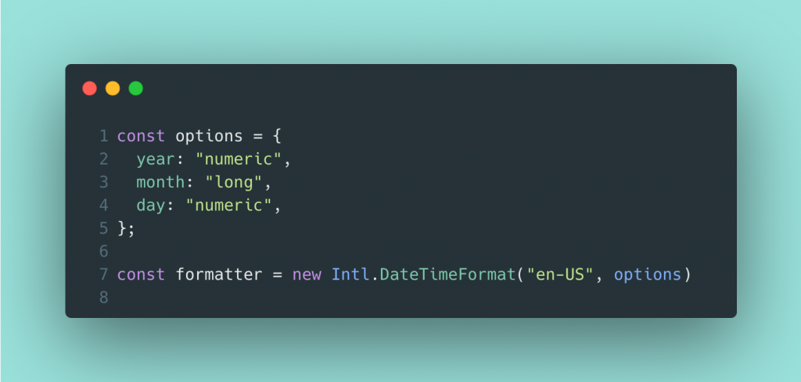

> ☝️ 이 문서는 사용자가 추가한 도시의 시간을 1분 단위로 갱신하기 위해, 기존에 작성된 코드를 Intl API를 활용하여 리팩토링한 과정을 정리한 문서입니다.

<br />

## I. 기존 도시 시간 계산 로직

사용자가 추가한 도시의 시간을 1분 단위로 갱신하기 위해, 초기 구현 단계에서는 기능 개발을 빠르게 진행하는 데 집중했습니다. 이 과정에서 코드의 하드 코딩 여부와는 관계없이, 상태 관리 방식이나 각 상태 값의 정의보다는 동작 구현을 우선하여 개발을 진행했습니다.

```tsx
// 기존 도시 시간 계산 로직
const [day, setDay] = useState<string>("");
const [target, setTarget] = useState<"PM" | "AM">("PM");
const [time, setTime] = useState<string>("");

useEffect(() => {
  const getLocalDateString = (timeZone: string) => {
    return new Intl.DateTimeFormat("en-CA", {
      timeZone,
      year: "numeric",
      month: "2-digit",
      day: "2-digit",
    }).format(new Date());
  }
  
  const compare = (from: string, to: string) => {
    if(from === to) return "Today";

    const a = from.split("-").map(Number).reduce((a, b) => a + b);
    const b = to.split("-").map(Number).reduce((a, b) => a + b);
    if(a < b) return "Tomorrow";
    else {
      return "Yesterday";
    }
  }

  const updateTime = () => {
    const now = new Date();
    // 1. 해당 지역 시간 계산 (기존 로직)
    const utc = now.getTime() + now.getTimezoneOffset() * 60 * 1000;
    const targetDate = new Date(utc + world.offset * 1000);
    
    // 2. AM/PM 및 시간 업데이트
    const hours = targetDate.getHours();
    const minutes = targetDate.getMinutes();
    setTarget(hours >= 12 ? "PM" : "AM");
    setTime(`${hours % 12 || 12}:${String(minutes).padStart(2, "0")}`);

    // 3. 날짜 비교 업데이트 (기존 compare 로직 재사용)
    const fromDateStr = getLocalDateString(world.from);
    const toDateStr = getLocalDateString(world.to);
    setDay(compare(fromDateStr, toDateStr));
  };

  updateTime(); // 초기 실행

  const now = new Date();
  const delay = (60 - now.getSeconds()) * 1000;
  
  const timeoutId = setTimeout(() => {
    updateTime();
    const intervalId = setInterval(updateTime, 1000 * 60);
    (window as any)._worldTimeInterval = intervalId;
  }, delay);

  return () => {
    clearTimeout(timeoutId);
    if((window as any)._worldTimeInterval) {
      clearInterval((window as any)._worldTimeInterval);
    }
  }
}, []);
```

동작 구현을 우선시하여 개발을 진행했기 때문에, 위 코드를 보면 알 수 있듯이 구조적인 설계보다는 기본적인 동작만 수행할 수 있도록 단순한 형태로 구현되었습니다.

<br />

## II. Intl API를 활용한 도시 시간 계산 로직 리팩토링

프로젝트 개발이 완료된 이후, 기존 도시 시간 계산 로직을 리팩토링하기 위해 먼저 전체 코드를 분석하고, 그 과정에서 다음과 같은 문제들을 정의했습니다.

<br />

**① AM / PM 및 시･분을 개별 상태로 관리하는 구조**

```tsx
// 객체를 통해 하나의 상태로 관리할 수 있음에도 불구하고 개별 상태로 관리하는 구조
const [day, setDay] = useState<string>("");
const [target, setTarget] = useState<"PM" | "AM">("PM");
const [time, setTime] = useState<string>("");

// 상태 변경 시 로직
setTarget(hours >= 12 ? "PM" : "AM");
setTime(`${hours % 12 || 12}:${String(minutes).padStart(2, "0")}`);
setDay(compare(fromDateStr, toDateStr));
```

위 코드를 보면 알 수 있듯이 AM / PM, 시･분, 날짜 정보는 하나의 시간 값을 기준으로 파생되는 밀접한 상태임에도 불구하고, 단일 객체가 아닌 개별 상태로 분리되어 관리되고 있습니다. 이로 인해 시간 변경 시 하나의 의미적 변경을 표현하기 위해 여러 상태 업데이트가 발생하며, 각 업데이트는 React의 상태 업데이트 스케줄링 대상이 되고, 상태 업데이트 함수 호출 수만큼 리렌더링 트리거가 발생하게 됩니다.

```tsx
setTarget(...);  // 리렌더링 트리거 발생 -> 렌더 -> 커밋
setTime(...);    // 리렌더링 트리거 발생 -> 렌더 -> 커밋
setDay(...);     // 리렌더링 트리거 발생 -> 렌더 -> 커밋
```

다만 React v18 이후부터는 자동 배치(Automatic Batching)가 기본 동작으로 적용되어, 동일한 실행 컨텍스트(이벤트 핸들러, useEffect, 타이머 등) 내에서 발생한 여러 상태 업데이트가 하나의 배치로 묶여 처리됩니다. 이로 인해 개별적으로 setState가 호출되더라도 최종적으로는 한 번의 리렌더링으로 커밋되도록 내부적으로 최적화되어 있습니다.

그러나 이 동작은 React의 내부 구현에 해당하므로, 자동 배치를 지원하지 않는 이전 버전(v18 이전)에서 동일한 방식으로 상태를 관리할 경우 상태 업데이트 함수 호출 수만큼 불필요한 리렌더링이 발생할 수 있습니다. 또한 모든 프로젝트가 항상 최신 React 버전을 사용한다는 보장이 없고, 버전별 내부 동작을 지속적으로 완벽하게 인지하며 개발하기도 어렵다고 판단했습니다.

이러한 이유로, 특정 버전의 최적화에 의존하지 않는 구조를 지향하고 런타임 성능 저하 가능성을 줄이기 위해, 서로 밀접하게 연관된 상태를 하나의 상태로 묶어 관리하는 습관을 가지는 방향으로 다음 코드와 같이 리팩토링을 진행했습니다.

```tsx
// 서로 밀접하게 연관된 상태를 하나의 객체로 묶어서 관리하는 구조
const [timeStatus, setTimeStatus] = useState<TimeStatus>({
  day: "Today",
  target: "AM",
  time: ""
});

// 상태 변경 시 로직
setState({
  day: fullYearCompare(getFullYear(from), getFullYear(to)),
  target: getFindIntlDateTimeFormatValue(to, "dayPeriod").replaceAll(".", "").toUpperCase() as "AM" | "PM",
  time: `${getFindIntlDateTimeFormatValue(to, "hour")}:${getFindIntlDateTimeFormatValue(to, "minute")}`
});
```

<br />

**② Time Zone DB API를 통해 얻은 offset을 통해 수동으로 도시 시간을 계산**

기존 도시 시간 계산 로직은 사용자 브라우저에 설정된 지역 시간을 기준으로 생성된 Date 객체에서 UTC 기준 절대 시간(`Date.getTime()`)과 지역 시간 <-> UTC 간 시차(`Date.getTimezoneOffset()`)를 함께 사용해 UTC 기준 시각을 밀리초 단위로 계산한 뒤, 여기에 TimeZoneDB API로부터 전달받은 시차(offset)를 더해 대상 도시의 UTC 기준 시간을 수동으로 계산하는 방식이였습니다.

```tsx
const updateTime = () => {
  const now = new Date();

  const utc = now.getTime() + (now.getTimezoneOffset() * 60 * 1000);  // UTC 기준 시간 계산
  const targetDate = new Date(utc + (world.offset * 1000));           // 대상 도시 UTC 기준 시간 계산

  // ...시간 상태 업데이트 로직...
}
```

위에서 설명한 것처럼, 초기 로직은 우선 기본적인 동작을 구현하는 데 집중하여 비교적 단순한 형태로 작성했습니다. 그러나 기능 구현 과정에서 다음과 같은 이유로 프로젝트 개발이 완료된 이후에 시간 계산 로직은 리팩토링이 필요하다고 판단했습니다.

먼저, 사용자 브라우저에 설정된 지역 시간과 대상 도시의 날짜를 비교하기 위한 방법을 찾는 과정에서 Intl API를 알게 되었고, 이를 날짜 비교(Yesterday / Today / Tomorrow)를 위한 용도로 사용하고 있었습니다. 반면, 시간 계산은 UTC 기준 시각과 TimeZoneDB API를 통해 전달받은 시차(offset)를 조합해 대상 도시의 시간을 수동으로 계산하는 방식으로 구현되어 있었습니다.

이처럼 날짜 비교는 Intl API를 사용하고, 시간 계산은 UTC 기준 시간을 직접 계산하는 방식으로 분리된 구조로 로직을 작성했습니다. 그러나 하나의 방식만으로도 대상 도시의 시간과 날짜를 모두 처리할 수 있지 않을까라는 의문이 들었습니다. 그래서 Intl API가 대상 도시의 날짜뿐만 아니라 시간 정보도 제공하지 않을까 생각하게 되었고, [MDN-Intl.DateTimeFormat](https://developer.mozilla.org/ko/docs/Web/JavaScript/Reference/Global_Objects/Intl/DateTimeFormat) 문서를 확인한 결과 `Intl.DateTimeFormat()`의 옵션을 통해 시간과 관련된 다양한 정보를 함께 얻을 수 있다는 점을 확인했습니다.

이로 인해 대상 도시의 정확한 시간을 제공하기 위해 직접 계산하는 방식은 계산식이 조금이라도 부정확할 경우 정확한 시간을 도출하지 못할 수 있다고 판단했습니다. 반면 Intl API는 정확한 시간을 제공할 뿐만 아니라 모든 주요 브라우저에서 지원되므로, 더 합리적인 방식이라고 생각하여 프로젝트 개발이 완료된 이후 리팩토링을 진행하기로 결정했습니다.

```tsx
// Intl API를 활용해 매개변수로 전달된 timeZone에 해당하는 도시의 시간 정보를 가져오는 로직
function getLocalDate(timeZone: string, now: Date) {
  return new Intl.DateTimeFormat("en-CA", {
    timeZone,
    dateStyle: "short",
    timeStyle: "short",
    hour12: true
  }).formatToParts(now).filter(format => format.type !== "literal");
}
```

위 코드와 같이 Intl API를 사용해 매개변수로 전달된 `timeZone`에 해당하는 시간 정보를 가져온 뒤, `formatToParts()` 메서드를 통해 각 형식별로 분리하고 기호(literal)를 제외한 `Intl.DateTimeFormatPart[]` 형태의 결과를 전달받도록 함수를 구성했습니다.

이후 사용자가 선택한 도시 목록을 렌더링하는 과정에서, 사용자 지역(`world.from`)과 대상 도시(`world.to`)의 지역명을 `getLocalDate()` 함수의 `timeZone` 매개변수로 전달해 각 시간 정보를 Intl API로 각 시간 정보를 조회하여, 단순히 두 시간대의 날짜만 비교하는 방식이 아니라 두 시간대의 정확한 차이를 계산해 화면에 반영하도록 로직을 개선했습니다.

```tsx
// 화면에 표시할 시간 정보를 갱신하기 위한 로직
export function updateTime(world: WordTimeListType, setState: React.Dispatch<React.SetStateAction<TimeStatus>>) {
  const now = new Date(); // Intl API에서 시간 계산의 기준이 될 현재 시각 생성

  const from = getLocalDate(world.from, now);  // 사용자 지역에 해당하는 시간 정보를 Intl API로 조회
  const to = getLocalDate(world.to, now);      // 대상 도시에 해당하는 시간 정보를 Intl API로 조회

  // Intl API를 통해 얻은 두 시간대를 기준으로 화면에 표시할 상태를 갱신
  setState({
    day: fullYearCompare(getFullYear(from), getFullYear(to)),
    target: getFindIntlDateTimeFormatValue(to, "dayPeriod").replaceAll(".", "").toUpperCase() as "AM" | "PM",
    time: `${getFindIntlDateTimeFormatValue(to, "hour")}:${getFindIntlDateTimeFormatValue(to, "minute")}`
  });
}
```

<br />

**③ `setInterval` 타이머 식별자를 전역 변수 대신 참조 객체로 관리하도록 수정**


- ~~UTC 기준으로 offset을 더해 수동으로 지역 시간을 계산~~
- ~~AM / PM, 시·분을 각각 상태로 분리해 관리~~
- ~~Intl.DateTimeFormat은 날짜 문자열 비교용으로만 제한적으로 사용~~
- ~~날짜 비교(Today / Tomorrow / Yesterday)를 문자열 합산 방식으로 처리~~
- interval을 window 전역에 보관하여 정리