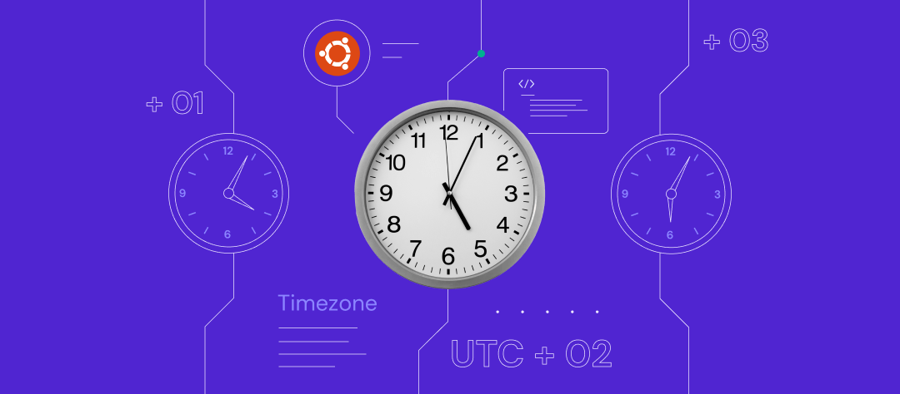
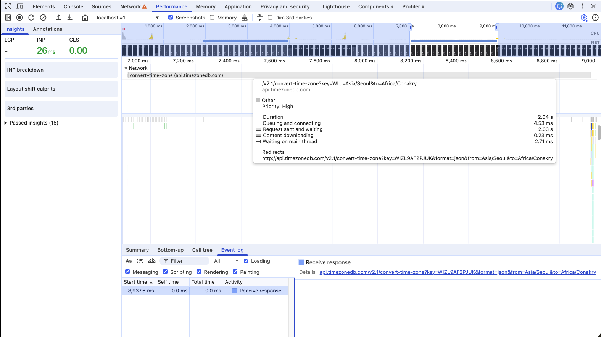
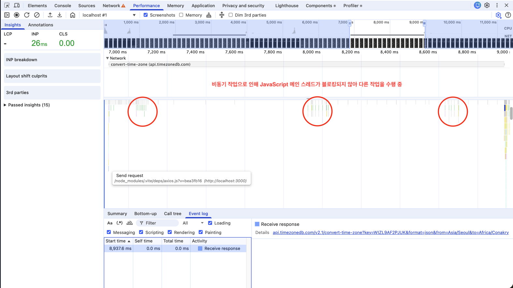
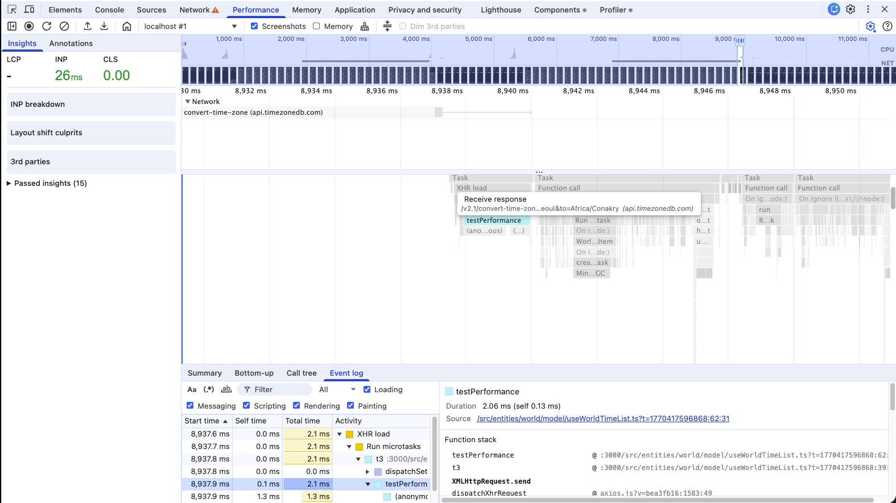
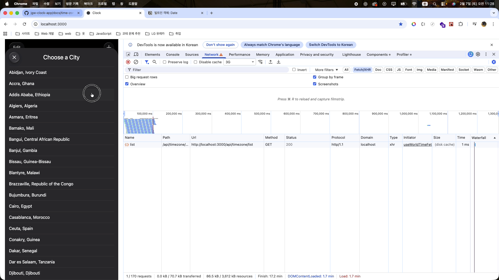

> ☝️ 이 문서는 세계 시간 추가 시, 사용자 시간대(from)와 대상 도시 시간대(to) 간의 시차를 Time Zone DB의 Convert Time Zone API를 통해 계산하던 기존 로직을, 단순 계산식 기반으로 리팩토링한 과정을 정리한 문서입니다.

<br />

## I. 리팩토링 이전의 Convert Time Zone API를 이용한 시차 계산 로직

기존에는 **세계 도시 목록**과, **사용자 시간대와 대상 도시 시간대 간의 시차를 계산**하기 위해 Time Zone DB에서 제공하는 **List Time Zone API**와 **Convert Time Zone API**를 활용했습니다.

**List Time Zone API의 경우** Clock 프로젝트에서는 **별도의 웹 서버와 WAS를 구축하지 않았기 때문에, 세계 도시 목록을 구성하기 위한 용도로 필수적으로 사용**해야 했습니다. 그러나 **사용자 시간대와 대상 도시 시간대 간의 시차를 계산하는 로직을 구현하던 당시**에는, **`Date` 객체를 이용해 시차 계산 로직을 직접 구현하는 방식은 정확한 시차를 계산하지 못할 것 같다고 생각**했습니다.

그렇기 때문에 직접 시차를 계산하기보다는, **외부 API를 활용하는 것이 더 정확한 계산을 수행**할 수 있다고 판단했습니다. 마침 현재 사용 중인 Time Zone DB에서 **두 시간대 간의 시차를 계산해 주는 Convert Time Zone API를 제공**하고 있었기 때문에, **해당 API를 기반으로 시차를 계산하는 방식이 보다 정확**할 것이라고 판단했습니다. 이에 따라 다음과 같이 Convert Time Zone API를 활용해 시차를 구하는 로직을 작성했습니다.

<br />

```tsx
// 기존 로직
const handleAppendWorldTime: WorldAppendHandler = async (from, to) => {
  const { data } = await axios.get(`http://api.timezonedb.com/v2.1/convert-time-zone?key=${import.meta.env.VITE_TIME_ZONE_API}&format=json&from=${Intl.DateTimeFormat().resolvedOptions().timeZone}&to=${to}`) as ConvertTimeZoneType;
  
  const newData: WordTimeListType = {
    name: from,
    from: data.fromZoneName,
    to: data.toZoneName,
    offset: data.offset
  }

  // 사용자가 등록한 세계 시계 리스트 정보를 포함하고 있는 상태를 업데이트하여, UI를 갱신한다. (UI 갱신용)
  setWorldTimeList((current) => {
    if(!current.length) { // 아무런 정보를 포함하고 있지 않는 경우
      localStorage.setItem("worldTime", JSON.stringify([newData]));
      return [newData];
    }

    // 하나 이상의 정보를 포함하고 있는 경우 -> 중복된 데이터는 추가하면 안되기 때문에 별도의 검증을 하여 추가한다.
    for(let prevData of current) {
      if(prevData.to === to) {
        return [
          ...current
        ];
      }
    }

    // 정보를 포함하고 있으면서, 중복된 나라가 없는 경우 이전 정보와 새로운 정보를 결합한 상태를 반환한다.
    localStorage.setItem("worldTime", JSON.stringify([...current, newData]));
    return [
      ...current,
      newData
    ];
  });

  handleCloseBottomSheet()
}
```

<br />

하지만 프로젝트 개발 완료 이후, 사용자가 선택한 도시와 사용자 도시 간의 **시차**를 **Convert Time Zone API에서 제공하는 `offset` 값을 기준으로 수동 계산**하여 **상태에 반영하던 로직**을 두 도시 간의 시간을 보다 **정확하게 반영하기 위해 Intl API 기반으로 리팩토링을 진행**했습니다.

> offset 값을 기준으로 수동 계산하여 상태에 반영하던 로직을 Intl API 기반으로 리팩토링한 내용은 [｢도시 시간 계산 로직 리팩토링 과정｣](./city-time-calculation-refactoring.md) 문서에서 자세하게 확인할 수 있습니다.

이를 반대로 생각하면, 리팩토링 과정에서 **두 도시 간의 시차를 Intl API를 통해 계산하고 있었다는 의미**가 됩니다. 따라서 기존에 **Local Storage와 상태(State)에 반영하기 이전**에 **Convert Time Zone API에 요청을 보내 두 도시 간의 시차를 구하는 방식**은 사용자의 **네트워크 환경에 따라 불필요한 렌더링 지연을 유발**할 수 있는 문제점을 야기할 뿐입니다.

실제로 네트워크 환경이 좋지 않은 경우 렌더링 지연 문제가 발생하는지 확인하기 위해, **"개발자 도구 > Performance" 패널**에서 **네트워크 성능을 3G로 제한하여 확인**해보겠습니다.

<br />



<br />

위 이미지를 보면 알 수 있듯이 **Convert Time Zone API의 지속 기간(Duration)** 이 **약 2.04s 동안 유지**되는 것을 확인할 수 있습니다. 하지만 여기서 중요한 점은 **네트워크 요청이 async 함수를 통해 비동기로 동작**하고 있다는 것입니다.

이때 많은 개발자가 **오해하는 부분 중 하나**는 **비동기 작업을 동기처럼 처리하기 위해 await를 사용한다는 점**입니다. 이로 인해 **async/await 기반으로 수행되는 비동기 작업 자체가 동기 작업으로 변경되어 처리된다고 이해하고 로직을 작성**하기도 합니다.

하지만 await는 비동기 작업 자체를 동기 작업으로 변환하는 것이 아니라, **async 함수 내부 실행 흐름만 일시적으로 정지**시키고 **비동기 작업이 완료된 후에 다시 실행을 재개하도록 만드는 역할**을 합니다. 따라서 **async 함수 내부에서는 awiat 아래의 로직이 비동기 작업 완료 이후 실행**되지만, **async 함수 외부에 존재하는 동기 작업은 해당 비동기 작업의 완료 여부와 관계없이 먼저 수행**됩니다.

<br />



<br />

따라서 **async/await 기반 비동기 로직의 동작 원리를 고려**했을 때, 기존 **Convert Time Zone API에 요청을 보내 시차를 계산하는 구조**에서는 해당 요청의 **응답을 전달받기 전까지 상태(State)를 갱신하거나 Local Storage에 정보를 반영할 수 없습니다.**

<br />



> 위 이미지는 async 함수의 동작 원리를 테스트하기 위해, Convert Time Zone API의 응답 결과를 전달받은 이후 10,000개의 원소를 가진 배열을 생성하는 testPerformance 함수가 호출되고 있는 결과입니다.

<br />

또한 **`handleAppendWorldTime` 비동기 함수**의 **마지막 시점에 Bottom Sheet를 비활성화하는 함수를 호출**하고 있기 때문에 **API 응답을 전달받기 전까지는 Bottom Sheet가 닫히지 않게 됩니다.**

<br />

[](https://drive.google.com/file/d/1M6jkI90TcNBSUUpYCkJxd7zSSdm_cGCE/view?usp=sharing)

> Markdown은 비디오를 직접 삽입할 수 없기 때문에, 해당 이미지는 API 응답을 전달받기 전까지 Bottom Sheet가 닫히지 않는 과정을 캡처한 화면입니다. 이미지를 클릭하면 Google Drive에 업로도된 비디오 공유 URL로 이동할 수 있습니다.

<br />

이처럼 **Convert Time Zone API를 통해 시차를 계산하는 구조**에서는 **사용자의 네트워크 환경이 좋지 않을수록 응답 전달 시간이 더욱 지연**되고, **그만큼 상태 반영 및 UI 갱신 시점도 함께 늦어지게 됩니다.** 결과적으로 **사용자 입장에서는 렌더링이 지연되는 것처럼 인식될 수 있는 상황이 발생**하게 됩니다.

<br />

## II. Intl API 기반으로 두 도시 간의 시차 계산 로직 리팩토링

