> ☝️ 이 문서는 World 라우트로 이동할 때마다 동일한 데이터를 반복적으로 요청하는 TimeZoneDB Open API 호출을 캐싱하여 개선한 과정을 설명한 문서입니다.

<br />

## I. TimeZoneDB Open API를 활용한 이유

Clock 프로젝트는 iOS 모바일 기기의 시계 앱을 클론 코딩한 프로젝트입니다. iOS 시계 앱의 세계 시간(World) 화면에서는 전 세계 도시 목록을 제공하며, 사용자가 특정 도시를 선택하면 해당 도시의 시간이 사용자의 앱에 추가되는 구조로 동작합니다.

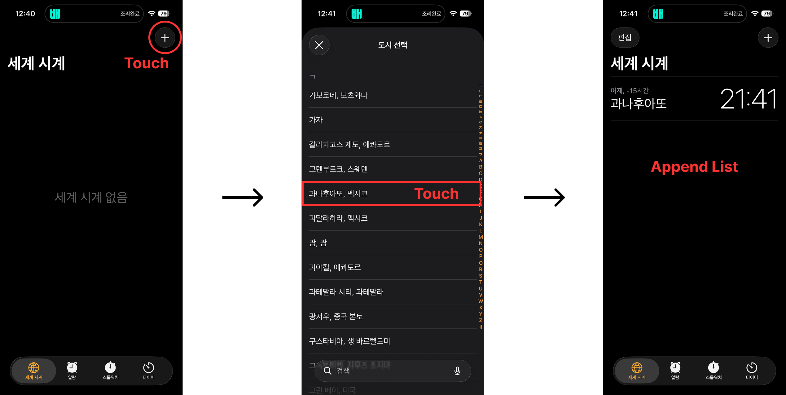

현재 진행 중인 Clock 프로젝트에서도 iOS 시계 앱과 동일하게 전 세계 도시 목록을 제공하는 기능이 필요했습니다. 하지만 해당 프로젝트는 정적 웹 사이트(Static Web Site) 형태로 구성되어 있어, 별도의 웹 서버나 WAS를 구축하지 않고 개발을 진행했기 때문에, 서버에서 전 세계 도시 목록을 요청할 수는 없었습니다.

이로 인해, 전 세계 도시 데이터를 제공하는 Open API를 찾던 중, 다음 두 가지 무료 Open API를 확인할 수 있었습니다.

<br />

**[① World Time API](https://worldtimeapi.org/)**

World Time API는 Google에서 "전 세계 도시 목록 제공 API"를 검색하던 과정에서 확인하게 되었습니다. 해당 API는 인프런 질문인 ["세계 시간 API 서버 이슈로 대체할만한 API 아시는분 계신가요?"](https://www.inflearn.com/community/questions/1509722/%EC%84%B8%EA%B3%84-%EC%8B%9C%EA%B0%84-api-%EC%84%9C%EB%B2%84-%EC%9D%B4%EC%8A%88%EB%A1%9C-%EB%8C%80%EC%B2%B4%ED%95%A0%EB%A7%8C%ED%95%9C-api-%EC%95%84%EC%8B%9C%EB%8A%94%EB%B6%84-%EA%B3%84%EC%8B%A0%EA%B0%80%EC%9A%94?srsltid=AfmBOoqM610JCOXEK7n7aJqFp6D8ynFZ17RYlwXMafMDcDkk-HchflKf)을 통해 해당 API의 정보를 알게 되었습니다.

인프런 강의에서도 활용되는 무료 Open API라는 점에서, Clock 프로젝트에서도 가별게 활용할 수 있을 것이라 생각했습니다. 또한 해당 질문이 2025.02.02에 등록된 글이기 때문에, 질문에 작성된 서버 이슈 역시 이미 해결되었을 것으로 판단하여 별도의 대안 API를 추가로 탐색하지 않고 사용하기로 결정했습니다.

그러나 해당 API의 사용 방법을 확인하기 위해 공식 문서를 들어갔지만, World 라우트를 개발하던 2025.11월 시점에도 서버 이슈가 여전히 해결되지 않은 상태였습니다. 이로 인해, 결국 해당 API를 사용하지 못하기 때문에 다른 Open API를 찾아보게 되었습니다.

<br />

**[② Time Zone DB API](https://timezonedb.com/api)**

Google을 통해 다른 Open API를 찾기 전에, World Time API를 알게 된 질문 자체가 "세계 시간 API 서버 이슈로 대체할만한 API 아시는분 계신가요?"라는 제목으로 등록된 글이였기 때문에 해당 질문 게시물의 댓글을 먼저 확인하게 되었습니다.

댓글 중 인프런 사이트에서 자체적으로 운영하는 AI 기반 댓글 봇인 "인프런 AI 인턴"이 남긴 댓글을 확인할 수 있었고, 해당 댓글에서 World Time API를 대체할 수 있는 3가지 Open API를 안내하고 있었습니다.

그 중 [World Clock API](http://worldclockapi.com/)의 경우, 공식 문서에 사용 방법에 대한 설명 없이 단순히 요청 URL만 명시되어 있어 활용 방법을 정확히 파악하기 어려웠습니다.

또한 [Goggle Maps Time Zone API](https://developers.google.com/maps/documentation/timezone/overview?hl=ko)는 무료 크레딧 이후 유료로 제공되는 API였으며, 전체 도시 목록을 제공하는 방식이 아니라 특정 지리 정보에 대한 시간대만 반환하는 API였기 때문에 Clock 프로젝트에는 적절하지 않다고 판단했습니다.

이후 남은 하나인 Time Zone DB API의 공식 문서를 확인했는데, 제공되는 API 중 전체 시간대 목록을 가져올 수 있는 List Time Zone과 특정 도시의 시간대를 조회할 수 있는 Get Time Zone API을 제공하고 있었기 때문에 해당 API를 사용하는 것이 적절하다고 판단했습니다.

또한, 당시 API 로직을 개발하던 시점에는 Intl API에 대해 알지 못한 상태였기 때문에, 두 시간대의 차이를 계산해 주는 Convert Time Zone API가 제공된다는 점에서도 Time Zone DB API가 더욱 적절하다고 판단하여 해당 API를 사용하기로 결정했습니다.

<br />

## II. 현재 작성된 "List Time Zone 요청 API 로직"의 문제점

Clock 프로젝트에서는 World Route에서 독립적으로 존재하는 World Bottom Sheet 컴포넌트가 렌더링 될 때, `useEffect`를 통해 Time Zone DB API에서 제공하는 전체 시간대 목록을 가져오는 API 로직을 작성했습니다.

```tsx
export default function useWorldTimeFetch() {
  const [worldTimeListData, setWorldTimeListData] = useState<ListTimeZone[]>([]);
  
  useEffect(() => {
    const fetchListTimeZone = async () => {
      try {
        const resposne = await getListTimeZone();

        // TimeZoneDB 요청이 실패한 경우 -> TimeZoneDB에서 설정한 message 값으로 에러문을 출력한다.
        if(response.data.status === "FAILED") {
          throw new Error(resposne.data.message);
        }

        // TimeZoneDB 요청이 성공적일 경우 -> 상태를 갱신하여 리렌더링을 발생시켜 사용자 화면에 리스트 목록을 나타낸다.
        setWorldTimeListData(response.data.zones);
      } catch(error) {
        // ...
      }
    }

    fetchListTimeZone();
  }, []);
}
```

하지만 현재 로직에는 문제가 존재합니다. 바로 페이지가 `/world`로 이동할 때마다 해당 `useEffect` 내부 로직이 실행되면서, 이미 한 번 받아온 데이터임에도 불구하고 동일한 데이터를 갱신하기 위한 재요청이 반복적으로 발생한다는 점입니다.

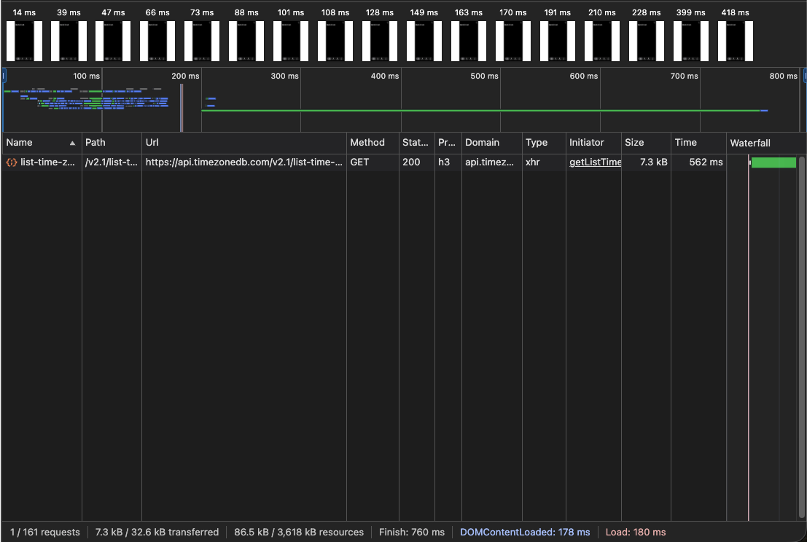

> _위 이미지는 "최초 요청" 시 개발자 도구 > 네트워크 탭의 Fetch/XHR만 필터링 한 결과입니다._

<br />

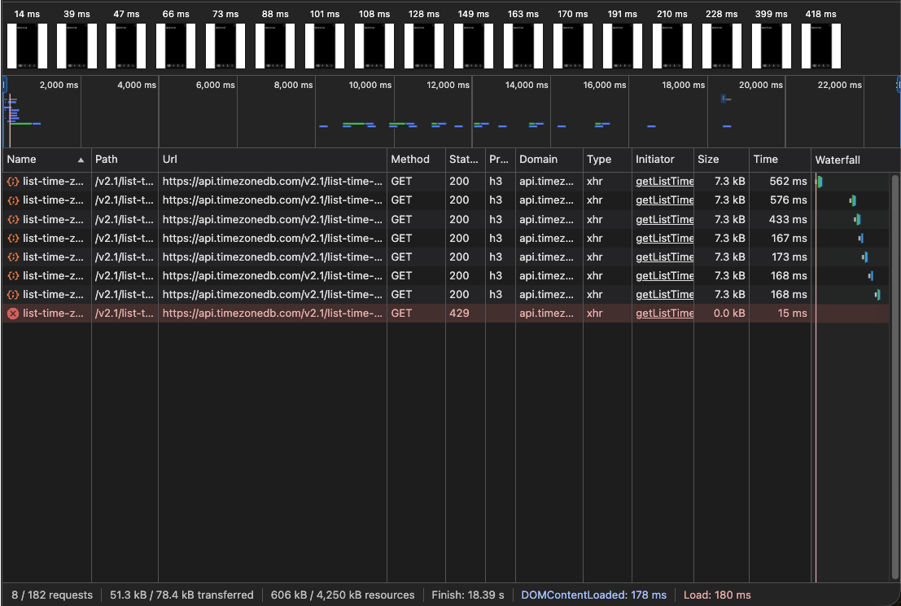

> _위 이미지는 최초 요청 이후 `/world` 페이지로 이동할 때마다 개발자 도구 > 네트워크 탭의 Fetch/XHR만 필터링 한 결과입니다._

<br />

동일한 데이터를 요청하기 위한 재요청이 반복적으로 발샐할 경우, 불필요한 네트워크 자원을 소모하게 될 뿐만 아니라, 응답을 제공하는 서버가 원인을 알 수 없는 오류로 인해 응답을 반환하지 못하는 상황이 발생했을 때 적절한 예외 처리가 되어 있지 않다면 런타임 에러로 이어질 수 있는 등 다음과 같이 여러 가지 문제가 발생할 수 있습니다.

<br />

**① HTTP 버전이 낮은 경우**

브라우저는 HTTP 프로토콜을 통해 서버와 통신을 주고받게 되며, HTTP 프로토콜은 기본적으로 비연결성(Non-Connection)이라는 특징을 가지고 있습니다.

비연결성을 간단히 설명하면, 클라이언트와 서버 간의 요청-응답 과정에서 TCP/IP 연결을 수립한 뒤 HTTP 요청을 전송하고, 서버가 이에 대한 응답을 반환하면 해당 TCP/IP 연결을 종료하는 방식입니다.

이를 보완하기 위해 HTTP/1.1부터는 지속적 연결(Persistent Connection)을 도입하여, TCP/IP 연결을 가능한 오랫동안 유지하고 해당 연결이 유지되는 동안 발생하는 HTTP 요청에 대해서는 연결을 끊지 않고 하나의 TCP/IP 연결 내에서 요청-응답 과정을 처리하도록 개선되었습니다.

하지만 HTTP/1.0까지는 이러한 방식이 적용되지 않았기 때문에, 만약 Time Zone DB API가 내부 서버를 HTTP/1.0 기반으로 구축하고 있었다면 매 요청마다 "TCP/IP 연결 수립 -> HTTP 요청 -> HTTP 응답 반환" 과정을 반복하는 구조를 가졌을 것입니다.

또한 비연결성 특징과 더불어, HTTP/1.1까지는 요청-응답을 FIFO(First-In-First-Out) 방식으로 처리했기 때문에 앞선 요청의 처리 시간이 지연될 경우, 그 이후에 발생한 요청들까지 함께 지연되는 HOL Blocking(Head-of-Line Blocking) 문제가 존재했습니다.

비록 리팩토링 이후에는 이러한 방식으로 동작하지 않지만, 기존 로직에서는 사용자 화면에 출력된 전체 시간대 목록 중 특정 항목을 클릭하면 Time Zone DB API에서 제공하는 Convert Time Zone API를 통해 시간 변환 요청을 수행하고 있었습니다.

이때 전체 시간대 목록을 가져오는 List Time Zone API 요청이 아직 완료되지 않은 상태에서 Convert Time Zone API 요청이 발생했가면, Bottom Sheet가 비활성화되었더라도 사용자 화면은 Convert Time Zone API의 응답이 도착하지 않은 상태로 유지되었을 것이며, 그 결과 사용자는 원인을 알 수 없는 상황에서 다시 요청을 시도하는 문제가 발생했을 가능성도 있습니다.

<br />

**② 유료 서비스 Open API를 사용하는 경우**

Clock 프로젝트에서 Time Zone DB API와 같은 무료 Open API가 아니라, Google Maps Time Zone API와 같은 유료 Open API를 사용하고 해당 API의 응답 헤더에 캐시 정책이 설정되어 있지 않았다면, 동일한 데이터에 대한 반복적인 재요청으로 인해 상당한 비용이 발생했을 것입니다.

유로 Open API 경우, API 요청 건당 비용을 부과하거나, 네트워크 요청이 인해 발생한 트래픽의 크기를 기준으로 해당 서비스에서 사용된 자원의 양만큼 비용을 부과하는 방식이 일반적입니다. 이 중 트래픽 기반 과금 방식의 경우에는 실제 사용자가 많지 않다면 비용 발생이 크지 않을 수도 있습니다.

그러나 API 요청 건당 비용을 부과하는 방식이었다면, 제가 문서를 작성하거나 배포된 사이트에서 테스트를 진행하는 과정에서도 실제 서비스 이용자가 아닌 개발자임에도 불구하고 API 요청이 발생할 때마다 비용이 청구되었을 것입니다.

<br />

**③ 요청이 발생할 때마다 JavaScript 로직 수행**

네트워크 요청은 브라우저가 화면을 그리기 위해 HTML, CSS, JavaScript와 같은 정적 파일을 전달하는 경우를 제외하면, 대부분 Fetch API, XHR, Axios와 같은 JavaScript를 통해 개발자가 직접 필요한 데이터를 요청하는 방식으로 수행됩니다.

즉, 네트워크 요청이 발생하면 API 로직이 JavaScript 해석기를 통해 실행되며, 이 과정에서 브라우저 프로세스의 메모리 자원(Heap, Code, Data)을 점유하게 됩니다. 또한 함수 호출은 JavaScript 해석기의 단일 스레드에서 처리됩니다.

이벤트 루프를 통해 비동기 로직이 수행되기 때문에 겉으로 보기에는 다중 스레드(Multi Thread)로 동작하는 것처럼 보일 수 있지만, 정확히 말하면 런타임 환경 자체가 멀티 스레드로 구성되어 있어 여러 비동기 작업을 병렬적으로 처리하는 구조일 뿐, JavaScript 해석기 자체는 단일 스레드로 동작합니다.

이로 인해 JavaScript를 통해 브라우저에 표시된 화면을 조작하거나 API 요청과 같은 특정 로직을 수행하게 되면, 해당 함수 호출은 JavaScript 해석기의 단일 스레드가 관리하는 콜 스택에 쌓이게 되고, 브라우저 프로세스의 메모리 자원을 점유하게 됩니다.

이를 직접 확인하기 위해 JavaScritp를 통해 List Time Zone API 요청을 수행한 뒤, 개발자 도구의 Performance 탭을 통해 해당 구간의 정보를 살펴보았습니다.

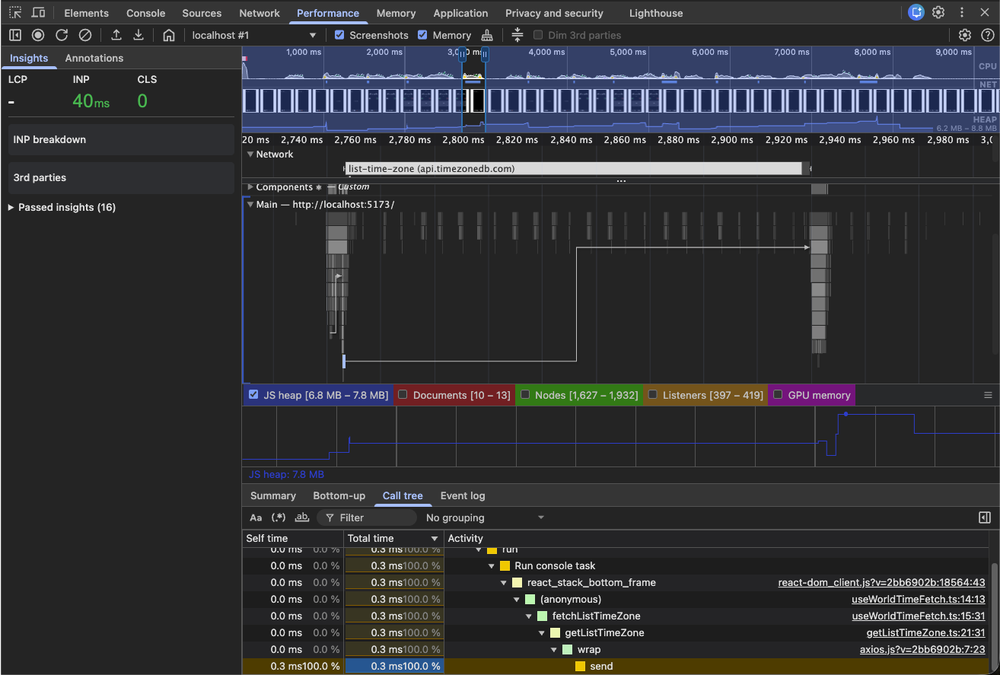

Performance 탭의 결과를 보면, List TIme Zone API 요청과 응답 과정에서 JavaScript 해석기의 스레드 상에 다수의 함수 호출 경로가 표시되는 것을 확인할 수 있습니다.

또한 JS Heap 메모리 영역을 살펴보면, 요청을 발생했을 때 계단식으로 메모리 사용량이 증가한 뒤 일부 메모리가 해제되며 소폭 감소한 상태로 유지되는 것을 확인할 수 있습니다. 이후 네트워크 요청의 응답을 전달받는 시점에 메모리 사용량이 다시 증가하며, 해당 구간 동안 최대 약 7.8MB의 메모리를 차지하고 있는 것을 확인할 수 있습니다.

이러한 현상은 JavaScript API 요청 로직이 수행되는 과정에서 콜 스택에 쌓였던 함수 호출 자체는 제거되었지만, 비동기 요청이 진행 중인 상황에서 API 로직 내부의 코드들이 클로저(Closure)로 인해 참조를 유지하고 있기 때문에 메모리가 해제되지 않은 상태로 유지되기 때문입니다. 이후 응답이 도착하면서 리렌더링과 같은 추가 로직이 수행되며 메모리 사용량이 다시 증가하게 됩니다.

약 7.8MB라는 수치 자체는 문제가 되지 않는 수준으로 보일 수도 있습니다. 하지만 이 결과는 외부 요인의 영향을 최소화한 Chrome 시크릿 모드 환경에서 측정한 결과입니다. 일반 사용자는 시크릿 모드가 아닌 일반 모드에서 브라우저를 사용하기 때문에, 외부 요인에 의해 메모리 사용량이 더 증가할 수 있습니다.

<br />

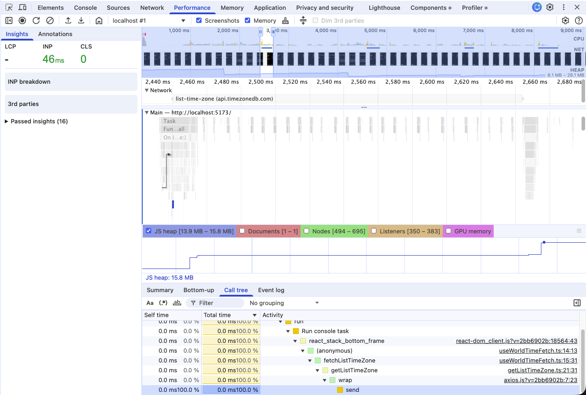

위 이미지는 시크릿 모드가 아닌 일반 모드에서 List Time Zone API 요청과 응답 과정에 대해 측정한 Performance 결과입니다.

시크릿 모드에서 측정한 결과보다 함수 호출 경로가 더 많이 표시되는 이유를 정확하 파악하기는 어렵지만, JS Heap 영역을 확인해 보면 브라우저 프로세스의 힙 메모리에서 최대 약 15.8MB의 메모리를 JavaScript 로직이 점유하고 있는 것을 확인할 수 있습니다.

이 수치 또한 절대적으로 큰 값은 아니지만, 사용자가 활성화한 탭이 많거나 확장 플러그인을 다수 사용하고 있는 환경과 같은 외부 요인이 더해질 경우 메모리 사용량은 더욱 증가할 수 있습니다. 실제로 이번 측정 역시 테스트를 위해 최대한 탭을 줄인 상태였음에도 불구하고, 시크릿 모드 대비 약 2배 이상 증가한 결과를 확인할 수 있었습니다.

<br />

이러한 상황이 문제가 되는 이유는, 클로저나 참조가 유지되는 참조 자료형(Array, Object, Function, Detached elements 등)으로 인해 GC(Garbage Collection)가 메모리를 즉시 해제하지 못하는 상태에서 순간적으로 메모리 사용량이 급증할 수 있기 때문입니다. 이 경우 사용자의 런타임 성능에 직접적인 영향을 줄 수 있습니다.

한두 번의 요청이라면 큰 문제가 되지 않을 수도 있지만, `/world` 페이지를 이동할 때마다 List Time Zone API 요청과 응답으로 인해 메모리 사용량이 반복적으로 급증하게 되면 버벅임 현상이 지속적으로 발생하게 되고, 결과적으로 사용자 경험(UX) 저하로 이어질 수 있습니다.

<br />

**④ 사용자가 사용 중인 네트워크가 느린 경우**

일반적으로 서비스를 개발하는 개발자의 네트워크 환경은 비교적 성능이 좋은 경우가 많습니다. 이로 인해 개발 과정에서 네트워크 성능으로 인한 문제를 직접 체감하기는 쉽지 않습니다.

특히 네트워크 요청 중에서도 브라우저 화면을 구성하기 위한 HTML, CSS, JavaScript와 달리 일반적인 데이터 요청은 상대적으로 응답 크기가 작기 때문에, 개발자의 로컬 환경에서는 빠르게 응답이 도착하는 경우가 많습니다. 또한 이러한 요청은 Skeleton UI나 Loading Spinner와 같은 시각적 처리로 가려지기 때문에 개발자는 네트워크 지연을 더욱 자각하지 못할 수 있습니다.

하지만 개발자의 환경이 아닌, 실제 사용자의 관점에서 네트워크 성능이 좋지 않은 상황을 가정해 보면 List Time Zone API 요청은 현재 개발 환경보다 훨씬 느린 속도로 응답을 받을 수밖에 없습니다. 이를 확인하기 위해 Clock 서비스에서 동일한 요청에 대해 네트워크 속도를 다르게 설정하여 응답 속도를 비교해 보겠습니다.

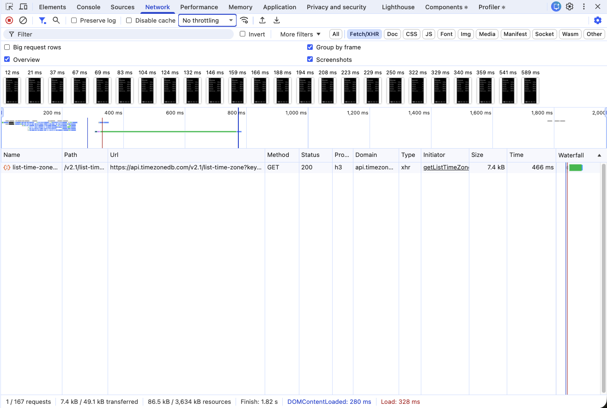

> _최초 요청 시, 네트워크 속도를 제어하지 않았을 때의 개발자 도구 > 네트워크 탭 결과_

<br />

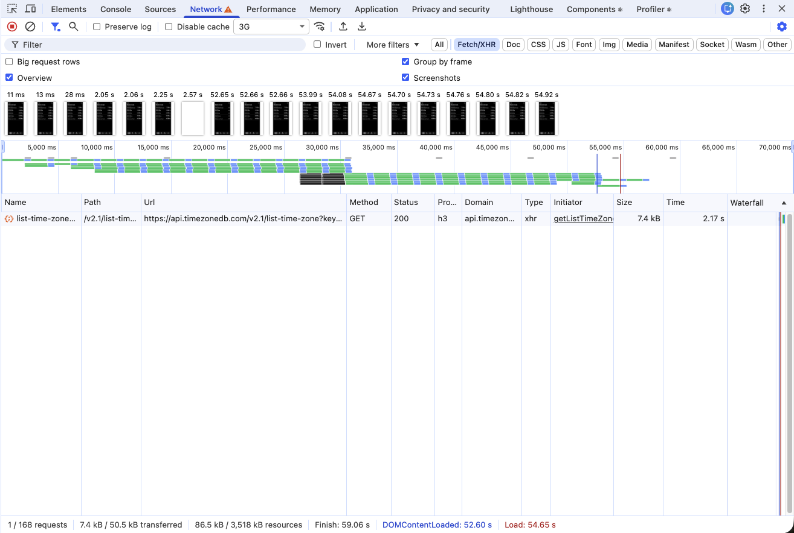

> _최초 요청 시, 3G로 네트워크 속도를 제어했을 때의 개발자 도구 > 네트워크 탭 결과_

응답 속도를 비교해 보면, 네트워크 속도를 제어하지 않았을 때는 약 466ms 만에 응답을 받아오는 것을 확인할 수 있습니다. 반면 3G로 네트워크 속도를 제어했을 경우에는 약 2.17s 이후에 응답을 받아오는 것을 확인할 수 있습니다.

이와 같은 상황에서 `/world` 페이지로 이동할 때마다 동일한 List Time Zone API 재요청이 반복적으로 발생한다면, 네트워크 성능이 좋지 않은 사용자의 환경에서는 매번 느린 응답을 기다려야 하는 상황이 발생하게 됩니다.

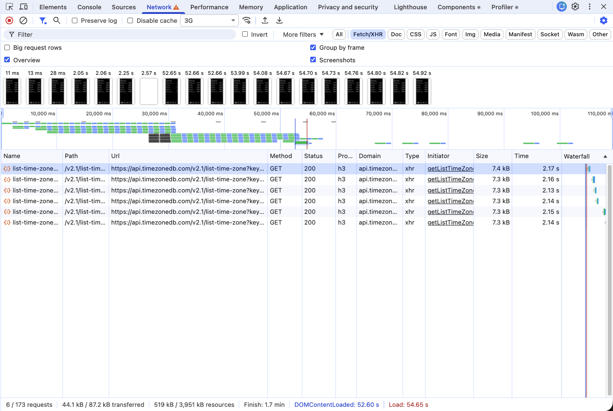

> _재요청이 발생할 때마다 네트워크 속도를 3G로 제어했을 때의 개발자 도구 > 네트워크 탭 결과_

<br />

여기서 중요한 점은, 최초 요청 시에는 단순히 응답 시간 수치보다 사용자가 체감하는 대기 시간이 더 길게 느껴질 수 있다는 점입니다. 일반적인 데이터 요청은 브라우저가 렌더링을 위한 HTML, CSS, JavaScript 자원을 모두 수신한 이후에 해당 요청 로직이 포함된 JavaScript가 실행되기 때문입니다.

또한 현재 비교한 응답 속도는 제 컴퓨터 환경에서 네트워크 속도만 제어했음에도 불구하고, 응답 시간이 약 5배 이상 느려졌다는 점을 보여줍니다. 즉, 서비스를 사용하는 사용자의 컴퓨터 성능이 제 환경보다 낮거나, 브라우저에서 확장 플러그인 등 외부 요인을 많이 실행하고 있거나 다른 브라우저를 사용하는 경우에는 응답 시간이 5배보다 더 느려질 수 있습니다.

결과적으로 이러한 반복적인 재요청 구조는 네트워크 환경이 열악한 사용자에게 매우 불리한 사용자 경험을 제공하게 되며, 응답 지연으로 인한 사용자 경험(UX) 저하는 서비스 이탈로 이어질 가능성을 높이게 됩니다.

<br />

**⑤ 적절한 예외 처리를 하지 않았을 경우**

개발자가 적절한 예외 처리를 수행하지 않았더라도, 그 결과가 화면에 직접적인 영향을 주지 않는 경우에는 사용자가 에러 발생 여부를 인지한지 못한 채 넘어갈 수 있습니다. 이게 정확히 무슨 소리인지 알아보기 위해 기존 API 로직을 다음과 같이 수정해보겠습니다.

```tsx
export default function useWorldTimeFetch() {
  const [worldTimeListData, setWorldTimeListData] = useState<ListTimeZone[]>([]);
  
  useEffect(() => {
    const fetchListTimeZone = async () => {
      const resposne = await getListTimeZone();

      // TimeZoneDB 요청이 성공적일 경우 -> 상태를 갱신하여 리렌더링을 발생시켜 사용자 화면에 리스트 목록을 나타낸다.
      setWorldTimeListData(response.data.zones);
    }

    fetchListTimeZone();
  }, []);
}
```

```tsx
// 컴포넌트 로직
export default function WorldBottomSheet({ isOpen, onClose, onClickAppendWorld }: Props) {
  const { worldTimeListData } = useWorldTimeFetch();
  
  return (
    <BottomSheet isOpen={isOpen} onClose={onClose} sheetTitle="Choose a City">
      <ul className={`${styles["world-sheet-content"]}`}>
        {worldTimeListData.map(({ countryName, zoneName }) => {
          return (
            <WorldSheetListItem
              key={zoneName}
              countryName={countryName}
              zoneName={zoneName}
              onClickAppendWorld={onClickAppendWorld}
            />
          );
        })}
      </ul>
    </BottomSheet>
  )
}
```

위와 같이 로직을 수정한 이후 "429 Too Many Request "에러가 발생하더라도, 런타임 오류가 발생하지 않기 때문에 화면에는 에러 메시지나 경고 없이 Bottom Sheet 내부의 리스트가 비어 있는 상태로만 보이게 됩니다.

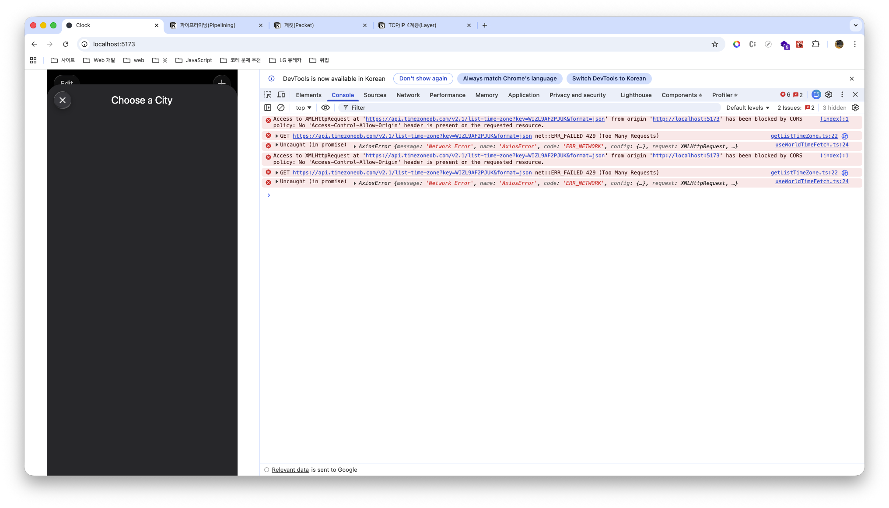

이러한 현상이 발생하는 이유는 Fetch API, XHR, Axios 등을 통해 네트워크 요청을 보냈을 때 요청이 실패하더라도, 브라우저가 해당 실패를 사용자 화면에 직접적인 영향을 주지 않는 상황으로 판단하면 에러를 화면에 출력하지 않기 때문입니다.

왜냐하면 결국 브라우저는 현재 페이지를 정상적으로 표시하는 것뿐만 아니라, 확장 프로그램, 외부 리소스 로드 등 다양한 외부 요인에 대해서도 동시에 처리합니다. 이 모든 상황에서 에러를 화면에 노출하게 되면 정상적인 소프트웨어 사용이 어려워질 수 있기 때문에 브라우저는 기본적으로 이러한 외부 요인으로 발생한 에러는 화면에 표시하지 않는 방향으로 동작합니다.

그 결과, 현재와 같이 네트워크 에러가 발생했더라도 해당 상태 값의 초기값이 빈 배열이며, JavaScritp 내장 객체(Built-in Object)인 배열에서 제공하는 메서드를 정상적으로 사용하고 있기 때문에 브라우저는 개발자 도구에는 에러 정보를 출력하지만 렌더링 결과에는 영향을 주지 않는 상태가 됩니다.

하지만 이 방식이 문제가 되는 이유는, 최근에는 API 요청과 같이 로딩이 발생하는 경우 Skeleton UI나 Loading Spinner와 같은 로딩 화면을 제공하는 것이 일반적인데, 로딩이 종료된 이후에도 아무런 리스트가 표시되지 않으면 개발자가 아닌 일반 사용자는 원인을 알 수 없는 오류로 인식하게 되고, 이는 결국 서비스 사용자 이탈로 이어질 수 있기 때문입니다.

<br />

> ⭐️ 지금 상황과 반대로 네트워크 요청 등으로 인해 오류가 발생했을 때 이 오류가 직접적인 렌더링 결과에 영향을 주는 경우에는 사용자 화면에는 빈 화면 또는 에러 결과문이 나타날 수도 있습니다.

<br />

**⑥ 친절하지 않은 Time Zone DB 공식 문서**

브라우저는 서버와 HTTP 프로토콜을 통해 서로 통신합니다. 따라서 필요한 자원에 대해 API 요청을 보내기 위해서는 URL(Uniform Resource Locator)을 사용하여 해당 자원의 명확한 위치를 식별한 뒤 요청을 전송하게 됩니다.

이처럼 프로젝트 내부에 구성된 API가 아닌 외부 API인 경우에는, 클라이언트가 해당 API의 사용 방법(요청 방식, 응답 결과 등)을 알 수 있도록 공식 문서를 운영하는 것이 일반적입니다. 현재 Clock 서비스에서 사용 중인 Open API인 Time Zone DB 역시 공식 문서를 제공하고 있습니다.

[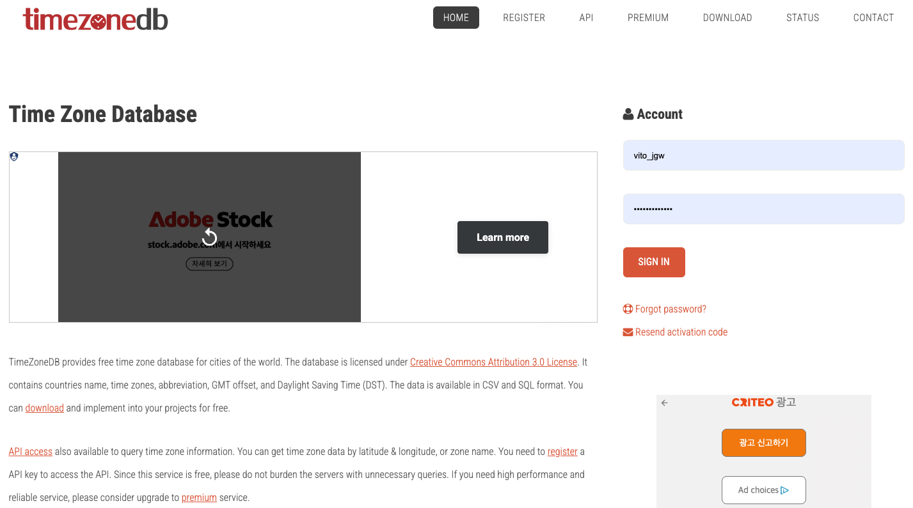](https://timezonedb.com/)

> _이미지를 클릭하면 Time Zone DB 공식 문서로 이동하실 수 있습니다._

<br />

하지만 모든 API나 라이브러이의 공식 문서가 항상 충분한 정보를 제공하는 것은 아닙니다. 특히 Time Zone DB와 같은 무료 Open API의 경우에는 문서의 상세도가 더 낮은 경우도 많습니다.

이를 단순히 문제로만 볼 수 없는 이유는, 공식 문서를 운영하고 유지하는 것 역시 인프라 비용이 발생하는 작업이며, 무료로 API를 제공하는 서비스 입장에서는 핵심 기능이 아닌 문서 영역에 추가적인 비용을 투자하기가 쉽지 않기 때문입니다.

본론으로 돌아와서, 이와 같은 무료 Open API를 사용하는 경우에도 결국 네트워크 요청은 발생하게 됩니다. 그리고 해당 API를 제공하는 서버가 클라이언트가 알 수 없는 이유로 정상적으로 동작하지 않는 상황이 발생하며, 클라이언트는 이에 대한 적절한 예외 처리를 수행하기 어려워집니다.

| Field |	Description |
|:--|:--|
| status |	Status of the API query. Either OK or FAILED. |
| message |	Error message. Empty if no error. |
| countryCode |	Country code of the time zone. |
| countryName |	Country name of the time zone. |
| zoneName |	The time zone name. |
| gmtOffset |	The time offset in seconds based on UTC time. |
| gmtOffset |	The time offset in seconds based on UTC time. |
| dst |	Whether Daylight Saving Time (DST) is used. Either 0 (No) or 1 (Yes). |
| timestamp |	Current local time in Unix time. Minus the value with gmtOffset to get UTC time. |

> _공식 문서에 명시된 [List Time Zone API의 응답 결과](./images/list-time-zone-api-reference.png)를 Markdown 형태로 정리한 테이블입니다._

<br />

위 응답 테이블을 보면, `status` 프로퍼티를 통해 API 요청 결과가 `OK` 또는 `FAILED`로 구분된다는 것을 알 수 있습니다. 즉, 서버에서 요청을 정상적으로 처리하지 못한 경우에도 실패 응답을 통해 이에 대한 예외 처리가 가능하다는 의미입니다.

하지만 Time Zone DB 공식 문서가 친절하지 않다고 느낀 이유는, 실패 응답이 반환될 수 있음에도 불구하고 어떤 상황에서 어떤 실패 응답이 반환되는지에 대한 정보가 공식 문서에는 명시되어 있지 않다는 점이었습니다.

이로 인해 실패 응답의 유형을 명확히 알 수 없어, List Time Zone API 요청에 대한 예외 처리 로직은 다음과 같이 제한적인 형태로 작성되어 있습니다.

```tsx
useEffect(() => {
  const fetchListTimeZone = async () => {
    try {
      // ...
    } catch(error) {
      if(error instanceof AxiosError) {
        switch(error.code) {
          case "ERR_NETWORK": {
            console.error("Axios 요청에서 Network Error가 발생했습니다.", error);
          }
        }
      }

      console.error(error);
    }
  }

  fetchListTimeZone();
}, []);
```

에러 응답이 발생했을 경우 `catch` 문에서 이에 대한 적절한 예외 처리가 이루어져야 하지만, 어떤 종류의 에러가 발생하는지 알 수 없기 때문에 현재는 단순히 에러를 출력하는 수준에 머물러 있는 상태입니다.

실제로 앞서 살펴본 문제점인 **"⑤ 적절한 예외 처리를 하지 않았을 경우"** 역시, Bottom Sheet 내부의 콘텐츠가 비어 있는 상태를 보고 개발자 도구를 열어 확인한 뒤에야 에러 발생 여부를 인지할 수 있었습니다.

즉, 에러가 발생했음에도 불구하고 어떤 에러인지 명확히 알 수 없기 때문에 적절한 예외 처리를 수행하지 못하는 구조가 됩니다. 이러한 상황에서 `/world` 페이지로 이동할 때마다 List Time Zone API 재요청이 빈번하게 발생한다면, 해당 문제는 더욱 크게 드러나게 됩니다.

<br />

## III. "List Time Zone 요청 API 로직" 문제 원인 분석 및 해결 방법

앞서 ["II. 현재 작성된 "List Time Zone 요청 API 로직"의 문제점"](#ii-현재-전체-시간대-목록-요청-api-로직의-문제점)에서는 현재 작성된 List Time Zone 요청 API 로직으로 인해 발생할 수 있는 여러 가지 문제점들을 정리했습니다. 이제 앞서 분석한 문제점들의 유형을 먼저 간단히 다시 정리해 보겠습니다.

|번호|문제점|문제 요약 설명|
|--|--|--|
|1|**HTTP 버전이 낮은 경우**|Time Zone DB Open API 서버의 HTTP 버전이 낮을 경우, 매 요청마다 **TCP/IP 연결 수립이 반복**되거나, 요청이 **FIFO 방식으로 처리하여 앞 요청 지연 시 이후 요청까지 함께 지연되는 HOL Blocking 문제**가 발생할 수 있음|
|2|**유료 서비스 Open API를 사용하는 경우**|API 요청 건당 비용을 부과하는 방식일 경우, 동일한 데이터에 대한 **반복 재요청으로 인해 불필요한 비용 증가** 발생|
|3|**요청이 발생할 때마다 JavaScript 로직 수행**|참조가 유지되는 데이터가 GC(Garbage Collection) 대상이 되지 못해 메모리가 해제되지 않는 경우, List Time Zone 요청･응답 과정에서 **메모리 사용량이 순간적으로 급증하여 런타임 성능에 직접적인 영향** 발생 가능|
|4|**사용자가 사용 중인 네트워크가 느린 경우**|사용자의 네트워크 환경이 좋지 않을 경우, `/world` 페이지 이동 시마다 **동일 데이터 재요청이 반복되어 응답 지연 및 UX 저하** 발생|
|5|**적절한 예외 처리를 하지 않았을 경우**|브라우저는 외부 요인에 대해 런타임 오류를 발생시키지 않기 때문에, 예외 처리가 없을 경우 **로딩 종료 이후에도 빈 화면만 표시되는 UX 문제** 발생 가능 _(직접적인 JS 오류 발생 시에는 에러 화면 출력 가능)_|
|6|**친절하지 않은 Time Zone DB 공식 문서**|실패 응답이 반환될 수 있음에도 불구하고, 무료 Open API 특성상 **실패 유형 및 에러 코드에 대한 정보가 공식 문서에 제공되지 않아** 재요청 시 어떤 오류 응답이 반환되는지 알 수 없으며, 그로 인해 문제 5번에 대한 적절한 예외 처리 구현이 어려움|

<br />

분석한 문제점들을 다시 살펴보면, 사용자가 `/world` 페이지로 이동할 때마다 동일한 데이터에 대해 **"재요청"** 이 발생한다는 구조가 여러 문제를 유발하는 가장 큰 원인이라는 것을 확인할 수 있습니다. 따라서 원본 서버(Origin Server)로 재요청을 보내지 않고, 동일한 데이터를 재사용할 수 있는 구조를 설계하는 것이 필요합니다.

다만 그전에, **"① HTTP 버전이 낮은 경우"** 문제는 Time Zone DB 서버의 HTTP 프로토콜 버전이 낮았을 경우를 가정하여 도출한 문제입니다. 그러나 아래 이미지에서 확인할 수 있듯이, Time Zone DB의 원본 서버는 HTTP/3 프로토콜을 사용하고 있기 때문에 해당 문제점은 현재 환경에서 실제로 발생하는 문제라기 보다는, 구조적으로 발생할 수 있는 문제를 가정하여 정리한 항목입니다.

<br />

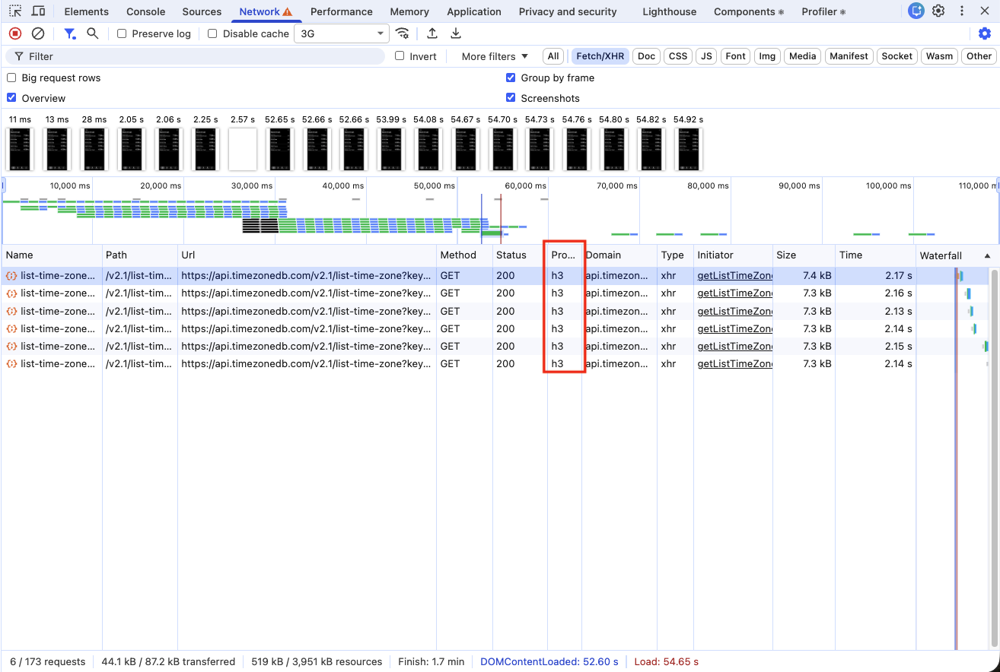

> _Dev Tools > Network 결과 항목에서 Protocol 열에 표시되는 h1, h2, h3 값은 클라이언트-서버 간에 사용되는 HTTP 프로토콜의 버전을 의미합니다._

<br />

다시 원래 문제로 돌아와 보면, "재요청"이 반복적으로 발생하는 상황에서 원본 서버로 요청을 보내지 않고 동일한 데이터를 재사용할 수 있는 방법은 무엇일까요? 바로 요청의 응답에 대해 **"캐싱(Cache)"** 을 적용하여 최적화하는 것입니다.

이 구조를 설계하기 전에, 먼저 캐시(Cache)란 무엇인지 살펴볼 필요가 있습니다. 캐시는 기본적으로 **"복사본을 저장하는 임시 저장소"** 를 의미합니다. 즉, 캐시의 원리는 자주 사용되거나 계산 비용이 큰 데이터를 매번 생성하지 않고, 더 빠르게 접근할 수 있도록 원본 데이터의 복사본을 임시 저장소에 저장하는 방식입니다.

> 캐시(Cache)에 대한 자세한 내용은 저의 노션 ["성능 최적화 | 캐시(Cache)"](https://gye-won.notion.site/Performance-Optimization-28288bd9c3fa80e6b712c8917e3934bb#2d988bd9c3fa80b889cad55b2e6ffaec)에서 확인할 수 있습니다.

이 **"개념"** 은 원래 운영체제(OS)에서 보조 기억 장치(HDD, SSD) 또는 주 기억 장치(RAM)에 대한 접근 속도를 줄이기 위해 사용되던 임시 저장소 공간을 부르는 용어였습니다. 이후 캐시라는 개념이 확장되면서, 현재는 다양한 환경에서 성능 최적화 기법으로 활용되고 있습니다.

그렇다면 브라우저 환경에서는 요청 응답에 대한 캐시를 어떻게 설정할 수 있을까요? 응답 헤더에 `Cache-Control`이 설정되어 있다면, 브라우저는 해당 응답에 대한 전반적인 캐싱 과정을 자동으로 관리하게 됩니다.

> HTTP 헤더 중 캐싱 정책을 설정할 수 있는 헤더의 종류와 각 헤더에 대한 설명은 저의 노션 ["HTTP 헤더 | 캐싱(Caching)"](https://gye-won.notion.site/Caching-29988bd9c3fa8089bcdecbcb03945ceb?pvs=74)에서 확인할 수 있습니다.

따라서 Time Zone API의 응답 헤더에 `Cache-Control`을 통해 캐시 정책이 설정되어 있다면, 앞서 살펴본 문제점들 역시 구조적으로 완하될 수 있습니다. 이를 확인하기 위해 개발자 도구 > 네트워크 탭에서 요청의 응답 헤더를 한 번 살펴보겠습니다.

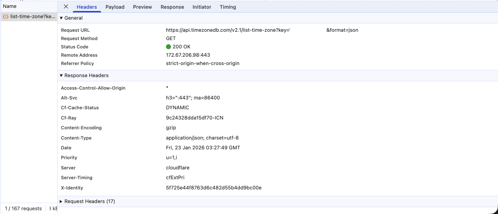

List Time Zone API의 응답 결과를 살펴보면, 캐시 정책을 설정할 수 있는 `Cache-Control` 헤더가 전혀 존재하지 않는 것을 확인할 수 있습니다. 즉, 브라우저는 해당 응답에 대한 전반적인 캐싱 과정을 자동으로 관리하지 않으며, 원본 데이터의 복사본을 임시 저장소에 저장하지 않고 요청이 필요할 때마다 계속해서 원본 서버로 요청을 보내는 구조임을 확인할 수 있습니다.

<br />

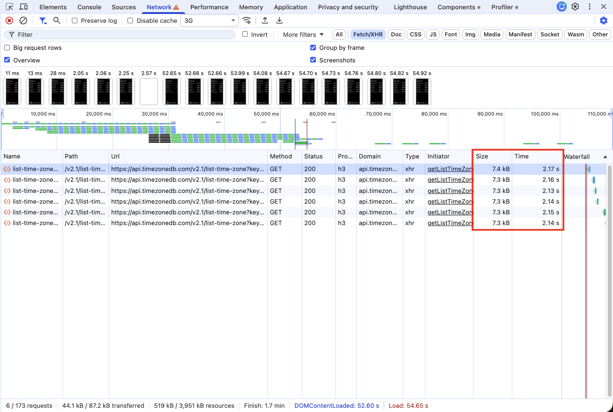

> 💡 Tip. 개발자 도구 > 네트워크 탭에서 Size 열을 확인하면, 최초 요청 이후 캐시된 응답은 크롬 기준으로 `(disk cache)` 또는 `(memory cache)`로 표시되기 때문에 캐싱 여부를 쉽게 확인할 수 있습니다.

<br />

그렇다면 응답 헤더에 `Cache-Control`이 설정되어 있지 않은 상황에서는 동일한 데이터를 계속 재요청할 수밖에 없을까요? 이 질문에 대한 답은 "아닙니다." 입니다.

왜냐하면, 앞서 캐시의 개념을 설명할 때, `.md` 문서를 작성하면서는 잘 사용하지 않는 볼드체를 사용해 **"개념"** 이라는 표현을 강조한 이유도 바로 여기에 있습니다. 캐시는 앞서 설명했듯이, 운영체제(OS)에서 사용되던 방식이 확장된 개념이기 때문입니다.

즉, 응답 헤더에 캐시 정책이 포함되어 있지 않더라도, 웹 스토리지(Local Storage, Session Storage), 쿠키(Cookie), IndexedDB와 같은 **브라우저 저장소를 사용**하거나, 변수에 **응답 결과를 저장하여 메모리에 유지**하는 방식, 또는 **TanStack Query와 같은 외부 패키지를 활용**하는 방식으로도 데이터 캐싱 구조를 직접 구현할 수 있습니다.

다만 이러한 방식은, 브라우저가 전반적으로 책임지던 **캐싱 과정**을 **개발자가 전적으로 책임지고 직접 로직으로 구현**해야 한다는 의미이기도 합니다. 그렇다면 이러한 방법들 중, 어떤 방식이 가장 적절한지에 대해 살펴보겠습니다.

<br />

**① TanStack Query와 같은 외부 패키지를 사용하는 방식**

TanStack Query와 같은 외부 패키지를 사용하면, 개발자가 직접 로직을 구현해야 하는 캐싱 과정을 설정만으로 간단하게 구성할 수 있으며, 자체적으로 제공하는 메서드들을 활용해 다양한 상황을 대비하면서 API 요청 로직을 구조적으로 단순화할 수 있다는 장점이 있습니다.

실제로 이전 ["PICKY 프로젝트"](https://github.com/LG-Uplus-Movie-SNS-PICKY/PICKY-FE/tree/dev)에서 API 요청 로직과 캐싱 구조를 구현하기 위해, 다음과 같이 TanStack Query에서 제공하는 `useQuery()`와 `useInfiniteQuery()` 메서드를 활용해 로직을 작성했습니다.

```tsx
// TMDB 영화 상세 데이터 React Query - Custom Hook
export const useDetailMovieInfo = (movieId: number) => {
  return useQuery({
    // ...
  });
};
```

```tsx
// 사용자가 좋아요 누른 영화 조회 React Query - Custom Hook
export const useUserLikedMovies = (nickname: string) => {
  return useInfiniteQuery({
    // ...
  });
};
```

하지만 이전에 진행한 PICKY 프로젝트와 현재 진행 중인 Clock 프로젝트의 가장 큰 차이점은, 현재 프로젝트에서는 작성된 API 요청 로직이 단 하나뿐이라는 점입니다. 또한 PICKY 프로젝트를 진행하던 당시에는 캐시가 개념적으로 존재하며, 다른 저장소를 통해 구현할 수 있다는 사실은 알고 있었지만, 그 구조와 동작 원리에 대해서는 정확히 이해하지 못한 상태였습니다.

특히 캐시의 신선도(Freshness)에 따른 캐시 검증(Cache Validation)을 위한 서버와 조건부 요청(Conditional Request)을 통해 만료된 캐시 자원의 재사용 및 갱신 구조 등에 대한 개념도 알지 못했고, HTTP 헤더를 통한 캐싱 방식이나 전반적인 흐름에 대한 이해도 부족한 상태였습니다.

이로 인해, 그 당시에는 프론트엔드 환경에서 캐싱을 구현하려면 브라우저 저장소(Local Storage, Session Storage, Cookie, IndexedDB 등)를 직접 사용하는 방식도 있겠지만, 가장 많이 사용되고 있고, 내부적으로 로직이 이미 구성되어 있으며, 최적화를 전담해 주는 도구를 사용하는 것이 합리적이라고 판단하여 TanStack Query를 사용했던 것입니다.

다만 저는 개발자는 기술이 등장한 목적과 배경이 되는 기본 개념을 이해해야 한다는 생각을 가지고 있어, 매일 특정 기술의 개념이나, 해당 기술 이전에 사용되던 구조와 방식에 대해 학습을 진행하고 있습니다.

그러다보니 Clock 프로젝트를 진행하면서 따로 캐시와 브라우저 캐시에 대한 공부도 별도로 진행하고 있는 상태였습니다. 그 과정에서 TanStack Query가 개발자가 전적으로 책임지는 브라우저 캐시 구조를 작성할 때 단순히 도와주는 도구라는 점을 이해하게 되었습니다.

그 결과, 현재 Clock 프로젝트에서 List Time Zone API 재요청 문제를 해결하기 위해 Cache-Control이 없는 상황에서 캐싱 구조를 직접 설계해야 하는 이 시점에서, "과연 TanStack Query라는 도구가 필요할까?"라는 질문을 스스로 던지게 되었습니다.

하지만 앞서 언급했듯이, 현재 Clock 프로젝트에서는 API 요청 로직이 단 하나뿐입니다. 즉, 단일 요청의 응답 결과를 캐시로 저장하기 위해 TanStack Query와 같은 외부 패키지를 도입하는 것은 오히려 프로젝트 규모 대비 의존성이 증가하여 번들 크기 및 빌드 시간만 증가시키는 오버 엔지니어링에 해당한고 판단했습니다.

또한 브라우저 저장소를 사용하더라도 저장 용량을 크게 차지하지 않으며, 데이터의 정보가 변경되지 않는 구조이기 때문에 캐시의 신선도를 장기간 유지하더라도 문제가 없는 상황에서는 외부 패키지 도입은 더욱 오버 엔지니어링이라고 판단했습니다.

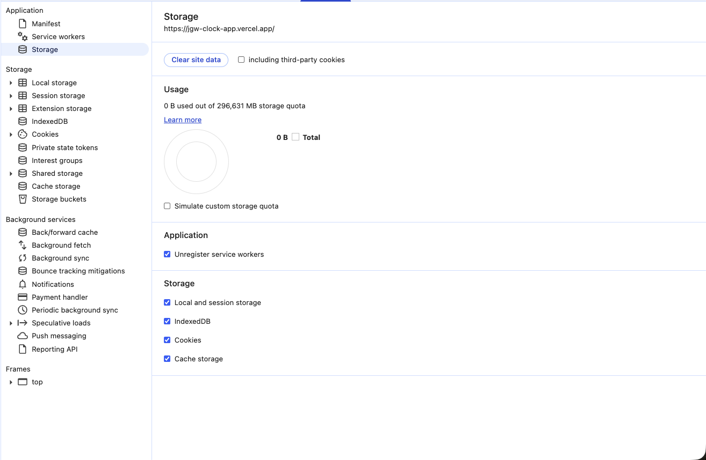

> _0 B used out of 296,631 MB storage quota: 총 296,631 MB 할당량 중 0B 사용_

<br />

실제로 "개발자 도구 > Application" 탭을 확인하면, 각 탭마다 제공되는 브라우저 저장소의 할당량과 현재 사용 중인 용량을 확인할 수 있습니다. Clcok 프로젝트의 배포 사이트 기준으로 보면, 브라우저는 탭마다 총 296,631MB의 저장 공간을 할당받고 있음에도 불구하고, 실제 사용량은 1kB 조차 사용하지 않고 있다는 것을 확인할 수 있습니다.

따라서 현재 Clock 프로젝트에서는 외부 패키지를 통한 캐싱 구조 도입은 적절하지 않다고 판단하여, TanStack Query와 같은 외부 라이브러리는 사용하지 않기로 결정했습니다.

<br />

**② Session Storage 또는 변수에 응답 결과를 저장하여 메모리 유지하는 방식**

Session Storage 또는 변수를 사용해 응답 결과를 메모리에 유지하는 방식은 개념적으로는 떠올렸지만, 실제 도입 대상으로는 고려하지 않았습니다.

그 이유를 설명하기 전에 앞서, ["II. 현재 작성된 "List Time Zone 요청 API 로직"의 문제점"](ii-현재-전체-시간대-목록-요청-api-로직의-문제점) 목차에서 설명한 문제점 중 **"④ 사용자가 사용 중인 네트워크가 느린 경우"** 에서 네트워크 성능을 3G 환경으로 최악의 상황을 가정했을 때의 List Time Zone API 최초 응답 시간을 다시 한 번 살펴보겠습니다.


앞서 확인했듯이, 네트워크 속도를 3G로 제어했을 경우 **"최초 요청 시"** 약 2.17s 이후에 응답을 도착하는 것을 확인할 수 있습니다. 즉, Session Storage 또는 변수를 사용하는 방식을 선택하지 않은 가장 큰 이유는 이 방식들이 가지는 **"휘발성"** 특성 때문입니다.

Session Storage는 정확히 말하면 메모리에 직접 저장되는 구조는 아니지만, 브라우저 저장소에 데이터를 저장하되 Local Storage와 달리 탭이 유지되는 동안에만 데이터가 유지되는 저장 공간입니다. 또한 변수를 사용하는 방식은, 메모리에 직접 할당되기 때문에 접근 속도는 빠르지만, 실행 컨텍스트가 종료되면 메모리에서 즉시 제거되는 구조입니다.

따라서 이 방식을 사용할 경우, "최초 요청" 이후에는 저장된 데이터를 재사용할 수는 있지만, 문제는 매 세션마다 발생하는 최초 요청이 항상 존재하게 되며, 그때마다 다시 느린 네트워크 환경에서 응답을 받아와야 한다는 점입니다.

결과적으로 이러한 구조는 최초 요청 비용을 구조적으로 해결하지 못하기 때문에, List Time Zone API 재요청 문제를 해결하는 방식으로는 적절하지 않은 선택이라고 판단했습니다.

<br />

**③ Local Storage 또는 IndexedDB에 저장하여 유지하는 방식**

캐싱 로직을 설계하기 위한 방법 중, 처음에는 앞서 살펴본 **"① TanStack Query와 같은 외부 패키지를 사용하는 방식"** 을 고려했습니다. 그러나 앞에서 정리한 것처럼 오버 엔지니어링에 해당한다고 판단형, 해당 방식은 후보군에서 제외했습니다.

그렇다면 Session Storage 또는 변수를 사용하는 방식을 제외하고, **최초 요청 이후의 응답 결과를 사용자가 페이지를 다시 접속하더라도 지속적으로 재사용할 수 있는 구조**를 기준으로 보면, 가장 적절한 방법은 Local Storage 또는 IndexedDB를 활용하는 방식이라고 판단했습니다.

이 판단의 근거를 설명하기 전에, 프록시 서버 없이 단순히 클라이언트(브라우저) <-> 원본 서버 간에 HTTP 프로토콜을 통해 통신하는 경우의 "브라우저 캐시(Browser Cache)"의 동작 원리를 간단히 살펴보겠습니다.


1. 브라우저가 원본 서버(Origin Server)로 요청을 보낸다.
1. 원본 서버는 요청에 대한 로직을 수행한 뒤, 응답 헤더에 `Cache-Control` 캐시 정책을 설정하여 응답을 반환한다. _(또는 UTC 기반의 `Expirse` 헤더를 통해 절대 만료 시점을 지정할 수도 있음)_
1. 응답을 전달받은 브라우저는 `Cache-Control` 지령의 `max-age` 값을 기준으로 웹 캐시(Disk Cache) 또는 메모리 캐시(Memory Cache) 방식 중 하나로 응답 결과를 저장한다.
1. 이후 동일한 요청이 발생하면, 브라우저는 서버로 요청을 보내기 전에 캐시 저장소를 먼저 확인하다. _(이때 캐시 저장소는 로컬 환경의 Disk 또는 Memory 영역을 의미하며, Application 탭의 Cache Storage를 의미하는 것이 아님)_
1. 저장된 캐시가 존재할 경우, 해당 캐시의 `Date` 헤더를 기준으로 `max-age` 기간이 지났는지 확인한다.
1. `max-age` 기간이 지나지 않았다면, 원본 서버로 요청을 보내지 않고 저장된 캐시 데이터를 즉시 재사용한다. _(브라우저 캐시는 로컬 환경에 저장되므로 네트워크 요청보다 훨씬 빠르게 접근 가능)_
1. 반대로 `max-age` 기간이 지났다면, 브라우저는 캐시 검증(Cache Validation)을 위해 서버에 조건부 요청(Conditional Request)을 전송하고, 응답에 따라 재사용(304 Not Modified) 또는 갱신(200 OK)을 수행한다. _(즉, 캐시로 저장되었더라도 만료 기간이 지나면 추가적인 요청이 발생한다. 다만 재사용(304)인 경우, 전송되는 HTTP 응답에는 헤더만 포함되므로 네트워크 전송량이 매우 작아 기본 요청보다 훨씬 빠르게 응답을 전달받을 수 있다. 반면, 갱신(200)인 경우에는 일반 요청과 동일한 응답 구조를 가짐)_

<br />

동작 구조를 보면 알 수 있듯이, 응답 결과를 캐시하기 위해서는 반드시 **한 번의 요청(최초 요청)** 은 발생하게 됩니다. 그러나 이후 동일한 요청에 대해서는, 브라우저 캐시 저장소에 저장된 응답 결과를 조회하여 네트워크 요청 없이 재사용하는 구조임을 확인할 수 있습니다.

하지만 현재 List Time Zone API는 `Cache-Control` 응답 헤더를 통해 캐시 정책이 설정되어 있지 않기 때문에, 브라우저 캐시에 저장에 응답 결과를 저장할 수 없는 구조입니다. 즉, 최초 요청으로 전달된 응답 결과를 저장할 수 있는 별도의 공간이 필요하며, 유효 기간이 만료되지 않았다면 사용자가 페이지를 나갔다가 다시 진입하더라도 해당 캐시 응답이 유지되어야 합니다.

> _💡 브라우저 캐시에 직접 접근할 수 없는 이유는, 응답 결과가 **로컬 환경에 저장**되며 인증 정보와 같은 **민감한 정보를 포함**할 수 있기 때문에, JavaScript로 직접 조작할 수 있는 방법을 제공하지 않기 때문입니다._

따라서 이 구조를 브라우저 캐시 저장소를 활용하지 않고 구현하기 위해서는, Local Storage 또는 IndexedDB를 활용해 비휘발성 저장소 기반의 캐시 구조를 구성하여 브라우저 캐시 저장소를 대체하는 방식이 가장 적절하다고 판단했습니다.

다만, 유효 기간이 만료된 이후에는 캐시 검증을 위해 조건부 요청을 수행해야 하지만 List Time Zone API는 변경 여부를 식별할 수 있는 식별자(Last-Modified, ETag, Vary)가 존재하지 않습니다.

또한 지금까지 응답 데이터가 변경되지 않는다고 설명해 왔지만, 이를 절대적으로 단언할 수는 없습니다. 왜냐하면 Open API 특성상, 해당 API를 제공하는 서비스 측에서 응답 구조나 데이터를 수정할 경우 응답 결과는 언제든지 변경될 수 있기 때문입니다.

그렇기 때문에 Local Storage 또는 IndexedDB를 활용하여 브라우저 캐시 저장소를 구축할 것이지만, 캐시 검증을 위한 조건부 요청은 재사용(304 Not Modified)이 아닌 갱신(200 OK) 방식으로 처리할 것입니다.

<br />

## IV. Local Storage vs IndexedDB

["III. "List Time Zone 요청 API 로직" 문제 원인 분석 및 해결 방법"](#iii-list-time-zone-요청-api-로직-문제-원인-분석-및-해결-방법)에서, 현재 List Time Zone API의 근본적인 문제 원인이 재요청 구조에 있으며, 해결 방향으로는 최초 요청을 통해 전달받은 응답 결과를 브라우저 저장소에 저장하여 캐싱 로직을 구성하는 방식을 선택했습니다.

그러나 List Time Zone API의 응답 헤더에는 HTTP 헤더 기반의 `Cache-Control` 캐시 정책이 포함되어 있지 않기 때문에, 브라우저 캐시 저장소를 직접 활용하는 방식이 아닌 Local Storage 또는 IndexedDB를 사용하는 구조를 선택하게 되었습니다.

두 방식 모두 비휘발성 저장소라는 특징을 가지고 있기 때문에, 사용자가 페이지를 나갔다가 다시 접속하더라도 저장된 데이터가 유지되어 추가 요청이 발생하지 않는다는 공통점을 가집니다.

즉, 브라우저 캐시 저장소를 대체하는 구조를 구성하는 과점에서는 두 방식 모두 올바른 선택지가 될 수 있습니다. 다만 두 저장소는 의미와 기술적 구조에 차이가 있기 때문에, 각 저장소의 사용 방식과 특성을 비교한 후 현재 구조에 더 적절하다고 판단되는 저장소를 선택해 보겠습니다.

<br />

### A. Local Storage

Local Storage는 클라이언트(브라우저)에서 사용할 수 있는 Key-Value 형태의 저장소로, 페이지를 닫거나 브라우저를 종료하더라도 데이터가 삭제되지 않고 영구적으로 유지되는 비휘발성 브라우저 저장소입니다.

> Local Storage의 자세한 개념은 저의 노션 ["브라우저 데이터 저장소 | Local Storage"](https://gye-won.notion.site/Local-Storage-2b488bd9c3fa80e88769cfaf087209bf?pvs=74)에서 확인할 수 있습니다.

이러한 특성 때문에 Local Storage는 특정 상태를 지속적으로 유지해야 하는 용도로 많이 활용됩니다. 대표적인 예로는 사용자의 테마 모드, 언어 설정, 로그인 상태 유지(토큰 기반 인증 구조) 등이 있습니다.

```tsx
const handleToggleTheme = () => {
  let currentTheme = localStorage.getItem<Theme>("theme"); // 현재 설정된 테마의 정보를 가지고 온다.

  switch(currentTheme) {
    case "light": {
      currentTheme = "dark"; // Light -> Dark
    }
    case "dark": {
      currentTheme = "light"; // Dark -> Light
    }
  }

  localStorage.setItem("theme", currentTheme); // 변경된 테마 상태를 영구 저장

  // 📌 실제 구현 시에는 테마 변경이 화면에 반영되어야 하므로,
  // React 환경에서는 상태(state)를 통해 리렌더링을 발생시키고,
  // Vanilla JavaScript 환경에서는 DOM의 class 속성을 제어하는 방식으로 처리됩니다.
}
```

위 코드와 같이 Local Storage는 특정 상태를 영구적으로 보존하기 위한 용도로 많이 사용됩니다. 다만 Local Storage를 포함한 웹 스토리지(Web Storage)는 일반적으로 약 5MB ~ 10MB 수준의 저장 용량 제한을 가지며, Key-Value 구조이지만 Value에는 문자열 형태의 데이터만 저장 가능하다는 제약이 있습니다.

즉, 배열이나 객체와 같은 복잡한 구조의 데이터를 저장하기 위해서는 문자열로의 직렬화 과정이 필요합니다. 그러나 단순 문자열로 변환할 경우, 실제 내부 데이터 구조는 유지되지 않고 참조 주소에 대한 문자열 표현만 남게 됩니다.

```java
public class Main {
  public static void main(String[] args) {
    String str[] = {"a", "b", "c"};
    
    System.out.println("Length: " + str.toString());
  }
}
// -> Length: [Ljava.lang.String;@5a07e868
```

```tsx
// 배열은 내부 값을 콤마(,)로 연결한 문자열로 변환됨
// 객체는 [object, Object] 형태의 문자열로 변환됨
const users = [
  { id: 1, name: "Vito", age: 28 },
  { id: 2, name: "John", age: 28 },
  { id: 3, name: "Michele", age: 28 },
];

console.log(String(users)); // 또는 users.toString()
// -> [object Object],[object Object],[object Object]
```

위 예시에서 확인할 수 있듯이, 참조 값을 단순 문자열로 변환할 경우 실제 데이터 구조를 보존하지 못하고 참조 주소에 대한 문자열만 생성하게 됩니다. 그러나 참조 자료형을 문자열로 변환하는 방법이 없는 것은 아닙니다.

JavaScript의 경우 JSON 빌트인 객체를 활용하는 방법입니다.` JSON.stringify()`를 통해 **"JSON 기반 데이터 -> 문자열"** 직렬화를 수행하고, `JSON.parse()`를 통해 **"문자열 -> JSON 기반 데이터"** 로 역직렬화할 수 있습니다.

표면적으로 보면 이는 매우 단순하고 편리한 방식처럼 보이지만, 내부 동작 구조를 살펴보면 생각이 달라지게 됩니다. 다음 코드는 실제 `JSON.stringify()` 구현이 아닌, 동작 원리를 이해하기 위해 구조를 유추하여 작성한 알고리즘 예시 코드입니다.

```tsx
// 실제 JSON.stringify() 내부 구현이 아닌 동작 구조를 이해하기 위한
// 동작 원리의 개념을 바탕으로 유추하여 작성한 알고리즘입니다.
class JSON {
  stringify(data: object | object[]) {
    let result = "";

    if(Array.isArray(data)) {
      result += "[";
      
      for(const value of data) {
        const valueType = getValueType(value);

        switch(valueType) {
          // 배열 내부의 값이 원시 자료형인 경우
          case "string":
          case "number":
          case "boolean":
          case "undefined":
          case "null": { // Null 자료형은 실제로 typeof 시 object로 나오게 됩니다. (JS 초기 결함)
            result += value;
            break;
          }
          case "object": {
            result += this.stringify(value); // 재귀를 통해 다시 내부 구성 요소의 값들을 재구성한 결과를 결합한다.
            break;
          }
        }

        result += ",";
      }

      result += "]";
    } else {
      result += "{";

      Object.Keys(data).forEach((key) => {
        result += `"${key}":`;

        const valueType = getValueType(value);

        switch(valueType) {
          // 배열 내부의 값이 원시 자료형인 경우
          case "string":
          case "number":
          case "boolean":
          case "undefined":
          case "null": { // Null 자료형은 실제로 typeof 시 object로 나오게 됩니다. (JS 초기 결함)
            result += value;
            break;
          }
          case "object": {
            result += this.stringify(value); // 재귀를 통해 다시 내부 구성 요소의 값들을 재구성한 결과를 결합한다.
            break;
          }
        }
      });

      result += "}";
    }

    return result;
  }

  // ...
}
```

구조를 보면, 전달받은 `data`의 각 프로퍼티에 접근하여 원시 값을 문자열로 변환하고, 재귀 구조를 통해 중첩 객체를 순회하면서 최종 문자열을 구성하는 방식임을 확인할 수 있습니다.

문제가 되는 지점은, API 응답 데이터의 구조를 사전에 예측할 수 없다는 점입니다. 응답이 단일 객체인지, 배열 구조인지, 중첩 구조인지, 혹은 복합 구조인지 알 수 없기 때문에 직렬화 비용은 구조에 따라 크게 달라지게 됩니다.

이를 "최선의 경우", "평균의 경우", "최악의 경우"와 같이 경우별로 나눠서 보면 다음과 같습니다.

- **최선의 경우(Best Case)**: 단일 객체 + 모든 프로퍼티가 원시 자료형 -> 객체 프로퍼티 수만큼 반복 수행 -> 시간 복잡도 O(N)
- **평균의 경우(Average Case)**: 단일 객체 + 중첩 구조 포함 -> 반복문 + 재귀 구조 결합 -> 재귀 깊이에 따라 시간 복잡도 예측 어려움
- **최악의 경우(Worst Case)**: 배열 구조 + 내부 요소가 중첩 객체 구조 -> 배열 순회 + 객체 순회 + 재귀 호출 중첩 -> 문자열 직렬화 반복 수행

이 구조에서 단순 반복문도 비용 요소가 될 수 있지만, 가장 큰 문제는 재귀 호출 구조입니다. 재귀는 함수 호출이 누적되며 콜 스택을 사용하게 되고, 스택 깊이에는 제한이 존재하므로 스택 오버플로우(Stack Overflow) 위험이 발생할 수 있습니다. 이는 곧 런타임 오류로 이어질 수 있는 구조입니다.

또한 재귀 구조는 동일한 계산이 반복 수행될 가능성이 있으며, 종료 조건이 명확하지 않을 경우 무한 루프 위험성도 함께 내포하게 됩니다.

문제는 저장 과정에서 끝나지 않습니다. Local Storage에 문자열 형태로 저장된 데이터를 다시 사용하기 위해서는 반드시 역직렬화 과정이 필요하며, 이 역시 문자열을 다시 복잡한 객체 구조로 복원하는 연산 비용을 수반하게 됩니다.

즉, Local Storage를 사용하여 응답 결과를 저장하는 구조는 단순 저장 비용뿐만 아니라 직렬화 + 역직렬화 과정이 모두 포함되는 구조이며, 결과적으로 성능 측면에서 불리한 특성을 가지게 됩니다.

<br />

> 물론 실제 `JSON.stringify()`와 `JSON.parse()`는 내부적으로 다양한 알고리즘 최적화가 적용되어 있기 때문에, 서술한 문제점들이 그대로 구현되어 있지는 않을 것입니다.
> 그러나 동작 원리 자체는 유사한 구조를 가지기 때문에, 네트워크 응답 결과를 직렬화･역직렬화하여 저장하는 구조가 성능 측면에서 불리한 특성을 가진다는 점은 동일합니다.

<br />

실제 Local Storage와 IndexedDB 간의 성능 차이를 비교하기 위해, 우선 Local Storage를 기반으로 브라우저 캐시 저장소를 대체하는 구조로 기존 로직을 수정해보겠습니다.

```tsx
useEffect(() => {
  const fetchListTimeZone = async () => {
    const listTimeZoneDatas = localStorage.getItem("listTimeZone");
    
    console.log("Local Storage에 List Time Zone API의 응답 결과가 포함되어 있는가?");

    // Local Storage에 최초 요청 이후 저장된 List Time API의 응답 결과가 있는 경우
    if(listTimeZoneDatas !== null) {
      console.time("yes");
      setWorldTimeListData(JSON.parse(listTimeZoneDatas));
      console.timeEnd("yes");
      return;
    }

    // Local Storage에 최초 요청 이후 저장된 List Time API의 응답 결과가 없는 경우
    try {
      //...

      console.log("List Time Zone API 응답 개수:", response.data.zones.length);

      console.time("no");
      localStorage.setItem("listTimeZone", JSON.stringify(response.data.zones));
      console.timeEnd("no");
    } catch(error) {
      // ...
    }
  }

  fetchListTimeZone();
}, []);
```

위와 같이 기존 로직을 간단히 수정한 뒤, Local Storage를 비운 상태에서 다시 실행하여 출력 결과를 확인해보겠습니다.

```md
# Local Storage에 응답 결과가 없는 경우
List Time Zone API 응답 개수: 418
no: 0.16796875 ms

# Local Storage에 응답 결과가 있는 경우
yes: 0.299072265625 ms
```

> 위 코드 블록은 실제 출력된 로그를 보기 쉽게 Markdown 형식으로 정리한 내용입니다. 실제 개발자 도구에서의 출력 화면은 [여기](./images/time-zone-response-local-storage-cache.png)에서 확인할 수 있습니다.

출력 결과를 확인하면, Local Storage에 응답 결과가 **없는 경우 약 0.17ms**, 응답 결과가 **이미 저장되어 있는 경우 약 0.3ms**의 시간이 소요된 것을 확인할 수 있습니다.

앞서 언급한 것처럼 JSON 빌트인 객체의 내부 알고리즘은 충분히 최적화되어 있기 때문에, 시간 수치만 놓고 보면 1ms도 걸리지 않는 매우 빠른 속도로 응답 결과의 저장 및 조회가 이루어지고 있음을 확인할 수 있습니다.

그러나 단순 콘솔 출력 시간만으로는 실제 성능 영향을 판단하기 어렵기 때문에, Local Storage를 비운 후 "개발자 도구 > Performance" 탭을 통해 응답 결과를 저장하는 과정과 조회하는 과정의 실제 런타임 성능을 다시 측정해보겠습니다.

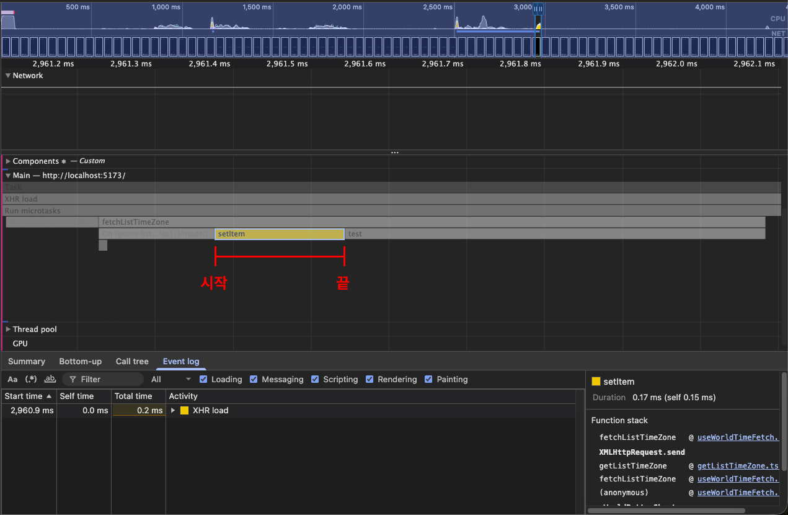

> setItem 우측에 표시된 test 함수는 Performance의 Main 탭이 JavaScript 메인 스레드의 콜 스택 기반 함수 호출 구조이기 떄문에, 실행 흐름을 명확히 구분하기 위해 분석용으로 임시 생성한 함수입니다.

Performance 패널에서 JavaScript 메인 스레드 구간을 살펴보면, `localStorage.setItem()` 호출 막대가 이어진 뒤 분석용으로 만든 `test()` 함수가 실행되는 것을 확인할 수 있습니다. 이는 무엇을 의미하는 것일까요?

이는 `localStorage.setItem()`이 **호출된 시점부터 종료되는 시점까지**를 하나의 막대(duration)로 표현하고 있다는 의미입니다. 즉, 해당 메서드가 **동기적으로 실행**되며, 호출이 끝나기 전까지는 다음 코드로 진행할 수 없다는 것을 보여줍니다.

다시 말해 Local Storage의 메서드는 동기 방식으로 동작하기 때문에, 응답 결과를 저장하거나 조회하는 과정이 **완전히 종료된 이후**에야 다음 명령줄로 넘어가 작업을 수행할 수 있습니다. 물론 현재 측정 결과에서는 `localStorage.setItem()`의 지속 시간(duration)이 약 0.17ms 수준으로 매우 짧기 때문에, 즉시 문제로 이어지지는 않습니다.

하지만 `JSON.stringify()`에 전달되는 데이터의 크기나 구조가 복잡해질수록 직렬화 비용이 증가하고, 그만큼 `localStorage.setItem()`의 수행 시간도 함께 늘어납니다. 또한 해당 시점에 화면 반영을 위한 렌더링 작업이 겹친다면, 메인 스레드가 블로킹되어 **렌더링 지연**으로 이어질 수 있습니다. 이를 확인하기 위해 다음과 같이 코드를 수정한 뒤 결과를 살펴보겠습니다.

```tsx
const dummyDatas = Array.from({ length: 10000 }, () => response.data.zones[0]);

console.log("List Time Zone API 응답 개수:", response.data.zones.length);
console.time("no");
localStorage.setItem("listTimeZone", JSON.stringify(arr));
console.timeEnd("no");
```

```md
List Time Zone API 응답 개수: 10000
no: 2.43603515625 ms
```

<br />

> 위 코드 블록은 실제 출력된 로그를 보기 쉽게 Markdown 형식으로 정리한 내용입니다. 실제 개발자 도구에서의 출력 화면은 [여기](./images/local-storage-stress-test-console.png)에서 확인할 수 있습니다. _(원본 이미지의 응답 개수는 418로 나와있지만, 실제 테스트 데이터 크기는 10,000 입니다.)_

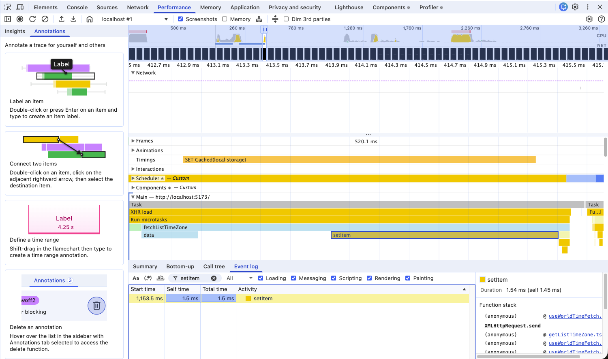

이미지에서 확인할 수 있듯이, 실제 API 응답 결과가 418개인 경우에는 약 0.17ms 내에 직렬화 및 저장이 완료되었습니다.

반면, 배열 크기를 10,000개로 늘리고 각 요소를 동일한 응답 데이터로 채운 경우에는 **전체 시간이 약 2.5s가 소요**되고, `localStorage.setItem()` 자체의 **작업 시간은 약 1.43ms로 증가**한 것을 확인할 수 있습니다.

즉, 최악의 상황을 가정하여 부하 테스트를 수행해보면, Local Storage 기반으로 응답 결과를 저장하는 방식은 다음과 같은 단점을 가지게 됩니다.

- `JSON.stringify()` / `JSON.parse()`에 의해 직렬화 및 역직렬화 비용이 추가된다.
- Local Storage에서 제공하는 기능들은 동기적으로 수행하기 때문에, 저장/조회 작업이 끝날 때까지 메인 스레드가 블로킹된다.
- 그 결과, 동일 시점에 렌더링 작업이 발생하면 렌더링 지연으로 이어질 수 있다.

<br />

### B. IndexedDB

Clock 프로젝트를 진행하기 전부터 IndexedDB라는 브라우저 저장소가 있다는 사실은 알고 있었습니다. 다만 실제로 어떻게 사용하는지, IndexedDB가 Local Storage와 비교했을 때 비휘발성 특징 외에 어떤 차이점이 있는지에 대해서는 정확히 알지 못했습니다.

그래서 IndexedDB를 활용해 브라우저 캐시 저장소를 대체하고, Local Storage와의 성능을 직접적으로 분석하기에 앞서, 먼저 MDN 공식 문서를 통해 IndexedDB의 주요 특징과 사용 방법을 학습했습니다. 이후 해당 내용을 바탕으로 성능 분석을 진행했습니다.

<br />

> IndexedDB에 대해 학습한 내용은 저의 노션 ["브라우저 데이터 저장소 | IndexedDB"](https://gye-won.notion.site/IndexedDB-2f388bd9c3fa80a6bc8af8f30f12ff76?pvs=74)에서 확인할 수 있습니다.

<br />

IndexedDB는 트랜잭션 기반 접근 모델을 사용하는 클라이언트 측 저장소이며, 주요 특징은 다음과 같습니다.

- IndexedDB에 저장되는 데이터는 Key-Value 구조를 가집니다. 다만 웹 스토리지(Web Storage)와 달리 문자열뿐만 아니라 객체와 같은 **구조화된 데이터**, **바이너리 데이터** 등 **다양한 형태의 값을 저장**할 수 있습니다.
- 대부분의 작업은 **논블로킹(Non-Blocking) 방식의 비동기 처리**로 수행되며, 각 작업의 성공 또는 실패 결과는 이벤트(Event)를 통해 전달되는 이벤트(Event-driven) 기반 구조를 가집니다.
- 데이터베이스 내부의 객체 저장소(Object Store)는 JavaScript 객체를 저장 단위로 사용하는 저장 공간이며, 인덱스(Index)는 브라우저 내부 구현에 따라 B-Tree 계열 기반의 정렬된 접근 구조로 관리됩니다. 이를 통해 **인덱스 키를 이용한 조회 시 일반적으로 O(log N) 수준의 접근 성능을 제공**합니다.
- 웹 스토리지(Web Storage)는 약 5MB ~ 10MB 수준의 저장 공간을 가지는 반면, IndexedDB는 브라우저와 사용자 디스크 환경에 따라 차이가 있지만 **일반적으로 수십 MB ~ 수 GB 단위의 저장 공간**을 가집니다.

앞서 ["IV. Local Storage vs Indexed - Local Storage"](#a-local-storage)에서 살펴본 것처럼, Local Storage를 사용할 경우 **`JSON.stringify()` / `JSON.parse()`에 의해 직렬화 및 역직렬화 비용이 발생하고, 동기적으로 동작하기 때문에 저장/조회 작업이 끝날 때까지 메인 스레드 블로킹**되는 문제가 있었습니다. 그러나 IndexedDB의 주요 특징을 살펴보면, 이러한 문제점들과 대비되는 구조로 설계된 저장소라는 점을 확인할 수 있습니다.

또한 활용 목적에서도 Local Storage는 테마 모드, 로그인 상태 유지와 같은 소량의 상태를 유지해야 하는 용도로 주로 사용되는 반면, IndexedDB는 서버 없이도 **비교적 많은 데이터를 관리하거나, API 요청을 통해 전달받은 응답 결과를 캐시하기 위한 용도로 활용**됩니다.

이제 이렇게 살펴본 IndexedDB의 특성이 실제로 Local Storage 사용 시 발생했던 문제를 해결하고, 성능적인 이점을 가지는지 확인하기 위해, 다음 코드와 같이 IndexedDB 기반 데이터베이스를 생성한 뒤 성능을 직접 분석해보겠습니다.

<br />

```tsx
const cacheStorageDB: Promise<IDBDatabase> = new Promise((resolve, reject) => {
  const DBOpenRequest = indexedDB.open("cacheStorageDB"); // 데이터베이스 연결 요청을 보낸다.

  // cahceStorageDB 데이터베이스의 구조를 구성한다.
  DBOpenRequest.onupgradeneeded = (event) => {
    const db = DBOpenRequest.result;

    // cacheStorageDB라는 데이터베이스가 생성되지 않은 경우에만 객체 저장소를 생성한다.
    if(event.oldVersion < 1) {
      db.createObjectStore("cacheStorage", {
        keyPath: "cacheStorageName"
      });
    }
  }

  // cacheStorageDB 데이터베이스 연결이 성공된 경우
  DBOpenRequest.onsuccess = () => {
    const db = DBOpenRequest.result;

    db.onclose = () => console.log("Database connection closed");
    db.onversionchange = () => console.log("The version of this database has changed");

    resolve(db);
  }

  // cacheStorageDB 데이터베이스 연결이 실패된 경우
  DBOpenRequest.onerror = () => {
    reject(DBOpenRequest.error);
  }
});
```

먼저 IndexedDB에 **`cacheStorageDB`라는 데이터베이스에 연결 요청**을 보냅니다. 이때 해당 데이터베이스가 IndexedDB에 존재하지 않는 경우, 브라우저는 새로운 데이터베이스를 생성하고 `onupgradeneeded` 이벤트를 통해 스키마 구성을 수행합니다.

위 코드에서는 데이터베이스 연결 결과를 **Promise 객체로 감싸서 관리**하고 있습니다. 처음에는 단순히 변수에 데이터베이스 객체를 할당하는 방식으로 구현했지만, IndexedDB API의 동작 특성상 **데이터베이스 연결은 비동기적으로 완료**되기 때문에, 연결이 완료되기 이전 시점에 데이터베이스 객체에 접근하면서 `undefined`가 참조되는 문제가 발생했습니다.

특히 이후 CRUD 작업을 위한 트랜잭션을 생성하는 과정에서, **아직 연결이 완료되지 않은 데이터베이스 객체를 사용하려다 `TypeError` 오류가 발생**했기 때문에, **데이터베이스 연결이 성공한 이후에만 해당 객체를 사용할 수 있도록 Promsie를 이용해 흐름을 제어**하도록 수정했습니다.

데이터베이스 연결 요청 로직을 작성한 이후에는, 실제 IndexedDB에 등록된 cacheStorageDB를 대상으로 **데이터를 조회하는 `getCacheStorage` 로직**과 **데이터를 추가하거나 기존 값을 갱신하는 `setCacheStorage` 로직**을 작성했습니다.

<br />

```tsx
/** Cache Storage 객체 저장소 조회 요청 수행 */
async function getCacheStorage<T>(cacheStorageName: string): Promise<CacheStorageRecord<T> | undefined> {
  const db = await cacheStorageDB;
  
  // 조회 요청도 비동기로 수행되기 때문에 Promise 객체를 반환한다.
  return new Promise((resolve, reject) => {
    const cacheObjectStore = db.transaction("cacheStorage", "readonly").objectStore("cacheStorage");
    
    // Cache Storage 객체 저장소에 매개변수로 전달된 데이터 조회 요청을 수행한다.
    const cacheObjectStoreGetRequest = cacheObjectStore.get(cacheStorageName);
    cacheObjectStoreGetRequest.onsuccess = () => resolve(cacheObjectStoreGetRequest.result as CacheStorageRecord<T> | undefined);
    cacheObjectStoreGetRequest.onerror = () => reject(cacheObjectStoreGetRequest.error);
  });
}
```

먼저 `getCacheStorage` 로직을 살펴보겠습니다. 해당 로직은 반환값으로 `Promise<CacheStorageRecord<T> | undefined>` 형태의 **Promsie 객체를 반환**하며, **성공 이행 결과에 제네릭 타입(T)을 사용**하고 있습니다. 이렇게 구성한 이유는 다음과 같습니다.

- cacheStorage에서 **데이터를 조회하는 과정은 비동기적으로 수행**되므로, 호출 측에서 동기적으로 값을 사용하려고 하면 실제 조회 결과가 아닌 `undefined`가 전달될 수 있습니다. 따라서 조회 결과를 Promise를 통해 전달하도록 구현했습니다.
- 성공 이행 결과에 제네릭 타입을 사용한 이유는, `cacheStorage`에 저장되는 레코드 중 `data` 프로퍼티의 경우 **사용되는 위치에 따라 타입이 달라지기 때문**입니다. 이에 따라 **호출부에서 제네릭 타입 매개변수를 전달받아, 저장되는 데이터의 타입을 상황에 맞게 지정**할 수 있도록 제네릭을 사용했습니다.

<br />

```tsx
/** Cache Storage 객체 저장소 삽입 요청 수행 */
async function setCacheStorage<T>(cacheStorageName: string, data: T) {
  const db = await cacheStorageDB;

  // 삽입 요청도 비동기로 수행되기 때문에 Promise 객체를 반환한다.
  return new Promise((resolve, reject) => {
    const cacheObjectStore = db.transaction("cacheStorage", "readwrite").objectStore("cacheStorage");

    const record: CacheStorageRecord<T> = {
      cacheStorageName,
      data,
      expires: Date.now() + (1000 * 60 * 60 * 24 * 365),
    }

    // Cache Storage 객체 저장소에 매개변수로 전달된 데이터를 삽입 요청을 수행한다.
    // 만일 동일한 기본 키에 대한 데이터가 존재하면 데이터 삽입이 아닌 갱신이 일어난다.
    const cacheObjectStoreSetRequest = cacheObjectStore.put(record);
    cacheObjectStoreSetRequest.onsuccess = () => resolve(cacheObjectStoreSetRequest.result);
    cacheObjectStoreSetRequest.onerror = () => reject(cacheObjectStoreSetRequest.error);
  });
}
```

다음으로 `setCacheStorage` 로직을 살펴보겠습니다. 해당 로직도 마찬가지로 **Promise 객체를 반환**하며, **`data` 매개변수의 타입을 제네릭 타입(T)을 사용**하고 있습니다. 또한 `IDBObjectStore.add()`가 아닌 **`IDBObjectStore.put()`을 사용**하고 있습니다. 이렇게 구성한 이유는 다음과 같습니다.

- IndexedDB API에서 `add()`, `put()`과 같은 데이터 삽입 요청은, **성공 시 해당 객체 저장소(Object Store)에 삽입된 레코드의 키를 반환**합니다. 이 때문에 단순 결과값만 사용한다면 Promise를 사용하지 않아도 되지만, 삽입 과정에서 **오류가 발생할 경우 이를 `onerror` 이벤트를 통해서만 처리**해야 합니다. 이러한 **예외 처리를 호출부에서 일관되게 관리**하기 위해, Promise를 사용해 오류를 `reject`로 전달하도록 구성했습니다.
- data 매개변수의 타입을 제네릭 타입(T)을 사용한 이유는, **조회 로직과 동일한 레코드 구조를 유지**하면서, **실제 저장되는 데이터 타입은 유연하게 지정**할 수 있도록 제네릭을 사용했습니다.
- 마지막으로 데이터 삽입 요청에 `add()` 대신 `put()`을 사용한 이유는, cacheStorageDB가 **캐시 저장소를 대체하기 위한 용도로 설계**되었기 때문입니다. **캐시된 데이터의 신선도(freshness)가 만료되어 기존 데이터를 교체해야 하는 상황**에서 `add()`를 사용할 경우, **동일한 키에 대한 삽입 요청으로 인해 ConstraintError가 발생**합니다. 반면 `put()`은 해당 **키에 대한 레코드가 존재하지 않으면 추가하고, 이미 존재하는 경우에는 기존 레코드를 갱신**하기 때문에 캐시 데이터 관리에 적합하기 때문입니다.

이와 같이 IndexedDB 기반의 캐시 저장소를 설계한 뒤, 기존 로직을 다음과 같이 수정을 했습니다.

```tsx
useEffect(() => {
  const fetchListTimeZone = async () => {
    try {
      const cached = await getCacheStorage<ListTimeZone[]>("listTimeZone"); // IndexedDB에 listTimeZone 데이터 조회 요청을 발생시킨다.

      // List Time Zone 캐시 데이터가 존재하지 않거나, 캐시 기간이 만료된 경우
      if(cached === undefined || cached.expires < Date.now()) {
        const response = await getListTimeZone();

        // TimeZoneDB 요청이 실패한 경우 -> TimeZoneDB에서 설정한 message 값으로 에러문을 출력한다.
        if(response.data.status === "FAILED") {
          throw new Error(response.data.message);
        }

        await setCacheStorage("listTimeZone", response.data.zones);
      
        setWorldTimeListData(response.data.zones); // 응답 결과를 바탕으로 상태를 갱신시켜 준다.
        return;
      }

      setWorldTimeListData(cached.data); // List Time Zone 캐시 데이터가 존재하는 경우
    } catch(error) {
      // Axios 에러가 발생한 경우
      if(error instanceof AxiosError) {
        switch(error.code) {
          case "ERR_NETWORK": {
            console.error("Axios 요청에서 Network Error가 발생했습니다.", error);
          }
        }
      }

      console.error(error);
    }
  }

  fetchListTimeZone();
}, []);
```