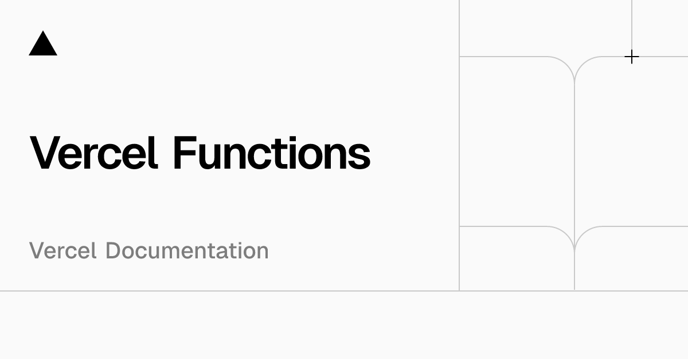
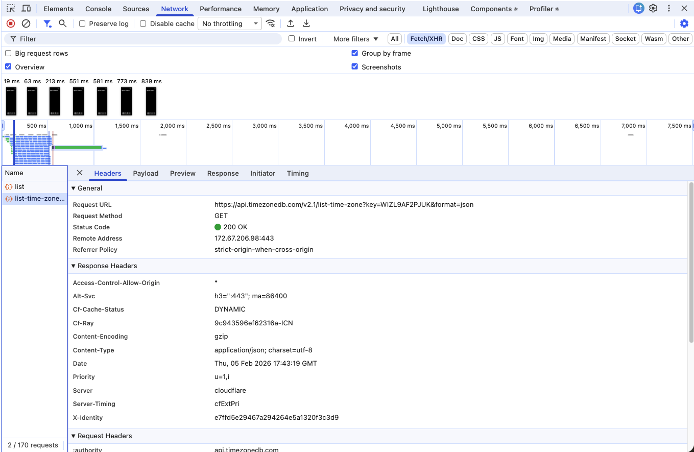
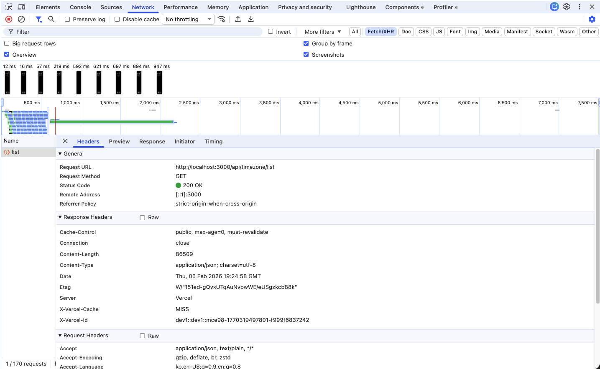
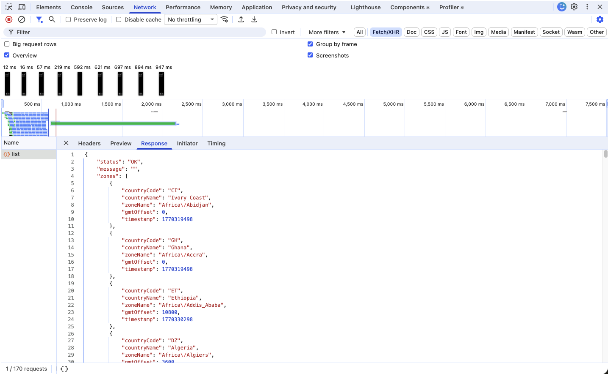
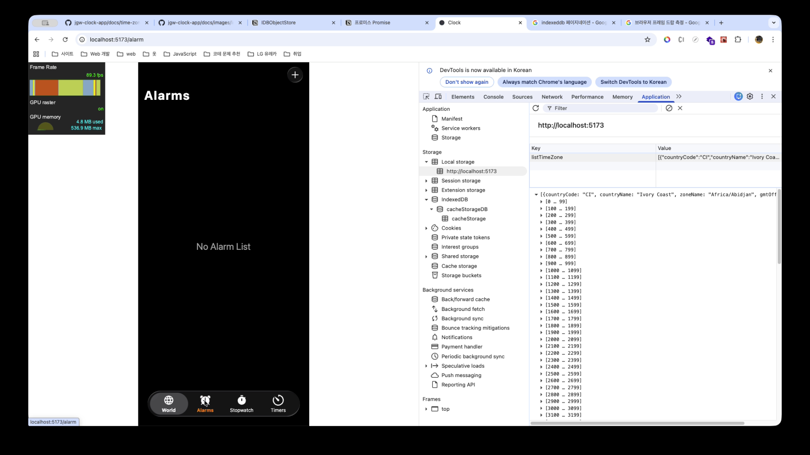
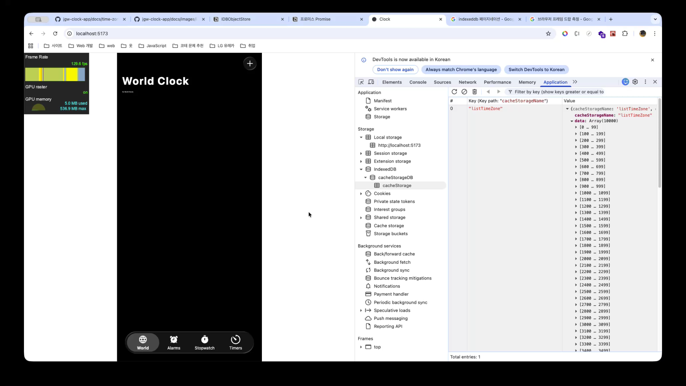
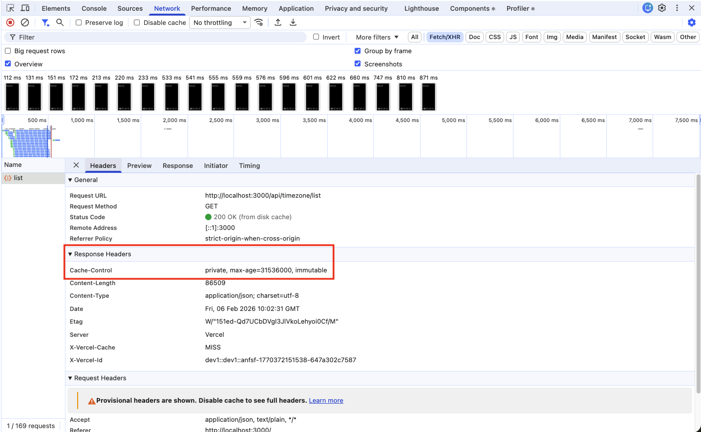
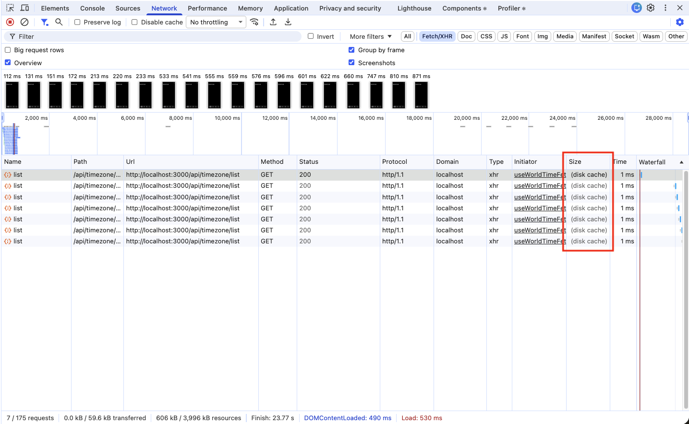

> ☝️ 이 문서는 Vercel 서버리스 함수를 도입한 이유인 Time Zone DB의 기관 인증용 API Key를 보호하기 위한 과정과, 기존 IndexedDB 기반 캐시 저장소 대체 방식이 아닌 Proxy 서버 기반 응답을 통해 브라우저 캐시 저장소를 활용한 내용을 설명한 문서입니다.

<br />

## I. 프록시 서버(Proxy Server)를 구축한 환경에서의 웹 애플리케이션 구조

사실 저는 **Vercel 서버리스 함수(Serverless Functions)** 에 대한 **정확한 개념을 충분히 이해하고 있는 상태는 아닙니다.**

따라서 **웹 애플리케이션을 배포하기 위한 아키텍처 구조**를 바탕으로 **서버리스 함수의 개념을 이해해보고자 했습니다.** 이에 앞서, 다음과 같이 **프록시 서버(Proxy Server)를 구축한 환경에서의 웹 애플리케이션 구조**를 먼저 살펴보겠습니다.

<br />


<br />

사진을 보면 알 수 있듯이, **프록시 서버(Proxy Server)를 구축한 환경에서의 웹 애플리케이션 통신 구조**에서는 일반적으로 요청을 보내는 주체인 **클라이언트(브라우저)** 와 **원본 서버(Origin Server)** 사이에 **프록시 서버(Proxy Server)** 를 두는 **3단계 구조**로 요청-응답 과정이 이루어지게 됩니다.

이처럼 **프록시 서버를 포함한 3단계 구조**로 요청-응답 과정이 동작하게 되면, 오히려 네트워크 성능이 저하되는 것이 아닌가 하는 인식이 들 수 있습니다. 그러나 **프록시 서버를 구성함으로써** 다음과 같은 이점을 얻을 수도 있습니다.

<br />

**① 프록시 서버 캐싱을 통한 네트워크 응답 속도 개선**

**원본 서버(Origin Server)** 가 **사용자의 위치보다 먼 곳(예: 한국 -> 미국)에 위치한 경우**, 응답을 전달받는 데까지의 **시간이 매우 길어질 수 있습니다.**

그러나 **프록시 서버(Proxy Server)** 를 구축하게 되면, 이전 요청 과정에서 프록시 서버에 **원본 서버의 응답을 캐시**함으로써 이후 요청부터는 원본 서버가 아닌 **비교적 가까운 위치의 프록시 서버로부터 응답을 전달받을 수 있게 됩니다.** 이로 인해 **클라이언트 <-> 원본 서버 간에 직접 통신하는 구조에 비해 네트워크 응답 속도가 크게 향상**될 수 있습니다.

다만, 이 방식 역시 **최초 한 번**은 **프록시 서버 <-> 원본 서버 간의 통신 과정이 반드시 필요**하기 때문에, **초기 요청 1회에 한해서는 응답 속도가 상대적으로 느릴 수 있습니다.**

<br />

**② 공용 API(Open API) 사용 시 API Key 노출 방지**

웹 프론트엔드 개발자는 **사용자에게 보여지는 브라우저 화면의 UI를 개발**하거나, **서버와 데이터를 주고받는 통신 과정**을 담당하게 됩니다.

하지만 브라우저 환경은 스마트폰과 달리, **개발자 도구(Dev Tools)를 활성화하는 것만으로도 내부 동작을 비교적 쉽게 확인**할 수 있습니다. 이로 인해 **빌드 도구를 활용**하여 여러 개의 파일을 **번들링**하거나, **난독화･압축 등의 추가 작업을 적용**하여 **Source 패널에 표시되는 JavaScript/CSS 파일의 가독성은 크게 떨어뜨려 분석을 어렵게 만들 수 있습니다.**

그럼에도 불구하고 **Network 패널**에서는 요청 URL, 헤더, 응답 데이터와 같은 **통신 정보를 그대로 확인**할 수 있으며, **Elements 패널**에서는 **렌더링된 DOM 구조와 리소스 참조 정보를 쉽게 확인**할 수 있습니다. 이처럼 **주요 정보가 다양한 경로를 통해 노출**될 수 있기 때문에, **클라이언트 측에 포함된 민감 정보는 보호하기가 어렵습니다.**

이를 방지하기 위해 일반적으로 **환경 변수**를 활용하지만, 브라우저 환경에서는 빌드 과정에서 해당 값이 포함되기 때문에 **개발자 도구를 통해 그대로 노출되게 됩니다.** 실제로 이러한 구조를 악용한 사례도 적지 않습니다.

저 역시 이전 **PICKY 프로젝트**를 진행하는 과정에서 유사한 문제를 겪은 적이 있습니다. 당시 백엔드 측에서 사용자의 **이미지 경로**에 **Cloudflare CDN 인증 키(API Key)를 포함한 상태로 이미지를 전달**하고 있었고, 이를 **인지하지 못한 채 그대로 사용**하게 되었습니다. 그 결과 **Cloudflare API Key가 외부에 노출**되었고, **해당 키가 악용되면서 CDN 서버 비용이 과도하게 발생**하는 문제가 실제로 발생했습니다.

이처럼 브라우저 환경에 포함된 **민감 정보는 보호하기가 쉽지 않습니다.** 그러나 **프록시 서버(Proxy Server)를 구축**하게 되면 이러한 **문제를 대부분 방지**할 수 있습니다.

그 이유는 클라이언트가 요청을 보내더라도 **원본 서버(Origin Server)로 직접 요청을 전달하지 않기 때문**입니다. 즉, **클라이언트는 API Key가 포함되지 않은 상태로 프록시 서버에만 요청**을 보내게 되며, 실제로 **API Key를 포함한 요청은 프록시 서버에서 원본 서버로 전달**됩니다.

이와 같은 구조에서는 **개발자 도구의 Network 패널**에서도 **클라이언트 <-> 프록시 서버 간의 요청-응답 정보만 확인**될 뿐, **프록시 서버 <-> 원본 서버 간에 전달되는 실제 인증 정보(API Key 포함 요청)는 노출되지 않기 때문**입니다. 따라서 **프록시 서버를 구축하는 것만으로 클라이언트 측에서의 민감 정보 노출 위험을 효과적으로 줄일 수 있습니다.**

<br />

## II. Vercel 서버리스 함수란?

앞서 ["프록시 서버(Proxy Server)를 구축한 환경에서의 웹 애플리케이션 구조"](#i-프록시-서버proxy-server를-구축한-환경에서의-웹-애플리케이션-구조)에서 **프록시 서버(Proxy Server)를 구축함으로써 얻을 수 있는 이점**에 대해 살펴보았습니다. 그렇다면 **서버리스 함수(Serverless Functions)** 와 **온프레미스 서버(On-Premiss Server) 및 클라우드 서버(Cloud Server)와의 차이점**은 무엇일까요? 바로 **서버의 상태**에 있습니다.

> 💡 "서버리스는 서버가 없는 백엔드라는 뜻이 아닌 개발자가 직접 서버를 관리하지 않아 신경 쓸 필요없는 경우를 뜻한다." - [｢인파 | 🌐 서버리스(ServerLess) 개념 💯 정리 (BaaS / FaaS)｣](https://inpa.tistory.com/entry/WEB-%F0%9F%8C%90-%EC%84%9C%EB%B2%84%EB%A6%AC%EC%8A%A4ServerLess-%EA%B0%9C%EB%85%90-%F0%9F%92%AF-%EC%B4%9D%EC%A0%95%EB%A6%AC-BaaS-FaaS)

여기서 말하는 **서버의 상태**는 이전 요청 정보를 기억하는 **상태 유지(Stateful)** 와 **무상태 유지(Stateless)** 개념을 의미하는 것이 아닙니다. 여기서의 상태란 **서버 인프라가 상시 실행되고 있는 운영 상태**를 의미합니다.

일반적으로 서버는 사용자가 어느 시점에 요청을 보낼지 예측할 수 없기 때문에 **365일 24시간 상시 운용**되는 형태로 운영됩니다. 그러나 이러한 방식으로 **서버를 지속적으로 유지하게 되면 상당한 비용이 발생**합니다. 기본적으로 **전력 비용이 발생**하며, 서버 장비에서 **지속적으로 발생하는 열을 해소하기 위한 냉각 장치** 등과 같은 **인프라 유지 비용도 함께 증가**하게 됩니다. _(이처럼 자체적으로 운영하는 서버를 온프레미스 서버(On-Premise Server)라고 합니다.)_

이러한 부담을 줄이기 위해 최근에는 **클라우드 컴퓨팅 서비스**를 활용하는 방식이 보편화되었습니다. 개발자가 직접 물리 서버를 운영하는 대신, 클라우드 사업자로부터 **일정 수준의 컴퓨팅 자원을 임대하여 사용**하고, **트래픽이 급증하는 경우에는 필요한 만큼 자원을 확장(Scale-out)하여 사용**하는 구조입니다. 이로 인해 **개인 개발자나 소규모 기업**도 **비교적 낮은 비용으로 서버를 운영**할 수 있게 되었습니다.

그러나 여기에도 한 가지 한계가 존재합니다. 클라우드 환경이라 하더라도 **서버를 상시 실행 상태로 유지하는 구조**이기 때문에, **실제 요청이 발생하지 않더라도 24시간 지속적인 유지 비용이 청구**됩니다. 따라서 **원본 서버(Origin Server)** 나 **프록시 서버(Proxy Server)** 를 클라우드 서비스를 통해 배포하는 경우, **사용량과 무관하게 기본 운영 비용이 계속 발생**하게 됩니다.

반면 **서버리스(Serverless)** 환경은 기존 클라우드 서버 운영 방식과 다르게 **서버의 상태를 상시 유지하지 않습니다.** **사용자 요청이 발생하기 전까지** 서버리스 함수는 **휴면 상태로 대기**하며, 이때는 **별도의 컴퓨팅 자원을 소모하지 않습니다.** **이후 요청이 발생하는 순간에만 함수를 실행하여 요청을 처리하고 응답을 반환한 뒤, 다시 휴면 상태로 전환**됩니다.

이러한 구조로 인해 **서버리스 기반 서버 환경**은 **실행된 함수 사용량만큼만 비용이 청구**되므로, 상시 서버를 운영하는 방식에 비해 **비용 효율성이 높은 서버 운영 방식이라 할 수 있습니다.**

지금까지 **서버리스(Serverless)** 가 기존 **온프레미스 서버(On-Premise Server)** 및 **클라우드 컴퓨팅 서비스(Cloud Server)** 와 비교했을 때 어떤 차이점이 있는지 살펴보았습니다. 그렇다면 이제 **Vercel 서버리스 함수**가 무엇인지 알아보겠습니다.

<br />


<br />

먼저 **Vercel**은 별도의 웹 서버를 직접 구축하지 않더라도, **프론트엔드 빌드 결과물을 Nginx 기반의 정적 웹 서버 인프라를 통해 배포할 수 있도록 지원하는 클라우드 서비스**입니다.

또한 AWS와 같은 일부 클라우드 서비스가 **월 단위의 무료 체험 기간**을 제공하는 방식과 달리, **Vercel**은 **일정 사용량을 초과하지 않는 한 지속적으로 무료로 이용할 수 있는 구조**를 제공합니다. 이로 인해 **학습용 프로젝트**나 **포트폴리오 목적으로 제작한 웹 애플리케이션**을 **별도의 비용 부담 없이 자유롭게 배포할 수 있다는 장점**이 있습니다.

이에 더해 Vercel은 **Vercel Functions**라는 기능을 통해 **서버리스 함수(Serverless Functions) 실행 환경을 함께 제공**합니다. 이 기능 역시 **일정 사용량 범위 내에서는 무료로 제공**됩니다.

즉, **Vercel 서버리스 함수**란 **Vercel을 통해 배포한 프로젝트에서 사용할 수 있는 Vercel Functions 기반의 서버 기능**을 의미합니다. 이를 이용하는 방법은 비교적 간단합니다.

프로젝트의 **루트 디렉토리 바로 하위에 `api/` 디렉토리를 생성**한 뒤, 해당 디렉토리 내부에 파일을 만들고 **`handler` 함수만 정의**하면 됩니다. 이후 클라이언트에서는 **확장자를 제외한 파일 경로로 API 요청을 전달**하기만 하면, **Vercel이 이를 서버리스 함수로 처리**합니다.

```md
clock/
├─ api/
│  └─ timezone/
│     └─ list.ts  # API 경로 - /api/timezone/list
└─ src/
   └─ ...
```

또한 Vercel Functions를 사용하여 **요청(Response)과 응답(Response)을 처리**할 수 있으며, 이 방식은 Node.js 기반 **Express 프레임워크의 사용 구조와 유사**합니다.

```tsx
export default async function handler(req, res) {
  // API 작업 로직
  return res.status(200).json({ success: true });
}
```

<br />

## III. Vercel 서버리스 함수 도입 이유

지금까지 **프록시 서버(Proxy Server)를 구축한 환경에서의 웹 애플리케이션 구조**와 더불어, 서버를 배포하는 방식인 **클라우드 서비스를 이용하는 방법**과 **서버리스 함수를 이용한 방법 간의 차이점**, 그리고 **Vercel Functions를 활용한 서버리스 함수 구축 방법**에 대해 살펴보았습니다.

그렇다면 **Clock 프로젝트**에서는 왜 **Vercel 서버리스 함수를 활용한 프록시 서버(Proxy Server)** 를 구축하게 되었을까요? 그 이유는 매우 단순하게도 **보안상의 이유**였습니다. 아래 그림을 통해 **"개발자 도구 > Network 패널"** 에서 **List Time Zone API의 요청 경로**가 어떻게 구성되어 있는지 확인해보겠습니다.

<br />



<br />

이미지에서 확인할 수 있듯이, **List Time Zone API의 요청 경로**를 보면 `https://api.timezonedb.com/v2.1/list-time-zone?key=WIZL9AF2PJUK&format=json`와 같이 **공용 API(Open API)를 인증하기 위한 API Key가 그대로 노출**되어 있는 것을 확인할 수 있습니다.

> ☝️ API Key 노출을 확인한 이후, 해당 Key는 즉시 재발급 받아 수정하였습니다.

즉, 앞서 ["프록시 서버(Proxy Server)를 구축한 환경에서의 웹 애플리케이션 구조"](#i-프록시-서버proxy-server를-구축한-환경에서의-웹-애플리케이션-구조)에서 설명했던 것처럼, **환경 변수를 사용하더라도 브라우저 환경에서는 개발자 도구를 통해 민감 정보가 노출될 수 있기 때문에 이를 보호하기가 쉽지 않습니다.**

물론 **List Time Zone API**는 무료로 제공되는 **공용 API(Open API)** 이며, 직접적인 민감 데이터가 포함되어 있지는 않습니다. 그러나 동시에 과도한 요청이 발생할 경우 **요청 제한으로 인해 예외가 발생**할 수 있기 때문에, 비용 문제라기보다는 **서비스 운영 관점에서의 보안 및 안전성 측면의 취약점**이 될 수 있다고 판단했습니다.

따라서 **API Key를 노출하지 않으면서도 정상적으로 요청을 처리할 수 있는 방법**을 고민하게 되었고, 그 과정에서 **프록시 서버(Proxy Server)를 도입하여 클라이언트 측에서는 프록시 서버로 요청을 보내고, 프록시 서버에서는 실제 원본 서버(List Time Zone API)로 요청을 전달하는 방식**을 고려하게 되었습니다.

다만 **Clock 프로젝트**의 경우, 웹 서버나 WAS를 직접 구축하지 않은 **정적 웹 사이트 구조로 구현**되어 있었기 때문에, 프록시 서버를 도입하려면 **별도의 서버 인프라 구축 및 운영 비용이 추가로 발생**한다는 부담이 있었습니다.

그러던 중 이전에 수강했던 패스트캠퍼스 [시그니처 프론트엔드: 웹 개발부터 웹앱까지 프론트엔드의 모든 것](https://fastcampus.co.kr/dev_online_fesignature) 강의에서, **Vercel을 통해 프로젝트를 배포한 뒤 Vercel Functions를 활용하여 API 로직을 구현했던 경험**이 떠올랐습니다.

당시에는 **강의에서 제시된 방시에 따라 Vercel Functions를 사용**했지만, 프록시 서버 도입 방식을 고려하던 중 **Vercel Functions가 무엇이길래 무료로 API 로직을 구현할 수 있었던 것인지에 대한 의문**이 생겨 관련 자료를 찾아보게 되었습니다.

관련 자료를 찾아본 결과, **앞서 살펴봤던 것처럼 Vercel Functions는 Vercel을 통해 배포한 프로젝트에서 사용할 수 있는 서버리스 함수(Serverless Functions) 실행 환경을 제공하는 기능**이며, **일정 사용량 범위 내에서는 무료로 사용할 수 있다는 점**을 확인할 수 있었습니다.

따라서 **Vercel Functions를 이용하면 서버리스 기반의 프록시 서버를 무료로 구축할 수 있겠다는 생각이 들어**, 다음과 같이 직접 코드를 작성하여 테스트를 진행해 보았습니다.

<br />

```tsx
// api/timezone/list.ts
import type { VercelRequest, VercelResponse } from "@vercel/node";

export default async function handler(req: VercelRequest, res: VercelResposne) {
  // API 요청 시 GET 요청이 아니라면 405 Methods Not Allowed 실패 응답을 내려준다.
  if(req.method !== "GET") {
    return res.status(405)
      .setHeader("Allow", "GET")
      .end();
  }

  // API 요청 메서드가 GET인 경우, List Time Zone API를 요청하여 해당 응답을 반환한다.
  try {
    const response = await fetch(`https://api.timezonedb.com/v2.1/list-time-zone?key=${process.env.VITE_TIME_ZONE_API}&format=json`);
    
    const body = await response.text();

    const headers = new Headers();
    headers.set("Content-Type", response.headers.get("Content-Type") || "application/json");

    return res.status(response.status).setHeaders(headers).send(body);
  } catch(error) {
    // Fetch API는 네트워크 오류만 실패로 처리된다.
    return res.status(500).json({
      status: "fail",
      message: "Internal Server Error",
      description: error instanceof Error ? error.message : "An unexpected error occurred"
    });
  }
}
```

<br />

이처럼 **GET 메서드를 제외한 다른 HTTP 메서드에 대해서는 예외 분기를 지정**하고, Fetch API 사용 시 **네트워크 오류만 `catch` 블록에서 처리**하도록 구성했습니다.

또한 프록시 서버에서 **List Time Zone API의 응답 결과에 대한 별도의 가공이나 예외 처리를 수행하지 않고**, 응답을 그대로 반환함으로써 **클라이언트 측에서 후속 처리르 수행**할 수 있도록 **Vercel Functions를 이용한 서버리스 함수를 구축**했습니다.

그 결과, **`api/timezone/list`로 요청**을 보내게 되면 **다음과 같은 응답을 전달**받는 구조로 구성하게 되었습니다.

<br />

```tsx
const res = await axios.get("/api/timezone/list");
console.log(res.data);
```





<br />

이미지를 보면 알 수 있듯이 요청 URL 경로를 확인해보면, 기존에는 **`https://api.timezonedb.com/v2.1/list-time-zone?key=WIZL9AF2PJUK&format=json`** 와 같이 **API Key가 노출된 상태로 요청**이 이루어졌습니다.

하지만 현재는 **Vercel Functions를 이용한 서버리스 함수의 URL 경로**인 **`http://localhost:3000/api/timezone/list`로 요청을 전송**하고 있으며, 기존과 동일한 응답을 전달받는 것을 확인할 수 있습니다.

<br />

## IV. List Time Zone API - HTTP 헤더를 통한 캐시 정책 적용

기존 List Time Zone API의 공용 API(Open API)에 요청을 보내면, 응답 헤더에 **Cache-Control을 통한 캐시 정책이 설정되어 있지 않았기 때문에** 이를 브라우저 캐시에 저장하는 것이 불가능했습니다.

<br />


<br />

이로 인해 브라우저 캐시 저장소를 대체하기 위해 [｢Time Zone DB List 요청 캐시｣](./time-zone-db-list-request-caching.md) 문서에서 해당 내용을 주제로 다루었으며, **Local Storage와 IndexedDB**를 활용하여 **어떤 클라이언트 측 저장소 사용 방식이 더 적절한지에 대해 성능 분석을 진행**한 뒤, **최종적으로 IndexedDB를 이용하기로 결정**하였습니다.

<br />

[](https://drive.google.com/file/d/1_m8kQjU5yRjbJKYvzupryNmUi8ywqqM1/view?usp=sharing)

> Markdown은 비디오를 직접 삽입할 수 없기 때문에, 해당 이미지는 Local Storage 사용 시 FPS 변호 과정을 캡처한 화면입니다. 이미지를 클릭하면 Google Drive에 업로드된 비디오 공유 URL로 이동할 수 있습니다.

<br />

[](https://drive.google.com/file/d/1Vb1HyS43GO0d9tE-ZfHZjdLq9r6SeLTP/view?usp=sharing)

> Markdown은 비디오를 직접 삽입할 수 없기 때문에, 해당 이미지는 IndexedDB 사용 시 FPS 변호 과정을 캡처한 화면입니다. 이미지를 클릭하면 Google Drive에 업로드된 비디오 공유 URL로 이동할 수 있습니다.

<br />

하지만 이 문서에서 설명했던 것처럼, List Time Zone API의 **공용 API(Open API)는 인증을 위해 API Key가 필요**하며, 브라우저 개발자 도구를 활성화할 경우 **민감 정보를 보호하기 어렵기 때문에 API Key를 보호하기 위한 목적으로 Vercel Functions를 이용한 서버리스 함수를 도입**하게 되었습니다.

즉, 현재는 List Time Zone API에 `Cache-Control`이 설정되어 있지 않아 **브라우저 캐시 저장소를 대체하기 위해 IndexedDB를 도입했던 상황과는 다소 달라졌습니다.** 왜냐하면 Vercel Functions를 이용해 서버리스 함수를 도입했다는 것은, **해당 요청에 대한 응답 헤더(Response Header)를 개발자가 직접 설정할 수 있게 되었음을 의미**하기 때문입니다.

따라서 **해당 요청에 한해** 개발자가 **응답 헤더에 `Cache-Control` 헤더를 통해 캐시 정책을 설정**해 준다면, **브라우저 캐시 저장소를 활용할 수 있다는 의미**가 됩니다. 앞서 API Key를 보호하기 위해 **Vercel Functions를 이용하여 구성한 서버리스 함수(Serverless Functions) 로직**을 다시 한 번 살펴보겠습니다.

<br />

```tsx
export default async function handler(req: VercelRequest, res: VercelResposne) {
  try {
    const response = await fetch(`https://api.timezonedb.com/v2.1/list-time-zone?key=${process.env.VITE_TIME_ZONE_API}&format=json`);
    
    const body = await response.text();

    const headers = new Headers();
    headers.set("Content-Type", response.headers.get("Content-Type") || "application/json");

    return res.status(response.status).setHeaders(headers).send(body);
  } catch(error) {
    // Fetch API는 네트워크 오류만 실패로 처리된다.
  }
}
```

<br />

현재 작성한 코드를 보면 알 수 있듯이, 요청에 대한 응답을 반환할 때 사용할 헤더 정보에 `header.set()`을 통해 **`Content-Type`을 설정**하고 있습니다. **List Time Zone API의 응답 결과에 Content-Type이 포함되어 있다면 해당 해석 방식을 그대로 사용**하고, **포함되어 있지 않다면 `application/json` 방식으로 해석할 수 있도록 응답 헤더를 지정**하고 있습니다.

이 말은 결국 Clock 애플리케이션을 개발하고 있는 제가 `header.set()`에 **`Cache-Control` 응답 헤더와 이에 적절한 캐시 정책을 설정**해 준다면, **해당 요청의 응답 결과가 브라우저 캐시 저장소에 저장될 수 있음을 의미**합니다. 그렇기 때문에 실제로 현재 코드에 다음과 같이 헤더를 추가한 뒤 결과를 확인해 보겠습니다.

<br />

```tsx
export default async function handler(req: VercelRequest, res: VercelResposne) {
  try {
    const response = await fetch(`https://api.timezonedb.com/v2.1/list-time-zone?key=${process.env.VITE_TIME_ZONE_API}&format=json`);
    
    const body = await response.text();

    const headers = new Headers();
    headers.set("Content-Type", response.headers.get("Content-Type") || "application/json");
    
    // Cache-Control 응답 헤더 설정
    headers.set("Cache-Control", `private, max-age=${60 * 60 * 24 * 365}, immutable`);

    return res.status(response.status).setHeaders(headers).send(body);
  } catch(error) {
    // Fetch API는 네트워크 오류만 실패로 처리된다.
  }
}
```





<br />

위 이미지의 결과를 보면 알 수 있듯이, `headers.set()`에 **Cache-Control을 설정한 이후**에는 **List Time Zone API의 요청 결과가 브라우저 캐시 저장소에 저장**되어, 최초 요청 이후에는 요청을 전달하지 않고 **브라우저 캐시 저장소에서 해당 응답 결과를 재사용**하는 것을 볼 수 있습니다.

즉 **Vercel Functions를 이용한 서버리스 함수를 도입하기 이전까지는** Local Storage와 IndexedDB 등을 이용하여 **브라우저 캐시 저장소를 대체하는 방법이 반드시 필요**했습니다. 하지만 **서버리스 함수를 도입한 이후에는 브라우저 캐시 저장소를 이용하여 요청 결과를 캐시할 수 있기 때문에** 브라우저 캐시 저장소를 대체할 이유가 사라졌습니다.

또한, **브라우저 캐시 저장소를 이용한 방법은 캐싱 과정을 브라우저가 전적으로 관리**를 하기 때문에 별도로 코드를 작성하지 않아도 되며, IndexedDB가 논블로킹(Non-Blocking) 방식의 비동기 처리를 지원하지만 결국에는 요청 이후에 **IndexedDB에 접근하기 위해 JavaScript 이용이 반드시 필요**합니다. 반면 **브라우저 캐시 저장소를 이용할 경우**에는 **HTTP 요청 과정에서 캐시된 데이터를 가져오기 때문에 JavaScript 메인 스레드를 이용하지 않는다는 장점**도 있습니다.

이로 인해, **브라우저 캐시 저장소를 지원하는 이상 IndexedDB를 이용하는 방법은 브라우저 캐시 저장소에 비해 특별한 장점이 있지 않기 때문에** 사용을 중단하고 **브라우저 캐시 저장소를 이용하는 방법으로 수정**을 하기로 결정했습니다.